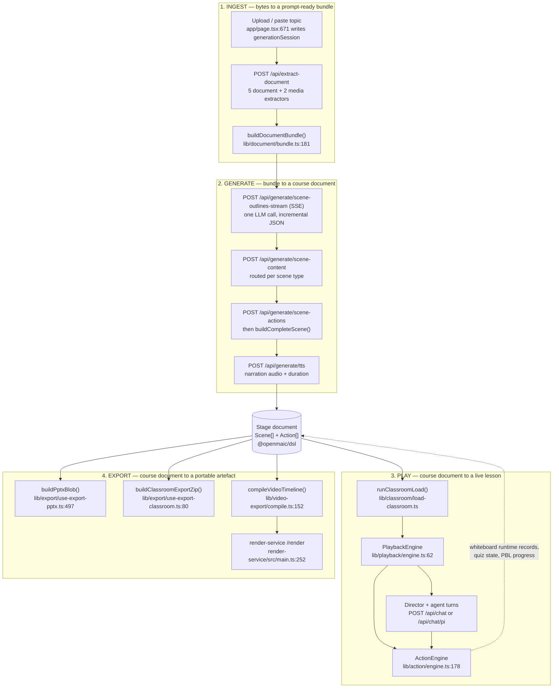
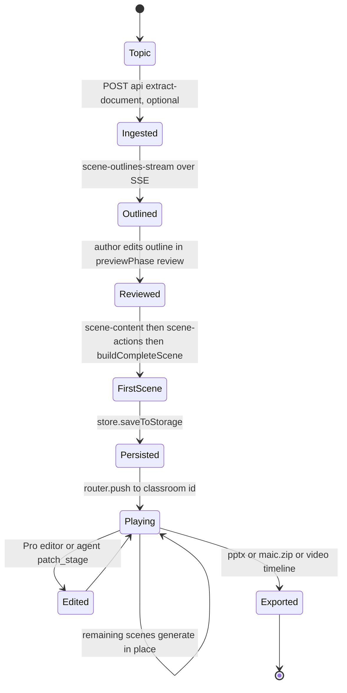

# What OpenMAIC Is, in System Terms

The problem, the shape of the solution, and the one-paragraph architecture. Read
this before any diagram in this set: everything downstream is a decomposition of
the four moves described here.

**Sources:** `README.md:72`, `package.json`, `app/page.tsx`, `app/generation-preview/page.tsx`,
`app/classroom/[id]/page.tsx`, `packages/@openmaic/generation/src/`,
`packages/@openmaic/dsl/src/stage.ts`, `lib/playback/engine.ts`,
`lib/export/`, `lib/video-export/compile.ts`, `render-service/src/main.ts`,
`../appendix/research/generation-pipeline/00-overview.md`,
`../appendix/research/classroom-runtime/00-overview.md`,
`../appendix/research/dsl-renderer-editor/00-overview.md`.

## The problem

Authoring a taught lesson is expensive in a way that authoring a document is
not. A lesson needs slides *and* the narration that goes with each slide, *and*
the timing that binds narration to what appears on screen, *and* checks for
understanding, *and* somebody to deliver it. Slide tools give you the first
artefact and none of the rest. LLM chat gives you prose with no playable form.

OpenMAIC's claim, stated at `README.md:72`, is that a topic string or an uploaded
document can be turned into a *playable* classroom: slides, quizzes, interactive
HTML simulations and project-based-learning activities, delivered by synthetic
teachers and classmates that speak, draw on a whiteboard, and hold a discussion
in real time.

The architectural consequence of that claim is the thing worth internalising: the
unit of persistence is not a slide deck, it is a **course document with an
embedded playback script**. `packages/@openmaic/dsl/src/stage.ts` defines a
`Stage` holding ordered `Scene`s; each scene carries a `type` discriminant
(`'slide' | 'quiz' | 'interactive' | 'pbl'`, `stage.ts:22`) bound to its own
content shape, plus a list of `Action`s. `Action` is a 21-variant union
(`packages/@openmaic/dsl/src/action.ts:235-256`) whose members are playback
verbs — `speech`, `wb_draw_latex`, `spotlight`, `discussion`, `play_video`,
`widget_setState`. The document *is* the lesson plan, the deck, and the score.

## The shape of the solution: four moves

The `Stage` document at the centre is why the four moves are separable. Move 2
writes it, move 3 reads it and appends runtime records to it, move 4 reads it.
No move reaches into another's internals; they communicate through one versioned
contract (`DSL_VERSION = '0.3.0'`, `packages/@openmaic/dsl/src/version.ts:61`,
with a second independent ladder `RUNTIME_DSL_VERSION = '0.1.0'` at
`version.ts:276` for the runtime envelope).

## The one-paragraph architecture

OpenMAIC is a single Next.js 16 App Router application (`package.json:119`) whose
domain logic lives in `lib/` and whose reusable contracts are hoisted into six
publishable packages under `packages/@openmaic/` — `dsl` (4 847 lines) is the
document contract, `generation` (8 199) the LLM pipeline, `storage` (14 904) the
persistence primitives, `renderer` (5 003) the read-only canvas, `editor`
(16 302) the edit kernel, `importer` (22 203) the `.pptx` reader; the one list is
`scripts/openmaic-packages.mjs:34`. Its entire HTTP surface is 69 `route.ts`
files with 86 exported method handlers totalling 9 435 lines, all on the Node
runtime — no route declares `runtime = 'edge'`. Every external capability is a
registry the operator populates: 19 LLM providers (`lib/ai/providers.ts:75`), 10
TTS and 6 ASR providers (`lib/audio/types.ts:82,179`), 8 image and 6 video
providers (`lib/media/types.ts:73,194`), 9 web-search backends
(`lib/web-search/index.ts:1-9`), 5 document and 2 media extractors
(`lib/document/extractors/manifest.ts`), and a persistence layer whose backends
are browser IndexedDB, PostgreSQL, or S3 for asset bytes
(`packages/@openmaic/storage/package.json` exports). Nothing is required except
one LLM key; everything else degrades. Persistence defaults to the browser
(IndexedDB + localStorage) and only becomes server-backed when
`NEXT_PUBLIC_PERSISTENCE === '1'` flips the bootstrap at
`lib/persistence/bootstrap.ts:15-68`. Two optional out-of-process pieces exist: a
PostgreSQL database (required for the Pro agent workbench and for server-backed
storage) and an isolated `render-service` container that turns an export ZIP into
an MP4 (`render-service/src/main.ts:229`).

## Two authoring modes over one document

The repo ships two ways to produce the same `Stage`, and it matters for every
diagram that follows.

| | One-click generator | Pro agent workbench |
| --- | --- | --- |
| Entry | `/` then `/generation-preview` | `/workspace` |
| Driver | A fixed 4-step pipeline the browser sequences | A durable LLM agent with 40 tools |
| Server state | None; `sessionStorage` carries the handoff (`app/page.tsx:671`, `app/generation-preview/page.tsx:1040`) | PostgreSQL owns claims, leases, event order, cancellation |
| Survives a reload | No | Yes — the browser re-reads a durable event log by `Last-Event-ID` |
| Gate | Always on | `isProWorkbenchEnabled() && isAgentRuntimeConfigured()` (`lib/workbench/entry-gate.ts:4`) |
| Availability | Default | Off by default; needs `NEXT_PUBLIC_PRO_WORKBENCH_ENABLED`, `OPENMAIC_AGENT_RUNTIME_ENABLED` **and** a non-empty `DATABASE_URL` (`lib/config/feature-flags.ts:23-34`) |

The state names come from the `previewPhase` union declared at
`app/generation-preview/types.ts:22`
(`'preparing' | 'outline-ready' | 'review' | 'generating-content'`) and from the
navigation at `app/generation-preview/page.tsx:1051`.

## What is deliberately absent

Naming the holes now saves you looking for them later.

| Absent | Evidence | Consequence |
| --- | --- | --- |
| Any notion of a user account | `lib/server/agent-runtime/owner.ts` mints an `anonymous_id` UUID cookie; the `authenticatedOwnerId` parameter it accepts has no call site | Ownership is per-browser, not per-person |
| Rate limiting | No limiter in `app/api/**` | Cost control is the operator's problem |
| An OpenAPI artefact | none in the tree | The 69 route files are the contract |
| Server-side session for the one-click path | `sessionStorage` only | Close the tab mid-generation and the run is gone |
| `error.tsx` / `not-found.tsx` / `loading.tsx` anywhere under `app/` | `../appendix/research/app-shell-and-routing/00-overview.md:114-118` | A thrown render error surfaces as Next's default boundary |
| Coverage measurement | no coverage provider in any of nine Vitest configs | Test coverage is unknowable, not low — unknown |

## Cross-links

- Containers and their responsibilities: `../02-container-view/index.md`
- The DSL contract itself: `../07-dsl-renderer-editor/index.md`
- Move 1 and 2 in detail: `../06-generation-pipeline/index.md`
- Move 3 in detail: `../08-classroom-runtime/index.md`
- Move 4 in detail: `../09-media-and-export/index.md`
- The agent authoring mode: `../05-agent-runtime/index.md`
