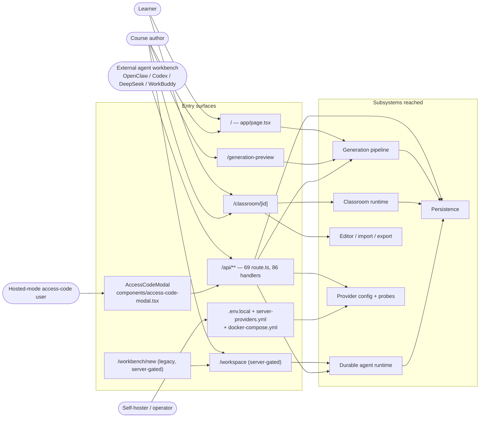
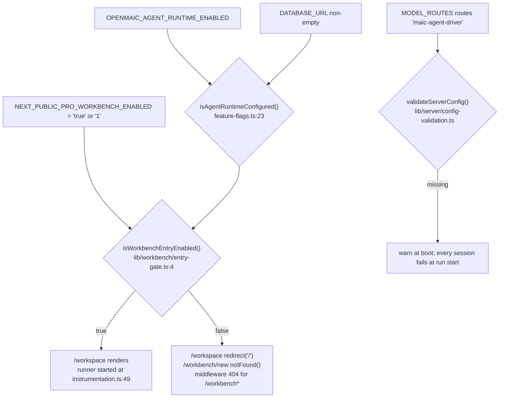
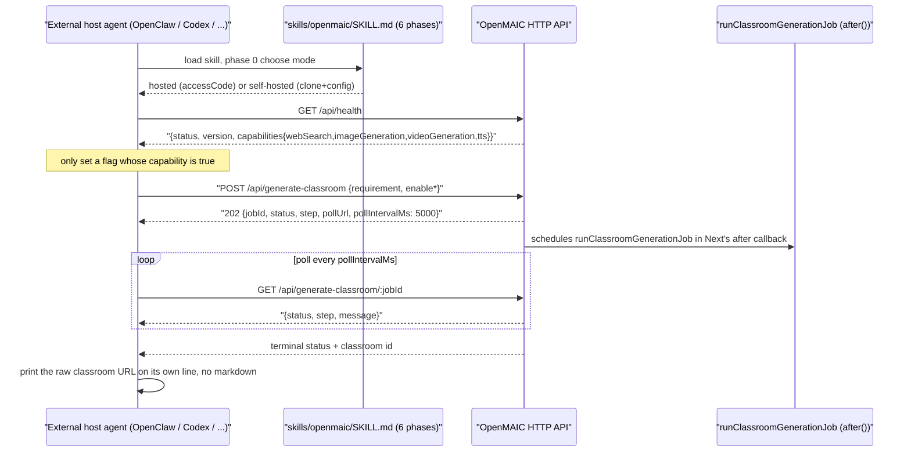
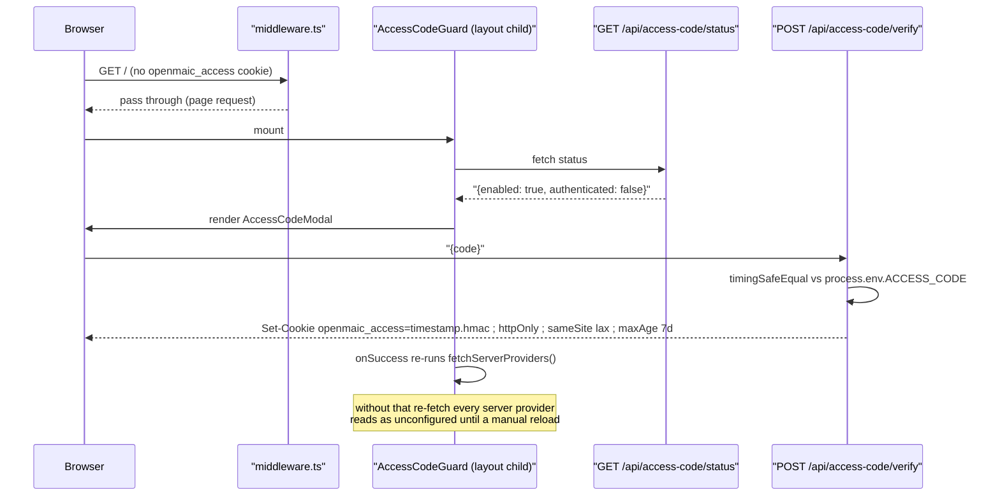

# Actors and Personas

Five actors reach OpenMAIC. Two are humans on different surfaces, one is a human
outside the app entirely, and two are machines. This page states each one's goal,
its entry surface, and — the part that matters — what the code actually lets it
do, which is often narrower than the README implies.

**Sources:** `middleware.ts:46-90`, `lib/config/feature-flags.ts`,
`lib/workbench/entry-gate.ts:4`, `app/page.tsx`, `app/workspace/page.tsx:34`,
`app/workbench/new/page.tsx`, `app/classroom/[id]/page.tsx`,
`components/access-code-guard.tsx`, `app/api/access-code/status/route.ts`,
`app/api/access-code/verify/route.ts`, `app/api/health/route.ts`,
`app/api/generate-classroom/route.ts`, `lib/server/classroom-generation.ts:48`,
`lib/server/agent-runtime/owner.ts:52`, `lib/server/provider-config.ts:417`,
`skills/openmaic/SKILL.md`, `skills/openmaic/references/live-demo.md`,
`skills/openmaic/references/generate-flow.md`,
`../appendix/research/api-surface/02a-interfaces-envelope-identity-model.md`.

## Actor to surface to subsystem

## 1. Learner

**Goal:** consume a generated course — watch it play, answer quizzes, argue with
the AI classmates, work a PBL task.

**Entry surface:** `/` for discovery of previously created courses, then
`/classroom/[id]`. Both are client components; `/classroom/[id]` reads its id
from `useParams()`, not from a server `params` prop.

**Can:**

- Play, pause, seek, and resume. Seek is `jumpToAction`, and it is *refused*
  when a `play_video`, `discussion` or `widget_*` action sits in the prefix
  (`lib/playback/action-navigation.ts:16`) — those actions cannot be replayed
  silently, so the engine will not jump past them.
- Talk to the classroom agents. The browser owns the conversation loop
  (`runAgentLoop`, `lib/chat/agent-loop.ts:154`) and re-posts the whole state to
  `POST /api/chat` (LangGraph default) or `POST /api/chat/pi` (Pi, behind
  `NEXT_PUBLIC_PI_CHAT_ENABLED`) each iteration.
- Answer quizzes, including short answers graded by an LLM at
  `POST /api/quiz-grade`.
- Progress a PBL task — but only by clicking Done. The instructor agent has
  exactly two tools, `record_observation` and `adjust_difficulty`, and cannot
  advance a task itself (`lib/pbl/v2/agents/instructor.ts`).
- Export the course as `.pptx`, as a `.maic.zip` offline bundle, or as a video
  project — if the corresponding flags are on.

**Cannot:** be identified. There is no login. Identity is an `anonymous_id`
UUIDv4 cookie (`lib/server/agent-runtime/owner.ts:52`); every owner id the server
computes is `anon:`-prefixed because the `authenticatedOwnerId` parameter that
function accepts has no call site anywhere in the repo. Two learners sharing a
browser profile share everything.

## 2. Course author

**Goal:** turn a topic or a pile of source material into a course, review it,
then fix what the model got wrong.

**Entry surface:** `/` (the composer), `/generation-preview` (the run), and
optionally `/workspace` (the Pro agent workbench). The classroom editor lives
inside `/classroom/[id]` behind `isMaicEditorEnabled()`
(`lib/config/feature-flags.ts:47`).

**Can:**

| Capability | Where | Gate |
| --- | --- | --- |
| Upload documents / audio / video for extraction | `POST /api/extract-document` | none |
| Edit the generated outline before scenes are written | `previewPhase === 'review'`, `app/generation-preview/types.ts:22` | none |
| Direct-manipulate slides (drag/resize/rotate/multi-select) | `@openmaic/editor` or the legacy `lib/edit` | `NEXT_PUBLIC_MAIC_EDITOR_ENABLED` |
| Ask an agent to patch the course | `patch_stage` tool, `lib/server/agent-runtime/dsl-tools.ts` | Pro workbench |
| Import a `.pptx` | `lib/import/use-import-pptx.ts` | `NEXT_PUBLIC_ENABLE_PPTX_IMPORT` |
| Export `.pptx` / `.maic.zip` / video | `lib/export/`, `lib/video-export-app/` | video needs `NEXT_PUBLIC_ENABLE_VIDEO_EXPORT` |

**Cannot:** rely on the one-click run surviving a reload. The handoff between `/`
and `/generation-preview` is a `sessionStorage` key written at
`app/page.tsx:671` and read at `app/generation-preview/page.tsx:223`; the second
handoff, `generationParams`, is written at
`app/generation-preview/page.tsx:1040` and never cleared. Neither is
schema-validated.

**Cannot:** get the Pro workbench without operator cooperation — see actor 3.

## 3. Self-hoster / operator

**Goal:** run a deployment whose providers, storage, and exposed features are
chosen by the operator rather than the user.

**Entry surface:** not the app. `.env.local` (the template is `.env.example`,
525 lines), `server-providers.yml` (`lib/server/provider-config.ts:417`), and
`docker-compose.yml` with its `openmaic`, `postgres` and `render-service`
services plus the `internal: true` `render` network
(`docker-compose.yml:142-143`) that carries app-to-render traffic.

**Holds authority the browser does not.** `lib/server/provider-config.ts` decides
whose credentials win. When the operator *manages* a provider, the client's
API key and base URL are discarded wholesale; when it does not, the client's are
used and SSRF-validated in production. Server-side TTS model pinning
(`resolveTTSModel`, `lib/server/provider-config.ts:805`) likewise overrides the
client.

**Owns the gates.** Fourteen flag predicates in `lib/config/feature-flags.ts`
divide into server-only and `NEXT_PUBLIC_*` (build-time, baked into the browser
bundle). The Pro workbench needs *three* things simultaneously:

`MODEL_ROUTES` must explicitly route the `maic-agent-driver` stage — one of the
20 entries in `LLM_STAGES` (`lib/server/model-routes.ts`) — with no fallback.

**Cannot:** get rate limiting, per-user isolation, or an expiring access token
out of the box. `PERSISTENCE_DEV_TOKEN` is documented in `.env.example:495-497`
as providing no user isolation, and the `ACCESS_CODE` HMAC token
(`lib/server/access-token.ts:4`) embeds a timestamp that neither
`middleware.ts:18` nor `verifyAccessToken` ever compares against now.

## 4. External agent workbench

**Goal:** drive an OpenMAIC deployment from outside — from a chat app or an IDE —
without a browser.

**Entry surface:** the HTTP API, driven by the skill package at
`skills/openmaic/SKILL.md` (104 lines) plus eight reference files. The skill is
*not consumed by any runtime in this repo*; it is a downloadable SOP for a
foreign host agent. README names OpenClaw, Codex, DeepSeek and WorkBuddy
(`README.md:90`).

**Can:** exactly what `GenerateClassroomInput`
(`lib/server/classroom-generation.ts:48`) accepts — `requirement`,
`pdfContent`, `enableWebSearch`, `webSearchProviderId`, `webSearchApiKey`,
`webSearchModelId`, `baiduSubSources`, `enableImageGeneration`,
`enableVideoGeneration`, `enableTTS`, `agentMode`. The route
(`app/api/generate-classroom/route.ts`) copies precisely these fields and drops
anything else.

**Cannot:** choose a model. The skill states the rule three times ("This skill
must not rely on any request-time model or provider overrides") and the code
agrees: `generate-classroom` is a routable `LLM_STAGES` entry, and a routed stage
discards client credentials (`lib/server/resolve-model.ts`).

**Drift worth knowing:** `skills/openmaic/references/generate-flow.md:37`
documents an optional `language` field defaulting to `"zh-CN"`.
`GenerateClassroomInput` has no `language` field and the route never reads one —
language is inferred by the outline step and returned as `languageDirective`
(`lib/server/classroom-generation.ts:492`). A host agent that sends `language`
gets it silently ignored.

## 5. Hosted-mode access-code user

**Goal:** use a deployment someone else runs, gated by a shared password.

**Entry surface:** any page. `middleware.ts:60-85` lets page requests through so
`AccessCodeGuard` can render a modal; `/api/*` gets a 401 JSON envelope instead.
The allowlist is exactly two paths: `/api/access-code/*` and `/api/health`
(`middleware.ts:66`).

**Can:** everything a learner or author can, once the cookie exists.

**Cannot:** be distinguished from any other access-code holder — one shared
password, no identity. And the `Authorization: Bearer <access-code>` scheme the
skill's hosted mode uses (`references/live-demo.md:13,23`) does **not** exist in
this repo: `middleware.ts:71` reads only the `openmaic_access` cookie, and
the only occurrence of `Daily quota` in the tree is the skill's own hosted-mode
reference (`references/live-demo.md:33`) — nothing under `app/` or `lib/`
implements it. **Inferred:** the hosted
`open.maic.chat` deployment runs additional server-side code (bearer auth, a
10-generations-per-day quota) that is not part of this open-source tree.

## Authority matrix

| | Learner | Author | Operator | External agent | Access-code user |
| --- | --- | --- | --- | --- | --- |
| Play a course | yes | yes | — | no | yes |
| Generate a course | yes (from `/`) | yes | — | yes (`/api/generate-classroom`) | yes |
| Edit a course document | flag | flag | — | no | flag |
| Drive a durable agent session | no | Pro only | enables it | no | Pro only |
| Choose the LLM | client keys, if provider unmanaged | same | authoritative | never | same as author |
| Choose TTS voice/model | voice yes, model no (`resolveTTSModel` pins) | same | authoritative | no | same |
| Read another owner's course | no — byte-identical 404 for off / not-yours / absent (`route-response.ts:35-43`) | no | via DB | no | no |
| Be identified | no | no | n/a | no | no |

## Open questions

- Whether hosted `open.maic.chat` bearer auth and the daily quota are intended
  to land in this repo or stay proprietary. The skill documents them as the
  hosted contract; nothing in the tree implements them.
- Whether `skills/openmaic/references/generate-flow.md`'s `language` field is
  stale documentation or a planned field. It is currently inert.
