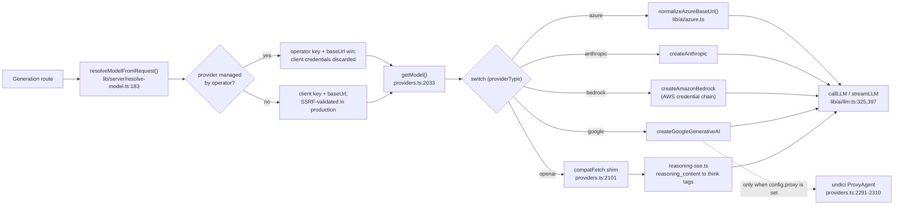
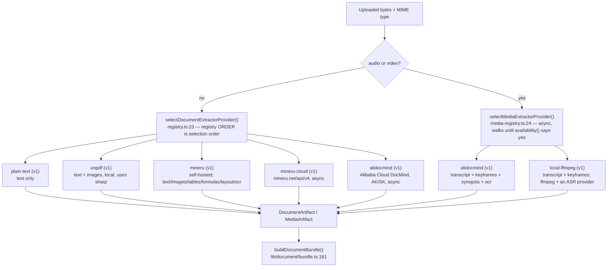
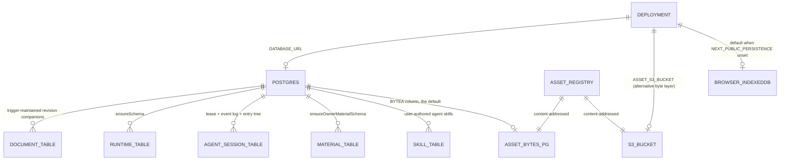
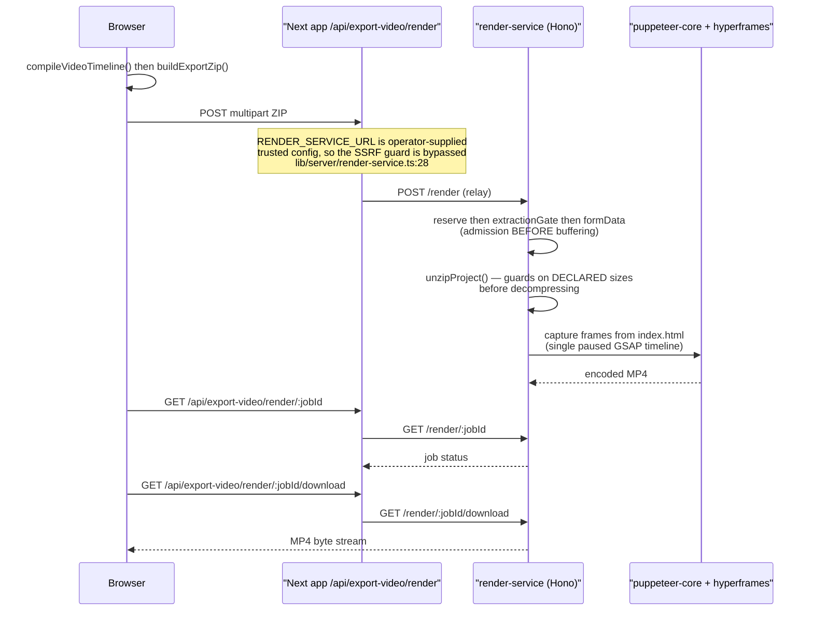

# External Systems

Every system outside the OpenMAIC process boundary, grouped by capability, named
from the registry that declares it. Nothing here is required except one LLM
provider; every other group degrades to absent.

**Sources:** `lib/ai/providers.ts:70-1553`, `lib/types/provider.ts:8-33`,
`lib/audio/types.ts:82,179`, `lib/audio/constants.ts:119,1078`,
`lib/media/types.ts:73,194`, `lib/media/image-providers.ts:33`,
`lib/web-search/index.ts:1-9`, `lib/web-search/types.ts`,
`lib/document/extractors/manifest.ts`, `lib/pdf/types.ts:8`,
`lib/media-parse/types.ts:10`, `packages/@openmaic/storage/package.json`,
`lib/persistence/server-provider.ts`, `lib/server/render-service.ts:16`,
`lib/server/ssrf-guard.ts`, `lib/server/proxy-fetch.ts:25-104`,
`.env.example`, `docker-compose.yml`,
`../appendix/research/ai-provider-layer/00-overview.md`,
`../appendix/research/media-audio-video/00-overview.md`.

## The whole picture

```mermaid
flowchart TD
  MAIC["OpenMAIC<br/>Next.js app + optional render-service"]

  LLM["Text LLMs — 19 providers<br/>lib/ai/providers.ts:75"]
  TTS["TTS — 10 providers<br/>lib/audio/types.ts:82"]
  ASR["ASR — 6 providers<br/>lib/audio/types.ts:179"]
  IMG["Image generation — 8 providers<br/>lib/media/types.ts:73"]
  VID["Video generation — 6 providers<br/>lib/media/types.ts:194"]
  DOC["Document extraction — 5 providers<br/>extractors/manifest.ts"]
  MED["Media extraction — 2 providers<br/>extractors/manifest.ts"]
  SRCH["Web search — 9 backends<br/>lib/web-search/index.ts"]
  PG[("PostgreSQL 16<br/>20 declared tables")]
  S3[("S3-compatible object store<br/>ASSET_S3_BUCKET")]
  RS["render-service container<br/>Hono + puppeteer-core"]
  CDN["Arbitrary user-supplied media URLs"]
  PROXY["HTTP(S) forward proxy<br/>HTTPS_PROXY / NO_PROXY"]

  MAIC -->|"HTTPS, per-provider transport<br/>(5 SDK families)"| LLM
  MAIC -->|"HTTPS REST; SSML / hex / concatenated JSON"| TTS
  MAIC -->|"HTTPS multipart audio upload"| ASR
  MAIC -->|"HTTPS REST, poll or sync"| IMG
  MAIC -->|"HTTPS REST, async job + poll"| VID
  MAIC -->|"HTTPS REST or local HTTP"| DOC
  MAIC -->|"HTTPS REST or local ffmpeg + ASR"| MED
  MAIC -->|"HTTPS REST"| SRCH
  MAIC <-->|"PostgreSQL wire, node-postgres pool<br/>+ LISTEN/NOTIFY"| PG
  MAIC <-->|"AWS SigV4, GetObject/PutObject<br/>optional presigned 302"| S3
  MAIC -->|"HTTP multipart ZIP up, MP4 down"| RS
  MAIC -->|"HTTPS GET via /api/proxy-media,<br/>SSRF-guarded, manual redirects"| CDN
  MAIC -.->|"undici ProxyAgent when configured"| PROXY
  PROXY -.-> LLM
```

Every edge except PostgreSQL is fire-and-forget request/response. The database is
the only external system OpenMAIC *depends on for correctness* rather than
capability, and only for the Pro workbench and server-backed persistence.

## 1. Text LLM providers

Nineteen built-in provider ids (`lib/types/provider.ts:8-27`) plus an open
`custom-${string}` escape hatch (`provider.ts:33`), carrying 104 model entries.
Each provider declares one of five `ProviderType` values
(`provider.ts:38`), and `getModel()` (`lib/ai/providers.ts:2033`) switches on it
to pick the SDK transport.

| `ProviderType` | SDK | Providers using it |
| --- | --- | --- |
| `openai` | `@ai-sdk/openai` | `openai`, `atlascloud`, `glm`, `qwen`, `deepseek`, `kimi`, `siliconflow`, `doubao`, `openrouter`, `grok`, `tencent-hunyuan`, `xiaomi`, `ollama`, `lemonade` |
| `azure` | `@ai-sdk/azure` | `azure` |
| `anthropic` | `@ai-sdk/anthropic` | `anthropic`, `minimax` |
| `bedrock` | `@ai-sdk/amazon-bedrock` | `bedrock` |
| `google` | `@ai-sdk/google` | `google` |

Two of these are *local*, not remote: `ollama` and `lemonade`. Reaching them
needs `ALLOW_LOCAL_NETWORKS=true` because the SSRF guard otherwise rejects
private addresses (`.env.example:460-463`).

`callLLM` / `streamLLM` is the only sanctioned door: an ESLint rule at
`eslint.config.mjs:578-626` bans importing `generateText` / `streamText` from
`ai` (`importNames` at line 626) anywhere except `lib/ai/llm.ts`, `eval/**` and
`tests/**`, and a companion rule at `eslint.config.mjs:17` closes the
`import('ai')` dynamic bypass.

## 2. TTS and ASR

Ten TTS providers (`lib/audio/types.ts:82`): `openai-tts`, `azure-tts`,
`glm-tts`, `qwen-tts`, `voxcpm-tts`, `doubao-tts`, `elevenlabs-tts`,
`minimax-tts`, `lemonade-tts`, `browser-native-tts`. Six ASR providers
(`types.ts:179`): `openai-whisper`, `browser-native`, `qwen-asr`, `funasr-asr`,
`lemonade-asr`, `azure-asr`.

Two of the ten are not external at all — `browser-native-tts` and
`browser-native` (ASR) use the Web Speech API in the learner's browser. That is
why the playback engine has a per-sentence `speechSynthesis` path with an
explicit Firefox workaround: `speechSynthesis.pause` is broken there, so pause
saves the remaining chunks and cancels instead (`lib/playback/engine.ts:246`).

The wire formats do not resemble each other, which is why the adapter layer
exists at all:

| Provider | Wire quirk |
| --- | --- |
| `azure-tts` | SSML request body |
| `doubao-tts` | Undelimited concatenated JSON, split by `lib/audio/json-stream.ts` |
| `minimax-tts` | Hex-encoded audio payload |
| `voxcpm-tts` | Three distinct self-hosted backends |
| `qwen-tts` | Clone voices are bound to the VC model by `resolveTTSModelForVoice` (`lib/audio/constants.ts:107`) |

Every TTS call runs under `AbortSignal.any([callerSignal, timeout(TTS_REQUEST_TIMEOUT_MS ?? 30s)])`
(`lib/audio/tts-providers.ts:207`).

## 3. Image and video generation

Eight image providers (`lib/media/types.ts:73`): `seedream`, `openai-image`,
`qwen-image`, `nano-banana`, `minimax-image`, `grok-image`, `comfyui-image`,
`lemonade`. Six video providers (`types.ts:194`): `seedance`, `kling`, `veo`,
`minimax-video`, `grok-video`, `happyhorse`.

`comfyui-image` is the interesting one: it is self-hosted, and the workflow file
name is client-controlled, so `loadWorkflow()`
(`lib/media/adapters/comfyui-image-adapter.ts:105`) puts three layers of defence
on it. `lemonade` appears in the LLM, TTS, ASR and image registries — one local
runtime serving four modalities.

`.env.example:244-245` declares `VIDEO_SORA_API_KEY` / `VIDEO_SORA_BASE_URL`,
but `sora` is not a member of `VideoProviderId`. **Inferred:** stale
configuration left behind by a removed provider.

## 4. Document and media extraction

`alidocmind` authenticates with an access-key pair rather than a single API key,
which is why `lib/server/provider-config.ts:423-440` gives it a dedicated
fallback: without both `ALIDOCMIND_ACCESS_KEY_ID` and
`ALIDOCMIND_ACCESS_KEY_SECRET` it stays *unmanaged* so clients must supply their
own.

A browser-safe mirror of this catalog exists at
`lib/document/extractors/manifest.ts` precisely so the two large client pages can
resolve the expected extractor without pulling `sharp`, `@alicloud/*`,
`child_process`, `fs` and `net` into the browser bundle.

## 5. Web search

Nine backends, one exhaustive `switch` in `searchWeb()`
(`lib/web-search/index.ts:15`): `tavily`, `exa`, `bocha`, `brave`, `baidu`,
`claude`, `minimax`, `doubao`, `searxng`.

`searxng` is the only one configured by base URL alone (`SEARXNG_BASE_URL`, no
key) — it is meant to be self-hosted. `claude` is not a search engine but
Anthropic's server-side web-search tool, reached with
`WEB_SEARCH_CLAUDE_API_KEY` against `https://api.anthropic.com/v1`.

## 6. Object storage and database

| System | Reached by | Required when |
| --- | --- | --- |
| PostgreSQL 16 | `pg` Pool, `lib/persistence/server-provider.ts`; five idempotent schemas provisioned in order at `server-provider.ts:43-47` (`ensureSchema`, `ensureDocumentSchema`, `ensureStageMetaSchema`, `ensureOwnerMaterialSchema`, `ensureAssetSchema`) | Pro workbench (`DATABASE_URL` is half the gate) or `NEXT_PUBLIC_PERSISTENCE=1` |
| S3-compatible object store | `@aws-sdk/client-s3` + `@aws-sdk/s3-request-presigner`, declared as **peer** deps of `@openmaic/storage` | `ASSET_S3_BUCKET` set; otherwise asset bytes live in a PostgreSQL `BYTEA` column |
| Local filesystem | `lib/server/usage-storage.ts:132` writes append-only JSONL under `data/usage/` | always, when usage is recorded |

The pluggable seam is stated explicitly at
`packages/@openmaic/storage/src/index.ts:1-23`: the backend swaps, not the
database driver. Fifteen subpath exports (plus the package root `.`) enumerate
the choices — `document/pg`, `runtime/pg`, `agent-session/pg`, `skill/pg`,
`material/pg`, `asset/pg`, `asset/pg-bytes`, `asset/s3-bytes`, plus HTTP clients
for `kv`/`document`/`runtime`/`asset`, `asset/collector`, and the server-side
`server` / `server/reference` entry points.

## 7. The render service

`render-service/` is a separate npm package (`@openmaic/render-service@0.1.0`)
with its own dependency set — Hono, `puppeteer-core`,
`@hyperframes/producer`, `esbuild` — and its own Dockerfile. The app reaches it
only when `RENDER_SERVICE_URL` is set (`lib/server/render-service.ts:16`); when
unset the video export degrades to downloading a project ZIP for local CLI
rendering.

The container has **zero outbound network**: `docker-entrypoint.sh:34` installs
an iptables egress DROP and fails closed if it cannot. That is why all 20 KaTeX
faces plus Noto CJK/Cyrillic/Arabic (2.0 MiB) are prebuilt by three
`gen:video-export-*` scripts and shipped *inside* the ZIP.

## 8. Arbitrary user-supplied URLs

Not a named system but a real external surface. Thirteen routes pass a
user-supplied URL through `validateUrlForSSRF` (`lib/server/ssrf-guard.ts:253`),
whose classifier unwraps IPv4-mapped, 6to4, Teredo and ISATAP embedded IPv4
(`ssrf-guard.ts:178-244`). `ALLOW_LOCAL_NETWORKS` is a single global off-switch
for all thirteen. `/api/proxy-media` follows redirects manually and re-validates
each hop (`app/api/proxy-media/route.ts:42,55`).

Outbound calls honour `HTTPS_PROXY` / `HTTP_PROXY` / `NO_PROXY` via undici's
`ProxyAgent` (`lib/server/proxy-fetch.ts:25-104`) because Node's global `fetch`
ignores those variables. The Google transport carries its own copy of that shim
inside `getModel()` (`lib/ai/providers.ts:2293-2306`), dynamically importing
`undici` behind a `webpackIgnore` comment.

## Degradation summary

| Group absent | Effect |
| --- | --- |
| All LLM providers | Nothing generates. This is the only hard requirement. |
| TTS | Narration is silent; timing falls back to `estimateSpeechDurationMs` (`lib/choreography/timing.ts:113`) |
| ASR | Audio/video material cannot be transcribed by `local-ffmpeg` |
| Image / video | Scenes render without generated media |
| Document extraction beyond `plain-text` | PDFs cannot be ingested |
| Web search | `capabilities.webSearch` reports `false` from `/api/health` (`app/api/health/route.ts:18`) |
| PostgreSQL | No Pro workbench; persistence stays in the browser |
| S3 | Asset bytes go to a PostgreSQL column |
| render-service | Video export degrades to a ZIP download |

## Cross-links

- Provider abstraction internals: `../04-ai-provider-layer/index.md`
- Media, TTS and export internals: `../09-media-and-export/index.md`
- Persistence internals: `../10-persistence-and-state/index.md`
- Licences and package-level facts: `../13-dependencies/index.md`
- SSRF, proxying and egress as a cross-cutting concern: `../15-cross-cutting/index.md`
- Container topology: `../17-deployment-view/index.md`

## Open questions

- `VIDEO_SORA_API_KEY` / `VIDEO_SORA_BASE_URL` exist in `.env.example` but
  `sora` is not in `VideoProviderId`. Dead config, or a provider mid-landing?
- The `custom-${string}` provider escape hatch has no documented registration
  path in `.env.example`; how an operator is meant to declare one was not
  determined from this topic's sources.
