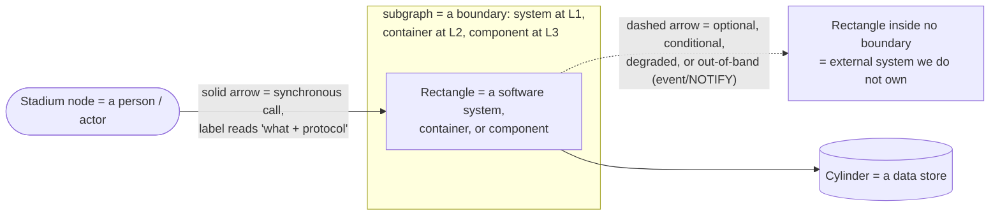
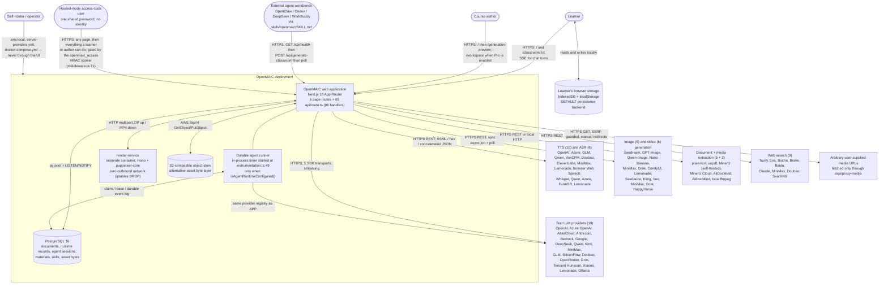
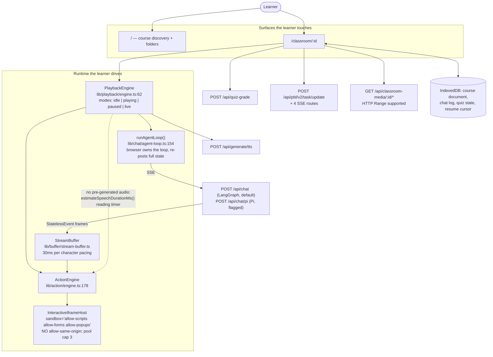
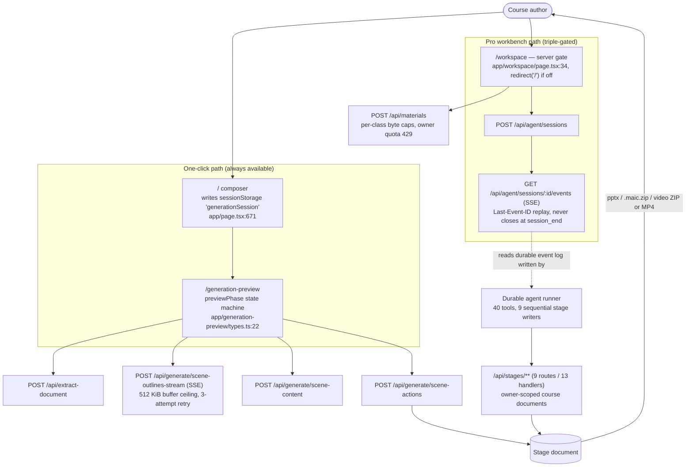
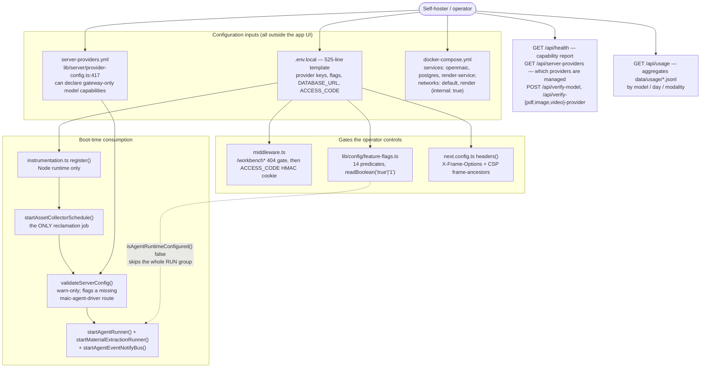

# The C4 Level 1 Context Diagram

The canonical system-context picture, given room to breathe, plus three
role-scoped zooms and the notation legend every diagram in this documentation set
obeys.

**Sources:** all of [`./02-actors-and-personas.md`](docs/01-system-context/02-actors-and-personas.md) and [`./03-external-systems.md`](docs/01-system-context/03-external-systems.md),
plus [`middleware.ts:46-90`](middleware.ts#L46-L90), [`instrumentation.ts:14-102`](instrumentation.ts#L14-L102),
[`lib/workbench/entry-gate.ts:4`](lib/workbench/entry-gate.ts#L4), `next.config.ts`, `docker-compose.yml`,
[`render-service/src/main.ts:229-441`](render-service/src/main.ts#L229-L441).

## Notation legend (applies to the whole docs set)

Mermaid has no C4 vocabulary we are willing to use — the experimental
`C4Context` / `C4Container` blocks are not stable, so C4 levels are expressed
with `subgraph` boundaries and node labels instead. The conventions below are
uniform across topics 01 through 17.

Additional rules used everywhere:

| Convention | Meaning |
| --- | --- |
| `path/to/file.ts:123` inside a node label | The definition site of that box. Always repo-relative. |
| A node label naming a function with `()` | The box *is* that function, not a vague responsibility |
| `sequenceDiagram` | One traced request or one playback turn; every `participant` is declared before use |
| `stateDiagram-v2` | A machine whose states are a real union type in the code, named verbatim |
| `erDiagram` | Persistence shape only. Relationship labels are the FK or the invariant, not prose |
| `classDiagram` | An interface/implementation seam, used only where the seam is the point |
| A box drawn dashed-in via a `-.->` edge only | Present in the deployment only under a flag or an env var |
| `Inferred:` prefix in prose | A reading of intent, not a reading of code |

## The canonical L1 diagram

Three things in that picture are load-bearing and easy to miss.

1. **The default persistence backend is the learner's browser, not the
   database.** [`lib/persistence/bootstrap.ts:15-68`](lib/persistence/bootstrap.ts#L15-L68) switches documents and
   runtime records to HTTP-backed stores *only* when
   `NEXT_PUBLIC_PERSISTENCE === '1'` in a browser. A stock deployment stores
   courses in IndexedDB.
2. **The runner is not a separate process.** It is a `setInterval` inside the
   Next server, installed once per server instance from [`instrumentation.ts:49`](instrumentation.ts#L49).
   Horizontal scaling therefore multiplies runners, which is why PostgreSQL —
   not the process — owns claims and leases.
3. **`render-service` is the only thing that is genuinely a second container**,
   and it is optional (`RENDER_SERVICE_URL`).

## Zoom 1: learner-facing

The learner never talks to an LLM provider directly; every model call is
server-side. But the learner's *browser* holds the conversation state — the
in-class runtime is stateless server-side and the client re-posts everything each
iteration ([`lib/chat/agent-loop.ts:181-192`](lib/chat/agent-loop.ts#L181-L192)).

## Zoom 2: author-facing

The two paths never share code for orchestration. The one-click path is
browser-sequenced with `sessionStorage` handoffs; the Pro path is
PostgreSQL-sequenced with a durable event log. They converge only on the `Stage`
document and on `@openmaic/generation`.

## Zoom 3: operator-facing

The operator's authority is asymmetric on purpose. `/api/health` and
`/api/server-providers` publish *whether* a capability exists without publishing
the credential; [`middleware.ts:66`](middleware.ts#L66) allowlists `/api/health` precisely so an
external agent can probe capability before authenticating.

## System boundary: what is in and what is out

| In the boundary | Out of the boundary |
| --- | --- |
| The Next.js app (pages + API + `lib/`) | Every LLM / TTS / ASR / image / video / search / extraction provider |
| The six `@openmaic/*` packages it consumes as workspace deps | The `@openmaic/*` packages *as published npm artefacts* consumed by third parties |
| The in-process agent runner and material-extraction runner | The external agent workbench that drives the API |
| The optional `render-service` container | The learner's browser storage (owned by the browser, not the server) |
| The optional PostgreSQL database and S3 bucket | `open.maic.chat`'s bearer auth and daily quota (not in this repo) |
| `data/usage/*.jsonl` on the app's filesystem | The two vendored forks' upstreams (`pptxgenjs`, `mathml2omml`) |

## Cross-links

- Actors in detail: [`./02-actors-and-personas.md`](docs/01-system-context/02-actors-and-personas.md)
- External systems in detail: [`./03-external-systems.md`](docs/01-system-context/03-external-systems.md)
- The next level down: [`../02-container-view/index.md`](docs/02-container-view/index.md)
- Every endpoint on the boundary: [`../12-api-reference/index.md`](docs/12-api-reference/index.md)
- Physical topology of these boxes: [`../17-deployment-view/index.md`](docs/17-deployment-view/index.md)
