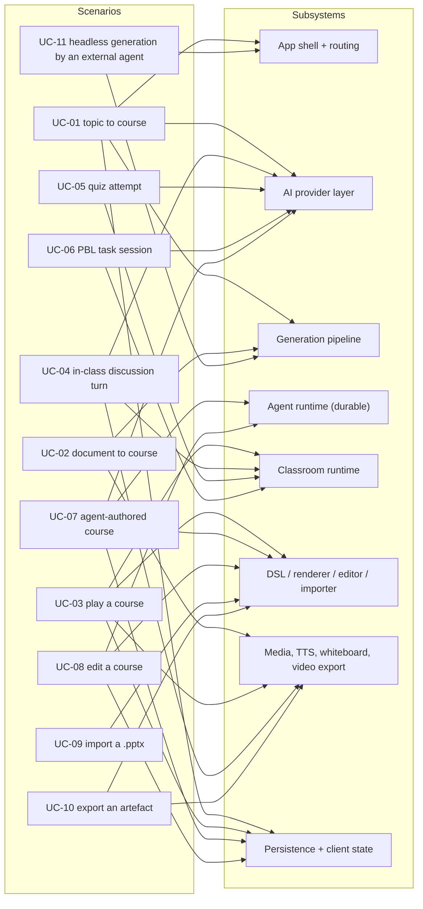
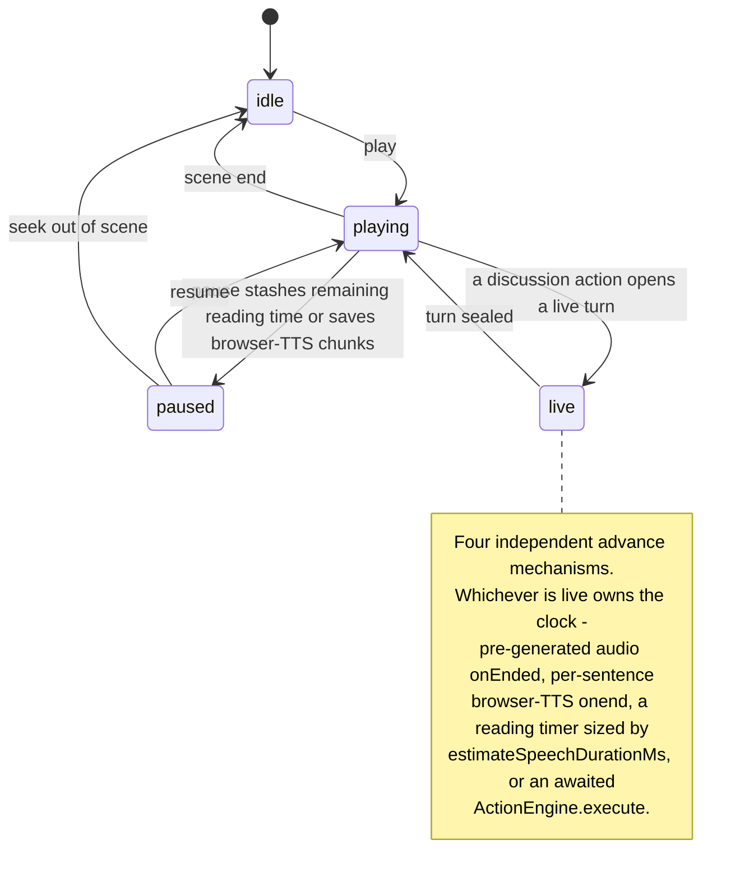
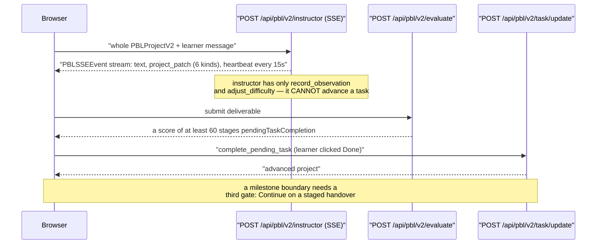
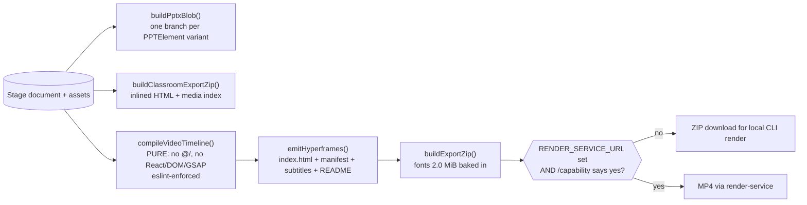

# Use-Case View (4+1)

Eleven primary scenarios. Each one names its actor, its trigger, the containers
and components it exercises, and where its hop-by-hop trace lives. This is the
scenarios ("+1") view of 4+1: the thread that ties the logical, process,
development and physical views together.

**Sources:** the route inventory (`git ls-files app/api | grep route.ts`, 69
files), [`app/page.tsx:671`](app/page.tsx#L671), [`app/generation-preview/page.tsx:1040-1051`](app/generation-preview/page.tsx#L1040-L1051),
[`lib/playback/engine.ts:62`](lib/playback/engine.ts#L62), [`lib/chat/agent-loop.ts:154`](lib/chat/agent-loop.ts#L154),
[`lib/chat/pi/director-loop.ts:29`](lib/chat/pi/director-loop.ts#L29), [`lib/server/agent-runtime/runner.ts:889,1861`](lib/server/agent-runtime/runner.ts#L889),
`lib/pbl/v2/api/sse.ts`, `app/api/pbl/v2/task/update/route.ts`,
`lib/import/use-import-pptx.ts`, [`lib/export/use-export-pptx.ts:497`](lib/export/use-export-pptx.ts#L497),
[`lib/video-export/compile.ts:152`](lib/video-export/compile.ts#L152), [`lib/store/video-render.ts:121`](lib/store/video-render.ts#L121),
`app/api/generate-classroom/route.ts`, [`skills/openmaic/references/generate-flow.md`](skills/openmaic/references/generate-flow.md).

## Scenario to subsystem map

Two facts fall straight out of that map. The AI provider layer (S2) is reached
*directly* by five of the eleven scenarios — UC-01, UC-04, UC-05, UC-06, UC-07.
Of the other six, UC-02 and UC-11 reach a model only through the generation
pipeline (S3) and UC-08 only through the agent runtime (S4); playback of an
already-generated course (UC-03), import (UC-09) and export (UC-10) draw no model
edge at all — they are model-free by construction. And the DSL / renderer /
editor / importer stack (S6) has the most distinct entry scenarios, five, with
the classroom runtime (S5) and persistence (S8) behind it at four each. S5 is
still the largest subsystem by file count (126 files / 33 687 lines).

## UC-01 — Topic to playable course (one-click)

| | |
| --- | --- |
| **Actor** | Course author |
| **Trigger** | Types a requirement in the `/` composer and submits |
| **Precondition** | At least one LLM provider resolvable by `resolveModel` |
| **Exercised** | `/` (`app/page.tsx`) → `sessionStorage['generationSession']` → `/generation-preview` → `POST /api/generate/scene-outlines-stream` (SSE) → author review gate → `POST /api/generate/scene-content` → `POST /api/generate/scene-actions` → `buildCompleteScene()` → `store.saveToStorage()` → `router.push('/classroom/:id')` |
| **Fails how** | Server-Sent-Events stream errors retry the whole stream up to 3 times; a scene whose TTS fails fails the whole scene; malformed slide elements are dropped individually |
| **Trace** | [`../11-data-flows/index.md`](docs/11-data-flows/index.md) |
| **Components** | [`../06-generation-pipeline/index.md`](docs/06-generation-pipeline/index.md), [`../03-app-and-api/index.md`](docs/03-app-and-api/index.md) |

Remaining scenes are *not* generated before navigation. Only the first scene
lands; the rest are pushed as skeleton placeholders
(`store.setGeneratingOutlines(remaining)`, [`app/generation-preview/page.tsx:1037-1038`](app/generation-preview/page.tsx#L1037-L1038))
and generated inside the classroom.

## UC-02 — Uploaded document to course

| | |
| --- | --- |
| **Actor** | Course author |
| **Trigger** | Attaches one or more PDFs / documents / audio / video before submitting |
| **Precondition** | A document extractor that supports the MIME type; media needs an ASR provider or AliDocMind |
| **Exercised** | `POST /api/extract-document` (multipart or asset-id form, both through `runExtraction`) → registry selection by order (`selectDocumentExtractorProvider`) or async availability probe (`selectMediaExtractorProvider`) → `DocumentArtifact` / `MediaArtifact` → `buildDocumentBundle()` ([`lib/document/bundle.ts:181`](lib/document/bundle.ts#L181)) → UC-01 from the outline step |
| **Fails how** | Unresolvable vision images are stripped from both prompt text and attachments; a missing extractor throws before any LLM spend |
| **Trace** | [`../11-data-flows/index.md`](docs/11-data-flows/index.md) |
| **Components** | [`../06-generation-pipeline/index.md`](docs/06-generation-pipeline/index.md) |

`buildDocumentBundle` is where multi-document ingestion gets interesting: it
renumbers image ids across documents, budgets text proportionally, and allocates
vision slots round-robin so one long PDF cannot starve the others.

## UC-03 — Play a course end to end

| | |
| --- | --- |
| **Actor** | Learner |
| **Trigger** | Opens `/classroom/:id` and presses play |
| **Precondition** | A `Stage` document reachable from IndexedDB or the server |
| **Exercised** | `runClassroomLoad()` (19 injected dependencies, IndexedDB then server fallback) → `Stage` chrome dispatch (`components/stage.tsx`) → `PlaybackChromeRoot` (1 848 lines, the real orchestrator) → `PlaybackEngine` ([`lib/playback/engine.ts:62`](lib/playback/engine.ts#L62)) → `ActionEngine` ([`lib/action/engine.ts:178`](lib/action/engine.ts#L178)) → `SlideCanvas` / whiteboard overlays / `InteractiveIframeHost` |
| **Fails how** | No pre-generated audio: a reading timer sized by `estimateSpeechDurationMs` advances instead. Cancellation is a monotonic `playbackGeneration` counter checked at 20 sites |
| **Trace** | [`../11-data-flows/index.md`](docs/11-data-flows/index.md) |
| **Components** | [`../08-classroom-runtime/index.md`](docs/08-classroom-runtime/index.md), [`../07-dsl-renderer-editor/index.md`](docs/07-dsl-renderer-editor/index.md) |

## UC-04 — In-class multi-agent discussion turn

| | |
| --- | --- |
| **Actor** | Learner |
| **Trigger** | A `discussion` action fires, or the learner types into the chat area |
| **Precondition** | An LLM route for the `chat-adapter` (LangGraph) or `maic-agent` (Pi) stage |
| **Exercised** | `runAgentLoop()` ([`lib/chat/agent-loop.ts:154`](lib/chat/agent-loop.ts#L154), browser-owned) → `POST /api/chat` (LangGraph `createOrchestrationGraph`, default) **or** `POST /api/chat/pi` (`runPiDirectorLoop`, flagged) → `StatelessEvent` SSE frames → `StreamBuffer` 30 ms/char pacing → `useDiscussionTTS` hold protocol → `ActionEngine` |
| **Fails how** | The director decides turn-taking; a duplicate `toolCallId` from the child is detected and dropped; abort propagates from `req.signal` |
| **Trace** | [`../11-data-flows/index.md`](docs/11-data-flows/index.md) |
| **Components** | [`../05-agent-runtime/index.md`](docs/05-agent-runtime/index.md), [`../08-classroom-runtime/index.md`](docs/08-classroom-runtime/index.md) |

Both chat paths ship today. `NEXT_PUBLIC_PI_CHAT_ENABLED` selects, and it is
commented out in [`.env.example:324`](.env.example#L324), so the LangGraph path is what a stock
deployment runs.

## UC-05 — Quiz attempt with an LLM-graded short answer

| | |
| --- | --- |
| **Actor** | Learner |
| **Trigger** | Submits an answer on a `quiz`-type scene |
| **Precondition** | For short answers only: an LLM route for the `quiz-grade` stage |
| **Exercised** | Quiz scene renderer → `POST /api/quiz-grade` → `resolveModelFromRequest('quiz-grade')` → `callLLM` → grade back to the scene → quiz state persisted to the learner `RuntimeStore` |
| **Fails how** | **Silently awards 50 % partial credit when the grading response fails to parse** ([`app/api/quiz-grade/route.ts:95-98`](app/api/quiz-grade/route.ts#L95-L98), `score: Math.round(points * 0.5)`), with no test coverage |
| **Trace** | [`../11-data-flows/index.md`](docs/11-data-flows/index.md) |
| **Components** | [`../06-generation-pipeline/index.md`](docs/06-generation-pipeline/index.md), [`../08-classroom-runtime/index.md`](docs/08-classroom-runtime/index.md) |

## UC-06 — Project-Based Learning task session (PBL v2)

| | |
| --- | --- |
| **Actor** | Learner |
| **Trigger** | Enters a `pbl`-type scene |
| **Precondition** | LLM routes for the `pbl-v2-runtime*` stages (five routable variants) |
| **Exercised** | Client POSTs the **whole** `PBLProjectV2` to one of `pbl/v2/instructor`, `/open-task`, `/evaluate`, `/simulator` (all SSE via `createSSEResponse`) → applies `project_patch` events → `POST /api/pbl/v2/task/update` for `start`, `continue_handover`, `complete_pending_task`, `enter_scenario`, `complete_act` |
| **Fails how** | `PBLGenerationError` is thrown rather than degraded — one of only two places generation refuses to degrade. A legacy v1 project is upgraded to a synthetic v2 for rendering but never persisted back, so progress on an upgraded v1 project is lost |
| **Trace** | [`../11-data-flows/index.md`](docs/11-data-flows/index.md) |
| **Components** | [`../08-classroom-runtime/index.md`](docs/08-classroom-runtime/index.md) |

## UC-07 — Agent-authored course (durable workbench)

| | |
| --- | --- |
| **Actor** | Course author, on a Pro deployment |
| **Trigger** | Submits a prompt in `/workspace` |
| **Precondition** | `NEXT_PUBLIC_PRO_WORKBENCH_ENABLED` **and** `OPENMAIC_AGENT_RUNTIME_ENABLED` **and** non-empty `DATABASE_URL` **and** `MODEL_ROUTES` routing `maic-agent-driver` |
| **Exercised** | `POST /api/agent/sessions` (validates and freezes `skillId`, defers the runner claim until opening context is durable) → `store.claimNextSession` by the scan timer → `runSession()` ([`runner.ts:889`](lib/server/agent-runtime/runner.ts#L889), a 970-line state machine) → 40 registered tools including 9 sequential stage writers → durable `HOST_AGENT_LIFECYCLE` events → `GET /api/agent/sessions/:id/events` SSE with `Last-Event-ID` replay → `lib/workbench/session-store.ts` fold outside React |
| **Fails how** | Recovery is `planResume` + `repairOrphanedToolCalls`, which makes tool execution **at-least-once** — every tool must be idempotent. A per-tool-call timeout (`OPENMAIC_AGENT_TOOL_TIMEOUT_MS`, default 600 000 ms) settles as an error tool-result rather than killing the session |
| **Trace** | [`../11-data-flows/index.md`](docs/11-data-flows/index.md) |
| **Components** | [`../05-agent-runtime/index.md`](docs/05-agent-runtime/index.md) |

Authorisation here is five independent layers: capability registration (a tool
the deployment cannot serve is never built), `makeAllowlistGate` as pi's
`beforeToolCall`, one owner-bound document store per run with `ownerId` absent
from every model-visible parameter, mutation fencing via `AsyncLocalStorage` +
`assertActiveLease`, and `executionMode: 'sequential'` on all nine stage writers.

## UC-08 — Edit an existing course

| | |
| --- | --- |
| **Actor** | Course author |
| **Trigger** | Enters edit chrome in `/classroom/:id`, or asks the agent to change something |
| **Precondition** | `isMaicEditorEnabled()` for direct manipulation; a Pro session for the agent path |
| **Exercised** | Direct: `EditableSlideCanvas` → L1 `EditIntent` (10 lenient variants) → L0 `EditorOperation` (13 strict variants that throw) → `EditorTransaction` → `EditorHistory` (cap 50) → `slide-edit-session.ts` write-through to `useStageStore`. Agent: `patch_stage` with typed JSON-Pointer / `str_replace` / `add_element` / `delete_element` ops, each re-validated against a closed TypeBox mirror of `slides.ts` plus the DSL structural validators |
| **Fails how** | The AI editor never writes prose — identity changes are rejected outright. A missing element id in an `EditIntent` is silently dropped; the same id in an `EditorOperation` throws |
| **Trace** | [`../11-data-flows/index.md`](docs/11-data-flows/index.md) |
| **Components** | [`../07-dsl-renderer-editor/index.md`](docs/07-dsl-renderer-editor/index.md), [`../05-agent-runtime/index.md`](docs/05-agent-runtime/index.md) |

## UC-09 — Import a `.pptx`

| | |
| --- | --- |
| **Actor** | Course author |
| **Trigger** | Chooses a `.pptx` file |
| **Precondition** | `NEXT_PUBLIC_ENABLE_PPTX_IMPORT`; the vendored importer bundle present under `public/vendor/maic-importer/` |
| **Exercised** | Browser: HEAD probe then a bundler-ignored `import('/vendor/maic-importer/index.js')` — the URL import exists because `pdfjs-dist`'s dynamic `require()` breaks Turbopack. Server: `import-pptx-worker.mjs` with `linkedom` + a fetch-backed `WorkerXHR` shim so DOM globals never touch the request process. Both: zip → model → serializer → `Output` in pt → `transformParsedToSlides` → px `Slide[]` → `normalizeSlideWith({onInvalid: 'drop'})` |
| **Fails how** | An unknown OOXML preset geometry falls back to a rectangle (154 presets + 44 multi-path presets are implemented). Two guard scripts plus a runtime HEAD probe keep the vendored bundle from 404-ing silently |
| **Trace** | [`../11-data-flows/index.md`](docs/11-data-flows/index.md) |
| **Components** | [`../07-dsl-renderer-editor/index.md`](docs/07-dsl-renderer-editor/index.md) |

## UC-10 — Export a portable artefact

| | |
| --- | --- |
| **Actor** | Course author or learner |
| **Trigger** | Picks an entry from the export menu |
| **Precondition** | Video needs `NEXT_PUBLIC_ENABLE_VIDEO_EXPORT`; MP4 additionally needs `RENDER_SERVICE_URL` |
| **Exercised** | `.pptx`: `buildPptxBlob()` ([`lib/export/use-export-pptx.ts:497`](lib/export/use-export-pptx.ts#L497)) through the **vendored** pptxgenjs 4.0.1, with LaTeX going temml → MathML → `mathml2omml` → OMML. `.maic.zip`: `buildClassroomExportZip()` ([`lib/export/use-export-classroom.ts:80`](lib/export/use-export-classroom.ts#L80)), format version 1. Video: `compileVideoTimeline()` (9 pure passes → zod-authored `VideoTimeline` IR, schema v4, 13 diagnostic codes) → `emitHyperframes()` → `buildExportZip()` → either a ZIP download or `startRender()` ([`lib/store/video-render.ts:121`](lib/store/video-render.ts#L121)) relaying to `render-service` |
| **Fails how** | `latex-to-omml` returns `null` on failure rather than throwing. The MP4 path degrades narrowly to a ZIP when the render service is absent or reports incapable via `/api/export-video/capability` |
| **Trace** | [`../11-data-flows/index.md`](docs/11-data-flows/index.md) |
| **Components** | [`../09-media-and-export/index.md`](docs/09-media-and-export/index.md), [`../07-dsl-renderer-editor/index.md`](docs/07-dsl-renderer-editor/index.md) |

## UC-11 — Headless generation driven by an external agent

| | |
| --- | --- |
| **Actor** | External agent workbench |
| **Trigger** | The user tells their assistant "teach me X" and the assistant has the `openmaic` skill loaded |
| **Precondition** | Server-side `DEFAULT_MODEL` or a `MODEL_ROUTES` entry for `generate-classroom` — the request carries no `x-model` |
| **Exercised** | `GET /api/health` (capability probe, middleware-allowlisted) → `POST /api/generate-classroom` → `createClassroomGenerationJob` + `after(() => runClassroomGenerationJob(...))` → `202 {jobId, pollUrl, pollIntervalMs: 5000}` → `GET /api/generate-classroom/:jobId` polled → `generateClassroom()` ([`lib/server/classroom-generation.ts:176-178`](lib/server/classroom-generation.ts#L176-L178)) with lazy per-stage model resolution and a **strictly serial** scene loop |
| **Fails how** | `resolveModel` throws if a stage resolves to no model — there is deliberately no hardcoded vendor fallback. `maxDuration = 30` on the submit route; the work itself runs in `after()` |
| **Trace** | [`../11-data-flows/index.md`](docs/11-data-flows/index.md) |
| **Components** | [`../06-generation-pipeline/index.md`](docs/06-generation-pipeline/index.md), [`../12-api-reference/index.md`](docs/12-api-reference/index.md) |

This is a *second, duplicated* orchestration of moves 1 and 2 over the same
`@openmaic/generation` primitives: different retry wiring, different
partial-failure semantics, different agent handling from the browser loop. It is
the generation subsystem's largest maintenance question.

## Scenario coverage against the API surface

| Route family | Scenarios that reach it |
| --- | --- |
| `generate/**` (8 routes) | UC-01, UC-02, UC-03 (TTS), UC-11 |
| `chat/**` (3) | UC-04 |
| `pbl/v2/**` (5) | UC-06 |
| `agent/**` (10) + `materials/**` (2) | UC-07, UC-08 |
| `stages/**` (9) + `folders/**` (3) + `persistence/[...path]` | UC-01, UC-07, UC-08 |
| `export-video/**` (4) + `classroom-media/**` | UC-10, UC-03 |
| `verify-*` + `provider/**` + `health` + `server-providers` | operator probes; UC-11 uses `health` |
| `quiz-grade`, `transcription`, `parse-pdf`, `extract-document` | UC-05, UC-02 |
| `stages/[id]/publish`, `stages/[id]/unpublish` | **none** — the handlers run, but their *success* path is unreachable: `withRequestOwnerId` only ever yields an `anon:`-prefixed id, and [`publish/route.ts:26-31`](app/api/stages/[id]/publish/route.ts#L26-L31) refuses those with `401 login_required` before any access lookup. The owner-match and already-public branches below it ([`:37-39`](app/api/stages/[id]/publish/route.ts#L37-L39), [`:41-45`](app/api/stages/[id]/publish/route.ts#L41-L45)) are therefore dead in this build |

## Open questions

- `stages/[id]/publish` and `stages/[id]/unpublish` are unreachable in the
  current identity model. Whether they anticipate a future auth layer or are dead
  code was not determined.
- No scenario exercises `app/eval/whiteboard` in production; it is an unflagged
  route that exists as a Playwright render harness for
  `eval/whiteboard-layout/capture.ts`. Whether shipping it publicly is
  intentional was not determined.
