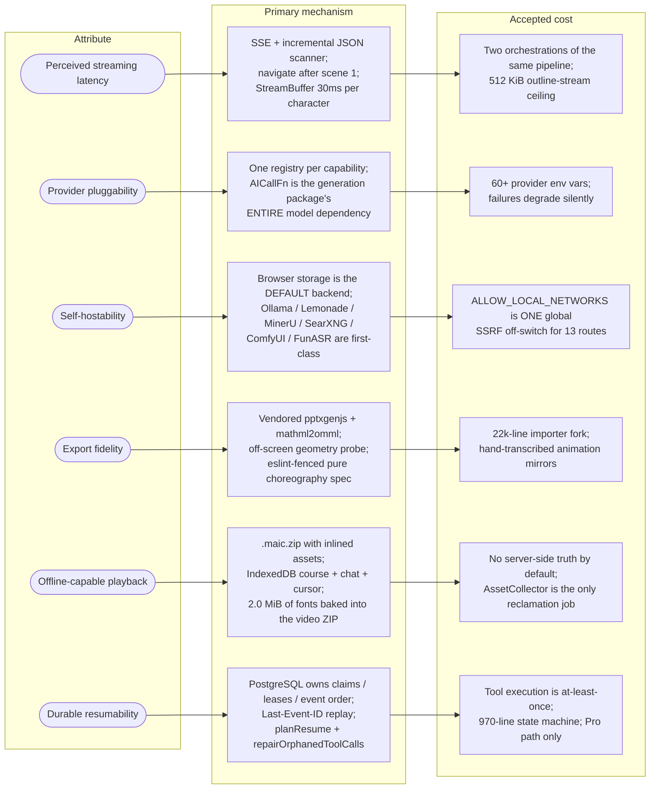
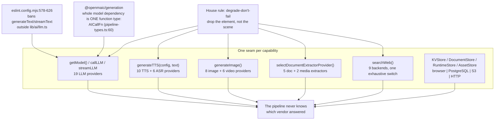
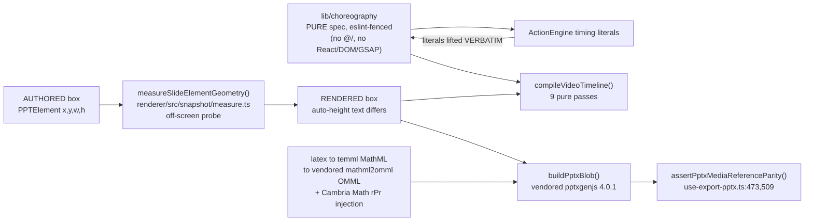
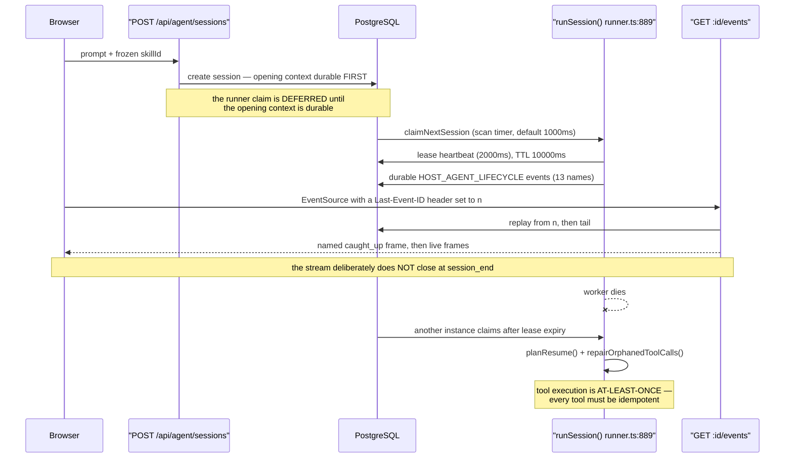

# Quality Attributes and Accepted Trade-offs

Six attributes the code demonstrably optimises for, each traced to the concrete
mechanism that buys it and the price the codebase pays. Every entry here is
inferred from a mechanism you can read, not from a design document — there is no
architecture-decision record in this tree.

**Sources:** `app/api/agent/sessions/[id]/events/route.ts:46,58`,
`lib/pbl/v2/api/sse.ts:215,286`,
`app/api/generate/scene-outlines-stream/route.ts:460,486`,
`app/generation-preview/page.tsx:1031-1051`, `lib/buffer/stream-buffer.ts`,
`eslint.config.mjs:255-323,578-626`, `lib/export/use-export-pptx.ts:473,509`,
`packages/@openmaic/renderer/src/snapshot/measure.ts`,
`lib/persistence/bootstrap.ts:15-68`, `lib/audio/audio-duration.ts:210`,
`lib/choreography/timing.ts:113`, `lib/video-export/deps.ts:61`,
`render-service/docker-entrypoint.sh:34`, `lib/server/ssrf-guard.ts:253`,
`lib/server/agent-runtime/route-response.ts:35-43`,
`lib/server/agent-runtime/runner.ts:889`,
`../appendix/research/quality-testing-ci-deps/00-overview.md`.

## The attribute map

## 1. Perceived streaming latency

An LLM course takes minutes. The architecture is built so the *author* never
waits minutes for the first signal.

| Mechanism | Where | What it buys |
| --- | --- | --- |
| SSE with an O(n) incremental JSON scanner | `app/api/generate/scene-outlines-stream/route.ts` | Outline cards appear while the model is still writing |
| Navigate to the classroom after **one** scene | `app/generation-preview/page.tsx:1031-1051` | Playback starts while scenes 2..n are still being generated |
| `StreamBuffer` paces at 30 ms/character | `lib/buffer/stream-buffer.ts` | Live conversation reads as speech, not as a JSON dump |
| Heartbeats: 25 s (agent events), 15 s (PBL, outlines) | `events/route.ts:58`, `sse.ts:215`, `scene-outlines-stream/route.ts:460` | Idle intermediaries do not kill a long stream |
| `X-Accel-Buffering: no` on PBL streams | `lib/pbl/v2/api/sse.ts:286` | nginx does not buffer the stream into uselessness |
| Duration stored on the `AudioFileRecord` at TTS time | `lib/audio/audio-duration.ts:210` | The export compiler's DI surface can be **synchronous** (`lib/video-export/deps.ts:61`) |

**Accepted cost.** Two complete orchestrations of the same pipeline exist — a
browser loop and a headless server job — with different retry wiring and
different partial-failure semantics. And a 512 KiB buffer ceiling on the outline
stream (`scene-outlines-stream/route.ts:486`) means an unusually long outline
response is truncated rather than degrading gracefully.

## 2. Provider pluggability

`@openmaic/generation` is the proof: 8 199 lines of pipeline whose *entire*
dependency on a model is the function type `AICallFn`. It never selects a
provider, never reads an env var, never persists.

**Accepted cost.** Sixty-plus provider env vars in a 525-line `.env.example`;
`/api/health` exists solely so a client can discover what actually works; and
"degrade-don't-fail" means real failures are quiet — malformed slide elements are
dropped individually, unmapped image ids remove their element, zero parsed actions
fall back to canned `Action` lists. Two deliberate exceptions exist (PBL scene
generation throws `PBLGenerationError`; a scene's TTS failure fails the whole
scene), and the quiz-grade 50 %-on-parse-failure fallback is the same instinct
applied where it should not have been.

## 3. Self-hostability

The hard requirement list is one item long: an LLM key. Everything else is
optional, and the defaults are chosen so a `git clone` + `pnpm install` +
one key produces a working product.

| Decision | Consequence for a self-hoster |
| --- | --- |
| Persistence defaults to the browser (`lib/persistence/bootstrap.ts:15-68` only switches on `NEXT_PUBLIC_PERSISTENCE === '1'`) | No database needed to try it |
| `output: 'standalone'` unless `VERCEL` (`next.config.ts`) | A Docker image without `node_modules` |
| Local providers first-class: Ollama, Lemonade (LLM+TTS+ASR+image), MinerU self-hosted, SearXNG, ComfyUI, FunASR | No cloud dependency for any capability |
| `ACCESS_CODE` as a one-variable site password | Shared-link deployments work without an identity provider |
| `render-service` behind `RENDER_SERVICE_URL`, degrading to a ZIP | MP4 is opt-in, not a hard dependency |
| Warn-only boot validation (`validateServerConfig()`) | Bad config surfaces as `[config]` warnings, not a failed boot |

**Accepted cost.** Reaching a local model needs `ALLOW_LOCAL_NETWORKS=true`,
which is a *single global* off-switch for the SSRF guard across all thirteen
routes that use it — you cannot allow-list only Ollama. And the development-only
persistence auth (`PERSISTENCE_DEV_TOKEN` + a client-supplied `x-learner-key`)
collapses every asset into one `'shared'` principal, which is documented as
providing no isolation.

## 4. Export fidelity

Export is not a nice-to-have here; it is a first-class output, and the codebase
spends real complexity on making the exported artefact match what was on screen.

Three mechanisms deserve naming:

1. **The pure-choreography fence.** `lib/choreography` holds the timing literals
   verbatim, copied from `ActionEngine`, and a dedicated ESLint block
   (`eslint.config.mjs:255-323`) makes it *impossible* to import `@/…`, React,
   DOM or GSAP from there. The app engine and the video exporter therefore
   cannot drift on timing.
2. **The geometry probe.** `measureSlideElementGeometry` exists because
   auto-height text makes the authored box differ from the rendered box; the
   exporter measures rather than guesses.
3. **Two vendored forks.** `packages/pptxgenjs` (4.0.1, sole local delta:
   `addFormula`/OMML) and `packages/mathml2omml` (0.5.0, a one-character upstream
   fix). Forking was cheaper than not having formula export.

**Accepted cost.** A 22 203-line importer fork; animation descriptors in
`lib/choreography` that are *hand-transcribed* mirrors of the React overlays and
consumed only by the exporter and a schema test — the one place in this design
where drift is possible and unguarded.

## 5. Offline-capable playback

| Mechanism | Where |
| --- | --- |
| `.maic.zip` with inlined HTML/CSS/media assets, format version 1 | `lib/export/use-export-classroom.ts:80`, `classroom-zip-types.ts:11-12` |
| Course document, chat log, quiz state and resume cursor in IndexedDB | `lib/document-store/store.ts`, `lib/runtime/store.ts`, `lib/utils/chat-storage.ts` |
| Per-tab `sessionStorage` action resume beating a 1 s-debounced device KV cursor | `lib/playback/action-resume.ts`, `cursor.ts` |
| Twenty KaTeX faces + Noto CJK/Cyrillic/Arabic (2.0 MiB) baked into the video ZIP | three `gen:video-export-*` scripts |
| `render-service` runs with iptables egress DROP, failing closed | `render-service/docker-entrypoint.sh:34` |

The render container's zero-egress posture is the strongest statement of this
attribute: the renderer cannot fetch a font, so the fonts ship with the job.

**Accepted cost.** For a stock deployment there is no server-side truth. Clear
your browser storage and your courses are gone. `AssetCollector` is the only
reclamation job in the whole system; documents, sessions, skills, materials and
usage logs only soft-delete or grow.

## 6. Durable resumability (Pro path only)

The client connection is never part of the execution lifetime. That is the whole
design: PostgreSQL is the authority for claims, leases, event ordering,
cancellation and recovery.

**Accepted cost.** At-least-once tool execution is a correctness burden pushed
onto all 40 tools. `runSession()` is a single 970-line state machine. And the
attribute exists only on the Pro path — the one-click path has none of it, so
closing the tab mid-generation loses the run.

## What the architecture explicitly does NOT optimise for

Naming these is as useful as naming the six above, because each is a deliberate
scope decision, not an oversight.

| Not optimised | Evidence | Why it is a *choice* |
| --- | --- | --- |
| Multi-tenancy | `resolveRequestOwnerId`'s `authenticatedOwnerId` parameter has no call site | Owner-scoping machinery exists and is thorough (row locks, four named refusals, no-existence-oracle 404s); only the identity source is missing |
| Rate limiting | zero limiters in `app/api/**` | Self-hosters bring their own reverse proxy; a hosted operator needs more than this repo has |
| Request-time schema validation | zod is a dependency and unused in every route file; validation is entirely hand-written | Hand-written checks are dense and commented, but four different error-envelope shapes coexist |
| Coverage measurement | no coverage provider in any of nine Vitest configs | 6 385 + 1 452 statically-counted cases exist; coverage is unknown, not low |
| Access-token expiry | `createAccessToken` embeds a timestamp neither verifier compares to now | 7-day cookie `maxAge` is the only bound, and it is client-side |

Verified by the quality pack:
`../appendix/research/quality-testing-ci-deps/00-overview.md`.

## Trade-off ledger, one line each

| Attribute | Bought with | Paid in |
| --- | --- | --- |
| Streaming latency | SSE + navigate-after-scene-1 | Duplicated orchestration, 512 KiB stream ceiling |
| Provider pluggability | Five registries + one `AICallFn` seam | 60+ env vars, silent degradation |
| Self-hostability | Browser-default persistence, local providers | One global SSRF off-switch, no isolation in dev auth |
| Export fidelity | Vendored forks, geometry probe, pure fenced spec | 22k-line fork, hand-mirrored animation descriptors |
| Offline playback | Inlined ZIPs, IndexedDB, baked fonts, zero-egress renderer | No server-side truth by default, only one reclamation job |
| Durable resumability | PostgreSQL-owned leases and event log | At-least-once tools, a 970-line state machine, Pro-only |

## Cross-links

- Test and gate inventory behind these claims: `../14-code-quality/index.md`
- Cross-cutting mechanisms (SSRF, flags, i18n, logging): `../15-cross-cutting/index.md`
- Build and CI shape: `../16-development-view/index.md`
- Deployment consequences of self-hostability: `../17-deployment-view/index.md`

## Open questions

- No architecture-decision records exist in the tree, so every attribute above
  is inferred from mechanism. Whether streaming latency or export fidelity was
  the *primary* driver when they conflict could not be determined.
- The hand-transcribed animation descriptors in `lib/choreography` are the only
  unguarded drift surface in the export path. Whether a generator or a parity
  test was considered and rejected was not determined.
