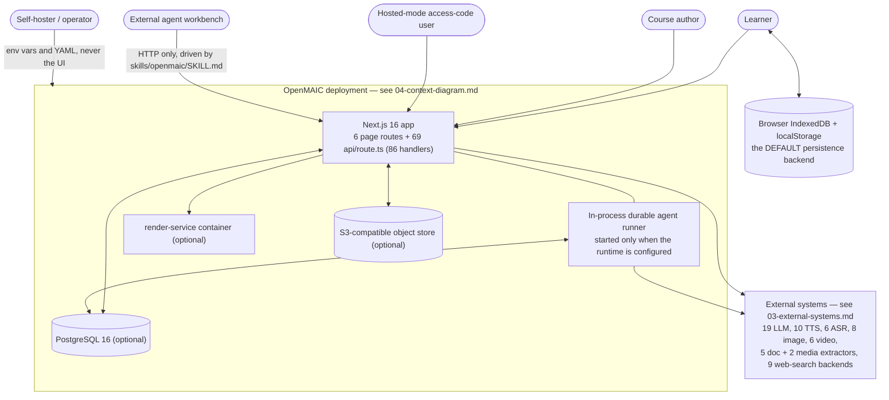
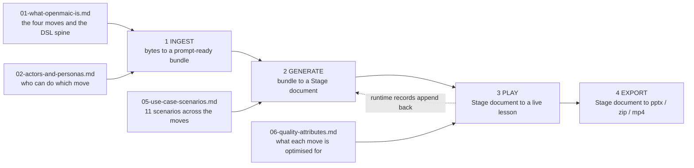

# System Context (C4 L1) and Use-Case View

The outermost ring of the OpenMAIC architecture: what the system is, who and what
talks to it, what it talks to, and the scenarios those conversations serve. This
is the C4 Level 1 view plus the 4+1 Use-Case view — the two things a new engineer
needs before any container or component diagram means anything.

**Audience:** a staff engineer joining the team. It assumes you can read
TypeScript and Next.js App Router conventions; it does not assume you know
anything about this repo.

**Surveyed at:** commit `c2c9553a` on `main`.

## What this topic covers

- The problem OpenMAIC solves and the four-move shape of the solution.
- Every human and machine actor, the surface each enters through, and the
  authority each one actually has in code.
- Every external system the deployment can talk to, named concretely from the
  registries in `lib/`, with the protocol and the direction of the call.
- The canonical L1 context diagram plus role-scoped zooms, and the notation
  legend used by every diagram in this documentation set.
- Eleven primary use-case scenarios, each traced to the containers it
  exercises and forward-linked to its process-view page.
- The quality attributes the code demonstrably optimises for, and the price paid
  for each.

## What this topic does NOT cover

Container decomposition ([`../02-container-view/index.md`](docs/02-container-view/index.md)), any component
internals (topics 03 through 10), the traced end-to-end data flows
([`../11-data-flows/index.md`](docs/11-data-flows/index.md)), the endpoint-by-endpoint API reference
([`../12-api-reference/index.md`](docs/12-api-reference/index.md)), and deployment topology
([`../17-deployment-view/index.md`](docs/17-deployment-view/index.md)). Those are named here only where the context
boundary touches them.

## Sources

Primary code read for this topic:

| Path | Why it matters here |
| --- | --- |
| [`README.md`](README.md) | The stated product claim, which every page here checks against code |
| `package.json` | The dependency set that bounds what OpenMAIC can integrate |
| `middleware.ts` | The only site-wide access gate |
| `instrumentation.ts` | The once-per-process startup schedule |
| `lib/config/feature-flags.ts` | The 14 gates that decide which surfaces exist |
| `lib/workbench/entry-gate.ts` | The server-authoritative Pro workbench decision |
| `lib/ai/providers.ts` | The 19-provider LLM registry |
| `lib/audio/types.ts`, `lib/audio/constants.ts` | The TTS and ASR provider unions |
| `lib/media/types.ts`, `lib/media/image-providers.ts` | Image and video provider unions |
| `lib/web-search/index.ts`, `lib/web-search/types.ts` | The nine search backends |
| `lib/document/extractors/manifest.ts` | The document and media extractor catalog |
| `packages/@openmaic/storage/src/index.ts` | The persistence charter and backend list |
| [`skills/openmaic/SKILL.md`](skills/openmaic/SKILL.md) + `references/` | The external-agent driver contract |
| `.env.example` | The operator-facing configuration surface |
| `docker-compose.yml`, `render-service/` | The optional out-of-process container |

Evidence packs (verbatim signatures and traced flows, written before this topic):

- [`../appendix/research/app-shell-and-routing/00-overview.md`](docs/appendix/research/app-shell-and-routing/00-overview.md)
- [`../appendix/research/api-surface/00-overview.md`](docs/appendix/research/api-surface/00-overview.md)
- [`../appendix/research/ai-provider-layer/00-overview.md`](docs/appendix/research/ai-provider-layer/00-overview.md)
- [`../appendix/research/agent-runtime/00-overview.md`](docs/appendix/research/agent-runtime/00-overview.md)
- [`../appendix/research/quality-testing-ci-deps/00-overview.md`](docs/appendix/research/quality-testing-ci-deps/00-overview.md)

Every non-obvious claim in this topic carries a `path:line` citation. Where a
statement is an inference rather than a reading, it is prefixed `Inferred:`.

## Section files

| File | Contents |
| --- | --- |
| [`01-what-openmaic-is.md`](docs/01-system-context/01-what-openmaic-is.md) | The problem, the solution shape, and the one-paragraph architecture; the ingest to generate to play to export spine |
| [`02-actors-and-personas.md`](docs/01-system-context/02-actors-and-personas.md) | Five actors, their entry surfaces, and the authority each holds in code |
| [`03-external-systems.md`](docs/01-system-context/03-external-systems.md) | Every external system by group, named concretely, with interaction and protocol |
| [`04-context-diagram.md`](docs/01-system-context/04-context-diagram.md) | The canonical C4 L1 diagram, three role-scoped zooms, and the docs-set notation legend |
| [`05-use-case-scenarios.md`](docs/01-system-context/05-use-case-scenarios.md) | Eleven primary scenarios: actor, trigger, containers exercised, forward link |
| [`06-quality-attributes.md`](docs/01-system-context/06-quality-attributes.md) | Six quality attributes inferred from code, each with mechanism and accepted cost |

## Reading order

Read `01` then `04`. `02` and `03` are reference tables you will come back to.
`05` is the bridge into [`../11-data-flows/index.md`](docs/11-data-flows/index.md). `06` is the page to read
before you propose a change that trades one of these attributes away.

## Topic overview

The whole topic in one picture: five actors, one system boundary with three
containers and two data stores, and seven groups of external systems. Every box
is expanded in the section file named on its edge.

The four moves the system performs on a course, and which section file explains
each actor's stake in them:

## Where to go next

| If you want | Go to |
| --- | --- |
| The containers these actors actually reach | [`../02-container-view/index.md`](docs/02-container-view/index.md) |
| The HTTP surface as an endpoint list | [`../12-api-reference/index.md`](docs/12-api-reference/index.md) |
| A scenario traced hop by hop | [`../11-data-flows/index.md`](docs/11-data-flows/index.md) |
| The external systems as npm/licence facts | [`../13-dependencies/index.md`](docs/13-dependencies/index.md) |
| Cross-cutting gates (auth, SSRF, i18n, flags) | [`../15-cross-cutting/index.md`](docs/15-cross-cutting/index.md) |
| How to run and deploy it | [`../17-deployment-view/index.md`](docs/17-deployment-view/index.md) |
| *Why* the system has this shape at all | [`../18-decisions/index.md`](docs/18-decisions/index.md) |
| What a word means | [`../glossary.md`](docs/glossary.md) |
| The documentation set root — reading paths, the C4 / 4+1 model, conventions | [`../README.md`](docs/README.md) |
