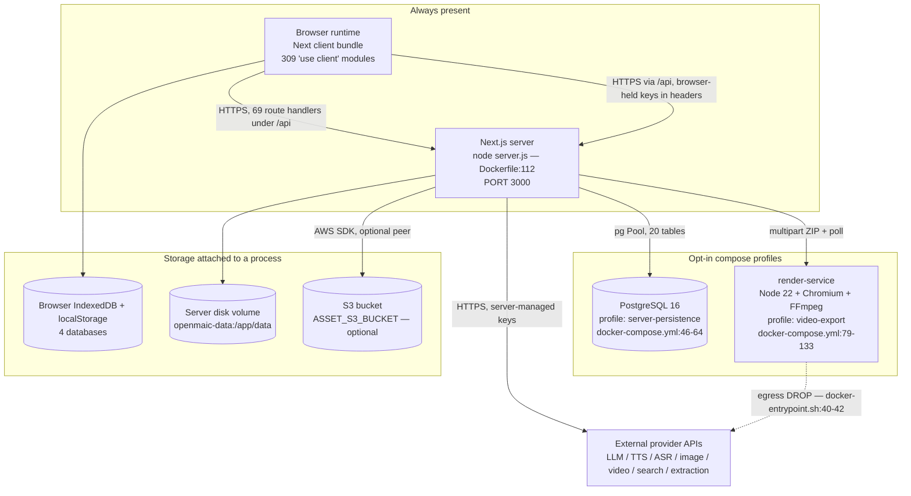
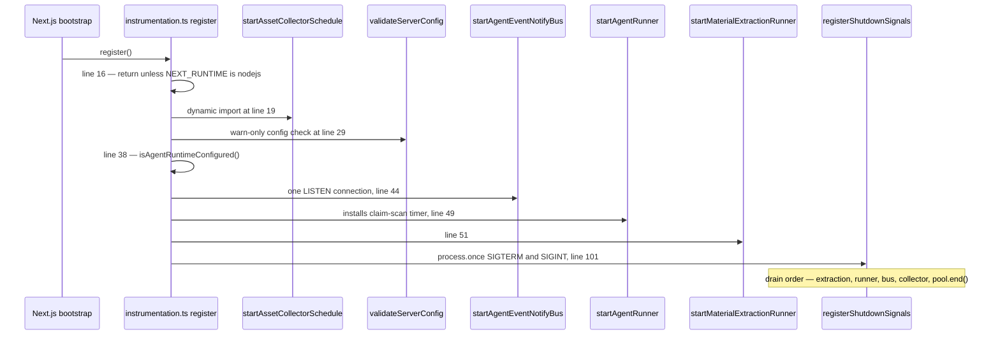
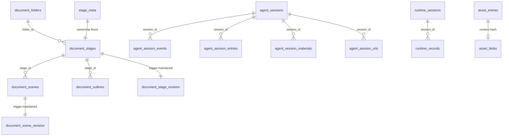
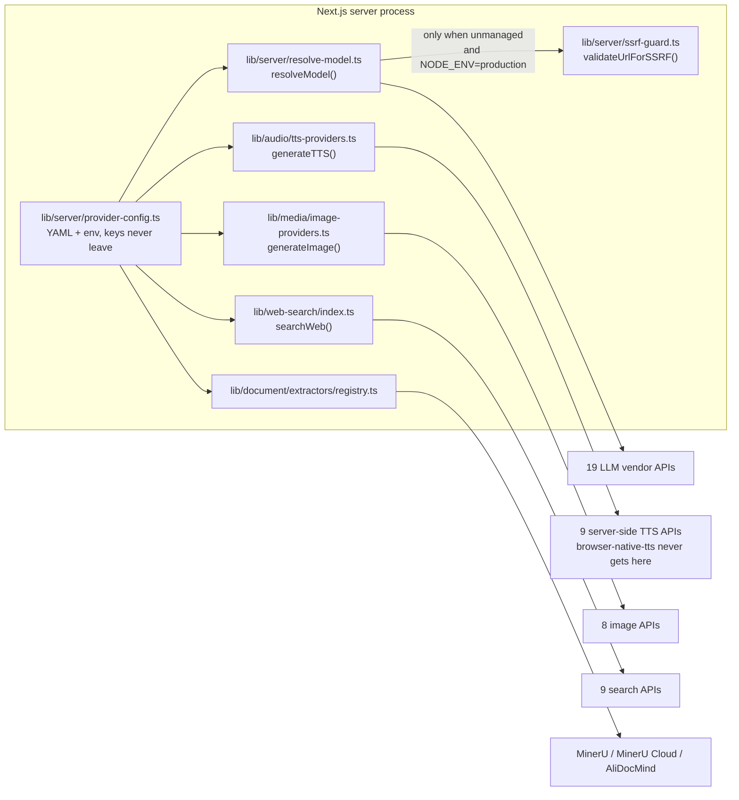

# 01 — Container inventory

Every separately-startable process and independently addressable store in an
OpenMAIC deployment, verified against the compose file, the two Dockerfiles and
the code that reads each configuration value. Nothing here is a logical grouping
— those are in [06-bounded-contexts.md](docs/02-container-view/06-bounded-contexts.md).

**Sources:** `docker-compose.yml`, `Dockerfile`, `render-service/Dockerfile`,
`render-service/docker-entrypoint.sh`, `render-service/package.json`,
`render-service/src/main.ts`, `next.config.ts`, `vercel.json`,
`instrumentation.ts`, `middleware.ts`, `lib/persistence/server-provider.ts`,
`lib/persistence/bootstrap.ts`, `lib/utils/database.ts`,
`lib/server/classroom-storage.ts`, `lib/server/usage-storage.ts`,
`lib/server/render-service.ts`, `lib/ai/providers.ts`, `lib/audio/constants.ts`,
`lib/media/image-providers.ts`, `lib/media/video-providers.ts`,
`lib/pdf/constants.ts`, `lib/web-search/index.ts`, `.env.example`.
Evidence: [app-shell-and-routing/04](docs/appendix/research/app-shell-and-routing/04-dependencies-and-config.md),
[persistence-storage-state/00](docs/appendix/research/persistence-storage-state/00-overview.md),
[media-audio-video/02g](docs/appendix/research/media-audio-video/02g-interfaces-render-service.md).

## The short answer

Exactly **three** processes can be started, and only one of them is mandatory.

The dotted edge is the point: the render container has **no** outbound network.
[`render-service/docker-entrypoint.sh:40-42`](render-service/docker-entrypoint.sh#L40-L42) installs the iptables `OUTPUT DROP`
policy inside `lockdown()`, and the wrapper at `:51-63` **exits non-zero** if it
cannot — on non-root, on missing `iptables`, or on a failed rule — rather than
starting an unisolated service that `/health` would still report healthy.

## Container-by-container

### 1. Next.js server runtime

| Field | Value |
| --- | --- |
| Technology | Next.js 16.2.11, React 19.2.3, Node ≥ 22.19.0 ([`package.json:7,119,143`](package.json#L7)) |
| Responsibility | Serves all six page routes and all 69 `app/api/**/route.ts` handlers; owns every operator secret; hosts the durable agent runner and three other background schedules |
| How started | `node server.js` in the runner stage ([`Dockerfile:112`](Dockerfile#L112)) when `output: 'standalone'`; as Vercel functions when `VERCEL` is set ([`next.config.ts:4`](next.config.ts#L4)) |
| Listens on | `0.0.0.0:3000` ([`Dockerfile:89-90`](Dockerfile#L89-L90)); mapped `3000:3000` in compose ([`docker-compose.yml:22-23`](docker-compose.yml#L22-L23)) |
| Config source | Process env; `.env.local` via compose `env_file` ([`docker-compose.yml:24-25`](docker-compose.yml#L24-L25)); optional `server-providers.yml`, which an operator must uncomment at [`docker-compose.yml:38-39`](docker-compose.yml#L38-L39) before it is mounted read-only — the shipped file's only active volume is `openmaic-data:/app/data` at [`:40`](docker-compose.yml#L40) (parsed by [`lib/server/provider-config.ts:8-10`](lib/server/provider-config.ts#L8-L10)) |
| Runtime flavour | Node only. No route in the tree declares `runtime = 'edge'`; only `middleware.ts` runs on the edge, and it branches on `process.env.NEXT_RUNTIME !== 'edge'` at [`middleware.ts:53`](middleware.ts#L53) because it cannot trust server-only variables there |

Four things start once per server instance, from `instrumentation.ts:register()`
— never from a route module, because a route module has no once-per-process
guarantee and no shutdown hook ([`instrumentation.ts:1-12`](instrumentation.ts#L1-L12)):

Every one of those imports is dynamic and guarded, so the Edge bundle never
pulls in `pg` ([`instrumentation.ts:14-20`](instrumentation.ts#L14-L20)). The two `process.once` calls live in
`lib/server/register-shutdown-signals.ts` purely so Turbopack's static Edge scan
stops flagging a Node API on a branch that can never run there
([`instrumentation.ts:97-100`](instrumentation.ts#L97-L100)).

### 2. Browser runtime

| Field | Value |
| --- | --- |
| Technology | The Next.js client bundle: React 19, Zustand 5, i18next 26, Dexie 4, `@openmaic/renderer` / `editor` / `importer` |
| Responsibility | Orchestrates generation (`lib/hooks/use-scene-generator.ts`), runs the classroom playback engine, holds the user's own provider API keys, compiles the video-export ZIP, and owns the whole in-class chat loop |
| How started | Page load. Six page routes exist outside `app/api` (`/`, `/generation-preview`, `/classroom/[id]`, `/workspace`, `/workbench/new`, `/eval/whiteboard`) |
| Config source | `NEXT_PUBLIC_*` values inlined at **build** time ([`lib/config/feature-flags.ts:1-8`](lib/config/feature-flags.ts#L1-L8)), plus the account-scoped settings store persisted to `localStorage` |
| Scale | 309 files carry `'use client'` (counted over `app/`, `components/`, `lib/`) |

This is a genuinely thick client: it is not a view layer over a server-side
domain model. See [03-server-client-boundary.md](docs/02-container-view/03-server-client-boundary.md).

### 3. render-service

| Field | Value |
| --- | --- |
| Technology | Node 22.22.2 (digest-pinned, [`render-service/Dockerfile:8`](render-service/Dockerfile#L8)), Hono 4, `@hyperframes/producer` 0.7.107, `puppeteer-core` 25, Chromium headless shell + FFmpeg in-image |
| Responsibility | Frame capture and MP4 encoding only. `POST /render`, `POST /preview`, `GET /render/:jobId`, `GET /render/:jobId/download`, `DELETE /render/:jobId`, `GET /health` ([`render-service/src/main.ts:12-17`](render-service/src/main.ts#L12-L17)) |
| How started | `ENTRYPOINT /usr/local/bin/docker-entrypoint.sh` ([`render-service/Dockerfile:95`](render-service/Dockerfile#L95)) → iptables lockdown → `setpriv --reuid=render … tsx src/main.ts` ([`docker-entrypoint.sh:72`](render-service/docker-entrypoint.sh#L72)). Compose profile `video-export` only ([`docker-compose.yml:81-82`](docker-compose.yml#L81-L82)) |
| Listens on | `9000`, `expose`d but **not** published to the host ([`docker-compose.yml:83-84`](docker-compose.yml#L83-L84), [`render-service/Dockerfile:78,89`](render-service/Dockerfile#L78)) |
| Config source | Its own env block in compose ([`docker-compose.yml:89-123`](docker-compose.yml#L89-L123)); its own `package.json` / `tsconfig.json` / `vitest.config.ts`; `render-service/src/config.ts` |
| Isolation | On the `render` network, `internal: true` — no route to host or internet ([`docker-compose.yml:142-143`](docker-compose.yml#L142-L143)); plus its own egress DROP; plus `mem_limit` default `8g` and `shm_size: 2gb` |
| Coupling to the app | Only `RENDER_SERVICE_URL` ([`lib/server/render-service.ts:16`](lib/server/render-service.ts#L16)). Unset ⇒ the app degrades to a ZIP download rather than erroring ([`lib/server/render-service.ts:4-7`](lib/server/render-service.ts#L4-L7)) |

`RENDER_SERVICE_URL` is deliberately **not** run through the SSRF guard, with the
reason written down at [`lib/server/render-service.ts:26-35`](lib/server/render-service.ts#L26-L35): the URL is *meant*
to point at an internal host, and guarding it would force operators to weaken
SSRF globally via `ALLOW_LOCAL_NETWORKS`.

It also does not consume the workspace packages by `workspace:*`. It pins
published versions — `@openmaic/dsl` `0.11.0` and `@openmaic/renderer` `0.1.4`
([`render-service/package.json:19-20`](render-service/package.json#L19-L20)) — against `0.11.1` and `0.1.6` currently
on disk (`packages/@openmaic/dsl/package.json`, `.../renderer/package.json`).
Consequences in [05-workspace-packages.md](docs/02-container-view/05-workspace-packages.md).

### 4. PostgreSQL (relational store)

| Field | Value |
| --- | --- |
| Technology | `postgres:16` image ([`docker-compose.yml:47`](docker-compose.yml#L47)); `pg` 8.16 pool in-process ([`lib/persistence/server-provider.ts:8,72`](lib/persistence/server-provider.ts#L8)) |
| Responsibility | 20 tables: course documents + revisions, learner runtime records, durable agent sessions/events/entries, materials, user skills, asset registry and optional asset bytes, owner-scoped stage ownership metadata |
| How started | Compose profile `server-persistence` ([`docker-compose.yml:48-49`](docker-compose.yml#L48-L49)). Schema is provisioned lazily and idempotently on first use by five `ensure*` calls ([`lib/persistence/server-provider.ts:43-47`](lib/persistence/server-provider.ts#L43-L47)) |
| Config source | `DATABASE_URL`. Absent ⇒ the persistence route answers `404 PERSISTENCE_NOT_CONFIGURED` ([`app/api/persistence/[...path]/route.ts:271-274`](app/api/persistence/[...path]/route.ts#L271-L274)) and `isAgentRuntimeConfigured()` is false ([`lib/config/feature-flags.ts:23-25`](lib/config/feature-flags.ts#L23-L25)) |
| Pooling | One `Pool` cached on a `globalThis` symbol, keyed by connection string ([`lib/persistence/server-provider.ts:30-34,74-77`](lib/persistence/server-provider.ts#L30-L34)), closed on drain ([`instrumentation.ts:82-92`](instrumentation.ts#L82-L92)) |

Table names are the literal `CREATE TABLE IF NOT EXISTS` targets, read from
`packages/@openmaic/storage/src/{document,runtime,asset,agent-session,material,skill}/pg.ts`
plus `lib/persistence/stage-meta.ts` and `lib/persistence/owner-materials.ts`.
Four further tables not shown as relationships:
`agent_owner_session_event_counters` and `agent_owner_session_events` (the owner
projection), `agent_user_skill`, and `owner_material`
([`lib/persistence/owner-materials.ts:103`](lib/persistence/owner-materials.ts#L103)) — 16 in the diagram plus these four is
the 20 counted above. Full column detail is in
[../10-persistence-and-state/index.md](docs/10-persistence-and-state/index.md).

### 5. Object / byte stores

Two byte layers exist and exactly one is selected per deployment, at
[`lib/persistence/server-provider.ts:49`](lib/persistence/server-provider.ts#L49) via
`lazyAssetByteStore(process.env.ASSET_S3_BUCKET, queryable)`:

| Layer | Selected when | Notes |
| --- | --- | --- |
| S3 bucket | `ASSET_S3_BUCKET` set | `@aws-sdk/client-s3` + `@aws-sdk/s3-request-presigner` are **optional peers** of `@openmaic/storage` (`packages/@openmaic/storage/package.json` `peerDependenciesMeta`), externalised in [`next.config.ts:32-33`](next.config.ts#L32-L33). Region/endpoint/credentials come from the standard AWS chain ([`.env.example:505-507`](.env.example#L505-L507)) |
| `asset_blobs.bytes` BYTEA column | otherwise | Cannot sign URLs, so `ASSET_BYTE_EGRESS=redirect` silently falls back to direct bytes |

`ASSET_BYTE_EGRESS=redirect` additionally requires `ASSET_COLLECTION_GRACE_MS`
to be at least ten times the signed-URL lifetime, or it degrades to direct
egress with a loud warning rather than failing init
([`app/api/persistence/[...path]/route.ts:63-77`](app/api/persistence/[...path]/route.ts#L63-L77)).

### 6. Server local filesystem

The compose volume `openmaic-data:/app/data` ([`docker-compose.yml:40`](docker-compose.yml#L40)) backs
three unrelated trees, all rooted at `process.cwd()/data`:

| Path | Written by | Content |
| --- | --- | --- |
| `data/usage/<YYYY>-<MM>.jsonl` | [`lib/server/usage-storage.ts:10,17`](lib/server/usage-storage.ts#L10) | Append-only token-usage metering. The one entity with a filesystem backend |
| `data/classrooms/` | `CLASSROOMS_DIR`, [`lib/server/classroom-storage.ts:6`](lib/server/classroom-storage.ts#L6) | Persisted classroom JSON + media, served with Range support by `app/api/classroom-media/[classroomId]/[...path]/route.ts` |
| `data/classroom-jobs/` | `CLASSROOM_JOBS_DIR`, [`lib/server/classroom-storage.ts:7`](lib/server/classroom-storage.ts#L7) | Headless generation job rows for the `/api/generate-classroom` poll loop |

Writes go through `writeJsonFileAtomic` (temp file + `rename`,
[`lib/server/classroom-storage.ts:21-29`](lib/server/classroom-storage.ts#L21-L29)).

### 7. Browser-local storage tier

Four independent browser databases plus two web-storage areas. This is the
**default** deployment mode: [`lib/persistence/bootstrap.ts:15-17`](lib/persistence/bootstrap.ts#L15-L17) only switches
documents and runtime to HTTP when
`typeof window !== 'undefined' && process.env.NEXT_PUBLIC_PERSISTENCE === '1'`.

| Store | API | Name | Owner |
| --- | --- | --- | --- |
| Legacy app database | IndexedDB via Dexie | `MAIC-Database`, version 17 (`lib/utils/database.ts` `DATABASE_NAME`, `this.version(17)` at line 562) | 16 tables incl. `audioFiles`, `mediaFiles`, `chatRestoreStaging`, `folders`, `stageFolders` |
| Course documents | IndexedDB | `maic-documents` (`packages/@openmaic/storage/src/document/browser.ts`) | `BrowserDocumentStore` |
| Learner runtime | IndexedDB | `maic-runtime` (`packages/@openmaic/storage/src/runtime/browser.ts`) | `BrowserRuntimeStore` |
| Asset pool | IndexedDB | `maic-asset-pool` (`packages/@openmaic/storage/src/asset/browser-store.ts`) | `BrowserAssetStore` |
| Settings + profile | `localStorage` | account-scoped keys via `lib/store/kv-persist.ts` | `BrowserKVStore` |
| Route handoffs | `sessionStorage` | `generationSession`, `generationParams`, `workbench.launchPrompt` | none — neither is schema-validated ([app-shell-and-routing/00](docs/appendix/research/app-shell-and-routing/00-overview.md)) |

`initDatabase()` calls `navigator.storage?.persist?.()` to ask the browser not to
evict under storage pressure ([`lib/utils/database.ts:578-584`](lib/utils/database.ts#L578-L584)) — the media blobs
are large enough to trigger LRU cleanup otherwise.

### 8. External provider APIs

Every one but two is reached over the network from the Next server process —
HTTPS for the hosted vendors, plain HTTP for the local-network ones (`ollama` at
`http://localhost:11434/v1`, [`lib/ai/providers.ts:1508`](lib/ai/providers.ts#L1508); `lemonade-tts` at
`http://127.0.0.1:8000`, [`lib/audio/constants.ts:794`](lib/audio/constants.ts#L794); `comfyui-image` at
`http://localhost:8188`, [`lib/media/image-providers.ts:132`](lib/media/image-providers.ts#L132)). The two exceptions
are `browser-native-tts` in `TTS_PROVIDERS` and `browser-native` in
`ASR_PROVIDERS`: both are the Web Speech API executing in the browser tab, and
the server dispatch for each throws by design — "Browser Native TTS must be
handled client-side using Web Speech API. This provider cannot be used on the
server." ([`lib/audio/tts-providers.ts:246-249`](lib/audio/tts-providers.ts#L246-L249), same shape at
[`lib/audio/asr-providers.ts:179`](lib/audio/asr-providers.ts#L179)). Counts are from the registry object literals,
not from documentation:

| Family | Count | Registry | Selection |
| --- | --- | --- | --- |
| Text LLM | 19 built-in + `custom-*` | `PROVIDERS`, [`lib/ai/providers.ts:75`](lib/ai/providers.ts#L75); ids in `BuiltInProviderId`, [`lib/types/provider.ts:8-27`](lib/types/provider.ts#L8-L27) | [`lib/server/resolve-model.ts:63-65`](lib/server/resolve-model.ts#L63-L65): stage route > `x-model` > `DEFAULT_MODEL` |
| TTS | 10 — 9 server-reachable + `browser-native-tts` | `TTS_PROVIDERS`, [`lib/audio/constants.ts:119`](lib/audio/constants.ts#L119) | `generateTTS(config, text)` |
| ASR | 6 — 5 server-reachable + `browser-native` | `ASR_PROVIDERS`, [`lib/audio/constants.ts:1078`](lib/audio/constants.ts#L1078) | per-request |
| Image generation | 8 | `IMAGE_PROVIDERS`, [`lib/media/image-providers.ts:33`](lib/media/image-providers.ts#L33) | `generateImage()` |
| Video generation | 6 | `VIDEO_PROVIDERS`, [`lib/media/video-providers.ts:22`](lib/media/video-providers.ts#L22) | per-request |
| Web search | 9 | exhaustive `switch` in `searchWeb()`, `lib/web-search/index.ts` | `providerId` argument |
| Document extraction | 4 PDF + 1 plain-text | `PDF_PROVIDERS`, [`lib/pdf/constants.ts:14`](lib/pdf/constants.ts#L14); registry order in `lib/document/extractors/registry.ts` | first provider whose MIME + capability set matches |
| Media extraction | 2 (AliDocMind cloud, local FFmpeg+ASR) | `lib/document/extractors/media-registry.ts` | async availability probe, `selectMediaExtractorProvider` |

`.env.example` declares 211 variable assignments; the provider families above
account for the bulk of them (`OPENAI_API_KEY` … `WEB_SEARCH_CLAUDE_MODELS`).

The SSRF edge is conditional on purpose: a server-managed provider's base URL is
operator-owned and trusted, so validation applies only to unmanaged providers,
where the URL really is client-supplied ([`lib/server/resolve-model.ts:83-110`](lib/server/resolve-model.ts#L83-L110)).

## Where configuration enters, per container

| Container | Build-time input | Run-time input | Notes |
| --- | --- | --- | --- |
| Browser bundle | 10 `NEXT_PUBLIC_*` build args plus `ALLOWED_FRAME_ANCESTORS`, 11 `ARG`s in all ([`Dockerfile:51-72`](Dockerfile#L51-L72)), mirrored in compose `build.args` ([`docker-compose.yml:5-21`](docker-compose.yml#L5-L21)). `ALLOWED_FRAME_ANCESTORS` is a server-side header input, not a bundle-inlined value | none | A `NEXT_PUBLIC_*` value supplied only via `env_file` reaches the *runtime* container, too late to be inlined |
| Next server | `tsconfig.build.json` selection at [`next.config.ts:13`](next.config.ts#L13); `output` at [`:4`](next.config.ts#L4) | full process env + optional `server-providers.yml` | `vercel.json` sets `functions["app/api/**/*.ts"].maxDuration = 300` — pages get no such budget |
| render-service | its own image build | its own compose env block | Shares nothing with the app's env |
| PostgreSQL | image | `POSTGRES_DB/USER/PASSWORD` ([`docker-compose.yml:50-55`](docker-compose.yml#L50-L55)) | Dev default password `openmaic-dev` |

Truthiness for every flag is strict: `readBoolean` accepts only the exact strings
`'true'` and `'1'` ([`lib/config/feature-flags.ts:10-12`](lib/config/feature-flags.ts#L10-L12)), so `'TRUE'`, `'yes'`
and `'on'` are all disabled.

Per-environment topology, resource sizing and the Vercel-versus-standalone split
are covered in [../17-deployment-view/index.md](docs/17-deployment-view/index.md);
the full env-var catalogue is in
[../15-cross-cutting/index.md](docs/15-cross-cutting/index.md) and
[../13-dependencies/index.md](docs/13-dependencies/index.md).

## Open questions

- **`NEXT_PUBLIC_PRO_WORKBENCH_ENABLED` has no build path in Docker.** It is
  read at [`lib/config/feature-flags.ts:33`](lib/config/feature-flags.ts#L33) but appears in neither [`Dockerfile:51-72`](Dockerfile#L51-L72)
  nor [`docker-compose.yml:5-21`](docker-compose.yml#L5-L21). Inferred consequence: a Compose build cannot
  enable the Pro workbench, because the value must be present during `pnpm build`.
  Not verified against a real image build here.
- No health check is declared for the `openmaic` service in compose (only
  `postgres` has one, [`docker-compose.yml:56-61`](docker-compose.yml#L56-L61)), and `render-service` has none
  either despite exposing `GET /health`. Whether that is deliberate is not
  recorded in the file.
- `docs/` used to be listed in `.gitignore`, making this documentation set untracked. That
  entry has been removed, so the set is tracked and CI can see it; the gate that reads it
  is [`../16-development-view/07-quality-gates.md`](docs/16-development-view/07-quality-gates.md)
  §Gate 6. What is still unrecorded is the relationship between this set and the
  `packages/docs` Fumadocs site, whose `content/docs/` holds none of it.
