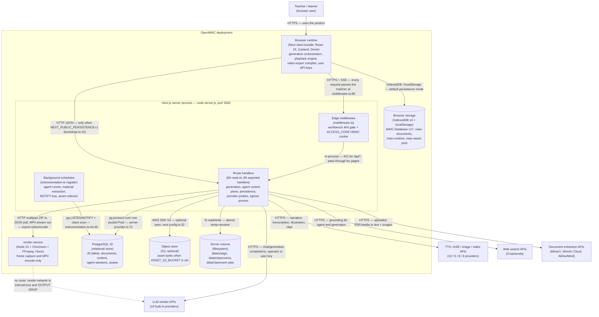
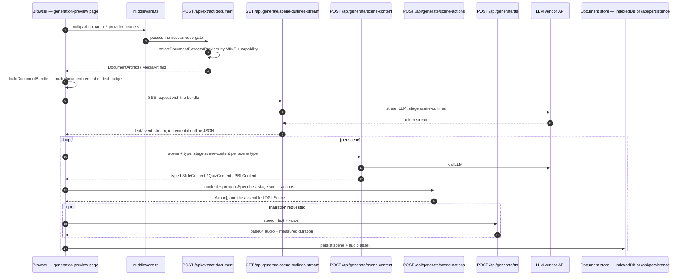
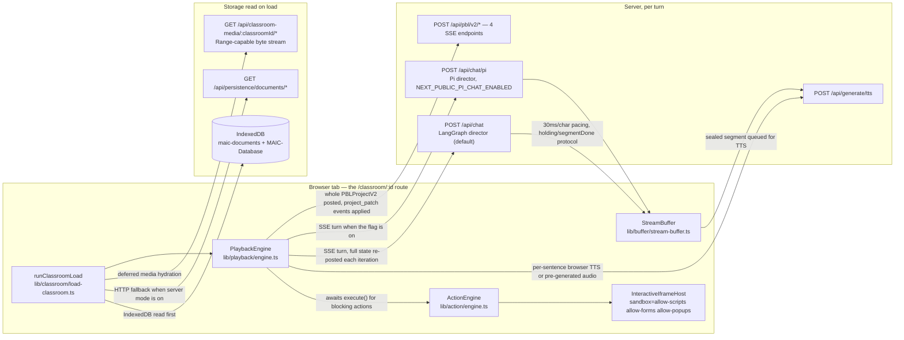
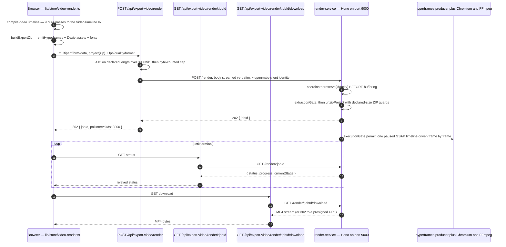

# 02 — Container diagram (C4 L2)

The canonical container diagram, then one reduced variant per major slice —
generation, playback, export — so each can be read without the noise of the
other two. Every edge is labelled with its protocol and its purpose.

**Sources:** `docker-compose.yml`, `middleware.ts`, `next.config.ts`,
`app/api/generate/scene-outlines-stream/route.ts`,
`app/api/generate/scene-content/route.ts`, `app/api/generate/scene-actions/route.ts`,
`app/api/generate/tts/route.ts`, `app/api/extract-document/route.ts`,
`app/api/chat/route.ts`, `app/api/chat/pi/route.ts`,
`app/api/agent/sessions/[id]/events/route.ts`,
`app/api/persistence/[...path]/route.ts`,
`app/api/classroom-media/[classroomId]/[...path]/route.ts`,
`app/api/export-video/render/route.ts`, `lib/store/video-render.ts`,
`lib/server/render-service.ts`, `render-service/src/main.ts`,
`lib/persistence/bootstrap.ts`, `lib/persistence/server-provider.ts`.
Evidence: [api-surface/00](docs/appendix/research/api-surface/00-overview.md),
[media-audio-video/02g](docs/appendix/research/media-audio-video/02g-interfaces-render-service.md).

## Canonical C4 L2

Mermaid's experimental `C4Container` block is not used; the C4 system boundary is
a `subgraph` and each node label carries `[technology]` the way a C4 element
would.

Two structural facts the diagram encodes:

1. **There is exactly one inbound gate.** `middleware.ts` matches
   `/((?!_next/static|_next/image|favicon.ico|logos/).*)`
   ([`middleware.ts:89`](middleware.ts#L89)) and is the only place `ACCESS_CODE` gates *traffic*; **no
   route file behind it re-checks the cookie**
   ([api-surface/00](docs/appendix/research/api-surface/00-overview.md)). Two
   allowlisted routes do read `ACCESS_CODE` themselves, because the gate skipped
   them: [`access-code/verify/route.ts:26`](app/api/access-code/verify/route.ts#L26) is the login — it `timingSafeEqual`s the
   submitted code against the env value and mints the cookie — and
   [`access-code/status/route.ts:13`](app/api/access-code/status/route.ts#L13) re-verifies an existing cookie. The gate is
   also conditional: [`middleware.ts:60-61`](middleware.ts#L60-L61) returns early when `ACCESS_CODE` is
   unset, and in that state `verify` answers `{valid:true}` to any caller (`:8-9`).
2. **The browser talks to the store directly in the default mode.** The
   `BROWSER → LOCAL` edge is not a cache — it is the primary system of record
   unless `NEXT_PUBLIC_PERSISTENCE=1` flips documents and runtime onto HTTP
   ([`lib/persistence/bootstrap.ts:41-68`](lib/persistence/bootstrap.ts#L41-L68)).

## Slice 1 — generation path

The browser drives the pipeline. The server is a stateless per-step LLM proxy
plus one SSE endpoint.

The whole loop lives client-side in `lib/hooks/use-scene-generator.ts`; the
headless server twin is `lib/server/classroom-generation.ts`, strictly serial and
polled through a job row under `data/classroom-jobs/`. See
[../06-generation-pipeline/index.md](docs/06-generation-pipeline/index.md) for why
both exist.

## Slice 2 — playback path

The classroom server is stateless per turn: the browser owns the loop and
re-posts full state each iteration, and PBL v2 posts the entire project and
applies returned `project_patch` events. Detail in
[../08-classroom-runtime/index.md](docs/08-classroom-runtime/index.md).

## Slice 3 — export path

This is the only slice that involves a second container, and the only one where
the app hands work to a process it cannot reach back into.

Three deliberate orderings in that sequence, each with a comment in the source:

| Ordering | Why | Where |
| --- | --- | --- |
| `reserve()` before buffering the body | Admission must not require holding a 300 MiB archive in RAM first | `render-service/src/render-coordinator.ts` `reserve`/`submit` split |
| ZIP guards on **declared** sizes before decompressing | A ZIP bomb must be rejected without being expanded | `render-service/src/unzip.ts` |
| Body streamed, never `formData()`-parsed in the app | Parsing would defeat the streaming byte cap; the service derives identity from `x-openmaic-client` and ignores any multipart `userId` | [`app/api/export-video/render/route.ts:66-84`](app/api/export-video/render/route.ts#L66-L84) |

Degradation is explicit rather than an error: `RENDER_SERVICE_URL` unset makes
the route answer `501 PROVIDER_DISABLED`
([`app/api/export-video/render/route.ts:47-50`](app/api/export-video/render/route.ts#L47-L50)), and the client falls back to
downloading the ZIP for local CLI rendering.

## Protocol summary

| Edge | Protocol | Purpose | Verified at |
| --- | --- | --- | --- |
| Browser → Next | HTTPS JSON | 86 method handlers across 69 route files | `app/api/**/route.ts` |
| Browser → Next | `text/event-stream` | 10 streaming endpoints: 6 hand-rolled SSE, 4 via `createSSEResponse` | [api-surface/00](docs/appendix/research/api-surface/00-overview.md) |
| Browser → Next | byte stream + `Range` | classroom media, MP4 download | `app/api/classroom-media/.../route.ts` |
| Next → PostgreSQL | pg wire, one pooled `Pool` | documents, runtime, agent sessions, assets | [`lib/persistence/server-provider.ts:40,72`](lib/persistence/server-provider.ts#L40) |
| Next → PostgreSQL | `LISTEN` / `pg_notify` | one dedicated connection per app instance for SSE wakeups | [`instrumentation.ts:39-45`](instrumentation.ts#L39-L45) |
| Next → render-service | HTTP multipart / JSON / octet-stream | submit, poll, cancel, download | `app/api/export-video/**` |
| Next → S3 | AWS SDK (HTTPS) | asset bytes; optionally a presigned 302 | `lib/persistence/asset-byte-store.ts`, [`app/api/persistence/[...path]/route.ts:105-107`](app/api/persistence/[...path]/route.ts#L105-L107) |
| Next → provider APIs | HTTPS | LLM, TTS, ASR, image, video, search, extraction | `lib/ai/providers.ts`, `lib/audio/tts-providers.ts`, … |
| Browser → IndexedDB | structured clone | primary system of record in local mode | `lib/utils/database.ts`, `packages/@openmaic/storage/src/*/browser*.ts` |

## Open questions

- The app never opens a connection *to* the browser (no WebSocket anywhere in
  `app/api/**`); every push is SSE over a client-initiated request. Whether a
  bidirectional channel was considered is not recorded in the code.
- `render-service` exposes `POST /preview` ([`render-service/src/main.ts:333`](render-service/src/main.ts#L333)) and
  the compose file configures `RENDER_PREVIEW_*` limits, but no `app/api` route
  proxies `/preview`. Which client is intended to call it could not be
  determined from this repository.
