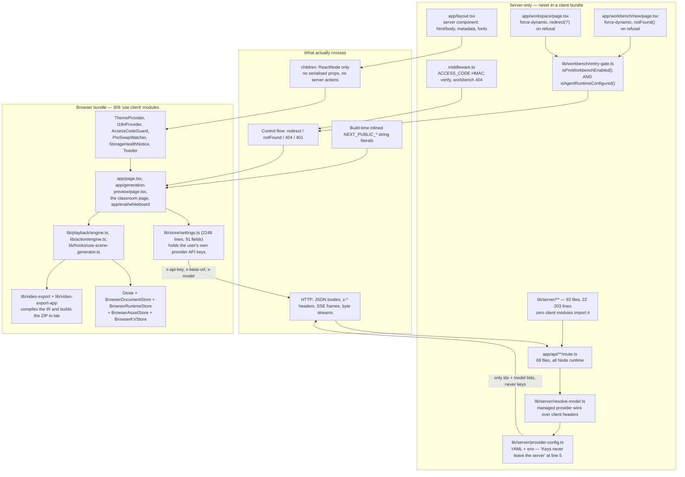
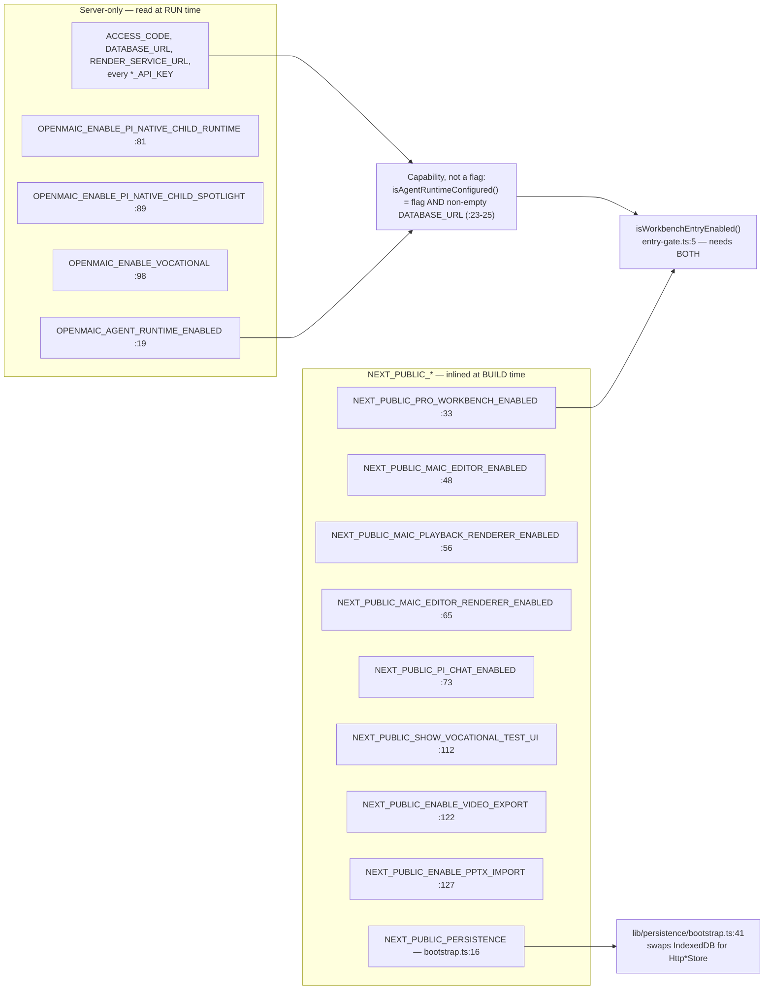
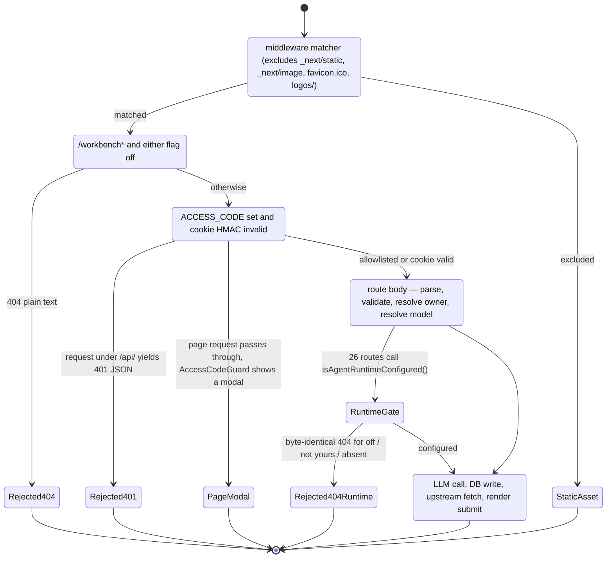

# 03 — The server / client boundary

The single most consequential boundary in the codebase. OpenMAIC is not a
server-rendered app with a sprinkle of interactivity: 309 modules carry
`'use client'`, only four modules under `app/` outside `app/api` are server
components, and no server component passes a serialised prop to a client one.
Everything interesting therefore happens either wholly in the browser or wholly
inside a route handler, with an HTTP hop and a header contract in between.

**Sources:** `app/layout.tsx`, `app/workspace/page.tsx`,
`app/workbench/new/page.tsx`, `app/generation-preview/layout.tsx`,
`lib/workbench/entry-gate.ts`, `lib/config/feature-flags.ts`, `middleware.ts`,
`lib/server/provider-config.ts`, `lib/server/resolve-model.ts`,
`app/api/server-providers/route.ts`, `app/api/health/route.ts`,
`app/generation-preview/page.tsx`, `lib/persistence/bootstrap.ts`,
`next.config.ts`, `Dockerfile`.
Evidence: [app-shell-and-routing/00](docs/appendix/research/app-shell-and-routing/00-overview.md),
[api-surface/02a](docs/appendix/research/api-surface/02a-interfaces-envelope-identity-model.md),
[ai-provider-layer/00](docs/appendix/research/ai-provider-layer/00-overview.md).

## The boundary in one picture



## What runs where, exhaustively for `app/`

Classified by whether the module's first five lines contain `'use client'`:

| Module | Kind | What it does at the boundary |
| --- | --- | --- |
| `app/layout.tsx` | server | Emits `html`/`body`, static `metadata`, four global CSS imports, and mounts a seven-child ordered provider stack. Passes `children` and nothing else |
| `app/generation-preview/layout.tsx` | server | Six lines; exists only to set `dynamic = 'force-dynamic'` |
| `app/workspace/page.tsx` | server | `if (!isWorkbenchEntryEnabled()) redirect('/')` (`:35`), then `Suspense` → `WorkspaceEntry` |
| `app/workbench/new/page.tsx` | server | Same gate, `notFound()` instead of `redirect` |
| `app/editor-fonts.ts`, `app/generation-preview/{types,vocational-mode,foreground-retry}.ts` | no directive | Plain modules imported from client code; they carry no server-only capability |
| `app/page.tsx` | client | 1896 lines: composer, discovery, folders, the `/api/agent/runtime` Pro probe |
| `app/generation-preview/page.tsx` | client | 1554 lines: the whole generation run driver |
| `app/generation-preview/components/visualizers.tsx` | client | The generation-run visualiser components that page mounts — `motion/react` animation over run state, no server capability |
| `app/classroom/[id]/page.tsx` | client | Its own copy of the classroom load pipeline |
| `app/workbench/new/client.tsx` | client | Consumes a one-shot launch intent, then replaces its own URL |
| `app/eval/whiteboard/page.tsx` | client | Unflagged production route used as a Playwright render harness |

Every gate decision is consumed on the server and converted into **control flow**
before render — never handed to the client as data. That is why the Pro badge on
`/` has to learn the server half of the gate through a runtime probe of
`/api/agent/runtime` rather than reading it: the client literally cannot see
`OPENMAIC_AGENT_RUNTIME_ENABLED` or `DATABASE_URL`.

## The three-way flag split

`lib/config/feature-flags.ts` documents the rule in its header comment
(`:1-8`) and then enforces it by naming:



The flag/capability distinction is load-bearing: 26 route files gate on
`isAgentRuntimeConfigured()`, and the intent flag alone is never enough
([api-surface/00](docs/appendix/research/api-surface/00-overview.md)).

A `NEXT_PUBLIC_*` value must be present during `pnpm build` to have any effect.
The `Dockerfile` builder stage declares ten of them as `ARG`+`ENV`
([`Dockerfile:51-72`](Dockerfile#L51-L72), eleven `ARG`s in all — the eleventh is
`ALLOWED_FRAME_ANCESTORS` at `:51`, a server-side header input with no
`NEXT_PUBLIC_` prefix); compose forwards the same ten
([`docker-compose.yml:12-21`](docker-compose.yml#L12-L21)) plus that one as `build.args`. Anything supplied only through `env_file` reaches
the *runtime* container and is inert in the browser bundle.

## How operator secrets stay server-side

Three mechanisms, all in code rather than convention:

### 1. Nothing client-side imports `lib/server/`

Verified mechanically over every `.ts`/`.tsx` under `app/`, `components/` and
`lib/`: of the 309 modules carrying `'use client'`, **zero** import any
`@/lib/server/*` specifier, and no `app/api/**/route.ts` imports
`@/components/*`, `@/lib/store/*` or `@/lib/hooks/*`.

Worth stating plainly: this is currently true but **unguarded**. The
`server-only` npm package is not used anywhere (zero imports across the same
scan), and `eslint.config.mjs` has no rule for `lib/server/`, even though it
carries seven other machine-enforced module walls
([04-logical-layering.md](docs/02-container-view/04-logical-layering.md)).

### 2. Managed providers discard client credentials

`lib/server/provider-config.ts` states the invariant in its file docstring
(`:5`, "Keys never leave the server — only provider IDs and metadata are exposed
via API") and implements it in two four-line resolvers:

- `resolveSectionApiKey` — if the operator has an entry for this provider,
  return the operator's key; otherwise return the client's.
- `resolveSectionBaseUrl` — same shape, same precedence.

[`lib/server/resolve-model.ts:78-104`](lib/server/resolve-model.ts#L78-L104) then makes the consequence explicit: when a
`MODEL_ROUTES` stage route overrides the client's model, `clientApiKey`,
`clientProviderType` and `clientBaseUrlParam` are all forced to `undefined`,
because "the client-sent connection params belong to the client's *other* model
and must not bleed onto the routed provider". SSRF validation is applied only to
an unmanaged, client-supplied base URL, and only in production (`:104-110`).

### 3. The two outbound reports are metadata-only

| Endpoint | Returns | Never returns |
| --- | --- | --- |
| `GET /api/server-providers` | per-section maps of provider id → `{ models?: string[] }`, plus `generation.parallelSceneConcurrency` ([`app/api/server-providers/route.ts:18-29`](app/api/server-providers/route.ts#L18-L29)) | API keys, base URLs — the docstring on `getServerProviders()` says base URLs are withheld because they "can reveal internal gateway/proxy infrastructure" |
| `GET /api/health` | `{ status, version, capabilities: { webSearch, imageGeneration, videoGeneration, tts } }` — four booleans derived from *enabled* providers ([`app/api/health/route.ts:12-23`](app/api/health/route.ts#L12-L23)) | provider identities, queue depths, anything per-user |

`/api/health` is one of exactly two paths the access-code gate allowlists
([`middleware.ts:66`](middleware.ts#L66)), so its response is the deployment's public capability
surface.

## What the browser holds that the server does not

The inverse leak matters just as much, and it is intentional: OpenMAIC is a
bring-your-own-key product for any provider the operator has not configured.

[`app/generation-preview/page.tsx:254-278`](app/generation-preview/page.tsx#L254-L278) builds fourteen request headers from
`useSettingsStore.getState()` — the store persisted to `localStorage`:

```
x-model                       x-image-provider    x-video-provider
x-api-key                     x-image-model       x-video-model
x-base-url                    x-image-api-key     x-video-api-key
x-provider-type               x-image-base-url    x-video-base-url
x-image-generation-enabled    x-video-generation-enabled
```

Consequences a joiner needs to internalise:

- A user-entered key lives in `localStorage` on the device and travels on every
  generation request. The server never stores it.
- `GET /api/server-providers` is a **one-way pull**: the settings store applies
  `isServerConfigured` / `serverModels` / `serverDisabled` with reset-then-apply
  and never touches user-entered keys, failing silently
  ([persistence-storage-state/00](docs/appendix/research/persistence-storage-state/00-overview.md)).
- `NEXT_PUBLIC_PERSISTENCE_TOKEN` is, by name and by design, a bearer token
  compiled into the browser bundle ([`lib/persistence/bootstrap.ts:34-38`](lib/persistence/bootstrap.ts#L34-L38)). The
  server-mode persistence authenticator is explicitly development-only.

## Boundary crossings, catalogued



The `Rejected404Runtime` state deserves the emphasis it gets in the API research:
"off", "not yours" and "absent" all answer a byte-identical plain-text 404 on
purpose, so the surface is not an existence oracle.

## Open questions

- Nothing enforces the "no `lib/server` in a client bundle" rule. Whether the
  `server-only` package was rejected deliberately or simply never adopted is not
  recorded in any comment found in this scan.
- `middleware.ts` never compares the signed timestamp in the access cookie
  against the current time (`verifyToken`, `:18-44`), so a minted cookie never
  expires. The timestamp is signed but unused as a lifetime. No test covers this
  file ([quality-testing-ci-deps](docs/appendix/research/quality-testing-ci-deps/00-overview.md)).
