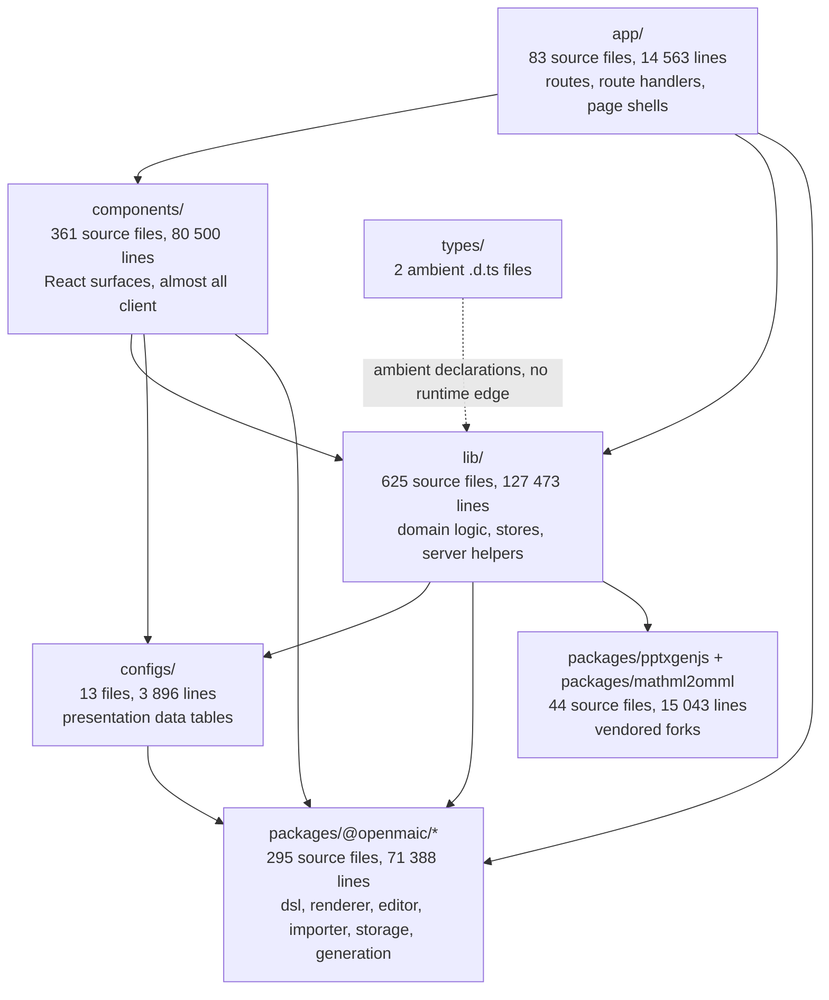
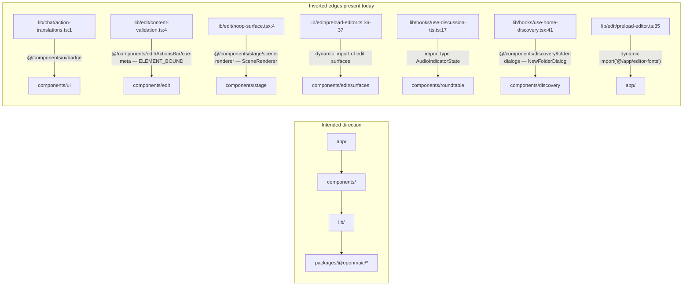
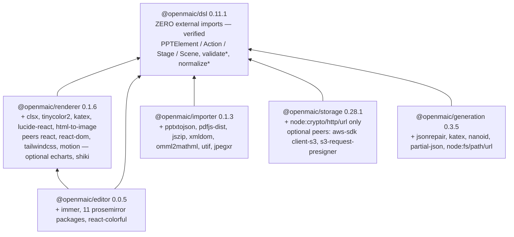
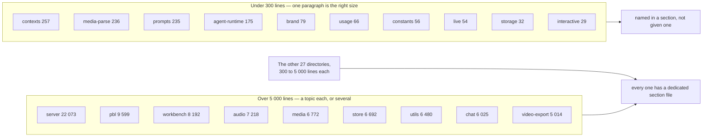

# 04 — Logical layering

The intended dependency direction of the source tree, then a mechanical check of
whether the code respects it. Where it does not, the violation is named with a
file and a line. Where the rule is machine-enforced, the ESLint block that
enforces it is cited.

**Sources:** `eslint.config.mjs` (670 lines, 10 blocks),
`packages/@openmaic/*/package.json`, `configs/*.ts`, `types/*.d.ts`,
`next.config.ts`, plus a scan over every `.ts`/`.tsx`/`.mjs` tracked in `app/`,
`components/`, `lib/`, `configs/`, `types/` and `packages/@openmaic/*` for
`@/…`-alias and bare-specifier module references.
Evidence: [quality-testing-ci-deps/01b](../appendix/research/quality-testing-ci-deps/01b-modules-ci-and-build.md),
[dsl-renderer-editor/00](../appendix/research/dsl-renderer-editor/00-overview.md).

## The intended direction

Two rules make that graph meaningful rather than decorative:

1. **`@/` is exclusively the host-app alias.** A `packages/@openmaic/*` module
   that contains any `@/…` string is a boundary violation by definition, and for
   three of the six packages that is enforced by lint rather than by review.
2. **`@openmaic/dsl` is the only thing everything may share.** It is the
   serialised-format contract; five packages, `configs/`, the app and the render
   service all depend on it, and it depends on nothing.

## Measured edge weights

Counted as *distinct import sites* of a `@/…` alias specifier, by source root of
the importer and of the target:

| Edge | Sites | Verdict |
| --- | --- | --- |
| `app/` → `lib/` | 451 | intended |
| `app/` → `components/` | 28 | intended |
| `components/` → `lib/` | 1023 | intended |
| `components/` → `components/` | 294 | intra-layer, intended |
| `components/` → `configs/` | 9 | intended |
| `lib/` → `lib/` | 978 | intra-layer, intended |
| `lib/` → `configs/` | 2 | intended |
| **`lib/` → `components/`** | **7** | **violation** |
| **`lib/` → `app/`** | **1** | **violation** |
| `components/` → `app/` | 0 | clean |
| `app/api/**` → `components/` or `lib/store/` or `lib/hooks/` | 0 | clean |

The ratio is the interesting part: `components/ → lib/` at 1023 sites against
`app/ → components/` at 28 means the composition root is thin and the surfaces
reach for domain logic directly. There is no service layer between
`components/` and `lib/`.

## The eight violations, cited

The unit is the **import site**: eight of them, spread over six files. The
diagram below collapses `preload-editor.ts:36-37` into one edge and the table
collapses `:35-37` into one row, so neither has eight entries.

| Site | Imports | Character |
| --- | --- | --- |
| `lib/chat/action-translations.ts:1` | `Badge` from `@/components/ui/badge` | A `lib/` module renders a UI primitive. The hardest of the eight to justify |
| `lib/edit/content-validation.ts:4` | `ELEMENT_BOUND` from `@/components/edit/ActionsBar/cue-meta` | A constant living in a component file; the fix is to move the constant down, not to move the import |
| `lib/edit/noop-surface.tsx:4` | `SceneRenderer` from `@/components/stage/scene-renderer` | A `.tsx` file in `lib/` returning a component — arguably this module belongs in `components/` |
| `lib/edit/preload-editor.ts:35-37` | dynamic `import()` of `@/app/editor-fonts`, `@/components/edit/surfaces/slide`, `@/components/edit/surfaces/quiz` | Deliberate: a preloader's whole job is to warm chunks it does not otherwise depend on. Inferred: the inversion is the point, and the honest fix is a registry the surfaces push into |
| `lib/hooks/use-discussion-tts.ts:17` | `import type { AudioIndicatorState }` | Type-only, so it erases at build time. Still an inverted *source* dependency |
| `lib/hooks/use-home-discovery.tsx:41` | `NewFolderDialog` | A hook that owns a dialog; same shape as `noop-surface.tsx` |

Seven of the eight sites — five of the six offending files — are in `lib/edit/`
and `lib/hooks/`, the two directories where "domain logic" and "React surface"
genuinely blur. None of them is caught by a lint rule.

## What *is* machine-enforced

`eslint.config.mjs` encodes **seven** module walls as `no-restricted-syntax` /
`no-restricted-imports` allowlists, plus one repo-wide rule that is not a wall —
eight rows in the table below. The header comment at `:5-24` explains the
mechanical reason they are duplicated rather than centralised: flat config
*replaces* a rule's options per key in later matching blocks, so a single
repo-wide block setting `no-restricted-syntax` would silently drop every
per-directory boundary. Hence `AI_SDK_DYNAMIC_IMPORT_BAN` is a shared array
spread into each block.

| Wall | Scope | Rule | Cited at |
| --- | --- | --- | --- |
| `@openmaic/renderer` may not reference `@/…` | whole package | any `Literal` or `TemplateElement` starting `@/` | `eslint.config.mjs:97-115` |
| `@openmaic/storage` may not reference `@/…` | whole package | same | `:122-140` |
| `@openmaic/generation`: allowlisted specifiers only | whole package + its tests | only `@openmaic/dsl`, `jsonrepair`, `katex`, `nanoid`, `partial-json`, `node:*`, relatives; **no** `import()`, **no** `require()` | `:146-191`, tests at `:195-242` |
| `lib/choreography` stays pure | directory | only `@openmaic/dsl`, `zod`, in-folder `./…`; no React / DOM / GSAP / motion | `:254-329` |
| `lib/video-export` stays pure, depth-specific | root files vs `passes/`+`legacy/` | root may add `../choreography`; passes may add `../../choreography` and one-level `../` | `:348-415`, `:419-492` |
| Hyperframes emitter | `lib/video-export/emit-hyperframes/**` | in-module relatives plus exactly `../../quiz/math-text` | `:498-533` |
| PBL v2 kernel may not import `operations/runtime` | `lib/pbl/v2/operations/kernel/**` | both alias and relative forms | `:539-574` |
| Single LLM entry point — repo-wide, not a module wall | every `.ts,.tsx,.js,.jsx,.mjs,.cjs` except `lib/ai/llm.ts`, `eval/**`, `tests/**` | no `generateText` / `streamText` from `ai`, static, namespace or dynamic | `:608-634`, `:650-667` |

The depth-specific split for `lib/video-export` is the sharpest piece of
engineering in the file: `../ir` from a root module escapes the module
(`lib/video-export/../action`) while the same `../ir` from `passes/` stays inside
it, so the boundary is two disjoint file scopes with two different allowlists
(`:340-347`).

`tests/lint-llm-entry-guard.test.ts` runs the real ESLint against the real
config over a 5×6×13 matrix of bypass form × extension × path, so a narrowed
scope fails a test rather than passing silently.

## Package-internal layering

Verified by scanning every non-relative `import`/`export … from` specifier in
each `src/` tree: **`@openmaic/dsl` has zero external module imports** — not one
line in `packages/@openmaic/dsl/src` imports anything that is not a relative
sibling. `@openmaic/editor` is the only package that depends on another
first-party package beyond `dsl`, and `INTERNAL_DEPENDENTS` in
`scripts/openmaic-packages.mjs:37-43` records exactly that graph as data the
version gate reads.

Every one of the 492 source files across the six packages was scanned for a
`@/…` specifier in `from`, `import()` or `require()` form. **Zero hits.** Three
of the six (`dsl`, `editor`, `importer`) have no lint wall at all, so their
compliance is currently held by convention plus the fact that each is built and
published in isolation.

## The vendored tier

`packages/pptxgenjs` and `packages/mathml2omml` are the bottom of the graph and
are reached from exactly three lines in the whole repository:

| Import site | Specifier | Note |
| --- | --- | --- |
| `lib/export/use-export-pptx.ts:4` | `pptxgenjs` | vendored fork, `packages/pptxgenjs` |
| `lib/export/latex-to-omml.ts:1` | `temml` | upstream npm package, not vendored |
| `lib/export/latex-to-omml.ts:2` | `mathml2omml` | vendored fork, `packages/mathml2omml` |

Both are `transpilePackages` entries alongside `@openmaic/importer`
(`next.config.ts:15`) and both are `globalIgnores`d by ESLint as "third-party /
vendored packages (not our code)" (`eslint.config.mjs:36-39`). Detail on the
forks is in [05-workspace-packages.md](./05-workspace-packages.md).

## `configs/` and `types/`

Two small roots that do not fit the four-layer story:

- `configs/` (13 files, 3 896 lines) is presentation data — theme tokens, shape
  presets, a glyph table, a MIME map. Five of the thirteen import
  `@openmaic/dsl` and the other eight import nothing at all. It is a leaf that
  sits *beside* `lib/`, consumed by `components/` (9 sites) and `lib/` (2).
- `types/` holds two ambient declaration files
  (`web-extraction-vendors.d.ts`, `web-speech.d.ts`, 40 lines total). No runtime
  edge; `tsconfig.json`'s `include` picks them up.

## The `lib/*` ledger — every directory, its owning topic

`lib/` is 46 directories and one loose file. The layer graph above says they are all "the
domain layer", which is true and useless for finding anything. This table is the
**completeness ledger for the whole documentation set**: one row per directory, its size,
and the topic that owns it. A directory whose owner is thin is visible here rather than
discovered by grepping and finding nothing.

Sizes from
`find lib/<dir> -name '*.ts' -o -name '*.tsx' | xargs wc -l`. "Docs" is the number of
main-topic files that cite the directory path, from
`grep -rl "lib/<dir>/" --include='*.md' docs/0* docs/1* docs/README.md docs/glossary.md | grep -v appendix | wc -l`
— a coverage signal, not a quality one.

| `lib/` directory | Files | Lines | Docs | Owning topic |
| --- | --- | --- | --- | --- |
| `server/` | 92 | 22 073 | 129 | spread across 03, 04, 05, 06, 09, 10, 12 — it is not one subsystem |
| `pbl/` | 37 | 9 599 | 27 | [08 §PBL v2](../08-classroom-runtime/08-pbl-v2.md) |
| `workbench/` | 48 | 8 192 | 33 | [05](../05-agent-runtime/index.md) client half |
| `audio/` | 27 | 7 218 | 26 | [09 §TTS/ASR](../09-media-and-export/01-tts-adapters.md) |
| `media/` | 39 | 6 772 | 28 | [09](../09-media-and-export/index.md) |
| `store/` | 20 | 6 692 | 40 | [10 §client state](../10-persistence-and-state/03-client-state-stores.md) |
| `utils/` | 20 | 6 480 | 36 | [10 §chat storage](../10-persistence-and-state/05-chat-storage-and-cutover.md) + [09](../09-media-and-export/index.md) |
| `chat/` | 20 | 6 025 | 28 | [05 §client/server split](../05-agent-runtime/02-client-server-split.md), [08 §roundtable](../08-classroom-runtime/05-roundtable-agents.md) |
| `video-export/` | 29 | 5 014 | 30 | [09 §video pipeline](../09-media-and-export/06-video-export-pipeline.md) |
| `export/` | 23 | 4 872 | 22 | [07 §pptx](../07-dsl-renderer-editor/07-export-pptx.md), [07 §html](../07-dsl-renderer-editor/08-export-html.md) |
| `ai/` | 8 | 3 851 | 35 | [04](../04-ai-provider-layer/index.md) |
| `hooks/` | 16 | 3 852 | 34 | [06 §progress](../06-generation-pipeline/08-progress-reporting.md), [08](../08-classroom-runtime/index.md) |
| `orchestration/` | 17 | 3 477 | 10 | [05 §orchestration registry](../05-agent-runtime/06-orchestration-registry.md) |
| `document/` | 24 | 3 168 | 19 | [06 §ingestion](../06-generation-pipeline/02-document-ingestion.md) |
| `edit/` | 24 | 2 417 | 15 | [07 §AI edit ops](../07-dsl-renderer-editor/05-ai-edit-operations.md) |
| `video-export-app/` | 12 | 2 205 | 16 | [09 §emitter](../09-media-and-export/06b-video-export-emitter.md) |
| `web-search/` | 14 | 1 694 | 11 | [09 §transcription and search](../09-media-and-export/05-transcription-and-search.md) |
| `types/` | 12 | 1 687 | 13 | wherever the type is used; no owning topic of its own |
| `persistence/` | 13 | 1 783 | 44 | [10 §storage abstraction](../10-persistence-and-state/01-storage-abstraction.md) |
| `playback/` | 8 | 1 651 | 29 | [08 §state machine](../08-classroom-runtime/02-playback-state-machine.md) |
| `pdf/` | 6 | 1 604 | 13 | [06 §ingestion](../06-generation-pipeline/02-document-ingestion.md) |
| `agent/` | 9 | 1 479 | 17 | [05 §client/server split](../05-agent-runtime/02-client-server-split.md) |
| `whiteboard/` | 7 | 1 470 | 12 | [09 §whiteboard](../09-media-and-export/03-whiteboard.md) |
| `document-store/` | 10 | 1 354 | 13 | [10 §storage abstraction](../10-persistence-and-state/01-storage-abstraction.md) |
| `quiz/` | 5 | 1 314 | 4 | [06 §quiz and grading](../06-generation-pipeline/09-quiz-and-grading.md) — thin; `runtime.ts` alone is 22 KB |
| `prosemirror/` | 16 | 1 152 | 3 | [07 §editor](../07-dsl-renderer-editor/04-editor-prosemirror.md) — thin, and 9 of its files are byte-identical to `@openmaic/editor` ([14/10](../14-code-quality/10-duplication-and-dead-code.md)) |
| `choreography/` | 8 | 1 147 | 21 | [08 §choreography](../08-classroom-runtime/03-choreography.md) |
| `classroom/` | 6 | 1 024 | 9 | [08](../08-classroom-runtime/index.md) |
| `api/` | 9 | 1 799 | 10 | [03 §API conventions](../03-app-and-api/06-api-layer-conventions.md) |
| `action/` | 1 | 902 | 27 | [07 §DSL schema](../07-dsl-renderer-editor/01-dsl-schema.md), [08](../08-classroom-runtime/index.md) |
| `i18n/` | 5 | 824 | 7 | [10 §i18n](../10-persistence-and-state/07-i18n.md) |
| `rag/` | 9 | 810 | 4 | [06 §ingestion](../06-generation-pipeline/02-document-ingestion.md) — thin |
| `buffer/` | 1 | 749 | 13 | [08 §buffering](../08-classroom-runtime/04-buffering-and-prefetch.md) |
| `import/` | 2 | 688 | 9 | [07 §importer](../07-dsl-renderer-editor/06-importer-pptx-to-dsl.md) |
| `config/` | 3 | 661 | 38 | [15 §configuration](../15-cross-cutting/06-configuration.md) |
| `runtime/` | 4 | 373 | 10 | [10 §storage abstraction](../10-persistence-and-state/01-storage-abstraction.md) |
| `contexts/` | 2 | 257 | 2 | [03 §providers](../03-app-and-api/02-layout-and-providers.md), [10/01b](../10-persistence-and-state/01b-adjacent-modules-and-name-collisions.md) — thin |
| `media-parse/` | 4 | 236 | 2 | [06 §ingestion](../06-generation-pipeline/02-document-ingestion.md) — thin |
| `prompts/` | 3 | 235 | 4 | [06 §prompt architecture](../06-generation-pipeline/06-prompt-architecture.md) — thin |
| `agent-runtime/` | 2 | 175 | 9 | [05](../05-agent-runtime/index.md); isomorphic lifecycle constants only |
| `brand/` | 2 | 79 | 5 | [03 §providers](../03-app-and-api/02-layout-and-providers.md) — the provider nothing mounts |
| `usage/` | 1 | 66 | 4 | [04 §usage accounting](../04-ai-provider-layer/07-usage-accounting.md) |
| `constants/` | 2 | 56 | 5 | [06](../06-generation-pipeline/index.md) |
| `live/` | 1 | 54 | 2 | [10](../10-persistence-and-state/index.md); one file, `apiRenameStage`. The name is misleading — see [glossary](../glossary.md) |
| `storage/` | 1 | 32 | 9 | [10/01b](../10-persistence-and-state/01b-adjacent-modules-and-name-collisions.md) — **not** `@openmaic/storage` |
| `interactive/` | 1 | 29 | 2 | [08 §interactive sandbox](../08-classroom-runtime/09-interactive-scene-sandbox.md) — one file, `logical-viewport.ts` |
| `logger.ts` (loose file) | 1 | — | — | [15 §observability](../15-cross-cutting/08-observability.md) |

**The rule this ledger encodes:** a directory does not need its own section file, but it
does need a named owner. Ten directories under 300 lines are cited inside a section rather
than given one, and that is the right shape — `lib/interactive/` is 29 lines. The rows to
watch are the ones where *size and coverage disagree*: `lib/quiz/` (1 314 lines, 4 docs),
`lib/prosemirror/` (1 152 lines, 3 docs) and `lib/orchestration/` (3 477 lines, 10 docs).

## Where the layering is genuinely at risk

Two structural debts, both already named in the evidence packs, both visible in
the layer graph:

1. **A duplicated renderer/editor tier.** The legacy in-app
   `components/slide-renderer`, `lib/edit` and `lib/prosemirror` ship *alongside*
   `@openmaic/renderer` and `@openmaic/editor`, selected at runtime by
   `NEXT_PUBLIC_MAIC_PLAYBACK_RENDERER_ENABLED` and
   `NEXT_PUBLIC_MAIC_EDITOR_RENDERER_ENABLED`
   (`lib/config/feature-flags.ts:55-66`). Four of the seven `lib/ → components/`
   import sites originate in `lib/edit/`, the legacy half.
2. **A duplicated generation orchestrator.** `lib/hooks/use-scene-generator.ts`
   (browser) and `lib/server/classroom-generation.ts` (headless) implement the
   same pipeline over the same primitives with different retry wiring and
   different partial-failure semantics
   ([generation-pipeline](../appendix/research/generation-pipeline/00-overview.md)).

## Open questions

- No lint wall exists for `lib/server/` even though it is the sharpest boundary
  in the tree ([03-server-client-boundary.md](./03-server-client-boundary.md)).
  Whether that is an oversight or a deliberate scoping decision is not recorded.
- `render-service/**` is `globalIgnores`d by ESLint (`eslint.config.mjs:56`) and
  excluded from the root `tsconfig.json`, so the layering rules above do not
  apply to it at all. It has its own `tsconfig.json` and `typecheck` script but
  no ESLint config was found in `render-service/`.
