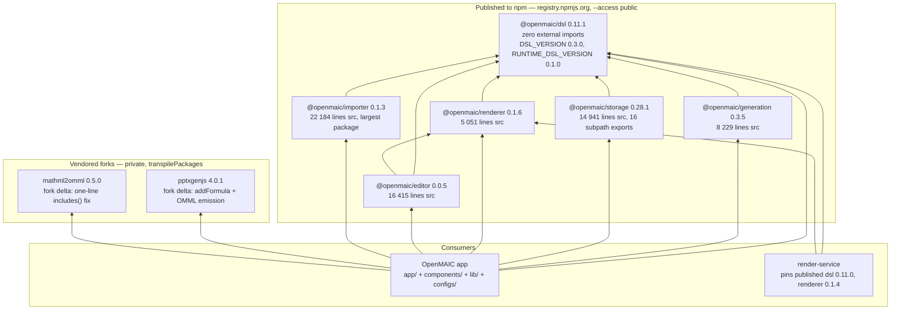
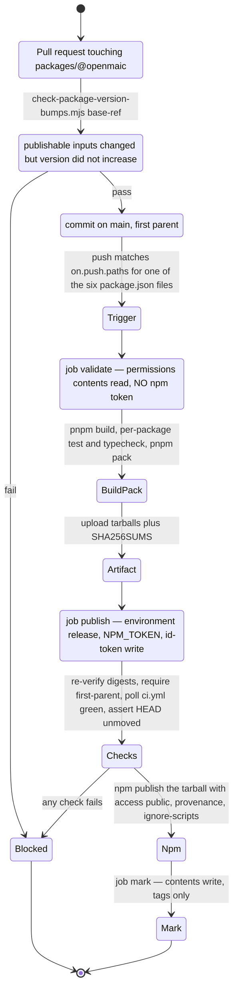

# 05 — Workspace packages and vendored forks

Six first-party `@openmaic/*` packages and two vendored third-party forks live
under `packages/`. All six are published to npm; both forks are private build
inputs. This section records what each one is for, who consumes it, and what
contract it offers to a consumer who is not this repository.

**Sources:** `pnpm-workspace.yaml`, `packages/@openmaic/*/package.json`,
`packages/pptxgenjs/package.json`, `packages/mathml2omml/package.json`,
`scripts/openmaic-packages.mjs`, `scripts/check-package-version-bumps.mjs`,
`.github/workflows/publish-packages.yml`, `next.config.ts`,
`render-service/package.json`, `packages/@openmaic/dsl/src/version.ts`,
`CONTRIBUTING.md`, plus a repo-wide scan of import sites per package.
Evidence: [dsl-renderer-editor/00](../appendix/research/dsl-renderer-editor/00-overview.md),
[quality-testing-ci-deps/01b](../appendix/research/quality-testing-ci-deps/01b-modules-ci-and-build.md).

## Workspace membership

`pnpm-workspace.yaml` declares three globs: `packages/*`, `packages/@openmaic/*`,
and an explicit exclusion `!packages/docs` ("standalone docs sub-app: own
lockfile, build, deploy"). `render-service/` is **not** a workspace member — it
has its own `package-lock.json` and installs from npm.

The root `postinstall` script builds them in dependency order and then syncs the
importer bundle into `public/`:

```
mathml2omml → pptxgenjs → dsl → generation → storage → importer → renderer → editor
→ node scripts/sync-maic-importer.mjs
```

(`package.json:10`.) That ordering is hand-maintained in one long shell chain,
not derived from the graph.

## Package dependency graph



## Per-package reference

### `@openmaic/dsl` — the contract

| Field | Value |
| --- | --- |
| Version | 0.11.1 |
| Published | yes, `publishConfig.access: public` |
| Runtime deps | **none**. Verified: not one non-relative `import`/`export … from` specifier exists across `packages/@openmaic/dsl/src` |
| Exports | `.` and `./schema/*` |
| Ships | `dist`, `README.md`, `LICENSE` |
| Owns | the 10-variant `PPTElement` union, the 21-variant `Action` union, `Stage`/`Scene`/`SlideContent`, pure `validate*` reporters, pure `normalize*` repairers, and two independent version ladders |
| Consumers | everything: 5 sibling packages, `components/` (75 sites), `lib/` (74), `configs/` (5), `app/` (2), `render-service` (3), `tests/` (48) |

The two version ladders are independent and separately gated:
`DSL_VERSION = '0.3.0'` on the `dslVersion` field
(`packages/@openmaic/dsl/src/version.ts:61`) and
`RUNTIME_DSL_VERSION = '0.1.0'` on `runtimeDslVersion` (`:276`).

### `@openmaic/storage` — the persistence seam

| Field | Value |
| --- | --- |
| Version | 0.28.1 — by far the most-released package |
| Published | yes |
| Runtime deps | `@openmaic/dsl` only. External imports are `node:crypto`, `node:http`, `node:url` |
| Optional peers | `@aws-sdk/client-s3`, `@aws-sdk/s3-request-presigner`, both `optional: true` |
| Exports | 16 subpaths, e.g. `./document/pg`, `./runtime/http`, `./asset/s3-bytes`, `./asset/collector`, `./server`, `./server/reference` |
| Charter | Stated verbatim at `src/index.ts:1-23` — `@openmaic/dsl` owns *what* persists, this package owns *where/how*. The pluggable seam is the **backend**, not the driver: every PostgreSQL backend takes an injected `Queryable`/`WithTransaction` and imports no driver |
| Consumers | `lib/` (61 sites), `tests/` (60), `app/` (9) |
| Lint wall | yes — no `@/…` string permitted (`eslint.config.mjs:122-140`) |

The driver-free design is why `lib/persistence/server-provider.ts:8,41` is the
only place `pg` is instantiated: the package receives
`pool as unknown as ConnectableQueryable`.

### `@openmaic/generation` — the prompt + pipeline package

| Field | Value |
| --- | --- |
| Version | 0.3.5 |
| Published | yes |
| Runtime deps | `@openmaic/dsl`, `jsonrepair`, `katex`, `nanoid`, `partial-json` |
| Ships | `dist` plus `templates`, `snippets`, `prompts-pbl` — the Markdown prompt corpus is a published artefact |
| Model coupling | one function type, `AICallFn`. It never selects a provider, reads env, or persists |
| Consumers | `lib/` (18 files), `tests/` (26), `app/` (5), `scripts/` (2), `eval/` (2), `components/` (1 — `components/generation/outlines-editor.tsx:31`) |
| Lint wall | the strictest in the repo — an allowlist of exactly its five declared deps plus `node:*` and relatives, and **no** `import()` or `require()` at all (`eslint.config.mjs:146-191`) |

Also listed in `next.config.ts:23-34` `serverExternalPackages`, because it and the
pi agent packages do a runtime `import(specifier)` with a computed specifier that
webpack cannot analyse.

### `@openmaic/renderer` — read-only paint

| Field | Value |
| --- | --- |
| Version | 0.1.6 |
| Published | yes |
| Runtime deps | `@openmaic/dsl`, `clsx`, `tailwind-merge`, `tinycolor2`, `katex`, `lucide-react`, `html-to-image`, `html2canvas-pro` |
| Peers | `react`, `react-dom`, `tailwindcss`, `motion` required; `echarts`, `shiki` optional |
| Exports | `.`, `./elements`, `./types`, `./snapshot`, `./fonts.css` |
| Ships | `dist`, `fonts.css`, `FONTS.md`, `font-licenses` — font licensing travels with the tarball |
| Consumers | `@openmaic/editor` (21 sites), `render-service` (1), `components/` (2), `lib/` (2), `app/` (1, the `fonts.css` side effect at `app/layout.tsx`) |
| Lint wall | yes (`eslint.config.mjs:97-115`), with the rationale spelled out at `:76-96`: host concerns (document + undo ownership, media resolution, i18n, hotkeys) are injected via props/callbacks so "a deadline can't punch a temporary store/undo/media dependency through the package API" |

Both optional peers are lazy: `shiki` is reached through exactly one
`import('shiki')` at
`packages/@openmaic/renderer/src/elements/code/BaseCodeElement.tsx:14`, which
memoises the resulting `createHighlighter` promise. That single line is the only
`shiki` reference in the package `src`, which is why the peer can be absent
without breaking a consumer that never renders a code element.

### `@openmaic/editor` — the op kernel plus React surface

| Field | Value |
| --- | --- |
| Version | 0.0.5 — the least mature |
| Published | yes, via the workflow's explicit `npm publish --access public` (`publish-packages.yml:409`). Note it is the **only** one of the six whose `package.json` has no `publishConfig` block |
| Runtime deps | `@openmaic/dsl`, `@openmaic/renderer`, `immer`, eleven `prosemirror-*` packages, `katex`, `lucide-react`, `react-colorful` |
| Exports | `.`, `./core`, `./react`, `./ui` — `main` points at `./dist/core/index.js`, so the default import is the pure kernel |
| Consumers | `components/` (2 sites), `lib/` (1), `tests/` (2). Barely used yet, because the legacy in-app editor still ships behind `NEXT_PUBLIC_MAIC_EDITOR_RENDERER_ENABLED` |
| Lint wall | none |

### `@openmaic/importer` — the PPTX ingest fork

| Field | Value |
| --- | --- |
| Version | 0.1.3 |
| Published | yes |
| Runtime deps | `@openmaic/dsl`, `pptxtojson`, `pdfjs-dist` 4.8.69, `jszip`, `@xmldom/xmldom`, `omml2mathml`, `mathml-to-latex`, `utif`, `jpegxr`, `katex`, `nanoid`, `tinycolor2` |
| Build shape | `main` is `./dist/index.cjs` — the only CJS-main package of the six |
| Consumers | `lib/` (3 sites) only, plus `scripts/` |
| Lint wall | none. `packages/@openmaic/importer/src1/**` (the legacy JS reference implementation) is `globalIgnores`d (`eslint.config.mjs:44`) |
| Special handling | in `transpilePackages` (`next.config.ts:15`); its dist is copied into `public/vendor` by `scripts/sync-maic-importer.mjs` and URL-imported at runtime, because `pdfjs-dist`'s dynamic `require()` breaks Turbopack. Two guard scripts plus a runtime HEAD probe keep that from 404-ing silently |

The `--filter` cross-check in `scripts/openmaic-packages.mjs:185-202` is
deliberately looser than the `on.push.paths` and `for pkg in …` set checks
precisely so the typecheck step can legitimately omit `importer` — stated in the
docstring at `:132-139`.

## Vendored forks

| Fork | Version | Fork delta, verified | Consumed at |
| --- | --- | --- | --- |
| `packages/pptxgenjs` | 4.0.1 | `addFormula` / OMML support added: `FormulaProps` at `core-interfaces.ts:614`, `formula` in `SLIDE_OBJECT_TYPES` at `core-enums.ts:743`, `addFormulaDefinition` at `gen-objects.ts:669`, `Slide.addFormula` at `slide.ts:253`, and the `m:oMathPara` emission at `gen-xml.ts:692-716` | `lib/export/use-export-pptx.ts:4` |
| `packages/mathml2omml` | 0.5.0 | one bug fix landed in-tree: `fix(mathml2omml): call includes() instead of indexing it (#681)`, plus `fix(build): use cross-platform file copy (#20)` | `lib/export/latex-to-omml.ts:2` |

Both are private (no `publishConfig`, no `version` gate coverage), both are in
`transpilePackages` (`next.config.ts:15`), and both are ESLint-ignored as
"third-party / vendored packages (not our code)" (`eslint.config.mjs:36-39`).
`packages/pptxgenjs` builds with Rollup; `packages/mathml2omml` builds with
Rollup plus a `copyFileSync` of its hand-written `index.d.ts`.

## The stability contract

Three gates decide whether a version number on npm still means "this exact
source". All three read the single list at `scripts/openmaic-packages.mjs:34`.



The security boundary is a **job** boundary, not a step boundary: install, build
and pack run with `contents: read` and no token
(`publish-packages.yml:80-81`); the token-bearing job downloads an immutable
artefact and re-verifies SHA-256 against digests anchored in a **parent shell
scalar** before any repository script runs (`:369-373`), because "a child process
can alter files, but it cannot rewrite its parent shell's scalar".

### The rule that matters most to a consumer

Dependents declare `@openmaic/dsl` as `workspace:^`, published as a caret. A
caret-admitted `dsl` bump therefore reaches a consumer **without a release of the
dependent**. `checkDslFormatVersionRule`
(`scripts/check-package-version-bumps.mjs:308`) closes the resulting data-format
hazard, and the docstring at `:281-307` spells out the exact failure it prevents:

> dsl ships 0.5.1 moving `DSL_VERSION '0.1.0' -> '0.2.0'` with a migration …
> Installation A resolves 0.5.1, and the very same published storage version
> stamps `dslVersion: '0.2.0'` into `document_stages`. Installation B,
> lockfile-pinned to dsl 0.5.0, reads that row and hard-fails as "newer than this
> client". Two installs of one published storage version, silently
> data-incompatible.

So a change to either serialised-format constant requires a `dsl` increase that
**escapes** the dependents' caret — a minor while `dsl` is `0.x`, a major once it
reaches `1.0.0`. The rule fails closed if it cannot locate the constants at
either revision (`:303-307`).

### Known drift

| Drift | Evidence |
| --- | --- |
| `CONTRIBUTING.md:132` says four packages publish to npm (`dsl`, `storage`, `renderer`, `importer`). Six do: the workflow's loop is `for pkg in dsl generation storage renderer editor importer` (`publish-packages.yml:376`) and its trigger paths list all six (`:42-47`) | doc vs workflow |
| `render-service/package.json:19-20` pins `@openmaic/dsl` `0.11.0` and `@openmaic/renderer` `0.1.4` from npm, against `0.11.1` and `0.1.6` in the workspace | the render service can lag the app by design, but nothing gates the gap |
| `@openmaic/editor` has no `publishConfig`, unlike the other five | `packages/@openmaic/editor/package.json` |
| The version gate's own docstring documents its under-approximation: "publishable input" means "file under the package directory", so a lockfile-only toolchain bump can change any tarball with no diff under the package directory (`check-package-version-bumps.mjs:16-30`) | self-documented limitation |

## Open questions

- Nothing verifies that `render-service`'s pinned `@openmaic/dsl` major/minor is
  compatible with the `DSL_VERSION` the app stamps into documents. The service
  calls `validateScene` from its pinned copy (`render-service/src/main.ts:29`),
  so a format bump that escapes the caret would surface as a preview/render
  validation failure rather than at build time. Not reproduced here.
