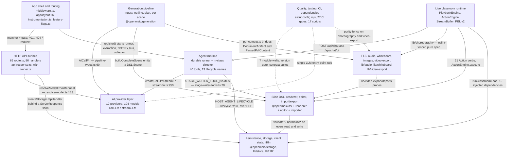
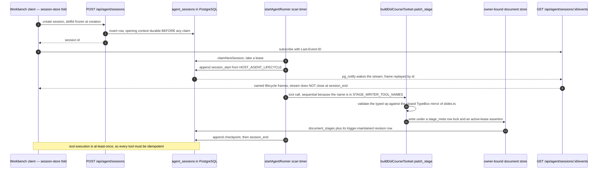

# 06 — Bounded contexts

Ten subsystems, each with a charter it actually enforces, a vocabulary it owns,
and a named seam to each neighbour. These are logical boundaries, not containers
— most of them straddle the browser and the server, which is exactly why the
seam artefacts matter more than the directory names.

**Sources:** every module cited inline, plus the ten evidence packs under
`docs/appendix/research/`. Each context section links to its component topic and
to its pack.

## Context map

## 1. App shell and routing

| | |
| --- | --- |
| Charter | Everything between "a request hits the Next server" and "a product surface is mounted", plus the once-per-process lifecycle. Every gate is server-authoritative where it can be; nothing periodic starts from a route module |
| Owns the words | *route segment*, *provider stack*, *entry gate*, *feature flag* vs *capability*, *session handoff* |
| Key artefacts | `middleware.ts` (the only auth gate), `app/layout.tsx` (7-child ordered stack, 3 of them render `null` — `ServerProvidersInit`, `ProSwapWatcher`, `StorageHealthNotice`), `instrumentation.ts` `register()`, `lib/workbench/entry-gate.ts`, `lib/config/feature-flags.ts` |
| Seams out | 401/404/`redirect`/`notFound` into the API and page contexts; `register()` into the agent runtime; three `sessionStorage` keys between routes |
| Topic | [../03-app-and-api/index.md](docs/03-app-and-api/index.md) · pack: [app-shell-and-routing](docs/appendix/research/app-shell-and-routing/00-overview.md) |

The flag-vs-capability distinction is this context's most exported idea:
`isAgentRuntimeEnabled()` is intent, `isAgentRuntimeConfigured()` is intent AND a
non-empty `DATABASE_URL` ([`lib/config/feature-flags.ts:18-25`](lib/config/feature-flags.ts#L18-L25)), and 26 routes gate
on the latter.

## 2. HTTP API surface

| | |
| --- | --- |
| Charter | The only HTTP surface OpenMAIC exposes. The routes *are* the contract — there is no OpenAPI artefact and no version other than `app/api/pbl/v2/**` |
| Owns the words | *envelope* (`apiError` / `apiSuccess`, 36 error codes), *owner id* (always `anon:`-prefixed), *learner key*, *no-existence-oracle 404*, *SSE frame* |
| Key artefacts | `lib/server/api-response.ts` (48 of 69 routes), `lib/server/agent-runtime/with-owner.ts` (22 routes), `route-response.ts`, `lib/server/ssrf-guard.ts` (13 routes), `lib/server/resolve-model.ts` (13 routes) |
| Seams out | `resolveModelFromRequest` into the provider layer; `createStorageHttpHandler` into persistence; `proxyFetch` into the render service; `createSSEResponse` into PBL clients |
| Topic | [../03-app-and-api/index.md](docs/03-app-and-api/index.md), [../12-api-reference/index.md](docs/12-api-reference/index.md) · pack: [api-surface](docs/appendix/research/api-surface/00-overview.md) |

Watch the naming trap: `lib/api/*` is **not** part of this context. It is an
in-process stage-store toolkit for AI agents, imported by no route file.

## 3. AI provider layer

| | |
| --- | --- |
| Charter | The single seam between generation code and every text-LLM vendor. Owns the registry, the capability model, adapter construction, and credential/routing arbitration. Explicitly *not* TTS, image, video or PDF providers, which have their own catalogs |
| Owns the words | `ProviderId` (19 built-in + `custom-*`), `ModelInfo`, `ThinkingCapability` / `ThinkingConfig`, `LlmStage` (20 routable stages), `MODEL_ROUTES`, *managed* vs *unmanaged* provider |
| Key artefacts | `PROVIDERS` ([`lib/ai/providers.ts:75`](lib/ai/providers.ts#L75)), `getModel()` ([`:2033`](lib/ai/providers.ts#L2033)), `callLLM` / `streamLLM` ([`lib/ai/llm.ts:325,397`](lib/ai/llm.ts#L325)), `lib/server/provider-config.ts`, `lib/server/model-routes.ts` |
| Seams in | `AICallFn` from generation, `createCallLlmStreamFn` from the agent runtime, `resolveModelFromRequest` from routes |
| Seams out | `GET /api/server-providers` (ids + model lists only), `GET /api/usage` over the JSONL log |
| Topic | [../04-ai-provider-layer/index.md](docs/04-ai-provider-layer/index.md) · pack: [ai-provider-layer](docs/appendix/research/ai-provider-layer/00-overview.md) |

The boundary is machine-enforced in both directions: [`eslint.config.mjs:608-667`](eslint.config.mjs#L608-L667)
bans `generateText` / `streamText` from `ai` everywhere except `lib/ai/llm.ts`,
`eval/**` and `tests/**`, in static, namespace and dynamic form.

## 4. Agent runtime

| | |
| --- | --- |
| Charter | Two independent runtimes over one harness (`@earendil-works/pi-agent-core`, pinned exact at `0.78.0`). The **durable** one makes PostgreSQL the authority for claims, leases, event ordering, cancellation and recovery, so a client connection is never part of the execution lifetime. The **in-class** one is fully stateless server-side and request-scoped |
| Owns the words | *session*, *claim*, *lease*, *steer*, *checkpoint*, *skill activation* (a successful `read` of `SKILL.md` in the transcript), *stage writer*, *allowlist gate* |
| Key artefacts | `startAgentRunner()` ([`lib/server/agent-runtime/runner.ts:1861`](lib/server/agent-runtime/runner.ts#L1861)), `runSession()` ([`:889`](lib/server/agent-runtime/runner.ts#L889)), `buildAgent()` ([`lib/agent/runtime/build-agent.ts:65`](lib/agent/runtime/build-agent.ts#L65)), `HOST_AGENT_LIFECYCLE` ([`lib/agent-runtime/lifecycle.ts:37`](lib/agent-runtime/lifecycle.ts#L37)), `STAGE_WRITER_TOOL_NAMES` ([`lib/agent-runtime/stage-writer-tools.ts:20`](lib/agent-runtime/stage-writer-tools.ts#L20)) |
| Seams out | the SSE event log the browser folds with `Last-Event-ID`; `patch_stage` and eight sibling writers into the DSL; `ActionEngine` for in-class actions |
| Topic | [../05-agent-runtime/index.md](docs/05-agent-runtime/index.md) · pack: [agent-runtime](docs/appendix/research/agent-runtime/00-overview.md) |

`STAGE_WRITER_TOOL_NAMES` is worth reading in full: nine tool names shared by
three consumers (the server's sequential scheduler, the workbench fold's write
ownership, and the curriculum toolset), with a docstring explaining why a
`read_stage` must never take ownership — "ownership's side effect is dropping the
user's own pending edits".

## 5. Generation pipeline

| | |
| --- | --- |
| Charter | Free-text requirement plus optional uploaded materials → a persisted course document. Four stages: ingestion, outline generation, stage planning, per-scene generation. Governing convention is **degrade-don't-fail** |
| Owns the words | *outline*, `DocumentArtifact` / `MediaArtifact`, `ParsedPdfContent`, *document bundle*, *vision slot*, *language directive*, `AICallFn` |
| Key artefacts | `@openmaic/generation` (8 229 lines src, 26 Markdown prompt templates), `buildDocumentBundle` ([`lib/document/bundle.ts:181`](lib/document/bundle.ts#L181)), the browser loop (`lib/hooks/use-scene-generator.ts`) and the headless twin (`lib/server/classroom-generation.ts`) |
| Seams out | `AICallFn` — one function type is the package's **entire** model dependency; `buildCompleteScene` emits a DSL `Scene`; `lib/document/pdf-compat.ts` bridges to the media/extraction context |
| Topic | [../06-generation-pipeline/index.md](docs/06-generation-pipeline/index.md) · pack: [generation-pipeline](docs/appendix/research/generation-pipeline/00-overview.md) |

Two deliberate exceptions to degrade-don't-fail, both documented in the pack: PBL
scene generation throws `PBLGenerationError`, and a scene's TTS failure fails the
whole scene.

## 6. Slide DSL, renderer, editor, import/export

| | |
| --- | --- |
| Charter | Own the slide document end to end. `@openmaic/dsl` is the zero-runtime-dependency contract; the renderer paints it; the editor mutates it through a two-level op model; the importer produces it from PPTX; the exporter emits PPTX from it |
| Owns the words | `PPTElement` (10 variants), `Action` (21 variants), `Stage` / `Scene` / `SlideContent`, `dslVersion` vs `runtimeDslVersion`, `EditIntent` (L1, lenient) vs `EditorOperation` (L0, strict), *z-order is array order* |
| Key artefacts | `packages/@openmaic/dsl/src/{slides,version,normalize,validate}.ts`, `SlideCanvas.tsx`, `@openmaic/editor` `core/index.ts`, `importPptx`, `lib/export/use-export-pptx.ts` |
| Seams out | `validate*` / `normalize*` called on every persistence read and write; the generated JSON Schema artefacts; the agent's typed `patch_stage` ops re-validated against a closed TypeBox mirror of `slides.ts` |
| Topic | [../07-dsl-renderer-editor/index.md](docs/07-dsl-renderer-editor/index.md) · pack: [dsl-renderer-editor](docs/appendix/research/dsl-renderer-editor/00-overview.md) |

Two ladders, one guard: `DSL_VERSION 0.3.0` and `RUNTIME_DSL_VERSION 0.1.0` are
independent, kept apart by a cross-line guard that throws on an undecidable
envelope ([`packages/@openmaic/dsl/src/version.ts:589`](packages/@openmaic/dsl/src/version.ts#L589)).

## 7. Live classroom runtime

| | |
| --- | --- |
| Charter | Everything after a course document exists and a learner opens the classroom. 53 source files / 13 978 lines across `lib/playback`, `lib/action`, `lib/buffer`, `lib/classroom` and `lib/pbl` — the roots named below. There is **no single clock** — whichever of four mechanisms is live owns the advance |
| Owns the words | `EngineMode` = `idle` \| `playing` \| `paused` \| `live`, *playback generation* (a monotonic cancellation counter with 20 guard sites), *seek admissibility*, *segment* with its `{holding, segmentDone}` protocol, *pending task completion* |
| Key artefacts | `PlaybackEngine` (`lib/playback/engine.ts`, 903 lines), `ActionEngine` (`lib/action/engine.ts`, 903 lines), `StreamBuffer` (`lib/buffer/stream-buffer.ts`), `runClassroomLoad` (`lib/classroom/load-classroom.ts`), `lib/pbl/v2/**` |
| Vocabulary hazard | *stage* means both the course document (`packages/@openmaic/dsl/src/stage.ts`) and the top-level React container (`components/stage.tsx`). *Utterance* is **not** a domain type — the only such identifier in the tree is `SpeechSynthesisUtterance` |
| Seams out | `lib/choreography` (shared with the exporter, machine-enforced pure); the chat POST contract; PBL `project_patch` events |
| Topic | [../08-classroom-runtime/index.md](docs/08-classroom-runtime/index.md) · pack: [classroom-runtime](docs/appendix/research/classroom-runtime/00-overview.md) |

## 8. TTS, audio, whiteboard, images, video export

| | |
| --- | --- |
| Charter | Four cooperating layers plus one isolated container: provider-neutral TTS/ASR dispatch, the narration/timing contract, the append-only whiteboard log, and the pure video-export compiler |
| Owns the words | *voice* and the "model follows voice" invariant, `measureAudioDuration`, `RuntimeRecord` (five whiteboard operations, folded on read), `VideoTimeline` (schema v4, 13 diagnostic codes), *hyperframe*, *resource profile*, *capture mode* |
| Key artefacts | `generateTTS()` ([`lib/audio/tts-providers.ts:207`](lib/audio/tts-providers.ts#L207)), `resolveActionTimeline()` ([`lib/choreography/timeline.ts:282`](lib/choreography/timeline.ts#L282)), `compileVideoTimeline()` ([`lib/video-export/compile.ts:152`](lib/video-export/compile.ts#L152)), `foldWhiteboardRuntimeRecords()` ([`lib/whiteboard/runtime/fold.ts:170`](lib/whiteboard/runtime/fold.ts#L170)), `render-service/src/main.ts` |
| Seams | **In:** the classroom runtime through `lib/choreography` (timing literals lifted verbatim so engine and exporter cannot drift). **Out:** `lib/video-export/deps.ts` — `TimingProbe` / `AssetSource` / `GeometryProbe` / `QuizLayoutProbe`, a *synchronous* DI surface, which is only possible because duration is measured and stored at TTS time |
| Topic | [../09-media-and-export/index.md](docs/09-media-and-export/index.md) · pack: [media-audio-video](docs/appendix/research/media-audio-video/00-overview.md) |

Purity here is enforced, not asserted: [`eslint.config.mjs:254-492`](eslint.config.mjs#L254-L492) fences
`lib/choreography` and `lib/video-export` against React, DOM, GSAP, `motion`,
`@/…` and every dynamic import, with a depth-specific relative allowlist.

## 9. Persistence, storage, client state, i18n

| | |
| --- | --- |
| Charter | `@openmaic/dsl` owns *what* persists; this context owns *where/how*. The pluggable seam is the backend, not the driver |
| Owns the words | the five primitives (`KVStore`, `DocumentStore`, `RuntimeStore`, `AssetStore`, `AgentSessionStore`), *scope* (`device` vs `account`), *owner binding* with four named refusals (`foreign` / `tombstoned` / `reserved-document` / `unclaimed`), `Outcome<T>`, *persist health*, *locale leaf key* |
| Key artefacts | `packages/@openmaic/storage/src/index.ts` (159 exports, 16 subpaths), `lib/persistence/bootstrap.ts`, `lib/persistence/owner-bound-document-store.ts`, `lib/store/kv-persist.ts` (735 lines, a per-key state machine), `lib/workbench/session-store.ts` (an 840-line pure `foldEvent`) |
| Seams | **In:** `validateAppScene` / `validateAppStage` injected into every backend; the agent-session SSE log folded outside React so `Last-Event-ID` resumption is exact. **Out:** `configureDocumentStorage` / `configureRuntimeStorage`, sealed permanently once resolution starts |
| Topic | [../10-persistence-and-state/index.md](docs/10-persistence-and-state/index.md) · pack: [persistence-storage-state](docs/appendix/research/persistence-storage-state/00-overview.md) |

## 10. Quality, testing, CI, dependencies

| | |
| --- | --- |
| Charter | Stated verbatim at [`scripts/openmaic-packages.mjs:17-33`](scripts/openmaic-packages.mjs#L17-L33): gates exist to catch **mistakes that are silent by default**, not deliberate subversion, "because every new check arrives with its own editable configuration" |
| Owns the words | *publishable input*, *contract suite*, *module wall*, *sentinel failure*, *fails closed*, *KNOWN LIMITATION* (a labelled section in almost every gate) |
| Key artefacts | `eslint.config.mjs` (670 lines, 7 module walls), `tests/lint-llm-entry-guard.test.ts` (a meta-test running real ESLint over a 5×6×13 matrix), `scripts/check-package-version-bumps.mjs` (685 lines), `scripts/assert-pg-contract-suites.mjs` (audits `pg_stat` deltas from outside the Vitest process), five GitHub workflows, 27 enforced gates |
| Seams | consumes every other context as a subject; produces CI status and npm tarballs |
| Topic | [../14-code-quality/index.md](docs/14-code-quality/index.md), [../16-development-view/index.md](docs/16-development-view/index.md) · pack: [quality-testing-ci-deps](docs/appendix/research/quality-testing-ci-deps/00-overview.md) |

## Seam catalogue

The seams worth memorising, because breaking one of them is how a change becomes
a cross-context incident:

| Seam artefact | Between | Shape |
| --- | --- | --- |
| `@openmaic/dsl` | every context | a typed, versioned document contract with zero runtime deps |
| `AICallFn` ([`packages/@openmaic/generation/src/pipeline-types.ts:60`](packages/@openmaic/generation/src/pipeline-types.ts#L60)) | generation ↔ provider layer | `(systemPrompt, userPrompt, images?) => Promise<string>` — the whole model dependency |
| `createCallLlmStreamFn()` ([`lib/agent/runtime/stream-fn.ts:250`](lib/agent/runtime/stream-fn.ts#L250)) | agent runtime ↔ provider layer | pi `StreamFn` adapted onto `streamLLM` with `stopWhen: stepCountIs(1)` |
| `resolveModelFromRequest()` ([`lib/server/resolve-model.ts:183`](lib/server/resolve-model.ts#L183)) | API surface ↔ provider layer | header + stage-route arbitration; a routed stage discards client credentials |
| `HOST_AGENT_LIFECYCLE` ([`lib/agent-runtime/lifecycle.ts:37`](lib/agent-runtime/lifecycle.ts#L37)) | agent runtime ↔ browser | 13 durable event names the client subscribes to *by name* |
| `STAGE_WRITER_TOOL_NAMES` ([`lib/agent-runtime/stage-writer-tools.ts:20`](lib/agent-runtime/stage-writer-tools.ts#L20)) | agent runtime ↔ DSL ↔ workbench client | 9 names, 3 consumers, one list |
| `lib/choreography` | classroom runtime ↔ video export | pure spec with timing literals lifted verbatim; ESLint-fenced |
| `lib/video-export/deps.ts` | video export ↔ app state | four synchronous probes, so the compiler stays pure |
| `lib/document/pdf-compat.ts` | generation ↔ extraction | bidirectional `DocumentArtifact` ⇄ `ParsedPdfContent` |
| `createStorageHttpHandler` ([`app/api/persistence/[...path]/route.ts:108-121`](app/api/persistence/[...path]/route.ts#L108-L121)) plus the `ServerResponse` shim (`nodeRequest` at [`:129-144`](app/api/persistence/[...path]/route.ts#L129-L144), `setHeaders` at [`:146-154`](app/api/persistence/[...path]/route.ts#L146-L154), closed by the `as unknown as ServerResponse` cast at [`:253`](app/api/persistence/[...path]/route.ts#L253)) | API surface ↔ persistence | a Node `RequestListener` adapted to a Web `Response` |
| `render-service` HTTP contract ([`render-service/src/main.ts:12-17`](render-service/src/main.ts#L12-L17)) | video export ↔ the render container | six endpoints, deliberately minimal so internals can be swapped |
| `lib/action/engine.ts` `ActionEngine` | classroom runtime ↔ both chat paths | one client-side executor for every classroom action |

### One request, five contexts

"Ask the Pro agent to edit a slide" crosses five of the ten contexts, and every
hop is one of the seams above. The shape is worth internalising because it is the
only path in the product where a client connection is *not* part of the execution
lifetime.

## Open questions

- Two contexts are duplicated in-tree behind flags: renderer/editor (packaged vs
  legacy `components/slide-renderer` + `lib/edit`) and the classroom chat director
  (Pi vs the older LangGraph graph, with `NEXT_PUBLIC_PI_CHAT_ENABLED` commented
  out in `.env.example`, so LangGraph is the shipped default). Neither pack found
  a written deprecation plan.
- `app/classroom/[id]/page.tsx` runs its own copy of the classroom load pipeline
  rather than importing `components/classroom/ClassroomSurface.tsx`, and the two
  copies have already diverged
  ([classroom-runtime](docs/appendix/research/classroom-runtime/00-overview.md)).
  Which one is intended to be canonical is not recorded in either file.
- [`skills/openmaic/SKILL.md`](skills/openmaic/SKILL.md) is consumed by no runtime in this repository — it is
  a downloadable skill for an **external** host agent that drives an OpenMAIC
  deployment over HTTP. It is therefore a context boundary with no code on the
  other side of it here.
