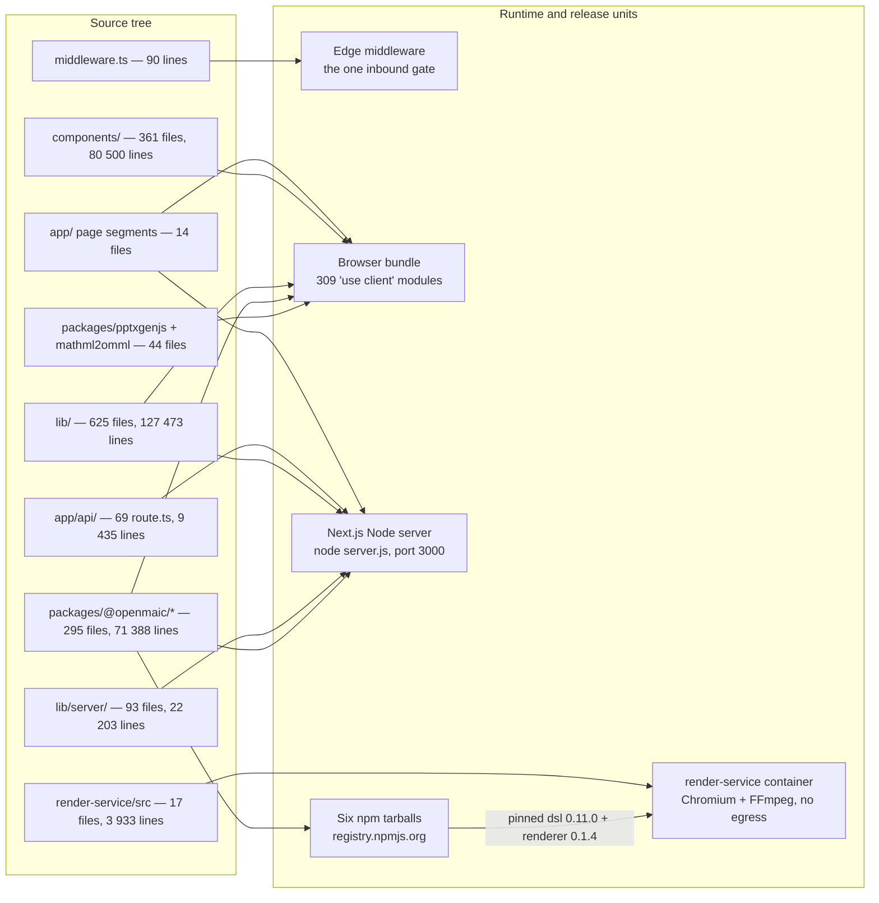

# Container View (C4 L2) and Logical Structure

The deployable and runtime units OpenMAIC is made of, the wires between them,
and the source-tree layering that maps onto those units. This topic answers two
different questions with one set of facts: *what processes and stores exist at
run time* (C4 level 2) and *how the repository is layered so that those
processes can be built from it* (logical/development structure).

Read this after [../01-system-context/index.md](docs/01-system-context/index.md)
and before any of the component topics (`03-` … `10-`). Every component topic
is a zoom into exactly one container or one bounded context named here. For how
those containers are actually deployed, scaled and configured per environment,
continue to [../17-deployment-view/index.md](docs/17-deployment-view/index.md).
The set root is [../README.md](docs/README.md).

## Who this is for

A staff engineer who has cloned the repo, run `pnpm dev`, and now needs to know
which of the 674 files under `lib/` runs in a browser tab, which runs in the
Node server process, which runs in a separate container with no network, and
which is compiled into a tarball published to npm.

## Sources

Primary code read for this topic:

- `docker-compose.yml`, `Dockerfile`, `render-service/Dockerfile`,
  `vercel.json`, `next.config.ts` — the container topology and how each one
  starts.
- `middleware.ts`, `instrumentation.ts`, `lib/server/register-shutdown-signals.ts`
  — the request edge and the process lifecycle.
- `lib/config/feature-flags.ts`, `lib/server/resolve-model.ts`,
  `lib/server/provider-config.ts` — how configuration and secrets are split
  across the server/client boundary.
- `lib/persistence/bootstrap.ts`, `lib/persistence/server-provider.ts`,
  `app/api/persistence/[...path]/route.ts`, `lib/utils/database.ts` — the
  storage tiers.
- `render-service/src/main.ts`, `render-service/src/types.ts`,
  `lib/server/render-service.ts` — the one out-of-process container.
- `eslint.config.mjs`, `scripts/openmaic-packages.mjs`,
  `scripts/check-package-version-bumps.mjs` — the machine-enforced layering.
- `packages/@openmaic/*/package.json`, `packages/pptxgenjs`,
  `packages/mathml2omml` — the workspace packages and vendored forks.

Evidence packs leaned on, with their own citations:
[app-shell-and-routing](docs/appendix/research/app-shell-and-routing/00-overview.md),
[api-surface](docs/appendix/research/api-surface/00-overview.md),
[persistence-storage-state](docs/appendix/research/persistence-storage-state/00-overview.md),
[media-audio-video](docs/appendix/research/media-audio-video/02g-interfaces-render-service.md),
[ai-provider-layer](docs/appendix/research/ai-provider-layer/00-overview.md),
[quality-testing-ci-deps](docs/appendix/research/quality-testing-ci-deps/00-overview.md).

## Topic overview

The one mapping that makes the rest of this topic legible: which source roots end
up inside which runtime unit. Note that `lib/` and `packages/@openmaic/*` each
compile into **two** different units, which is why the server/client boundary
(section 03) is the boundary that matters most, and note the `npm → render-service`
edge — the render container consumes the *published* packages, not the workspace.

## Section files

| File | What it covers |
| --- | --- |
| [01-container-inventory.md](docs/02-container-view/01-container-inventory.md) | Every container: technology, responsibility, how it starts, where its config comes from. |
| [02-container-diagram.md](docs/02-container-view/02-container-diagram.md) | The canonical C4 L2 diagram plus per-slice variants for the generation, playback and export paths. |
| [03-server-client-boundary.md](docs/02-container-view/03-server-client-boundary.md) | The server/browser split: what ships to the bundle, what crosses, how operator secrets stay server-side. |
| [04-logical-layering.md](docs/02-container-view/04-logical-layering.md) | `app/` → `components/` → `lib/` → `packages/@openmaic/*` → vendored, the intended direction, and the cited violations. |
| [05-workspace-packages.md](docs/02-container-view/05-workspace-packages.md) | The six `@openmaic/*` packages and two vendored forks: purpose, publication, consumers, stability contract. |
| [06-bounded-contexts.md](docs/02-container-view/06-bounded-contexts.md) | The ten subsystems as bounded contexts, the language each owns, and the seams between them. |

## Measured scale (context for everything below)

Counted with `git ls-files <dir>` and a line count over the source extensions
(`.ts`, `.tsx`, `.mjs`, `.cjs`, `.js`, `.jsx`):

| Source root | Tracked files | Source files | Lines |
| --- | --- | --- | --- |
| `app/` (of which `app/api/`) | 86 (69) | 83 (69) | 14 563 (9 435) |
| `components/` | 365 | 361 | 80 500 |
| `lib/` (of which `lib/server/`) | 674 (93) | 625 (93) | 127 473 (22 203) |
| `packages/@openmaic/*/src` | 296 | 295 | 71 388 |
| `packages/pptxgenjs` + `packages/mathml2omml` | 50 | 44 | 15 043 |
| `render-service/src` | 17 | 17 | 3 933 |
| `tests/` | 680 | 674 | 160 891 |
| `e2e/` | 24 | 24 | 2 698 |
| `eval/` | 39 | 25 | 4 271 |
| `configs/` | 13 | 13 | 3 896 |

Two numbers set the shape of everything in this topic: **309 files carry
`'use client'`** (so most of `components/` and much of `lib/` executes in the
browser), and **`app/api/` is exactly 69 route files** — the entire HTTP
surface of the product.

## Conventions used in this topic

- A **container** here is a separately-startable process or an independently
  addressable data store, per C4 L2. Mermaid's experimental `C4Container` block
  is deliberately not used; C4 levels are expressed with `subgraph` grouping
  and explicit node labels so the diagrams render everywhere.
- "Inferred:" prefixes any claim not directly readable from the code.
- Anything unverifiable is in an **Open questions** section, never guessed.
