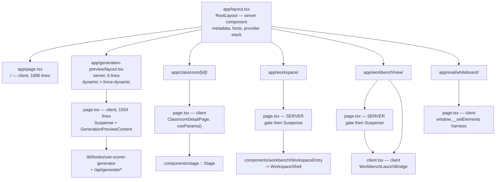
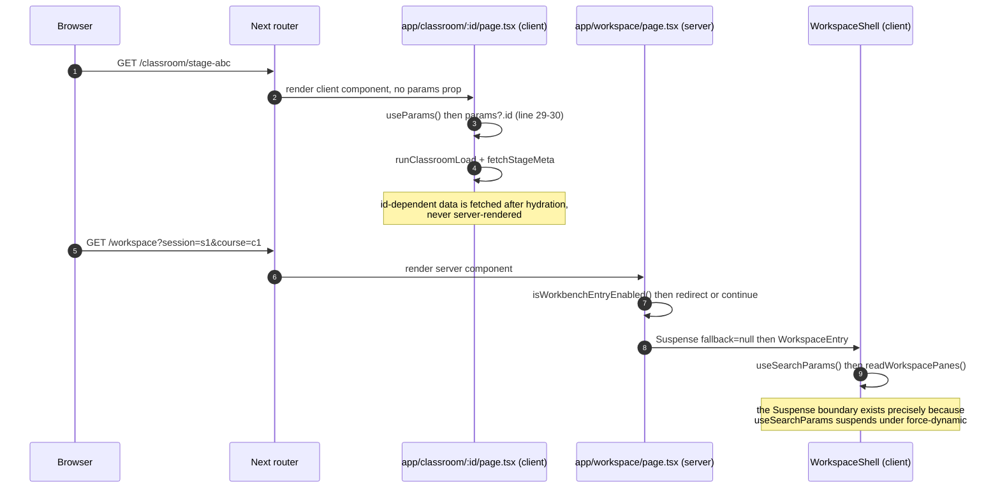
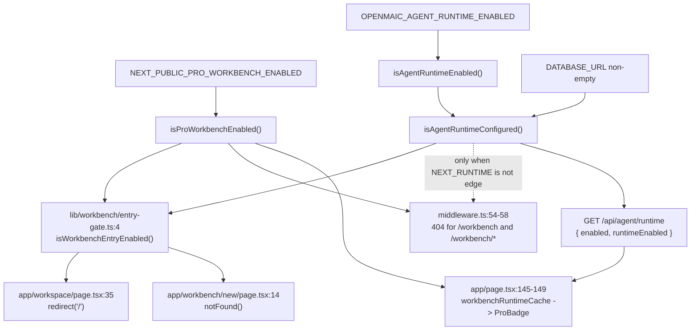

# Route Map

Every user-facing route segment outside `app/api`, what it renders, whether it is
a server or client component, which subsystem it drives, and which App Router
convention files are absent. Six routes, two layouts, eight components total.

**Sources:** `app/page.tsx`, `app/generation-preview/{page,layout}.tsx`,
`app/classroom/[id]/page.tsx`, `app/workspace/page.tsx`,
`app/workbench/new/{page,client}.tsx`, `app/eval/whiteboard/page.tsx`,
`app/layout.tsx`, `lib/workbench/entry-gate.ts`; file list from
`git ls-files app | grep -v '^app/api/'`. Evidence:
[`../appendix/research/app-shell-and-routing/00-overview.md`](../appendix/research/app-shell-and-routing/00-overview.md),
[`01-modules.md`](../appendix/research/app-shell-and-routing/01-modules.md).

## The six routes

| Route | Segment file | Kind | Rendering | Gate | Drives |
| --- | --- | --- | --- | --- | --- |
| `/` | `app/page.tsx` (1896) | client (`'use client'` line 1) | default; static shell, all data client-fetched | none server-side; Pro entry hidden behind a runtime probe (`app/page.tsx:145`) | composer → generation handoff; course/folder discovery from IndexedDB; settings |
| `/generation-preview` | `app/generation-preview/page.tsx` (1554) | client | `force-dynamic` via `app/generation-preview/layout.tsx:2` | none | [generation pipeline](../06-generation-pipeline/index.md) — 6-step run driver |
| `/classroom/[id]` | `app/classroom/[id]/page.tsx` (256) | client | default | none | [live classroom runtime](../08-classroom-runtime/index.md) via `components/stage` |
| `/workspace` | `app/workspace/page.tsx` (42) | **server** | `force-dynamic` (line 32) | `isWorkbenchEntryEnabled()` → `redirect('/')` (line 35) | Pro workbench shell → [agent runtime](../05-agent-runtime/index.md) |
| `/workbench/new` | `app/workbench/new/page.tsx` (21) | **server** | `force-dynamic` (line 11) | `isWorkbenchEntryEnabled()` → `notFound()` (line 14) | legacy launch-link compatibility only; owns no product UI |
| `/eval/whiteboard` | `app/eval/whiteboard/page.tsx` (107) | client | default | **none — unflagged in production** | Playwright render harness for `eval/whiteboard-layout/capture.ts` |

Line counts from `wc -l`. `/` and `/generation-preview` are 60% of all non-API
source in `app/`; `app/generation-preview/components/visualizers.tsx` (848) adds
another 15%.

## Route tree

## Rendering modes, complete

Three `dynamic` exports exist outside `app/api`, and nothing else:

| Export | File:line | Stated reason |
| --- | --- | --- |
| `dynamic = 'force-dynamic'` | `app/generation-preview/layout.tsx:2` | "this page uses client-side hooks (useI18n)" (comment line 1) |
| `dynamic = 'force-dynamic'` | `app/workspace/page.tsx:32` | keeps the flags request-scoped instead of baking them into a prerender (docstring lines 18-19) |
| `dynamic = 'force-dynamic'` | `app/workbench/new/page.tsx:11` | same gate, same reason |

There is no `revalidate`, `runtime`, `fetchCache`, `generateMetadata`, or
`generateStaticParams` anywhere in the non-API tree. `metadata` is a single static
object at `app/layout.tsx:31` — one title (`'OpenMAIC'`) for every route, so
`/classroom/<id>` shares the home page's document title.

## Absent convention files

`git ls-files app | grep -E "error|not-found|loading|template|robots|sitemap|opengraph|default"`
returns nothing. Consequences, in order of how likely you are to hit them:

| Missing | Effect |
| --- | --- |
| `error.tsx` / `global-error.tsx` | any render-phase throw in a client surface falls through to Next's built-in error page; there is no route-scoped recovery UI and no reset boundary |
| `not-found.tsx` | `notFound()` from `app/workbench/new/page.tsx:14` renders Next's default 404, not a branded one |
| `loading.tsx` | no automatic Suspense boundary per segment — every surface that needs one declares its own (`/generation-preview`, `/workspace`, `/workbench/new`) |
| `robots.ts` / `sitemap.ts` / `opengraph-image` | no crawler directives and no social preview |

## Dynamic segments and query params

No route component in this tree takes `params` or `searchParams` props. The
dynamic segment and the query string are both read client-side:

Consequence: neither `/classroom/[id]` nor `/workspace` can produce a
server-rendered, data-dependent first paint, and `/classroom/[id]` cannot be
statically prerendered per id.

## Route-to-route state handoff

Three transitions carry state through `sessionStorage` rather than the URL or the
server. None is schema-validated.

| Key | Written by | Read by | Cleared |
| --- | --- | --- | --- |
| `generationSession` | `app/page.tsx` (composer submit) | `app/generation-preview/page.tsx` on mount | on success and on `goBackToHome` |
| `generationParams` | `app/generation-preview/page.tsx` before pushing to `/classroom/<id>` | `app/classroom/[id]/page.tsx` resume phase | **never** |
| `workbench.launchPrompt` | legacy deploy handoff | `app/workbench/new/client.tsx` | consumed once |

Detail and the exact shapes are in
[`../appendix/research/app-shell-and-routing/02c-interfaces-session-handoff.md`](../appendix/research/app-shell-and-routing/02c-interfaces-session-handoff.md).
The `/` ↔ `/workspace` transition additionally runs a View-Transition
shared-element swap whose state lives in a module (`lib/workbench/pro-swap.ts`)
because the component that starts it unmounts mid-flight.

## The workbench gate, three times over

`/workspace` and `/workbench/new` are gated by the same six-line predicate, and
the same decision is re-derived in two other places for two other purposes.

`/workspace` redirects and `/workbench/new` 404s from the *same* gate — a
deliberate asymmetry. The docstring at `app/workspace/page.tsx:10-16` states the
reason: a workspace whose every submit 404s is worse than no workspace, so the
entry route degrades to `/`; the legacy compatibility route has nothing to
degrade to and simply does not exist. Middleware only ever reaches
`isAgentRuntimeConfigured()` when `NEXT_RUNTIME !== 'edge'`
(`middleware.ts:53`), so the routes — not middleware — are the authority.

## Open questions

- `app/workspace/page.tsx:5-8` and `components/workbench/workspace/WorkspaceShell.tsx:7`
  both describe an `AppChrome` component that "suppresses `SiteHeader` on this
  path". Neither `AppChrome` nor `SiteHeader` exists in this repository; the only
  file under `components/site-header/` is `theme-toggle.tsx`. Whether these are
  stale comments or a planned refactor is not determinable from the squashed
  history.
- `/eval/whiteboard` is a production-reachable route with no feature flag and no
  middleware exclusion. Whether that is intentional (it renders only synthetic
  data seeded by `window.__setElements`) or an oversight is not recorded anywhere
  in the code.
