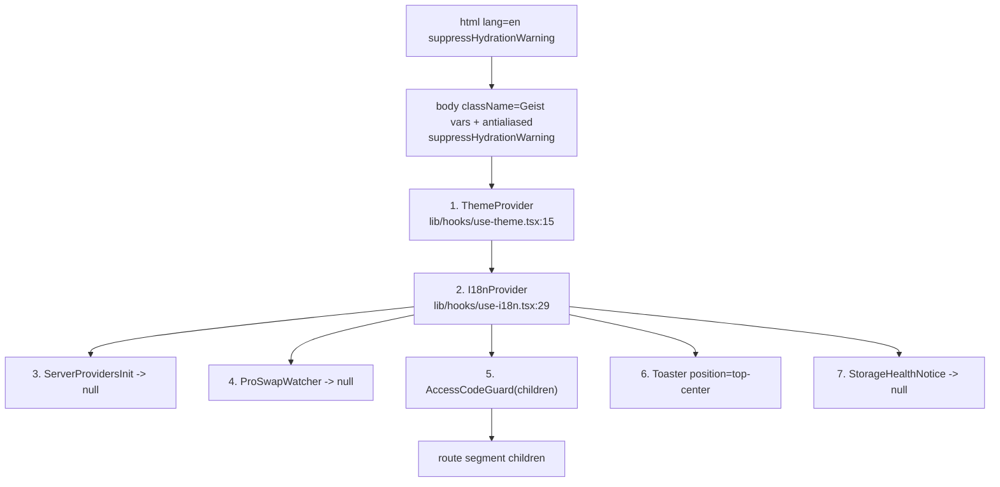
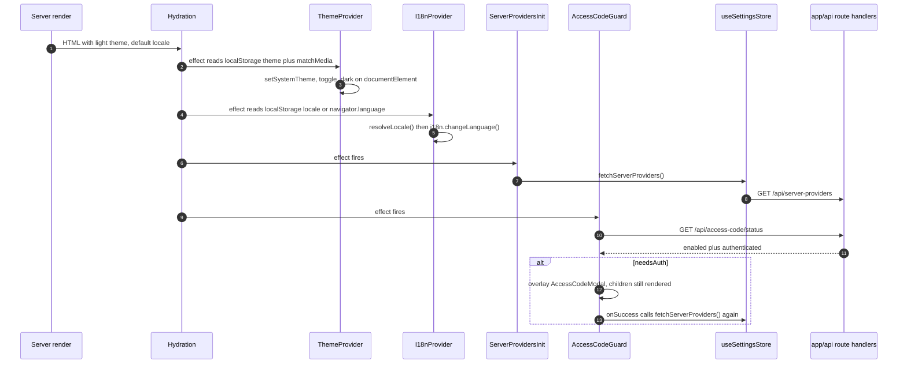
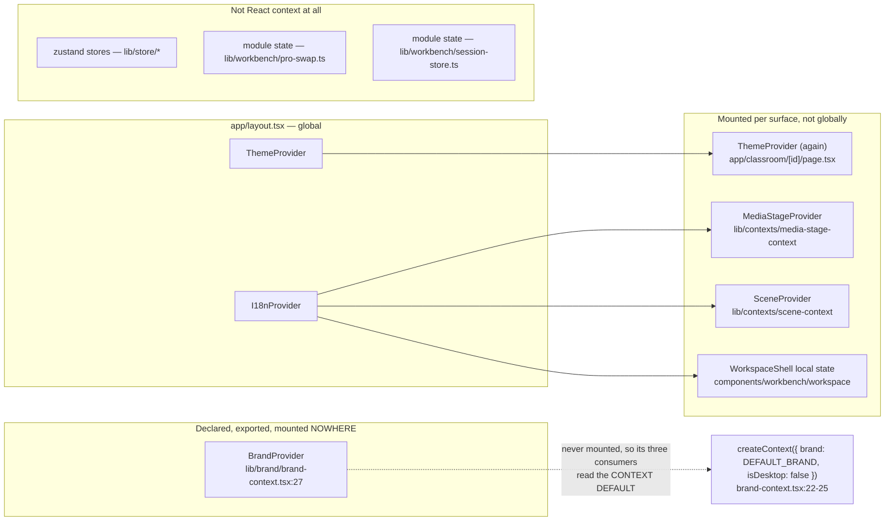

# Root Layout and the Provider Stack

`app/layout.tsx` is 63 lines and mounts seven children under `<body>`. Three of
them render `null`. This file explains what each provides, who consumes it, and
which parts of the ordering are load-bearing rather than incidental.

**Sources:** `app/layout.tsx`, `lib/hooks/use-theme.tsx`,
`lib/hooks/use-i18n.tsx`, `components/server-providers-init.tsx`,
`components/workbench/ProSwapWatcher.tsx`, `components/access-code-guard.tsx`,
`components/ui/sonner.tsx`, `components/storage-health-notice.tsx`,
`lib/store/persist-health`, `lib/brand/brand-config.ts`,
`lib/brand/brand-context.tsx`, `lib/contexts/`. Evidence:
[`../appendix/research/app-shell-and-routing/02b-interfaces-client-contracts.md`](docs/appendix/research/app-shell-and-routing/02b-interfaces-client-contracts.md).

## The stack, outer to inner

[`app/layout.tsx:42-62`](app/layout.tsx#L42-L62). `RootLayout` itself is a **server** component; every one
of the seven children is a client component (`'use client'` at line 1 of each).

`ThemeProvider` and `I18nProvider` are real nesting. Children 3-7 are **siblings**
inside `I18nProvider`, not a chain — only `AccessCodeGuard` receives `children`.

## What each one provides and who consumes it

| # | Component | Provides | Consumed by | Renders |
| --- | --- | --- | --- | --- |
| 1 | `ThemeProvider` | `{ theme, setTheme, resolvedTheme }` via `ThemeContext`; toggles the `dark` class on `document.documentElement` ([`use-theme.tsx:33-40`](lib/hooks/use-theme.tsx#L33-L40)); persists to `localStorage['theme']` | `useTheme()` — throws outside the provider ([`use-theme.tsx:68`](lib/hooks/use-theme.tsx#L68)) | `children` |
| 2 | `I18nProvider` | `{ locale, setLocale, t }`; side-effect-imports `@/lib/i18n/config` (line 6) so i18next is initialised by mounting | `useI18n()` — throws outside the provider ([`use-i18n.tsx:63`](lib/hooks/use-i18n.tsx#L63)) | `children` |
| 3 | `ServerProvidersInit` | nothing; calls `useSettingsStore().fetchServerProviders()` once on mount | — | `null` |
| 4 | `ProSwapWatcher` | nothing; forwards every `usePathname()` change to `proSwapArrived()` | `lib/workbench/pro-swap.ts` | `null` |
| 5 | `AccessCodeGuard` | nothing; probes `/api/access-code/status` and overlays `AccessCodeModal` when auth is needed | — | `children` **unconditionally** (line 57) + optional modal |
| 6 | `Toaster` | the `sonner` toast host | every `toast.*()` call in the app | the toast portal |
| 7 | `StorageHealthNotice` | nothing; subscribes to `subscribeToPersistHealth` and raises sticky toasts | — | `null` |

## The three orderings that matter

### `Toaster` before `StorageHealthNotice`

The comment at [`app/layout.tsx:54-56`](app/layout.tsx#L54-L56) is explicit: `StorageHealthNotice` can raise
a toast on mount when persistence is already broken, and *"a toast raised before
its host exists has nowhere to go."* Swapping these two silently drops the
first-paint storage failure — the exact case the component exists for.

### `I18nProvider` above `StorageHealthNotice`

`StorageHealthNotice` calls `useI18n()` at line 17 to translate
`settings.persistChangesLost` / `settings.persistUnavailable`. Hoisting it out of
`I18nProvider` throws.

### `ThemeProvider` outermost

`resolvedTheme` drives a class mutation on `documentElement`, which is why both
`<html>` and `<body>` carry `suppressHydrationWarning` (`app/layout.tsx:43,46`).
The theme is hydrated from `localStorage` *in an effect*, not during render
([`use-theme.tsx:23-29`](lib/hooks/use-theme.tsx#L23-L29), with an explicit
`eslint-disable react-hooks/set-state-in-effect` and the reason inline) — so the
server always renders light and the first client commit corrects it.

## Effect ordering on mount

The re-fetch inside `AccessCodeGuard.onSuccess` ([`access-code-guard.tsx:53`](components/access-code-guard.tsx#L53)) exists
because of an ordering hazard the comment at lines 47-52 spells out:
`ServerProvidersInit` runs on mount, which on an `ACCESS_CODE`-gated deployment is
*before* any access cookie exists, so middleware answers 401 and the settings
store keeps blank defaults with nothing to re-trigger it. The guard repairs it
after a successful unlock. See [`./04-middleware.md`](docs/03-app-and-api/04-middleware.md) for the
401.

`AccessCodeGuard`'s failure default is fail-closed: a rejected status probe sets
`{ enabled: true, authenticated: false, loading: false }` (lines 27-32), i.e. show
the modal. The `loading` term in `needsAuth` (line 38) is what stops the modal
flashing on every cold load.

## Font strategy

Two mechanisms, deliberately:

| Family | Mechanism | Why |
| --- | --- | --- |
| Geist Sans / Geist Mono | `next/font` via the `geist` package; CSS variables land on `<body className>` ([`app/layout.tsx:45`](app/layout.tsx#L45)) | standard next/font path |
| Inter (the UI font) | `@fontsource-variable/inter` **stylesheet** import ([`app/layout.tsx:29`](app/layout.tsx#L29)) | only the stylesheet carries per-subset `unicode-range` declarations |

The 13-line comment at [`app/layout.tsx:16-28`](app/layout.tsx#L16-L28) records both failed alternatives:
pointing `next/font` at a single `.woff2` loaded exactly one subset, so Cyrillic
(ru-RU) and tone-marked Latin (vi-VN) fell back to an arbitrary OS font mid-word;
and declaring the other subsets as sibling faces does not fall through per glyph
when descriptors match and `unicode-range` is absent. Consequence: `--font-sans`
is declared in `app/globals.css`, not by a generated next/font class.

Four global CSS imports at [`app/layout.tsx:4-7`](app/layout.tsx#L4-L7): `./globals.css`,
`@openmaic/renderer/fonts.css`, `animate.css`, `katex/dist/katex.min.css`.

## Providers that are *not* here

### `BrandProvider` is in the tree and in no tree

`lib/brand/` holds the white-label seam — `brand-config.ts` (the `BrandConfig` shape and
`DEFAULT_BRAND`) and `brand-context.tsx` (`BrandProvider`, `useBrand`, `useIsDesktop`). It
belongs in this file's inventory precisely because it looks like a root provider and is
not one: `grep -rn "BrandProvider" app components lib tests` returns **only the
declaration** at [`lib/brand/brand-context.tsx:27`](lib/brand/brand-context.tsx#L27).

Three components consume it anyway, and therefore read the context's default value rather
than a provided one:

| Consumer | Reads |
| --- | --- |
| `components/edit/SlideNavRail/SlideNavRail.tsx:9,54` | `useBrand()`, `useIsDesktop()` |
| `components/workbench/workspace/WorkspaceHome.tsx:40,65` | `useBrand()`, `useIsDesktop()` |
| `components/workbench/workspace/WorkspaceRail.tsx:96,234` | `useBrand()` |

Two consequences follow mechanically. `useBrand()` always returns `DEFAULT_BRAND`
(`productName: 'OpenMAIC'`, `logoSrc: '/logo-horizontal.png'`,
`markSrc: '/openmaic-mark.png'`, `themeColor: '#722ed1'`, [`lib/brand/brand-config.ts:27`](lib/brand/brand-config.ts#L27)),
and **`useIsDesktop()` always returns `false`** — the desktop branch in those three
components is unreachable in this workspace.

This is scaffolding rather than rot, and the files say so before you have to work it out.
[`brand-config.ts:1-9`](lib/brand/brand-config.ts#L1-L9): "The reference (live deployment) resolves the brand per vendor from
the desktop shell's User-Agent token. This workspace has no vendor shell: the product
ships with its own single brand, so the config is static and the desktop flag is always
off." [`brand-context.tsx:8-11`](lib/brand/brand-context.tsx#L8-L11) adds that the provider "accepts the values as props (for
future wiring) and defaults to the static brand / non-desktop, which is also what the
hooks read when no provider is mounted."

`tests/lib/brand/brand-config.test.ts` pins every `DEFAULT_BRAND` field, and
[`tests/workbench/workspace-rail-session-rename.test.ts:22-23`](tests/workbench/workspace-rail-session-rename.test.ts#L22-L23) mocks the context module
rather than mounting the provider — consistent with a provider nothing mounts. It is
recorded as a dead-path candidate with a *high* confidence of being intentional in
[`../14-code-quality/10-duplication-and-dead-code.md`](docs/14-code-quality/10-duplication-and-dead-code.md).

**Wiring it up, if a vendor shell ever arrives, is a root-layout change**: `RootLayout` is
a server component, so it can parse the request User-Agent and pass `brand` / `isDesktop`
as props — which is exactly the shape `BrandProvider` already accepts. Nothing else needs
to move.

Most cross-cutting client state in OpenMAIC is **not** in the root provider stack:
it lives in zustand stores (`lib/store/settings.ts`, `lib/store/stage.ts`, …) that
components subscribe to directly, or in plain module state for the two cases that
must survive a component unmount — `lib/workbench/pro-swap.ts` (the swap
outlives the badge that starts it) and `lib/workbench/session-store.ts` (a fold
over the agent SSE log kept outside React so `Last-Event-ID` resumption is
exact). See [`../10-persistence-and-state/index.md`](docs/10-persistence-and-state/index.md).

[`app/classroom/[id]/page.tsx:224`](app/classroom/[id]/page.tsx#L224) mounts a **second** `ThemeProvider` nested
inside the root layout's. Harmless (the inner context wins and behaves
identically) but redundant.

## Open questions

- [`components/ui/sonner.tsx:3`](components/ui/sonner.tsx#L3) imports `useTheme` from **`next-themes`**, not from
  `lib/hooks/use-theme`. `next-themes` is a declared dependency
  ([`package.json:120`](package.json#L120)) and this is its only importer in the repo; no
  `next-themes` `ThemeProvider` is mounted anywhere. The destructuring default
  `const { theme = 'system' }` (line 14) is therefore what actually takes effect,
  so the toaster is permanently on `'system'` and never follows an explicit
  light/dark choice. Whether this is a known shadcn-generator artefact or a live
  bug is not recorded.
- `app/editor-fonts.ts` claims in its docstring to be "imported once from the root
  layout". It is not — the only importer is [`lib/edit/preload-editor.ts:35`](lib/edit/preload-editor.ts#L35), a lazy
  `import()`.
