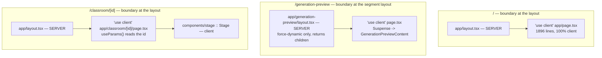
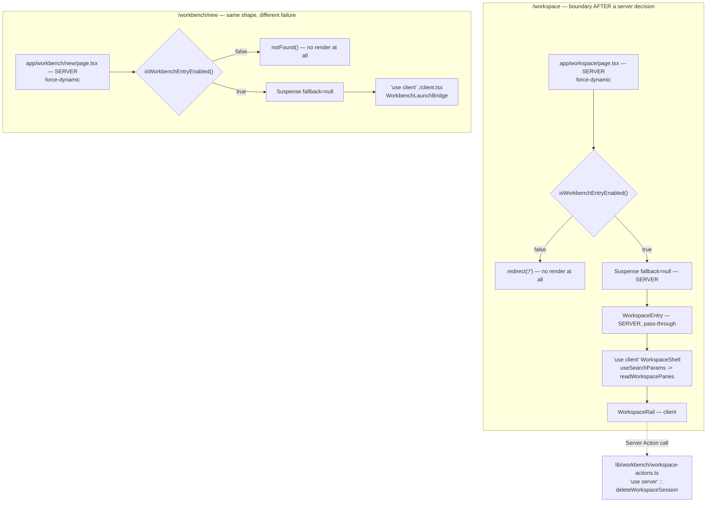
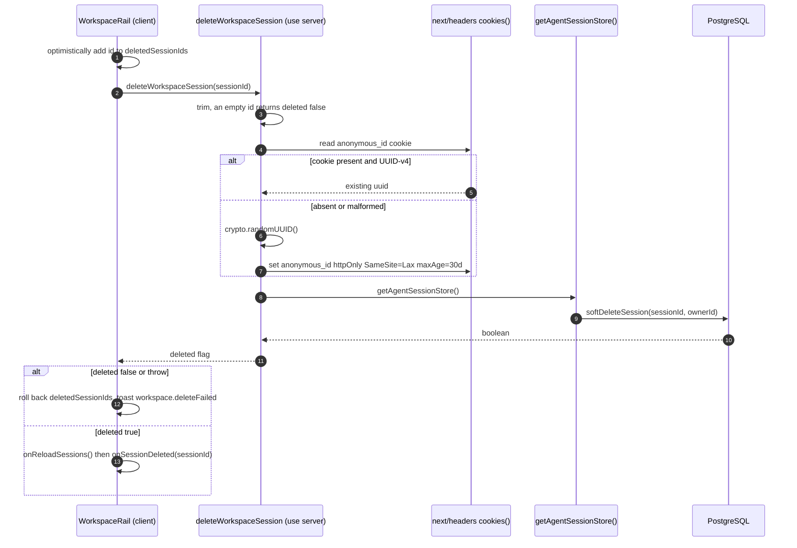
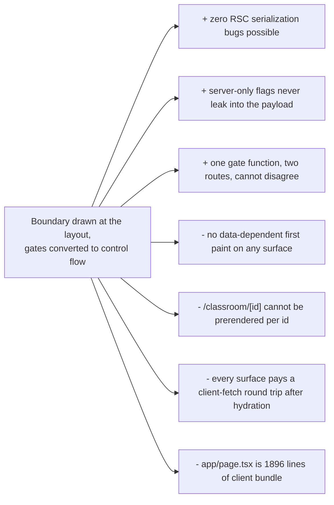

# The RSC Boundary

Where the React Server Component boundary is drawn on each surface, what crosses
it, and why the serialization concerns that normally dominate an App Router
codebase are largely absent here. The short version: the boundary is drawn as
high as possible and nothing but `ReactNode` crosses it.

**Sources:** `app/layout.tsx`, `app/workspace/page.tsx`,
`app/workbench/new/{page,client}.tsx`, `app/generation-preview/layout.tsx`,
`app/classroom/[id]/page.tsx`, `app/page.tsx`, `app/eval/whiteboard/page.tsx`,
`components/workbench/WorkspaceEntry.tsx`,
`components/workbench/workspace/WorkspaceShell.tsx`,
`lib/workbench/workspace-actions.ts`,
`components/workbench/workspace/WorkspaceRail.tsx`. Evidence:
[`../appendix/research/app-shell-and-routing/00-overview.md`](docs/appendix/research/app-shell-and-routing/00-overview.md).

## Server components, complete list

Five files in the render tree have no `'use client'`:

| File | Role | Does server work? |
| --- | --- | --- |
| `app/layout.tsx` | root layout: `<html>`/`<body>`, static `metadata`, font + CSS imports, provider stack | no — reads no request state |
| `app/generation-preview/layout.tsx` | 6 lines; exists only to export `dynamic = 'force-dynamic'` | no |
| `app/workspace/page.tsx` | `isWorkbenchEntryEnabled()` → `redirect('/')` | **yes** — reads server-only env |
| `app/workbench/new/page.tsx` | `isWorkbenchEntryEnabled()` → `notFound()` | **yes** — reads server-only env |
| `components/workbench/WorkspaceEntry.tsx` | 6-line pass-through seam returning `<WorkspaceShell />` | no |

Everything else in `app/` and `components/` that participates in rendering is a
client component. `WorkspaceEntry` is technically a server component but carries
no logic; it exists as an integration seam for the independently landed
workspace-shell slice (docstring line 3).

## Per-surface boundary

The pattern in both gated routes is the same and it is the important one: **the
gate decision is consumed on the server and converted into control flow before
render.** No boolean is serialised into a prop; the client never learns the
server-only flag's value from the page payload. `/` learns it separately, and only
indirectly, by fetching `/api/agent/runtime` ([`app/page.tsx:145`](app/page.tsx#L145)).

## What crosses the boundary

| Crossing | Payload | Serialization concern |
| --- | --- | --- |
| `app/layout.tsx` → `AccessCodeGuard` | `children: React.ReactNode` | none — RSC payload, not a serialised prop |
| `app/generation-preview/layout.tsx` → page | `children: React.ReactNode` | none |
| `app/workspace/page.tsx` → `WorkspaceEntry` → `WorkspaceShell` | nothing; `WorkspaceShell` takes no props | none |
| `app/workbench/new/page.tsx` → `WorkbenchLaunchBridge` | nothing | none |
| `WorkspaceRail` (client) → `deleteWorkspaceSession` (server action) | `id: string` in, `{ deleted: boolean }` out | both trivially serialisable |

That is the complete list. No server component in this repo passes fetched data,
a Date, a Map, a class instance, or a function to a client component, so the
usual RSC serialization failure modes ("Only plain objects can be passed…",
accidental over-fetching into the flight payload, prop-drilling a non-serialisable
handler) do not arise. The cost is paid elsewhere: **every id-dependent and
query-dependent read happens after hydration**, so no surface has a
data-dependent first paint.

## The one Server Action

`lib/workbench/workspace-actions.ts` is the only `'use server'` module in the
repository. `deleteWorkspaceSession(id)` is called from
[`components/workbench/workspace/WorkspaceRail.tsx:453`](components/workbench/workspace/WorkspaceRail.tsx#L453) behind an optimistic
row-removal that is rolled back on failure (lines 449-470).

The action re-implements owner resolution rather than reusing
`resolveRequestOwnerId`, and the docstring at lines 6-13 states why: a server
action has no `Request` object to hand it, so the module re-reads the same
`anonymous_id` cookie with the same UUID-v4 guard and the same mint semantics.
That is a deliberate duplication with a stated invariant ("an over-strict guard is
fail-safe: visitors merely get a fresh id"), not an accident — but it *is* a second
copy of the identity rule described in
[`./06-api-layer-conventions.md`](docs/03-app-and-api/06-api-layer-conventions.md).

Note what this means for the access-code gate: a server action POST is a normal
request through `middleware.ts`, so it is subject to the same cookie check as any
page request — and because its path is the page path (`/workspace`), not `/api/*`,
an unauthenticated invocation is **passed through** rather than 401'd. See
[`./04-middleware.md`](docs/03-app-and-api/04-middleware.md).

## `Suspense` boundaries and why they exist

| Boundary | File:line | Reason |
| --- | --- | --- |
| `Suspense fallback={null}` around `WorkspaceEntry` | [`app/workspace/page.tsx:38-40`](app/workspace/page.tsx#L38-L40) | `WorkspaceShell` calls `useSearchParams()`, which suspends; docstring lines 21-24 |
| `Suspense fallback={null}` around `WorkbenchLaunchBridge` | [`app/workbench/new/page.tsx:17-19`](app/workbench/new/page.tsx#L17-L19) | `client.tsx` reads `searchParams.get('prompt')` and `searchParams.get('skill')` |
| `Suspense` with a pulse skeleton around `GenerationPreviewContent` | [`app/generation-preview/page.tsx:1541-1552`](app/generation-preview/page.tsx#L1541-L1552) | the content component uses client hooks under `force-dynamic` |

There is no `loading.tsx` anywhere, so these three are the only Suspense
boundaries in the route tree — see [`./01-route-map.md`](docs/03-app-and-api/01-route-map.md).

## Consequences, stated plainly

Inferred: the reason `/` is entirely client-side is historical rather than
designed — `app/page.tsx` reads its course list from IndexedDB
(`lib/utils/stage-storage`), which is only available in the browser, so the
surface could never have been a server component without moving persistence
first. Nothing in the code states this, so treat it as an inference.

## Open questions

- Whether the absence of `params`/`searchParams` props is a deliberate policy or
  an artefact of the pages predating the App Router's async-params API is not
  recorded anywhere. Both gated routes were written after `force-dynamic` became
  necessary, and neither takes props, so the pattern is at least consistent.
- `components/workbench/WorkspaceEntry.tsx` has no `'use client'` and would work
  identically with one. Whether keeping it a server component is intentional
  (keeping the seam free of client-bundle cost) is not documented.
