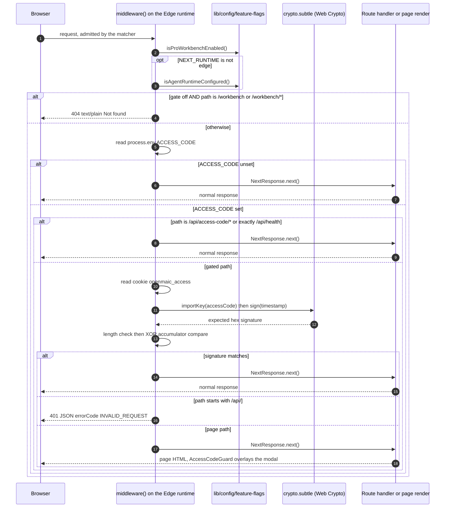
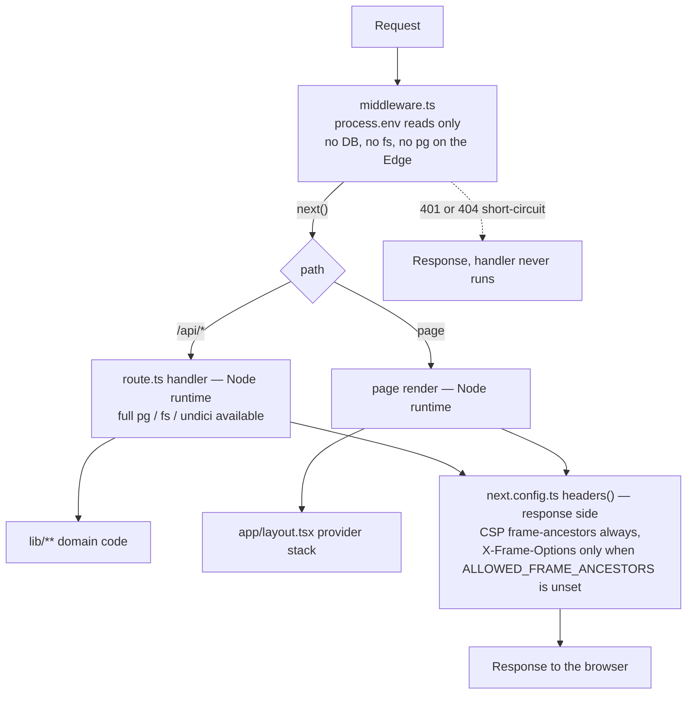
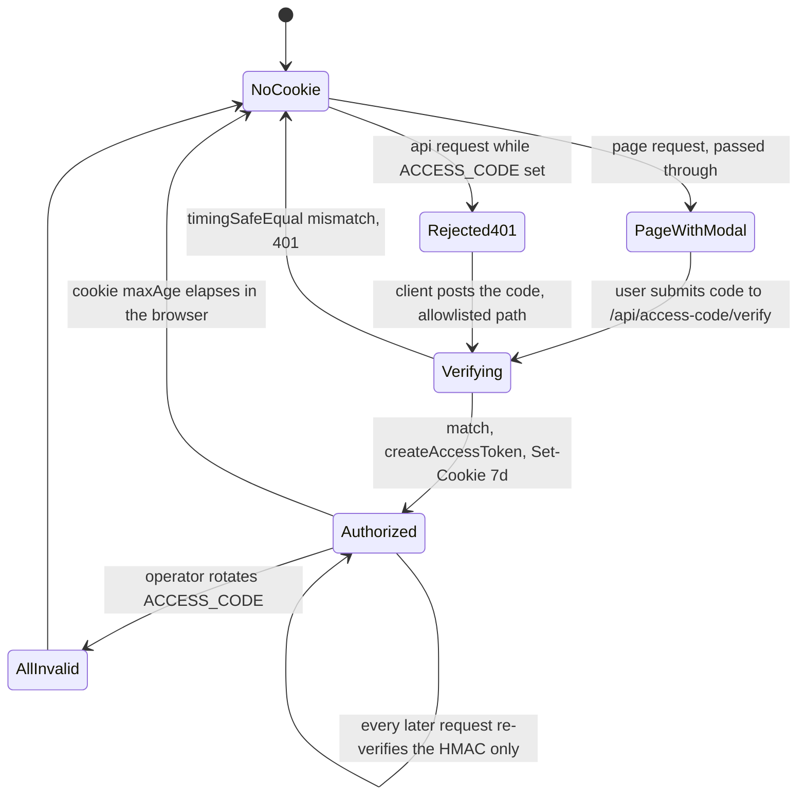

# Middleware

`middleware.ts` is 90 lines and does two unrelated things in a fixed order. It is
the only **deployment-wide** auth gate, and no route handler re-checks it — the
separate `PERSISTENCE_DEV_TOKEN` bearer check in two routes is the one other auth
mechanism ([`./06-api-layer-conventions.md`](./06-api-layer-conventions.md)).
This file states exactly what it enforces, what its matcher covers, where it sits
relative to handlers, and the long list of things it does not do.

**Sources:** `middleware.ts` (read in full), `lib/server/access-token.ts`,
`app/api/access-code/verify/route.ts`, `components/access-code-guard.tsx`,
`lib/workbench/entry-gate.ts`, `lib/config/feature-flags.ts`,
`package.json:119` (`next@16.2.11`). Evidence:
[`../appendix/research/api-surface/01a-modules-shared-helpers.md`](../appendix/research/api-surface/01a-modules-shared-helpers.md),
[`../appendix/research/app-shell-and-routing/01-modules.md`](../appendix/research/app-shell-and-routing/01-modules.md).

## Responsibilities, in source order

| # | Lines | What |
| --- | --- | --- |
| 1 | 53-58 | **`/workbench*` 404 gate.** `canInspectServerRuntime = process.env.NEXT_RUNTIME !== 'edge'`; `workbenchEnabled = isProWorkbenchEnabled() && (!canInspectServerRuntime \|\| isAgentRuntimeConfigured())`. Off + path is `/workbench` or `/workbench/*` → `new NextResponse('Not found', { status: 404 })`. |
| 2 | 60-63 | **`ACCESS_CODE` short-circuit.** Unset → `NextResponse.next()`, nothing else runs. |
| 3 | 66-68 | **Allowlist.** `/api/access-code/` prefix, and the exact path `/api/health`. |
| 4 | 71-74 | **Cookie verification.** `request.cookies.get('openmaic_access')` → `verifyToken(value, accessCode)`. |
| 5 | 77-82 | **API rejection.** Unauthenticated `/api/*` → `401 { success: false, errorCode: 'INVALID_REQUEST', error: 'Access code required' }`. |
| 6 | 85 | **Page pass-through.** Every other unauthenticated request is let through so `AccessCodeGuard` can render a modal client-side. |

Step 1 runs **before** step 2, so a `/workbench` probe answers 404 even on a gated
deployment with no cookie — the workbench's existence is not an access-code
secret, and the 404 is not conditional on authentication.

## Matcher

```ts
// middleware.ts:88-90
export const config = {
  matcher: ['/((?!_next/static|_next/image|favicon.ico|logos/).*)'],
};
```

One negative-lookahead pattern. It runs for every page, every `/api/*` route,
`app/apple-icon.png`, and everything under `public/` **except** the ~30 provider
SVGs in `public/logos/`. That exclusion is an invocation-cost optimisation, not a
security decision: those paths would reach step 6 and pass through anyway.

## Request path through middleware



## Ordering relative to route handlers

Middleware runs **strictly before** any handler or page render. `middleware.ts`
declares no `runtime`, and the code is written for either host: it branches on
`canInspectServerRuntime = process.env.NEXT_RUNTIME !== 'edge'`
(`middleware.ts:53`). Handlers all run on the Node.js server runtime (29 declare
`runtime = 'nodejs'` explicitly, 0 declare `'edge'`; the remaining 40 get Node by
default). Consequences:



The strength of the `/workbench` gate therefore depends on where middleware is
hosted. On the Edge it cannot reach server-only deployment truth
(`middleware.ts:49-52` says so in a comment), `canInspectServerRuntime` is false,
and the gate degrades to the public flag alone — weaker than the one the routes
enforce. A Node-hosted middleware enforces the *same* gate as the routes, because
`workbenchEnabled` then includes `isAgentRuntimeConfigured()`
(`middleware.ts:53-55`). Either way the routes call `isWorkbenchEntryEnabled()`
unconditionally (`lib/workbench/entry-gate.ts:4`), so **the routes, not
middleware, are the authority** — see [`./01-route-map.md`](./01-route-map.md).

## The token

Two independent implementations of one wire format, `timestamp.hexSignature`:

| Side | File | Primitive | Compare |
| --- | --- | --- | --- |
| Edge | `middleware.ts:18-44` (`verifyToken`) | `crypto.subtle.importKey` + `sign` | length check, then XOR accumulator over `charCodeAt` (lines 38-43) |
| Node | `lib/server/access-token.ts:11-25` (`verifyAccessToken`) | `createHmac('sha256', …)` | length check, then `crypto.timingSafeEqual` on hex buffers |

The HMAC **key is the access code itself** (`access-token.ts:6`), so the token is a
self-signed bearer proof: there is no separate server secret. The mint path is
`POST /api/access-code/verify` → `createAccessToken` → `Set-Cookie openmaic_access`
with `httpOnly`, `sameSite: 'lax'`, `path: '/'`, `maxAge: 604800` (7 days),
`secure` in production (`app/api/access-code/verify/route.ts:30-38`).

**Neither verifier reads the timestamp.** The signature proves only that the holder
once possessed the access code. Nothing expires server-side; the cookie's own
7-day `maxAge` is the only bound, and it is client-controlled. Rotating
`ACCESS_CODE` is the only revocation mechanism, and it invalidates every token at
once.

The comment at `middleware.ts:37` is honest that the XOR compare is *"not truly
constant-time in JS, but sufficient here"* — the compared value is a public HMAC
output, not the secret.



## What middleware does NOT do

This list is the point of the file. Every item was checked against the code.

| Not done | Where the gap lands |
| --- | --- |
| **No per-user identity.** `ACCESS_CODE` is one deployment-wide shared password. | Per-request ownership is a *separate*, non-composing mechanism: the `anonymous_id` cookie resolved inside 25 route files — 22 via `withRequestOwnerId`, 3 calling `resolveRequestOwnerId` directly ([`./06-api-layer-conventions.md`](./06-api-layer-conventions.md)). |
| **No token expiry check.** The signed timestamp is never compared to now. | A leaked cookie value is valid until `ACCESS_CODE` changes. |
| **No rate limiting.** There is no counter, no bucket, no store, anywhere in middleware or in `app/api/**`. | Every endpoint — including the LLM-spending ones and `POST /api/access-code/verify` itself — is unthrottled. |
| **No CSRF protection.** `sameSite: 'lax'` on both cookies is the only mitigation. | Cross-site `POST` is blocked by `lax` for top-level navigations only. |
| **No authorization.** It never inspects the resource being requested. | Ownership is enforced by the owner-bound document store inside the handler. |
| **No `/api/*` feature gating.** Step 1 gates `/workbench*` page paths only, not `/api/agent/*`. | 26 route files re-derive `isAgentRuntimeConfigured()` themselves and answer a plain-text 404. |
| **No security headers.** No CSP beyond frame-ancestors, no HSTS, no `X-Content-Type-Options`. | `next.config.ts:38-56` emits `X-Frame-Options: SAMEORIGIN` (only when `ALLOWED_FRAME_ANCESTORS` is unset) and `Content-Security-Policy: frame-ancestors …`. Nothing else. |
| **No request logging or correlation id.** | Observability starts inside handlers via `lib/logger.ts` (35 route files). |
| **No body inspection.** It never reads the request body. | Payload validation is per-handler and hand-written. |

## Test coverage

`git ls-files | grep -i middleware` returns exactly one path: `middleware.ts`
itself. **The only auth gate in the application has no test.** Contrast
`lib/server/register-shutdown-signals.ts` — 15 lines — which has a dedicated
suite (`tests/server/register-shutdown-signals.test.ts`). See
[`../14-code-quality/index.md`](../14-code-quality/index.md).

## Open questions

- Why `/api/health` is allowlisted by *exact path* while `/api/access-code/` is a
  *prefix* is not commented. The effect is that `/api/health/` (trailing slash)
  and any future `/api/health/live` would be gated.
- The interaction between the access-code gate and Server Actions is not addressed
  anywhere in the code. A server-action POST targets a page path, so step 6 passes
  it through unauthenticated — see
  [`./03-server-client-components.md`](./03-server-client-components.md). Whether
  that is understood or simply never came up cannot be determined.
