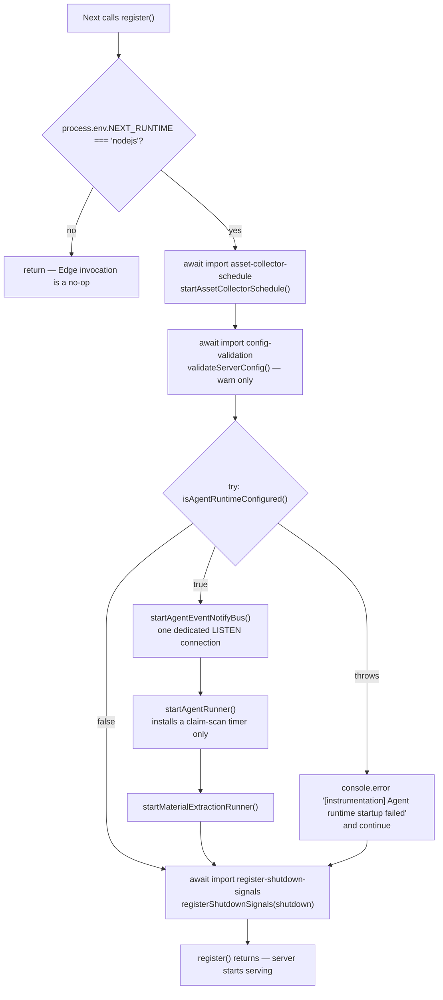
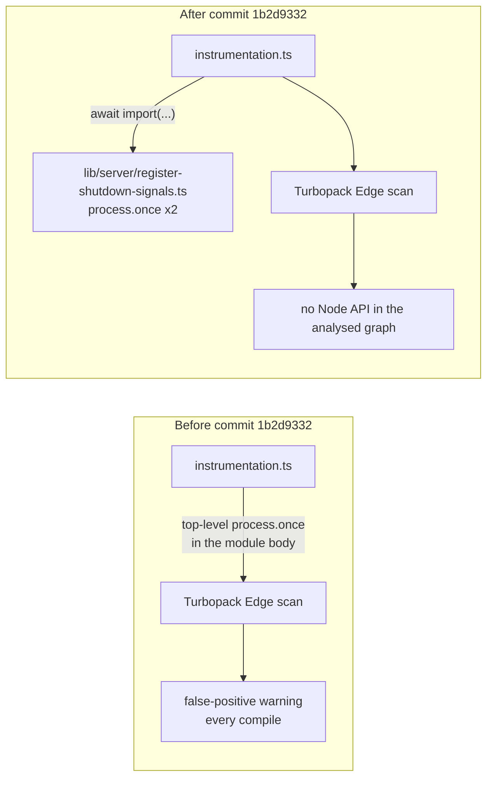
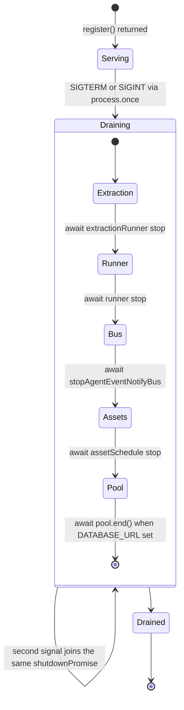
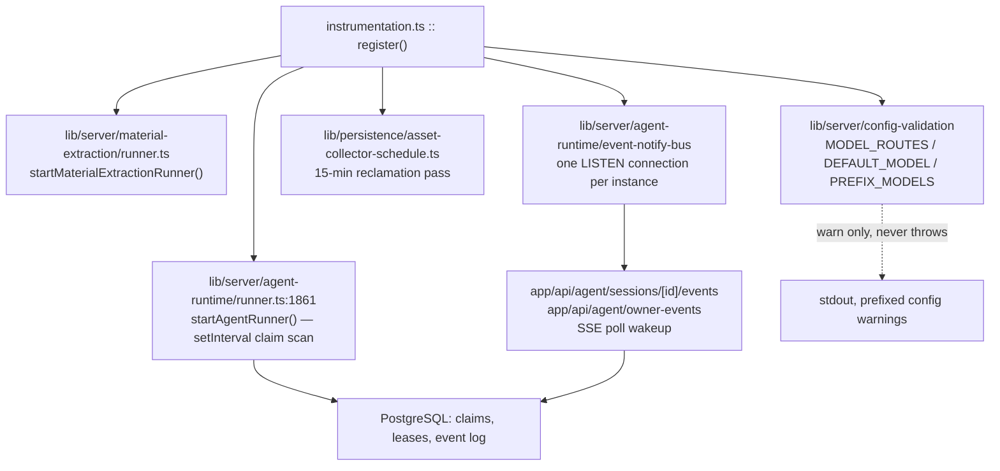

# Instrumentation and Process Lifecycle

`instrumentation.ts` is 102 lines and is **not** OpenTelemetry. It is
process-scoped startup — the only place in the app where a background timer may
legitimately live — plus a memoised, causally-ordered drain. This file covers the
startup schedule, the shutdown order, and the reason two `process.once` calls
live in their own 15-line module.

**Sources:** `instrumentation.ts` (read in full),
`lib/server/register-shutdown-signals.ts`,
`tests/server/register-shutdown-signals.test.ts`,
`lib/persistence/asset-collector-schedule.ts`, `next.config.ts`,
`git show --stat 1b2d9332`. Evidence:
[`../appendix/research/app-shell-and-routing/01-modules.md`](docs/appendix/research/app-shell-and-routing/01-modules.md),
[`02a-interfaces-lifecycle-and-routing.md`](docs/appendix/research/app-shell-and-routing/02a-interfaces-lifecycle-and-routing.md).

## There is no OpenTelemetry

Stated up front because the filename implies otherwise. `git grep -ln
"opentelemetry"` over all tracked `.ts`/`.tsx`/`.json`/`.mjs` returns exactly one
file: `render-service/package-lock.json`, where `@opentelemetry/api` appears as an
optional peer of a transitive dependency. There is **no** first-party
`@opentelemetry/*` import, no `@vercel/otel`, no `OTEL_*` environment variable,
and no tracer, meter, or exporter anywhere in the repository.

Next's `instrumentation.ts` convention is being used for its *timing* guarantee
(called once per server instance, before the first request is served) and nothing
else. Observability in OpenMAIC is `lib/logger.ts` — imported by 35 route files —
and stdout. See [`../15-cross-cutting/index.md`](docs/15-cross-cutting/index.md).

## Why this file exists at all

The docstring at [`instrumentation.ts:1-12`](instrumentation.ts#L1-L12) states the rule directly: a route
module has no once-per-process guarantee — *"it can be instantiated more than once
and gets no shutdown hook"* — so anything periodic started from one is really
started per instantiation. `register()` is therefore the only sanctioned home for
a timer. A second, independent guard exists inside
`startAssetCollectorSchedule()`: the schedule is keyed on a
`Symbol.for('openmaic.asset-collector.schedule')` slot on `globalThis`
([`asset-collector-schedule.ts:75-95`](lib/persistence/asset-collector-schedule.ts#L75-L95)) because dev-time module reloads retain
`globalThis` even though `register()` runs once.

The second constraint is also stated (lines 10-11): `register()` must return before
the server is ready, so nothing in it may block on I/O. Starting a timer does not.
Every store/schema initialisation is left behind a lazy promise.

## Startup



| Step | Line | Call | Failure behaviour |
| --- | --- | --- | --- |
| 1 | 16 | `if (process.env.NEXT_RUNTIME !== 'nodejs') return;` | — |
| 2 | 19-21 | `startAssetCollectorSchedule()` | **unguarded** — a throw escapes `register()` |
| 3 | 28-29 | `validateServerConfig()` | **unguarded**; the function itself is warn-only by design |
| 4 | 37-38 | `isAgentRuntimeConfigured()` | inside the `try` |
| 5 | 42-45 | `startAgentEventNotifyBus()` | inside the `try` |
| 6 | 48-49 | `startAgentRunner()` | inside the `try` |
| 7 | 50-51 | `startMaterialExtractionRunner()` | inside the `try` |
| 8 | 100-101 | `registerShutdownSignals(shutdown)` | unguarded |

Steps 4-7 sit in one `try`/`catch` (lines 36-55) that logs and continues, so a
database that is not up yet degrades the deployment to "no durable agent runtime"
rather than failing boot. Steps 2 and 3 are deliberately outside it.

`startAssetCollectorSchedule()` returns `AssetCollectorSchedule | undefined`
([`asset-collector-schedule.ts:88-90`](lib/persistence/asset-collector-schedule.ts#L88-L90)) — `undefined` when `DATABASE_URL` is empty or
`ASSET_COLLECTION_ENABLED` is `0`/`false`. That is why the drain uses
`assetSchedule?.stop()`.

## Every import is dynamic, and that is the point

All eight imports inside `register()` are `await import(...)`, and the two
runner handle types are referenced as `import('…').Type` type-positions
([`instrumentation.ts:31-34`](instrumentation.ts#L31-L34)) so they never produce a value import (the third
shutdown handle, `stopAgentEventNotifyBus`, is a plain function type — line 35). The reason,
stated at lines 18 and 26-27: **the Edge bundle must never pull in `pg` or the
`fs`/`js-yaml`-backed provider config.** The `NEXT_RUNTIME` guard at line 16
prevents *execution* on the Edge; the dynamic imports prevent *bundling*.

## The node-only shutdown-signal split

`lib/server/register-shutdown-signals.ts` is 15 lines holding one function:

```ts
export function registerShutdownSignals(shutdown: () => Promise<void>): void {
  process.once('SIGTERM', () => void shutdown());
  process.once('SIGINT', () => void shutdown());
}
```

The docstring (lines 4-11) gives the exact reason, and it is a toolchain reason,
not a runtime one: Turbopack's static Edge-runtime scan flags a top-level
`process.once` reference in the Edge-analysed module graph as an unsupported
Node.js API, and **cannot prove** the `NEXT_RUNTIME !== 'nodejs'` guard in
[`instrumentation.ts:16`](instrumentation.ts#L16) makes it unreachable — so it emitted a false-positive
warning on every compile. Moving the call behind a dynamic import at
[`instrumentation.ts:100`](instrumentation.ts#L100) removes the reference from the analysed graph entirely.



`git show --numstat 1b2d9332` is +5/-2 in `instrumentation.ts`, a new 15-line module,
and a new 57-line test. The test
(`tests/server/register-shutdown-signals.test.ts`) pins three properties: exactly
one listener per signal (lines 14-22), a single invocation on repeat emit
(lines 24-40, 42-56), and that the listener count returns to 0 after firing
(line 39) — which is what `process.once` rather than `process.on` buys.

Two independent once-guards exist. `process.once` makes the *listener*
self-removing; the memoised `shutdownPromise ??=` at [`instrumentation.ts:59`](instrumentation.ts#L59) makes
the *drain* idempotent even if both signals arrive.

## Shutdown



Order is deliberate and commented at lines 60-62: **park sessions before any pool
they use is closed**, which preserves the last durable entry-tree checkpoint for
immediate takeover by another instance.

| # | Line | Step | Own try/catch prefix |
| --- | --- | --- | --- |
| 1 | 63 | `extractionRunner?.stop()` | `Material extraction runner drain failed` |
| 2 | 68 | `runner?.stop()` | `Agent runner drain failed` |
| 3 | 73 | `stopAgentEventNotifyBus?.()` | `Agent event notify bus drain failed` |
| 4 | 78 | `assetSchedule?.stop()` | `Asset collector drain failed` |
| 5 | 82-92 | `getServerPersistenceProvider(DATABASE_URL).pool.end()` | `Persistence pool shutdown failed` |

Each step has its own `try`/`catch` with a distinct `console.error` prefix, so one
failing drain never skips the rest — a five-step best-effort teardown rather than a
chain that aborts on the first error. Step 5 is skipped entirely when
`DATABASE_URL` is empty after trimming (line 83).

Note what is absent: there is **no timeout on the overall drain** and no
`server.close()` — `register()` has no handle on the HTTP server. Whether the
process actually exits depends on the container/orchestrator's own grace period,
not on this code. `runner.stop()` and `extractionRunner.stop()` each accept an
optional `{ timeoutMs }`; `instrumentation.ts` passes neither, so each uses its
own default.

## Interaction with the rest of the shell



The notify bus is the load-bearing coupling: it is a single `LISTEN` connection
shared by the runner and every open SSE route through an in-process fanout
registry, so the number of streams does not scale the number of database
connections (comment at [`instrumentation.ts:39-41`](instrumentation.ts#L39-L41)). Detail in
[`../05-agent-runtime/index.md`](docs/05-agent-runtime/index.md) and
[`../11-data-flows/index.md`](docs/11-data-flows/index.md).

[`next.config.ts:5-11`](next.config.ts#L5-L11) matters here too: `outputFileTracingIncludes` pulls
`lib/server/agent-runtime/import-pptx-worker.mjs` and `skills/**` into the
standalone output, because nothing statically imports them and the tracer would
otherwise omit them.

## Open questions

- No config validation runs for the *shell*'s own environment variables.
  `validateServerConfig()` covers model routing only; `ACCESS_CODE`,
  `ALLOWED_FRAME_ANCESTORS`, `PERSISTENCE_DEV_TOKEN` and `ALLOW_LOCAL_NETWORKS`
  are read where used with no boot-time check.
- Whether the absent overall drain timeout is intentional (delegating to the
  orchestrator's `SIGKILL`) is not stated. Each runner has its own internal
  default, so the total is the sum of two unstated numbers.
