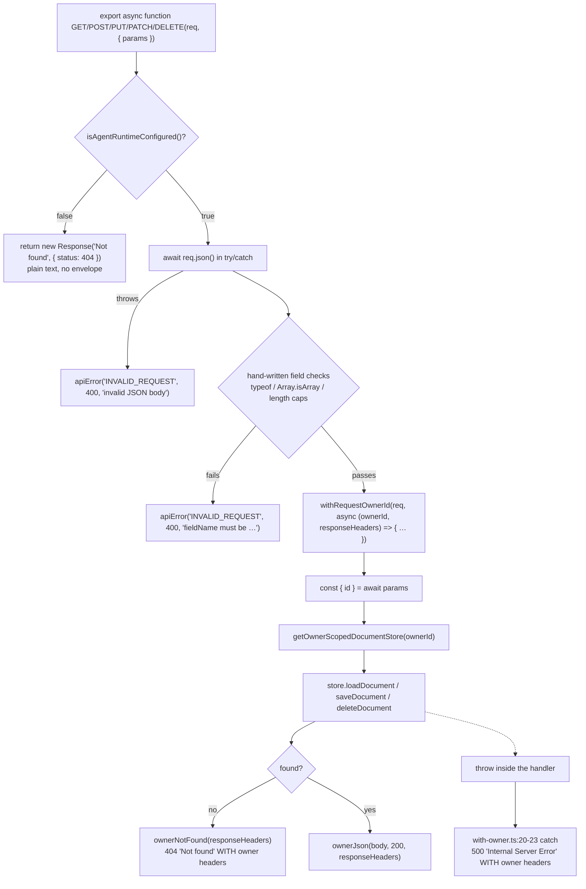
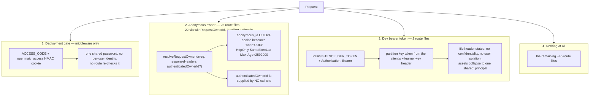
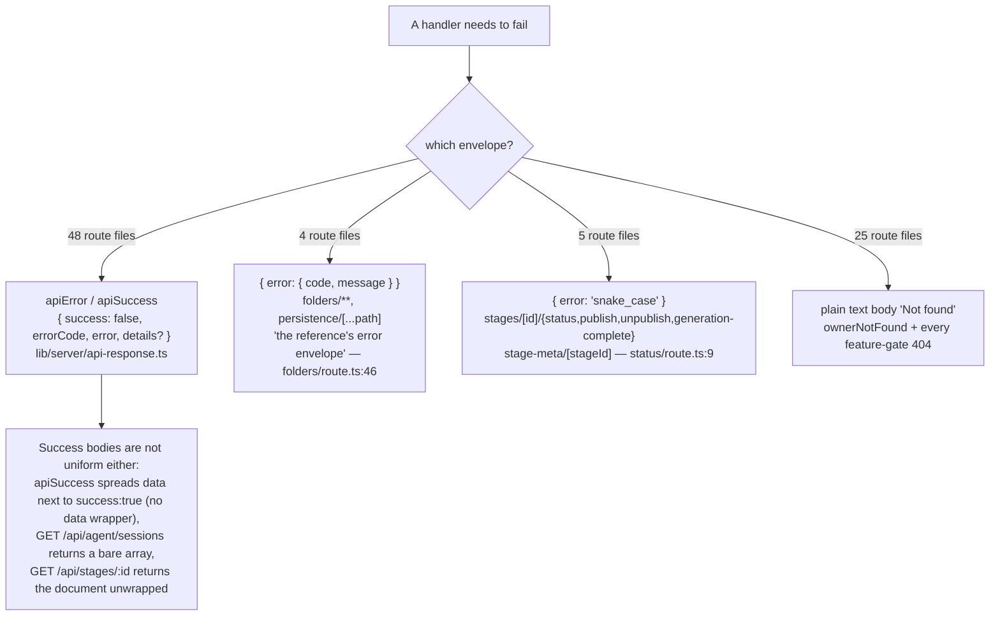
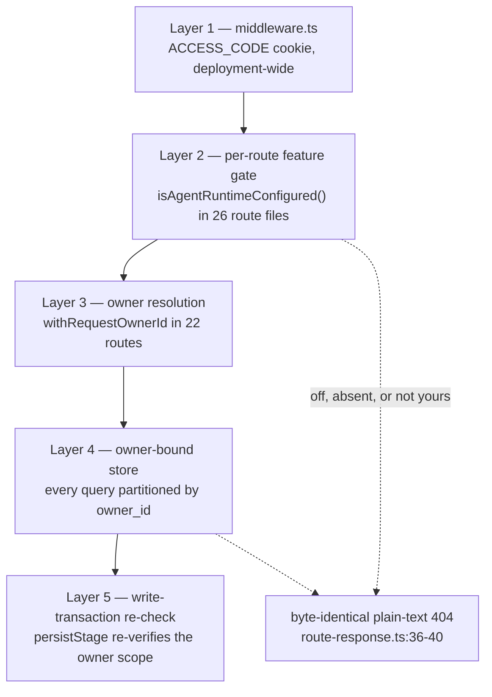

# API Layer Conventions

`app/api/**` is 69 `route.ts` files and 86 exported method handlers. Treated as a
layer rather than as a list of endpoints, it has a recognisable conventional
skeleton, seven shared helpers with measured adoption, four competing error
envelopes, and zero schema validation. This file states the convention and names
every deviation.

The endpoint-by-endpoint reference is [`../12-api-reference/index.md`](../12-api-reference/index.md).

**Sources:** `lib/server/api-response.ts`,
`lib/server/agent-runtime/{with-owner,owner,route-response}.ts`,
`lib/server/{resolve-model,ssrf-guard,proxy-fetch,capped-stream,http-range,llm-error-response}.ts`,
`lib/pbl/v2/api/sse.ts`, `app/api/stages/[id]/route.ts`,
`app/api/stages/[id]/status/route.ts`, `app/api/folders/route.ts`,
`app/api/access-code/verify/route.ts`; adoption counts from `git grep -ln … --
'app/api'`. Evidence:
[`../appendix/research/api-surface/01a-modules-shared-helpers.md`](../appendix/research/api-surface/01a-modules-shared-helpers.md),
[`02a`](../appendix/research/api-surface/02a-interfaces-envelope-identity-model.md),
[`02b`](../appendix/research/api-surface/02b-interfaces-egress-body-sse.md).

## Helper adoption, measured

| Helper | Route files | Purpose |
| --- | --- | --- |
| `lib/server/api-response.ts` | 48 | `apiError` / `apiSuccess` and the 36-entry `API_ERROR_CODES` |
| `lib/logger.ts` | 35 | scoped structured logging |
| `lib/server/agent-runtime/with-owner.ts` | 22 | anonymous-owner resolution + cookie-on-every-response guarantee |
| `lib/server/resolve-model.ts` | 13 | per-request LLM resolution |
| `lib/server/ssrf-guard.ts` | 13 | egress URL validation |
| `lib/server/agent-runtime/route-response.ts` | 10 | owner-header-carrying responses and the no-existence-oracle 404 |
| `lib/pbl/v2/api/sse.ts` (`createSSEResponse`) | 4 | the only typed SSE contract |

Counted with `git grep -ln "<module>" -- 'app/api' | wc -l`.

## The conventional handler skeleton

`app/api/stages/[id]/route.ts` is the reference implementation — four handlers, all
the same shape.

Five properties this skeleton encodes, each verifiable at
`app/api/stages/[id]/route.ts`:

1. **Feature gate first, before anything else** (lines 66, 79, 119, 181). The gate
   404 is a bare `Response`, not `apiError` — no envelope, no owner headers,
   because the caller is not supposed to learn that the family exists.
2. **Body parsing and validation happen *outside* `withRequestOwnerId`**
   (lines 81-98). A malformed body therefore does **not** mint an anonymous cookie.
3. **Ownership is enforced by the store, not by a pre-check.** The docstring
   (lines 3-8) states this: every read and write goes through the owner-bound
   document store, so a foreign id and a missing id answer identically, and a write
   into a foreign document is refused inside the store's transaction.
4. **`await params`** — Next 16 dynamic params are a promise
   (`type Params = { params: Promise<{ id: string }> }`, line 33).
5. **Every response carries the owner headers**, including the catch-all 500
   (`with-owner.ts:20-23`). The comment there gives the reason: a 500 that dropped
   the minted cookie would silently make the client's retry a *different* anonymous
   owner.

## Identity: three mechanisms that do not compose

The consequence of `authenticatedOwnerId` never being supplied is concrete:
every owner id in a running deployment begins with `anon:`, so
`app/api/stages/[id]/publish` and `.../unpublish` — which reject
`ownerId.startsWith('anon:')` with `401 { error: 'login_required' }` — are
**unreachable in the current build**.

Note the one place identity is resolved *outside* a route: the single Server
Action, `lib/workbench/workspace-actions.ts`, re-reads the same cookie with the
same UUID-v4 guard because it has no `Request` to pass
([`./03-server-client-components.md`](./03-server-client-components.md)).

## Validation conventions

**`zod` is a declared dependency (`package.json:165`, `^4.3.5`) and is imported by
zero route files.** `git grep -ln zod -- 'app/api'` returns nothing; six modules
under `lib/` and `packages/` use it (notably
`lib/video-export/ir.ts:373`, where `VideoTimelineSchema` is the authored
contract). Every HTTP request body in the app is validated by hand.

The house pattern, from `app/api/stages/[id]/route.ts:118-144`:

| Step | Technique |
| --- | --- |
| declare the shape | a local `interface` or an inline `body as { … }` cast — declaration only, never enforced |
| parse | `await req.json()` in `try`/`catch` → `apiError('INVALID_REQUEST', 400, 'invalid JSON body')` |
| check | `typeof x !== 'string'`, `!Array.isArray(x)`, `x === null`, `.trim().length === 0` |
| cap | a named constant, e.g. `STAGE_NAME_MAX_LENGTH` (120), `MAX_SESSION_TEXT_LENGTH` (100 000), `MAX_BATCH_SCENE_IDS` (200) |
| normalise | `.trim()` before use |
| reject | `apiError('INVALID_REQUEST', 400, '<field> must be …')` naming the field |

This is consistent, readable, and untyped at the boundary: a body that passes the
hand-checks is then `as`-cast to the declared interface, so any field the handler
did not explicitly check is trusted. The deeper defence is that the *store*
re-validates: the comment at `app/api/stages/[id]/route.ts:166-167` notes the full
payload is validated inside `@openmaic/storage` before anything is persisted, and
those failures map to 400 via `mapSaveError` (lines 46-62).

## Error envelopes: four shapes

Two of the three JSON shapes are documented as deliberate ports of a reference
implementation: `app/api/folders/route.ts:46` (*"The reference's error envelope:
`{ error: { code, message } }`"*) and `app/api/stages/[id]/status/route.ts:9`
(*"Convention: snake_case error codes"*). The plain-text 404 is the deliberate
no-existence-oracle posture stated at
`lib/server/agent-runtime/route-response.ts:36-40`. The net effect is still that a
generic client cannot branch on one error shape.

`apiSuccess<T extends Record<string, unknown>>(data, status = 200)` spreads `data`
next to `success: true` (`api-response.ts:69`), so there is no `data` wrapper and
a payload field named `success` or `error` collides with the envelope by design.

## Streaming conventions

Twelve routes stream. Two of the twelve stream bytes (`classroom-media` with HTTP
Range support via `lib/server/http-range.ts`, and the MP4 download); the other ten
are SSE, split across two mechanisms:

| Mechanism | Routes | Frame format | Named events | Heartbeat |
| --- | --- | --- | --- | --- |
| `createSSEResponse` (`lib/pbl/v2/api/sse.ts:211`) | `pbl/v2/{instructor,open-task,evaluate,simulator}` | `event: <type>` + `data: <json>` (`sse.ts:187`) | 7 typed `PBLSSEEvent` kinds | `: keepalive` / 15 s default (`sse.ts:192,215`) |
| hand-rolled stream — `TransformStream` for `chat` and `chat/pi`, `ReadableStream` for `generate/scene-outlines-stream` | `chat`, `chat/pi`, `generate/scene-outlines-stream` | `data: <json>` only | none — the discriminator is inside the JSON | `:heartbeat` / 15 s |
| hand-rolled `ReadableStream` | `agent/sessions/[id]/events`, `agent/owner-events`, `stages/[id]/freshness` | `id:` + `event:` + `data:` | `caught_up`, `resync_required`, `owner_moved`, `stage_freshness` | `: ping` / 25 s |

Only the last group is consumable by a native `EventSource` with typed listeners
and `Last-Event-ID` replay. `createSSEResponse` also sets
`X-Accel-Buffering: no`; the heartbeat comment at `sse.ts:190-191` names the
reason — Vercel and nginx drop idle connections around 30-60 s.

`PBLSSEEvent` (`sse.ts:168-178`) is the **only** formally typed streaming contract
in the surface. Generator semantics are documented at `sse.ts:202-209`: an `error`
event does not stop the generator, a final `done` event is mandatory, and a throw
emits `error` + `done` before closing.

## Auth gating, layer by layer

Layers 2-5 are genuinely strong for the agent-runtime families. Outside them there
is nothing: `generate/**`, `chat/**`, `pbl/v2/**`, `verify-*`, `proxy-media`,
`web-search`, `export-video/**` and `extract-document` are reachable by anyone who
passes the single deployment-wide access-code gate — or by anyone at all when
`ACCESS_CODE` is unset, which is the default.

**There is no rate limiting anywhere.** `git grep -ni "rate.limit" -- app/api`
matches exactly three lines, and all three are *propagation* of an upstream 429
(`app/api/generate/tts/route.ts:168` returns `apiError('RATE_LIMITED', 429, …)`;
`app/api/verify-model/route.ts:65` maps a provider message;
`app/api/export-video/render/route.ts:92` maps a 429 from the render service onto
`'RATE_LIMITED'`). No counter, bucket, or store exists. The LLM-spending endpoints and `POST /api/access-code/verify` are
equally unthrottled.

## Where routes deviate from the convention

| Deviation | Routes | Detail |
| --- | --- | --- |
| No shared envelope | `folders/**`, `persistence/[...path]` | `{ error: { code, message } }` — a deliberate reference port |
| No shared envelope | `stages/[id]/{status,publish,unpublish,generation-complete}`, `stage-meta/[stageId]` | `{ error: 'snake_case' }` — deliberate, documented |
| Owner resolved directly, not via `withRequestOwnerId` | `agent/owner-events`, `agent/sessions/[id]/events`, `stages/[id]/freshness` | they build streaming responses, so the wrapper's return type does not fit |
| Bare `fetch` instead of `proxyFetch` | `proxy-media`, every `verify-*` | `proxyFetch` is what reads `https_proxy`/`no_proxy` (`proxy-fetch.ts:30-45`); its 14 callers are `export-video/**` (3 routes), `lib/server/render-service.ts`, `lib/server/agent-runtime/scene-preview.ts` and the nine `lib/web-search/*` providers |
| SSRF strictness differs between siblings | `proxy-media` re-validates every redirect hop; others validate once | `validateUrlForSSRF` resolves DNS itself and `fetch` resolves again — a check-then-fetch gap |
| Global SSRF off-switch | all 16 `validateUrlForSSRF` callers | `ALLOW_LOCAL_NETWORKS=true` short-circuits `validateUrlForSSRF` to `null` (`ssrf-guard.ts:265-268`) for every one at once — the 13 route files plus `agent-runtime/generate-image.ts`, `agent-runtime/generate-video.ts` and `resolve-model.ts` |
| SSRF on a client base URL is production-only | `resolve-model.ts:105-110` | a deliberate dev affordance |
| Error inside a 200 | `generate/scene-outlines-stream` | exhausted retries emit `{ type: 'error' }` inside an already-open 200 stream |
| Unconditional success | `access-code/verify` | returns `apiSuccess({ valid: true })` when `ACCESS_CODE` is unset (line 8-10) |
| Not the HTTP surface at all | `lib/api/*` | despite the directory name, an in-process stage-store toolkit for agents; imported by no route file |

## Segment config and method distribution

86 handlers by method, counted over the 69 route files: **31 GET, 44 POST, 2 PUT,
4 PATCH, 5 DELETE**. 81 are `export async function <METHOD>`; the remaining 5 are
`export const <METHOD> = (request) => handlePersistenceRequest(request)` at
`app/api/persistence/[...path]/route.ts:325-329`, the only route that mounts a
foreign handler contract. No route exports `HEAD` or `OPTIONS`.

| Declaration | Count | Notes |
| --- | --- | --- |
| `runtime = 'nodejs'` | 29 | explicit |
| nothing declared | 40 | Next uses the Node.js server runtime for App Router handlers by default |
| `runtime = 'edge'` | **0** | only `middleware.ts` runs on the Edge |
| `maxDuration` | 24 | plus a 300 s API default in `vercel.json` |
| `dynamic = 'force-dynamic'` | 5 | `export-video/capability`, `export-video/render/[jobId]`, `.../download`, `generate-classroom/[jobId]`, `stage-meta/[stageId]` |

## Open questions

- Why `zod` is a dependency while every route validates by hand is not recorded.
  The hand-written checks are consistent enough to look like policy rather than
  drift, but no comment or CONTRIBUTING rule states it.
- Whether the two "reference implementation" envelopes are meant to converge on
  `apiError` eventually, or are frozen wire contracts, is not stated in either
  file.
