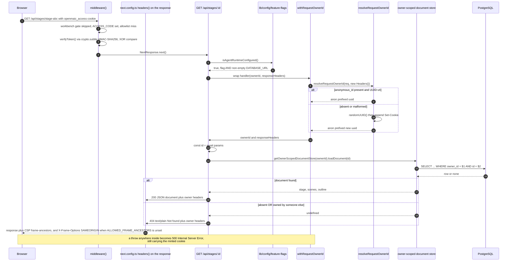
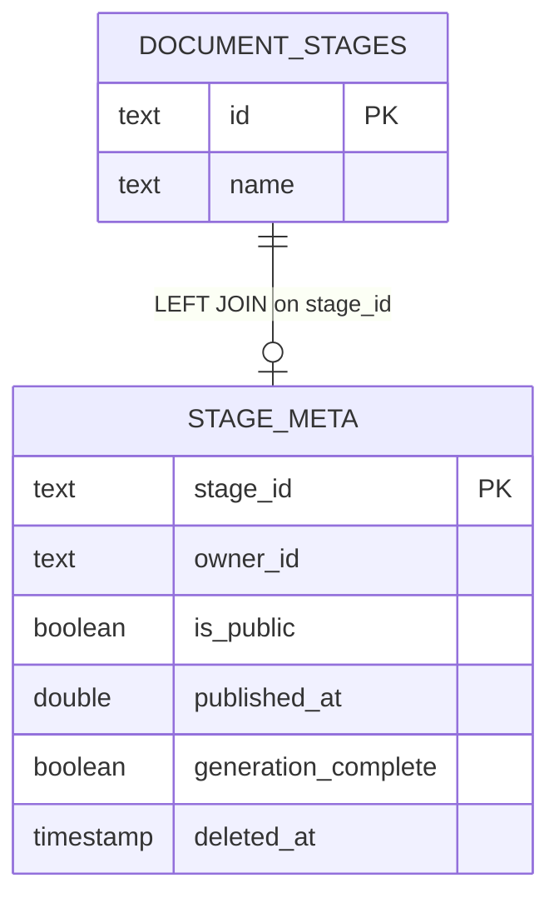
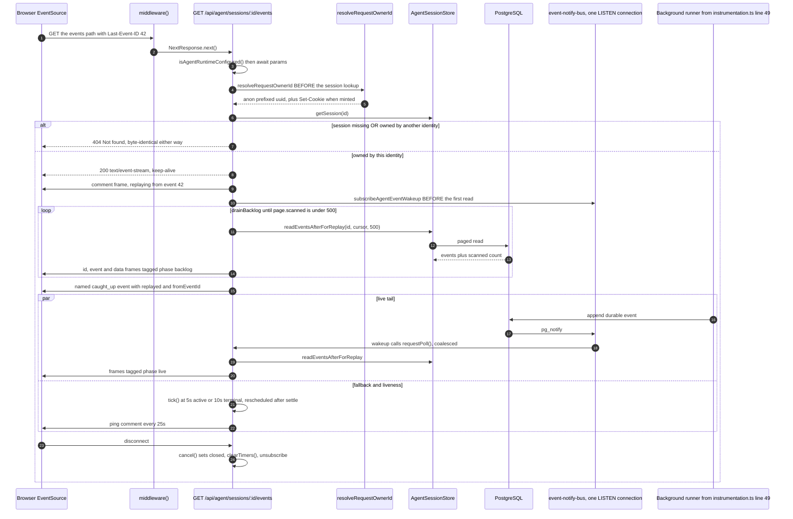
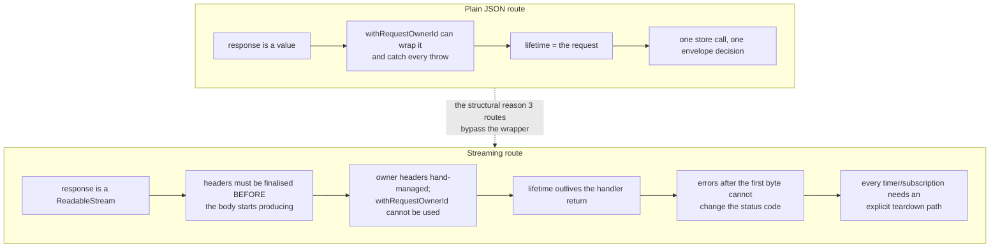

# Request Lifecycle, End to End

Two requests traced hop by hop, naming the real function at every step: a plain
JSON route (`GET /api/stages/[id]`) and a streaming route
(`GET /api/agent/sessions/[id]/events`). Both are on a deployment with
`ACCESS_CODE` set and the agent runtime configured, which is the maximal path.

**Sources:** `middleware.ts`, `next.config.ts`,
`lib/server/agent-runtime/{owner,with-owner,route-response,event-notify-bus}.ts`,
`lib/config/feature-flags.ts`, `app/api/stages/[id]/route.ts`,
`app/api/stage-meta/[stageId]/route.ts`, `lib/server/stage-access.ts`,
`app/api/agent/sessions/[id]/events/route.ts` (read in full). Evidence:
[`../appendix/research/api-surface/03-flows.md`](docs/appendix/research/api-surface/03-flows.md).

## Flow A — a plain JSON route

`GET /api/stages/stage-abc`, issued by the workbench canvas to load a course
document.

| # | Hop | Where |
| --- | --- | --- |
| 1 | matcher admits the path (not `_next/static`, `_next/image`, `favicon.ico`, `logos/`) | [`middleware.ts:89`](middleware.ts#L89) |
| 2 | `/workbench*` gate skipped — path prefix does not match | [`middleware.ts:56`](middleware.ts#L56) |
| 3 | `ACCESS_CODE` set, so no early `next()` | [`middleware.ts:60-63`](middleware.ts#L60-L63) |
| 4 | allowlist miss (`/api/access-code/*`, `/api/health`) | [`middleware.ts:66`](middleware.ts#L66) |
| 5 | `verifyToken(cookie, accessCode)` via `crypto.subtle` HMAC-SHA256 → true → `NextResponse.next()` | [`middleware.ts:71-74`](middleware.ts#L71-L74) |
| 6 | handler entry; `isAgentRuntimeConfigured()` false would return plain `404 'Not found'` | [`app/api/stages/[id]/route.ts:66`](app/api/stages/[id]/route.ts#L66) |
| 7 | gate = `OPENMAIC_AGENT_RUNTIME_ENABLED` truthy **and** non-empty `DATABASE_URL` | [`lib/config/feature-flags.ts:23`](lib/config/feature-flags.ts#L23) |
| 8 | `withRequestOwnerId(req, handler)` allocates a fresh `Headers` | [`with-owner.ts:16`](lib/server/agent-runtime/with-owner.ts#L16) |
| 9 | `resolveRequestOwnerId(req, responseHeaders)` — no `authenticatedOwnerId` is ever passed | [`owner.ts:52-57`](lib/server/agent-runtime/owner.ts#L52-L57) |
| 10 | reads `anonymous_id` from the raw `cookie` header, tests it against `UUID_V4`, returns `anon:<uuid>`; on miss mints `randomUUID()` and appends `Set-Cookie … HttpOnly; SameSite=Lax; Max-Age=2592000` (+`Secure` in production) | [`owner.ts:59-64`](lib/server/agent-runtime/owner.ts#L59-L64), [`:22-28`](lib/server/agent-runtime/owner.ts#L22-L28) |
| 11 | `const { id } = await params` — Next 16 dynamic params are a promise | [`route.ts:69`](app/api/stages/[id]/route.ts#L69) |
| 12 | `getOwnerScopedDocumentStore(ownerId)` binds a store partitioned by `owner_id` | [`route.ts:70`](app/api/stages/[id]/route.ts#L70) |
| 13 | `store.loadDocument(id)` — a foreign document reads as absent, not as forbidden | [`route.ts:71`](app/api/stages/[id]/route.ts#L71) |
| 14 | absent → `ownerNotFound(responseHeaders)`: plain-text `404 'Not found'` **with** the owner headers | [`route-response.ts:41-43`](lib/server/agent-runtime/route-response.ts#L41-L43) |
| 15 | present → `ownerJson(document, 200, responseHeaders)` — the whole `{ stage, scenes, outline }`, unwrapped | [`route-response.ts:21-23`](lib/server/agent-runtime/route-response.ts#L21-L23) |
| 16 | any throw inside the handler → `500 'Internal Server Error'` still carrying the cookie | [`with-owner.ts:20-23`](lib/server/agent-runtime/with-owner.ts#L20-L23) |
| 17 | on the way **out**, `next.config.ts headers()` adds `Content-Security-Policy: frame-ancestors …` to the response, plus `X-Frame-Options: SAMEORIGIN` only when `ALLOWED_FRAME_ANCESTORS` is unset | [`next.config.ts:38-56`](next.config.ts#L38-L56) |

### The parallel tenancy read

The client issues a second, independent request for the ownership sidecar:
`GET /api/stage-meta/[stageId]` → `resolveStageAccess(stageId)` →
`readStageAccessIncludingDeleted`, which `LEFT JOIN`s `stage_meta` against
`document_stages` off a synthetic single-row key so a missing stage and a missing
meta row are both representable ([`lib/server/stage-access.ts:42-52`](lib/server/stage-access.ts#L42-L52)). The resolver
returns `null` unless **both** `meta_owner_id` and `document_name` are present, and
additionally returns `null` for a tombstoned row. The route derives `isOwner` by
comparing `access.ownerId === ownerId` and **never emits `ownerId`**.

[`app/classroom/[id]/page.tsx:78-82`](app/classroom/[id]/page.tsx#L78-L82) documents the ordering rule for this pair: the
sidecar fetch is fired **after** the document load so the ownership answer wins,
and its three outcomes are handled distinctly — `'found'` sets viewer access,
`'unavailable'` records an outage without concluding "stranger's course",
`'absent'` keeps the local editable default.

## Flow B — a streaming route

`GET /api/agent/sessions/<id>/events`, the reference SSE implementation. Hops 1-5
are identical to Flow A; the differences start at the handler.

| # | Hop | Where |
| --- | --- | --- |
| 7 | `isAgentRuntimeConfigured()` gate → plain `404 'Not found'` | [`events/route.ts:63-65`](app/api/agent/sessions/[id]/events/route.ts#L63-L65) |
| 8 | `await params`, then a **hand-allocated** `new Headers()` — `withRequestOwnerId` is not used because its return type does not fit a stream | [`events/route.ts:66-67`](app/api/agent/sessions/[id]/events/route.ts#L66-L67) |
| 9 | `resolveRequestOwnerId(req, responseHeaders)` runs **before** the session lookup, on purpose (comment lines 68-76) | [`events/route.ts:77`](app/api/agent/sessions/[id]/events/route.ts#L77) |
| 10 | `store.getSession(id)` → missing **and** `meta.ownerId !== ownerId` both return byte-identical `404 'Not found'` with the same cookie headers | [`events/route.ts:78-85`](app/api/agent/sessions/[id]/events/route.ts#L78-L85) |
| 11 | cursor = `Last-Event-ID` header, else `?lastEventId`, else 0 | [`events/route.ts:88-89`](app/api/agent/sessions/[id]/events/route.ts#L88-L89) |
| 12 | `new ReadableStream({ start, cancel })`; `write()` flips `closed` and clears timers if `enqueue` throws, because a broken socket does not reliably invoke `cancel()` in every runtime | [`events/route.ts:109-134`](app/api/agent/sessions/[id]/events/route.ts#L109-L134) |
| 13 | first frame is a comment: `: replaying from event <n>` | [`events/route.ts:274`](app/api/agent/sessions/[id]/events/route.ts#L274) |
| 14 | heartbeat `: ping` every `HEARTBEAT_INTERVAL_MS` = 25 000 ms | [`events/route.ts:275-278`](app/api/agent/sessions/[id]/events/route.ts#L275-L278) |
| 15 | `subscribeAgentEventWakeup({ kind: 'session', sessionId: id }, …)` is registered **before** the first read so a commit racing backlog exhaustion cannot fall into the 5 s fallback window | [`events/route.ts:279-284`](app/api/agent/sessions/[id]/events/route.ts#L279-L284) |
| 16 | `drainBacklog()` pages `store.readEventsAfterForReplay(id, cursor, 500)`; exhaustion is judged on raw `page.scanned`, **not** the compacted length | [`events/route.ts:189-208`](app/api/agent/sessions/[id]/events/route.ts#L189-L208) |
| 17 | `writePage` emits `id:` + `event:` + `data:` with `phase: 'backlog' \| 'live'` | [`events/route.ts:157-187`](app/api/agent/sessions/[id]/events/route.ts#L157-L187) |
| 18 | `markCaughtUp()` emits a named `caught_up` event; three consecutive read failures emit `caught_up { degraded: true }` | [`events/route.ts:140-155`](app/api/agent/sessions/[id]/events/route.ts#L140-L155), [`:197`](app/api/agent/sessions/[id]/events/route.ts#L197) |
| 19 | `requestPoll()` serialises: an in-flight poll sets `repollRequested` and the caller awaits the same promise | [`events/route.ts:234-253`](app/api/agent/sessions/[id]/events/route.ts#L234-L253) |
| 20 | `tick()` reschedules only after the previous poll **settles**; interval 5 000 ms, 10 000 ms once terminal | [`events/route.ts:255-272`](app/api/agent/sessions/[id]/events/route.ts#L255-L272) |
| 21 | response headers: `text/event-stream; charset=utf-8`, `no-cache, no-transform`, `keep-alive` | [`events/route.ts:296-299`](app/api/agent/sessions/[id]/events/route.ts#L296-L299) |
| 22 | client disconnect → `cancel()` sets `closed` and clears both timers plus the wakeup subscription | [`events/route.ts:290-293`](app/api/agent/sessions/[id]/events/route.ts#L290-L293), [`:100-107`](app/api/agent/sessions/[id]/events/route.ts#L100-L107) |

## The two shapes contrasted

Three consequences that fall out of the stream shape and are visible in the code:

1. **The 401/404/500 status envelope is only available before the first byte.**
   `generate/scene-outlines-stream` therefore emits `{ type: 'error' }` *inside* an
   already-open 200 stream when its retries are exhausted.
2. **`withRequestOwnerId` is structurally unusable**, so `agent/owner-events`,
   `agent/sessions/[id]/events` and `stages/[id]/freshness` call
   `resolveRequestOwnerId` directly and hand-manage the `Headers` object that
   later becomes the response headers.
3. **Teardown must be explicit and paired.** `events/route.ts` clears the poll
   timer, the heartbeat interval and the wakeup subscription in one `clearTimers()`
   called from both `cancel()` and the `write()` failure path — because a broken
   socket is not guaranteed to invoke `cancel()` (comment lines 128-129).

Neither flow touches `instrumentation.ts` directly, but Flow B depends on it
entirely: the notify bus that supplies its low-latency wakeups and the runner that
appends the events it streams are both started once in `register()`. Poll-only
operation is the documented correctness fallback for notifications lost during a
disconnect ([`events/route.ts:49-51`](app/api/agent/sessions/[id]/events/route.ts#L49-L51)). See
[`./05-instrumentation.md`](docs/03-app-and-api/05-instrumentation.md) and
[`../11-data-flows/index.md`](docs/11-data-flows/index.md).

## Open questions

- No request-scoped correlation id is generated anywhere, so a single request
  cannot be followed across `middleware.ts` → handler → `lib` domain → store in
  the logs. Whether an upstream proxy supplies one is deployment-specific and not
  read by any code here.
- `maxDuration = 300` on [`events/route.ts:47`](app/api/agent/sessions/[id]/events/route.ts#L47) is annotated as useful to Vercel's
  build adapter and unenforced by self-hosted `next start`. What actually bounds a
  stream in the Docker deployment (an intermediary idle timeout, presumably) is not
  documented; the 25 s heartbeat is the mitigation, not the bound.
