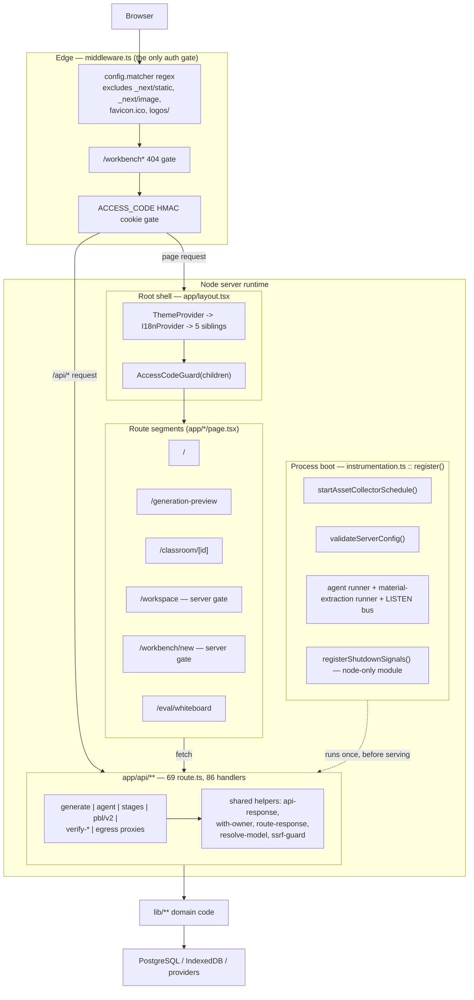

# Component View: App Shell, Routing, API Layer (C4 L3)

This topic decomposes the single Next.js container — the `openmaic` app — into
its shell components: the route tree, the root layout's provider stack, the RSC
boundary, the edge middleware, the process-lifecycle hook, and the HTTP handler
layer treated as a layer rather than as 69 individual endpoints.

## Who this is for

A staff engineer who needs to know *where a request goes* and *what runs where*
before changing anything. It answers: which surfaces are server components and
why only two are; what the single auth gate is and what it deliberately does not
cover; which envelope a handler is expected to return and which families broke
that expectation; and where periodic work is allowed to start.

It does **not** enumerate endpoints — that is
[`../12-api-reference/index.md`](../12-api-reference/index.md). It does not cover
what the handlers delegate *to*; those are the subsystem topics
([`../05-agent-runtime/index.md`](../05-agent-runtime/index.md),
[`../06-generation-pipeline/index.md`](../06-generation-pipeline/index.md),
[`../10-persistence-and-state/index.md`](../10-persistence-and-state/index.md)).

## Measured shape

| Thing | Count | How measured |
| --- | --- | --- |
| user-facing route segments (`page.tsx` outside `app/api`) | 6 | `git ls-files app` filtered to drop `app/api/` |
| `layout.tsx` files | 2 | `app/layout.tsx`, `app/generation-preview/layout.tsx` |
| server components among the 8 route/layout components | 4 | two layouts + `/workspace` + `/workbench/new` |
| `app/api/**/route.ts` files | 69 | `git ls-files 'app/api/**/route.ts'` |
| routes declaring `runtime = 'nodejs'` | 29 | `git grep -l "runtime = 'nodejs'" -- app/api` |
| routes declaring `runtime = 'edge'` | 0 | `git grep -ln "runtime = 'edge'" -- app/api` |
| routes declaring `maxDuration` | 24 | `git grep -ln maxDuration -- app/api` |
| routes declaring `dynamic` | 5 | `git grep -n "export const dynamic" -- app/api` |
| middleware / instrumentation / root layout | 90 / 102 / 63 lines | `wc -l` |

The shell is small: `middleware.ts` (90) + `instrumentation.ts` (102) +
`app/layout.tsx` (63) + `next.config.ts` (59) +
`lib/config/feature-flags.ts` (128) + `lib/workbench/entry-gate.ts` (6) is the
entire routing/lifecycle/config core. The mass is in the product pages hanging
off it — `app/page.tsx` alone is 1896 lines.

## Topic overview

## Sources

Read directly: `middleware.ts`, `instrumentation.ts`,
`lib/server/register-shutdown-signals.ts`, `app/layout.tsx`, `next.config.ts`,
`lib/workbench/entry-gate.ts`, `app/workspace/page.tsx`,
`app/workbench/new/page.tsx`, `app/generation-preview/layout.tsx`,
`app/classroom/[id]/page.tsx`, `app/page.tsx`, `app/eval/whiteboard/page.tsx`,
`lib/server/api-response.ts`, `lib/server/agent-runtime/with-owner.ts`,
`lib/server/agent-runtime/route-response.ts`, `app/api/stages/[id]/route.ts`.

Evidence packs:
[`../appendix/research/app-shell-and-routing/`](../appendix/research/app-shell-and-routing/00-overview.md)
and [`../appendix/research/api-surface/`](../appendix/research/api-surface/00-overview.md),
with cross-checks against
[`../appendix/research/persistence-storage-state/`](../appendix/research/persistence-storage-state/00-overview.md).

## Sections

| File | Lines | Diagrams | What it covers |
| --- | --- | --- | --- |
| [`01-route-map.md`](./01-route-map.md) | 177 | 3 | Every user-facing route: component kind, rendering mode, subsystem driven, absent App Router convention files, the three `sessionStorage` handoffs, and the workbench gate derived in three places. |
| [`02-layout-and-providers.md`](./02-layout-and-providers.md) | 192 | 3 | `app/layout.tsx`'s seven-child provider stack in order, what each provides, who consumes it, the three orderings that are load-bearing, and the two-mechanism font strategy. |
| [`03-server-client-components.md`](./03-server-client-components.md) | 190 | 4 | Where the RSC boundary sits per surface, what crosses it (only `ReactNode` and one `string`), and the single Server Action in the repository. |
| [`04-middleware.md`](./04-middleware.md) | 199 | 3 | `middleware.ts`: the two gates in fixed order, the matcher, the twin HMAC verifiers, ordering relative to handlers, and the nine things it does not do. |
| [`05-instrumentation.md`](./05-instrumentation.md) | 224 | 4 | `instrumentation.ts` as process-scoped startup — **not** OpenTelemetry — the five-step drain, and the node-only shutdown-signal split with its Turbopack reason. |
| [`06-api-layer-conventions.md`](./06-api-layer-conventions.md) | 280 | 4 | The API layer as a layer: measured helper adoption, the conventional handler skeleton, four error envelopes, hand-written validation, streaming conventions, and ten named deviations. |
| [`07-request-lifecycle.md`](./07-request-lifecycle.md) | 239 | 4 | Two traced requests end to end — a plain JSON route and a streaming SSE route — browser through middleware, handler, `lib` domain, store, response. |

26 Mermaid diagrams across the eight files, including this page.

## Reading order

`01` → `02` → `03` is the render path. `04` → `05` is the process edge. `06` →
`07` is the HTTP path. Start at `04` if you are debugging a 401 or a 404, at
`06` if you are adding a handler, at `05` if a background job is not running.

## The five facts worth carrying out of this topic

1. **One auth gate, in `middleware.ts`, and no route re-checks it.** It is a
   deployment-wide shared password with no expiry check and no per-user identity.
2. **Two of the six page components are server components** — and both segment
   layouts are too, so 4 of the 8 route/layout components. Both pages are gated, both
   converting the gate answer into `redirect`/`notFound` before render. Nothing
   else crosses the RSC boundary but `children`.
3. **`instrumentation.ts` is startup, not telemetry.** There is no OpenTelemetry
   in the repository. It is also the only sanctioned home for a timer.
4. **`zod` is installed and unused by all 69 route files.** Every HTTP body is
   validated by hand; the real second line of defence is the store's own
   validation.
5. **There is no rate limiting anywhere in `app/api/**`.**

## Related

- [`../12-api-reference/index.md`](../12-api-reference/index.md) — the same surface
  endpoint by endpoint: all 69 route files and all 86 handlers.
- [`../18-decisions/02-no-schema-layer-at-the-http-edge.md`](../18-decisions/02-no-schema-layer-at-the-http-edge.md)
  — why point 4 above is a decision rather than an oversight, and what it costs.
- [`../15-cross-cutting/05-auth-and-access-control.md`](../15-cross-cutting/05-auth-and-access-control.md)
  — the one middleware gate in its wider security context.
- [`../glossary.md`](../glossary.md) — the canonical vocabulary.
- [`../README.md`](../README.md) — the documentation set root.
