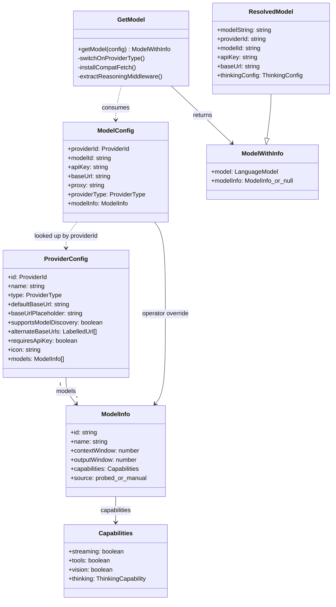
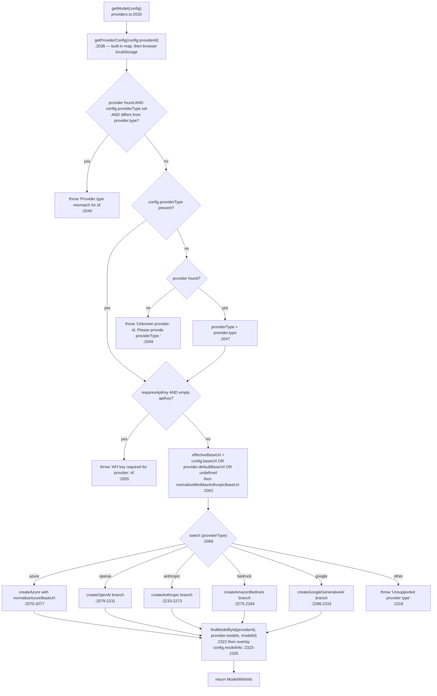

# Provider Registry and Adapter Construction

Every provider OpenMAIC can talk to, the transport it uses, and the exact ordered decision
procedure `getModel()` follows to turn a `(providerId, modelId, apiKey, baseUrl, proxy)` tuple
into a Vercel AI SDK `LanguageModel`. This is the "how do we speak to a vendor" half of the
layer; "which vendor" is [./03-stage-routing.md](docs/04-ai-provider-layer/03-stage-routing.md).

**Sources:** `lib/ai/providers.ts`, `lib/types/provider.ts`, `lib/ai/azure.ts`,
`lib/ai/reasoning-sse.ts`, `lib/ai/model-aliases.ts`, `package.json`;
[../appendix/research/ai-provider-layer/01a-modules-catalog.md](docs/appendix/research/ai-provider-layer/01a-modules-catalog.md),
[../appendix/research/ai-provider-layer/02-interfaces.md](docs/appendix/research/ai-provider-layer/02-interfaces.md).

## The abstraction, verbatim

Five types carry the whole contract. All are in `lib/types/provider.ts` and re-exported from
[`lib/ai/providers.ts:67`](lib/ai/providers.ts#L67).

```ts
// lib/types/provider.ts:33
export type ProviderId = BuiltInProviderId | `custom-${string}`;

// lib/types/provider.ts:38
export type ProviderType = 'openai' | 'azure' | 'anthropic' | 'bedrock' | 'google';

// lib/types/provider.ts:164
export interface ProviderConfig {
  id: ProviderId;
  name: string;
  type: ProviderType;
  defaultBaseUrl?: string;
  /** Example shown in the Base URL input when no safe default exists. */
  baseUrlPlaceholder?: string;
  /** Whether this provider exposes a usable model-discovery endpoint. */
  supportsModelDiscovery?: boolean;
  alternateBaseUrls?: { label: string; url: string }[];
  requiresApiKey: boolean;
  icon?: string;
  models: ModelInfo[];
}

// lib/types/provider.ts:186
export interface ModelConfig {
  providerId: ProviderId;
  modelId: string;
  apiKey: string;
  baseUrl?: string;
  proxy?: string; // Optional: HTTP proxy URL for this provider
  providerType?: ProviderType; // Optional: for custom providers on server-side
  /** Operator-declared metadata for a server-pinned model. */
  modelInfo?: ModelInfo;
}

// lib/ai/providers.ts:1594
export interface ModelWithInfo {
  model: LanguageModel;
  modelInfo: ModelInfo | null;
}
```

`ProviderId` is a union containing a template-literal member (`` `custom-${string}` ``), so
`Record<ProviderId, ProviderConfig>` at [`lib/ai/providers.ts:75`](lib/ai/providers.ts#L75) behaves as an index signature and
does **not** force exhaustiveness over `BuiltInProviderId`. All 19 built-ins happen to be present;
the type does not require it.



## The 19 providers

Registry order is source order and is what the settings UI renders. Model counts and capability
counts were computed by evaluating the literal at [`lib/ai/providers.ts:75`](lib/ai/providers.ts#L75).

| Key | Line | `type` | Key required | Models | `defaultBaseUrl` |
| --- | --- | --- | --- | --- | --- |
| `openai` | `:76` | `openai` | yes | 8 | `https://api.openai.com/v1` |
| `azure` | `:215` | `azure` | yes | **0** | none (`baseUrlPlaceholder` only) |
| `atlascloud` | `:227` | `openai` | yes | 2 | `https://api.atlascloud.ai/v1` |
| `anthropic` | `:263` | `anthropic` | yes | 9 | `https://api.anthropic.com/v1` |
| `bedrock` | `:418` | `bedrock` | **no** | 8 | none (region-resolved) |
| `google` | `:483` | `google` | yes | 8 | `https://generativelanguage.googleapis.com/v1beta` |
| `glm` | `:622` | `openai` | yes | 10 | `https://open.bigmodel.cn/api/paas/v4` |
| `qwen` | `:721` | `openai` | yes | 12 | `https://dashscope.aliyuncs.com/compatible-mode/v1` |
| `deepseek` | `:888` | `openai` | yes | 2 | `https://api.deepseek.com/v1` |
| `kimi` | `:931` | `openai` | yes | 6 | `https://api.moonshot.cn/v1` |
| `minimax` | `:1043` | `anthropic` | yes | 2 | `https://api.minimaxi.com/anthropic/v1` |
| `siliconflow` | `:1072` | `openai` | yes | 7 | `https://api.siliconflow.cn/v1` |
| `doubao` | `:1136` | `openai` | yes | 8 | `https://ark.cn-beijing.volces.com/api/v3` |
| `openrouter` | `:1203` | `openai` | yes | 2 | `https://openrouter.ai/api/v1` |
| `grok` | `:1228` | `openai` | yes | 10 | `https://api.x.ai/v1` |
| `tencent-hunyuan` | `:1372` | `openai` | yes | 1 | `https://tokenhub.tencentmaas.com/v1` |
| `xiaomi` | `:1397` | `openai` | yes | 5 | `https://api.xiaomimimo.com/v1` |
| `ollama` | `:1504` | `openai` | **no** | 3 | `http://localhost:11434/v1` |
| `lemonade` | `:1536` | `openai` | **no** | 1 | `http://localhost:13305/v1` |

Consequences worth internalising:

- **14 of 19 providers share the `openai` transport.** `minimax` is served over the
  *Anthropic*-compatible transport (`type: 'anthropic'`, [`lib/ai/providers.ts:1043`](lib/ai/providers.ts#L1043)), which is why
  its base URL is force-suffixed to `…/anthropic/v1`.
- **`azure` ships zero models by design** ([`lib/ai/providers.ts:215`](lib/ai/providers.ts#L215)–[`:226`](lib/ai/providers.ts#L226)): Azure addresses
  *deployment names*, not catalog model ids, and `supportsModelDiscovery: false` tells the
  settings UI not to offer probing. `modelInfo` is therefore `null` for Azure *unless* the operator
  declares per-model capabilities under `providers.azure.models[]` in `server-providers.yml`:
  `getServerModelInfo()` ([`lib/server/provider-config.ts:709`](lib/server/provider-config.ts#L709)) then supplies the whole `ModelInfo`
  through the merge at [`lib/ai/providers.ts:2323`](lib/ai/providers.ts#L2323)–[`:2335`](lib/ai/providers.ts#L2335), and vision / thinking gating applies as
  usual (see [./02b-capability-shapes-and-gating.md](docs/04-ai-provider-layer/02b-capability-shapes-and-gating.md)).
- **Three providers are keyless** (`bedrock`, `ollama`, `lemonade`). `requiresApiKey: false` is
  what lets `getModel()` skip the key check at [`lib/ai/providers.ts:2054`](lib/ai/providers.ts#L2054);
  `isProviderKeyRequired()` (`:2025`) defaults to `true` for anything unknown.
- **`atlascloud` is the only provider with `supportsModelDiscovery: true`** (`:227`); everyone
  else either has no flag (UI decides) or has it explicitly off.

### Regional endpoint chips

Five providers declare `alternateBaseUrls`, rendered as quick-select chips under the Base URL
input. The `label` values are i18n keys, not display text.

| Provider | Alternates |
| --- | --- |
| `glm` | `open.bigmodel.cn/api/paas/v4` (CN) / `api.z.ai/api/paas/v4` (intl) |
| `kimi` | `api.moonshot.cn/v1` (CN) / `api.moonshot.ai/v1` (intl) |
| `minimax` | `api.minimaxi.com/anthropic/v1` (CN) / `api.minimax.io/anthropic/v1` (intl) |
| `tencent-hunyuan` | `tokenhub.tencentmaas.com/v1` (CN) / `tokenhub-intl.tencentmaas.com/v1` |
| `xiaomi` | pay-as-you-go plus three token-plan regions (CN / SGP / AMS) |

### Custom providers

`ProviderId` admits `custom-<slug>`. `getProviderConfig()` ([`lib/ai/providers.ts:1558`](lib/ai/providers.ts#L1558)) checks the
built-in map first, then — **only when `typeof window !== 'undefined'`** — parses
`localStorage.getItem('providersConfig')` (`:1567`). Server-side there is no localStorage, so a
`custom-*` id resolves to `null` and `getModel()` throws `Unknown provider: …` unless the caller
supplies an explicit `providerType` (`:2045`–`:2050`). That is the whole mechanism: custom
providers work because the browser sends `x-provider-type` alongside `x-model`.

## `getModel()` — the ordered decision procedure

`getModel(config: ModelConfig): ModelWithInfo` at [`lib/ai/providers.ts:2033`](lib/ai/providers.ts#L2033). Every step is a
guard or a branch; there is no configuration object and no registry of factories.



Note the asymmetry at the top: a *mismatched* `providerType` throws, but a *missing* one silently
falls back to the registry. That is deliberate — the browser omits `x-provider-type` for
built-ins and only sends it for `custom-*` ids.

### Base URL precedence and the two normalizers

`config.baseUrl` → `provider.defaultBaseUrl` → `undefined` (SDK default), computed once at
[`lib/ai/providers.ts:2062`](lib/ai/providers.ts#L2062). Two normalizers then run:

- `normalizeMiniMaxAnthropicBaseUrl` (`:1755`) applies **only** to `providerId === 'minimax'` and
  force-appends `/anthropic/v1` unless the URL already ends in `/anthropic/v1` or `/anthropic`.
- `normalizeAzureBaseUrl` ([`lib/ai/azure.ts:9`](lib/ai/azure.ts#L9)) runs only in the `azure` branch. It clears query
  and hash, strips a trailing `/chat/completions` or `/responses`, strips
  `/deployments/<name>`, and for `*.openai.azure.com` hosts strips a trailing `/v1` and defaults
  the path to `/openai` (the SDK adds `/v1` back for classic hosts but not for Azure AI Foundry
  `services.ai.azure.com` endpoints).

### What happens inside each transport branch

The five `switch (providerType)` branches, the three predicates that shape the `openai` branch, the
`compatFetch` request/response seam, and the SDK packages behind them are documented in
[./01b-adapter-transports.md](docs/04-ai-provider-layer/01b-adapter-transports.md).

## Model-string parsing

```ts
// lib/ai/providers.ts:2370
export function parseModelString(modelString: string): {
  providerId: ProviderId;
  modelId: string;
};
```

Splits on the **first** colon, so model ids containing colons survive
(`bedrock:us.anthropic.claude-sonnet-5` and `siliconflow:deepseek-ai/DeepSeek-R1` both work). A
bare id with no colon silently defaults to `providerId: 'openai'` (`:2388`). The absence of a
warning there is deliberate and commented (`:2384`–`:2387`): the path is reachable with
request-controlled strings, which must not drive log volume or grow a dedupe set. Config-derived
bare ids are warned about instead, once per unique id, by `warnBareModelIdDeprecation` (`:2359`)
called from boot validation — see [./05-boot-validation.md](docs/04-ai-provider-layer/05-boot-validation.md).

`findModelById` ([`lib/ai/model-aliases.ts:13`](lib/ai/model-aliases.ts#L13)) resolves catalog lookups through
`getCanonicalModelId`, so an alias never changes the id sent on the wire.
`MODEL_ID_ALIASES` currently holds exactly one entry: `openai:gpt-5.6-sol → gpt-5.6`
([`lib/ai/model-aliases.ts:1`](lib/ai/model-aliases.ts#L1)).

## Open questions

- `atlascloud` is the only provider without an `icon`, which the settings UI must fall back for.
  The fallback path was not traced.
- `Record<ProviderId, ProviderConfig>` cannot enforce that all 19 `BuiltInProviderId` members are
  present, because the union includes a template-literal member. Nothing else asserts completeness,
  so removing a provider from the literal would typecheck.
