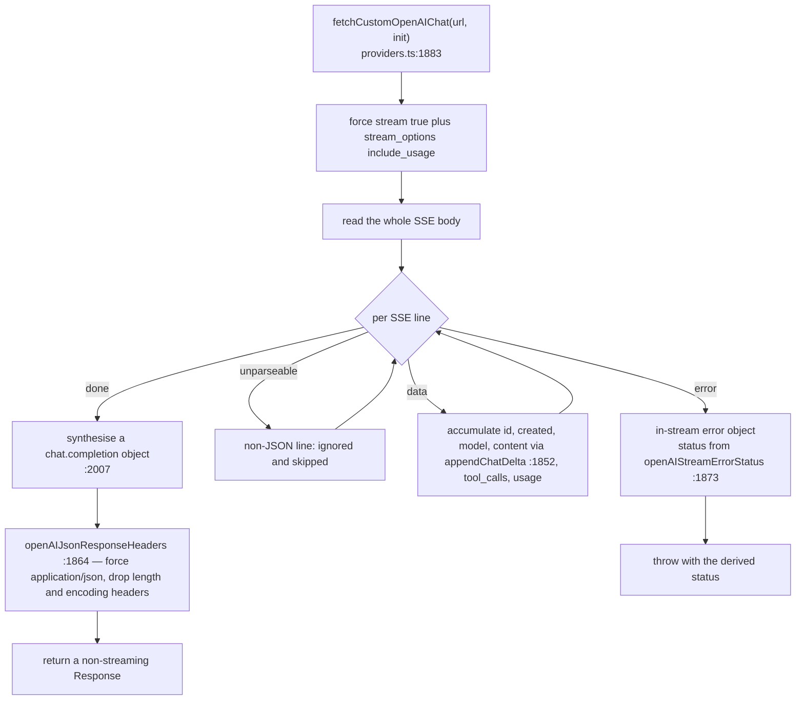

# Adapter Transports and the OpenAI-Compatible Seam

The second half of `getModel()`: what each of the five `switch (providerType)` branches actually
builds, the three predicates that decide the shape of the `openai` branch, the `compatFetch`
request/response seam, and the SDK packages behind them. The registry, types and resolution order
are in [./01-provider-registry.md](./01-provider-registry.md).

**Sources:** `lib/ai/providers.ts:1599-2338`, `lib/ai/reasoning-sse.ts`,
`lib/ai/thinking-context.ts`, `lib/ai/azure.ts`, `lib/server/provider-config.ts:328,363,735`,
`package.json`;
[../appendix/research/ai-provider-layer/01a-modules-catalog.md](../appendix/research/ai-provider-layer/01a-modules-catalog.md).

## The five branches at a glance

| Branch | Line | Providers | Compat shim | Reasoning middleware |
| --- | --- | --- | --- | --- |
| `azure` | `:2070` | `azure` | no | no |
| `openai` | `:2079` | 14 ids | conditional | conditional |
| `anthropic` | `:2233` | `anthropic`, `minimax` | MiniMax only | no |
| `bedrock` | `:2275` | `bedrock` | no | no |
| `google` | `:2286` | `google` | proxy only | no |

Anything outside the five throws `Unsupported provider type: <type>` (`:2318`) — unreachable from
`ProviderType`, reachable from a client-supplied `x-provider-type` on a `custom-*` id.

## The `openai` branch

Three predicates decide its shape:

| Predicate | Line | True when |
| --- | --- | --- |
| `shouldUseOpenAIResponsesApi` | `:1813` | `providerId === 'openai'` **and** the model id matches `gpt-5.N-pro`, `gpt-5.6*`, `gpt-5.5*`, or `gpt-5.[3-9]-codex*` |
| `usesCustomOpenAIBaseUrl` | `:1824` | origin is not `https://api.openai.com`, or the path is not `/v1`. An unparseable URL counts as custom (`:1834`) |
| `shouldUseOpenAIStreamingChatCompat` | `:1838` | `openai` slot **and** custom base URL **and** `OPENAI_COMPAT_USE_STREAMING_CHAT === 'true'` |

From those, `usesCompatTransport` (`:2096`–`:2098`) is true for **every non-`openai` provider id**,
and for the `openai` id when `config.baseUrl` is custom and Responses is not in play. It tests
`config.baseUrl`, not `effectiveBaseUrl` — a provider whose only URL comes from `defaultBaseUrl` is
judged on that fact, which is why all 13 other `openai`-transport providers reach the compat path
regardless of whether the operator overrode their URL.

Then:

- `model = usesOpenAIResponses ? openai.responses(modelId) : openai.chat(modelId)` (`:2210`).
- If `usesCompatTransport`: `openaiOptions.fetch = compatFetch` (`:2206`) and the model is wrapped in
  `extractReasoningMiddleware({ tagName: 'think' })` (`:2224`), with
  `createKimiReasoningPreservationMiddleware()` prepended for `kimi:kimi-k3` (`:2221`).

```mermaid
flowchart LR
  sdk["createOpenAI(openaiOptions).chat(modelId)<br/>providers.ts:2209-2210"]
  cf["compatFetch<br/>:2101"]
  ctx["globalThis.__thinkingContext.getStore()<br/>:2103-2106"]
  fallback["lemonade only: getDefaultThinkingConfig(catalog capability)<br/>:2109-2111"]
  body["getCompatThinkingBodyParams<br/>:1599 — 12-way adapter switch"]
  merge["Object.assign(body, extra), re-stringify<br/>:2125-2126"]
  kimi["restoreKimiReasoningInRequestBody<br/>:2141 — kimi-k3 only"]
  send{"useStreamingChatCompat?"}
  scc["fetchCustomOpenAIChat<br/>:1883 — forces stream true, reassembles a chat.completion"]
  plain["globalThis.fetch<br/>:2149"]
  wrap{"request body declared stream true?"}
  sse["wrapResponseWithReasoning<br/>reasoning-sse.ts:164"]
  jsonw["wrapJsonResponseWithReasoning<br/>reasoning-sse.ts:203 — kimi-k3 only"]
  lem["lemonade non-streaming JSON sanity log<br/>:2188-2202"]
  mw["extractReasoningMiddleware tagName think<br/>:2224"]

  sdk --> cf
  cf --> ctx
  ctx -->|"no async context"| fallback --> body
  ctx -->|"config present"| body
  body --> merge --> kimi --> send
  send -- yes --> scc --> wrap
  send -- no --> plain --> wrap
  wrap -- yes --> sse --> mw
  wrap -- no --> jsonw --> mw
  cf -.-> lem
```

### Why `compatFetch` reads a global

`compatFetch` pulls the thinking config from `globalThis.__thinkingContext` (`:2103`) instead of
importing `lib/ai/thinking-context.ts`. `providers.ts` is bundled for the browser (via
`lib/store/settings.ts`), and `thinking-context.ts` imports `node:async_hooks`. The constraint is
spelled out twice: the header comment at `lib/ai/providers.ts:59`–`:62` and the module docstring at
`lib/ai/thinking-context.ts:8`–`:13`, where the `AsyncLocalStorage` is published onto `globalThis`
at module load (`:23`) precisely so this read works without an import edge.

`callLLM` / `streamLLM` establish the context with `thinkingContext.run(effectiveThinking, …)`
(`lib/ai/llm.ts:348`, `:421`), so any call that bypasses those wrappers leaves `compatFetch` with no
config — which is one of the three things the ESLint funnel exists to prevent
(`eslint.config.mjs:17`).

### `getCompatThinkingBodyParams` — 12 vendor body shapes

`lib/ai/providers.ts:1599`. One hard-coded model special case runs ahead of the switch: the `openai`
slot serving `deepseek-v4-flash-vision-exp` needs `chat_template_kwargs.thinking`, because the
gateway's toggle is neither OpenAI's `reasoning_effort` nor DeepSeek's native `thinking` object
(`:1605`–`:1614`). After that, `capability = modelInfo?.capabilities?.thinking ??
getCatalogThinkingCapability(...)` (`:1616`) — so an operator-declared capability wins — and a
missing capability or `control === 'none'` returns `undefined` (`:1618`).

| `requestAdapter` | Emitted body fields |
| --- | --- |
| `openai` | `{ reasoning_effort }` when an effort resolves (`:1624`) |
| `kimi`, `xiaomi` | `{ thinking: { type: 'enabled' \| 'disabled' } }`, nothing when the mode is undefined (`:1629`) |
| `glm` | `effort` control: disable shape on `mode disabled` or `effort none`, else `thinking` plus optional `reasoning_effort` (`:1635`); otherwise a plain toggle |
| `deepseek` | disable shape, or `{ thinking: {type:'enabled'}, reasoning_effort }` clamped to `max` for `max`/`xhigh` and `high` otherwise (`:1657`) |
| `qwen` | `{ enable_thinking, thinking_budget }` |
| `siliconflow` | `{ enable_thinking?, thinking_budget }` |
| `doubao` | `reasoning_effort` (`minimal` to disable) or `thinking.type` |
| `openrouter` | `{ reasoning: { enabled, effort, max_tokens, exclude } }` |
| `hunyuan` | `{ chat_template_kwargs: { reasoning_effort } }` |
| `lemonade` | `{ chat_template_kwargs: { enable_thinking, thinking_budget } }` |
| `none`, `anthropic`, `google` | `undefined` — the native adapters go through `providerOptions` in `lib/ai/llm.ts:140` instead |

The merge is guarded by `try { JSON.parse(init.body) } catch { /* leave body as-is */ }` (`:2120`–`:2129`).
If the body were ever not valid JSON, thinking control would be dropped with no log line. In
practice the body is produced by the AI SDK and is always JSON, so this is latent rather than live.

### Two vendor quirks inside `compatFetch`

- **`lemonade`** falls back to the catalog default thinking config when no async context exists
  (`:2109`), deletes `stream_options` from the body (`:2122`), returns streaming responses untouched
  (`:2184`), and on a non-streaming response clones the body purely to log a diagnostic when it is
  not valid JSON (`:2188`–`:2202`) — status, content type, body length, first and last 500 bytes.
- **`kimi:kimi-k3`** needs a round trip. `createKimiReasoningPreservationMiddleware`
  (`lib/ai/reasoning-sse.ts:66`) encodes assistant reasoning parts as length-prefixed sentinel text
  (`KIMI_REASONING_MARKER`, `:28`), and `restoreKimiReasoningInRequestBody` (`:88`, called at
  `providers.ts:2141`) decodes them back into `reasoning_content` **after** SDK serialization. Its
  non-streaming responses additionally go through `wrapJsonResponseWithReasoning` (`:2166`).

### Reasoning recovery

`lib/ai/reasoning-sse.ts` exists because `@ai-sdk/openai`'s chat schema drops
`reasoning_content`. `createReasoningContentRewriter` (`:112`) is a two-flag state machine that
opens a `<think>` block on the first `reasoning_content` delta and closes it at the first real
content, tool call or finish. `wrapResponseWithReasoning` (`:164`) applies it over an SSE
`TransformStream`, buffering partial lines and forwarding an unparseable line verbatim (`:178`).
`extractReasoningMiddleware` on the model then splits the inline block back into first-class
reasoning parts, so the agent stream and the UI get a thinking panel and clean answer text — the
comment at `providers.ts:2211`–`:2216` states the round trip.

## The other four branches

| Branch | What is not obvious |
| --- | --- |
| `azure` (`:2070`) | Only `createAzure({apiKey, baseURL: normalizeAzureBaseUrl(effectiveBaseUrl)})` then `azure(modelId)`. No compat shim, no reasoning middleware, and `azure.models` is `[]`, so `modelInfo` is `null` unless the operator declares `providers.azure.models[]` capabilities in `server-providers.yml` — `getServerModelInfo` (`lib/server/provider-config.ts:709`) then becomes the whole `ModelInfo` at the merge (`:2323`–`:2335`) |
| `anthropic` (`:2233`) | A MiniMax key starting `sk-cp-` goes into `authToken`, not `apiKey` (`:2237`–`:2241`). MiniMax additionally gets its own `fetch` shim that injects `thinking: {type:'disabled'}` — but only when the catalog capability's `requestAdapter` is `anthropic`, its `control` is not `none`, and the resolved mode is `disabled` (`:2250`–`:2256`) |
| `bedrock` (`:2275`) | `apiKey: effectiveApiKey \|\| undefined`, region from `resolveBedrockRegion()` (`:1773`), and `createBedrockCredentialProvider()` (`:1800`) wrapping a module-memoised `import('@aws-sdk/credential-providers').then(fromNodeProviderChain)` (`:1791`–`:1798`) so the AWS SDK never enters the client bundle |
| `google` (`:2286`) | The only branch honouring `config.proxy`: an `undici` `ProxyAgent` behind a `/* webpackIgnore: true */` dynamic import (`:2295`–`:2296`), with the agent memoised per model instance via `agent ??= new ProxyAgent(proxy)` (`:2304`) |

`config.proxy` is populated by `resolveProxy()` (`lib/server/provider-config.ts:735`) from
`getConfig().providers[providerId]?.proxy`. That field is set **only** on the YAML path (`:328`); the
env branch at `:363`–`:367` does not copy it. There is no `<PREFIX>_PROXY` variable — see
[./08-env-vars.md](./08-env-vars.md).

## `fetchCustomOpenAIChat` — the non-streaming shim

`lib/ai/providers.ts:1883`. Some gateways answer correctly only with `stream: true`.

The failure mode to know: a malformed SSE chunk is skipped with the comment "ignore and continue"
(`:1995`), so that chunk's content is lost without a log line.

## SDK dependencies

| Package | Version | Used for | Evidence |
| --- | --- | --- | --- |
| `ai` | `^6.0.168` | `generateText`, `streamText`, `wrapLanguageModel`, `extractReasoningMiddleware`, `APICallError`, `RetryError` | `package.json:89`; `lib/ai/providers.ts:34`, `lib/ai/llm.ts:7`, `lib/server/llm-error-response.ts:1` |
| `@ai-sdk/openai` | `^3.0.84` | `createOpenAI` — 14 providers | `lib/ai/providers.ts:29` |
| `@ai-sdk/anthropic` | `^3.0.71` | `createAnthropic` — `anthropic`, `minimax` | `lib/ai/providers.ts:31` |
| `@ai-sdk/azure` | `^3.0.88` | `createAzure` | `lib/ai/providers.ts:30` |
| `@ai-sdk/amazon-bedrock` | `^4.0.103` | `createAmazonBedrock` | `lib/ai/providers.ts:32` |
| `@ai-sdk/google` | `^3.0.64` | `createGoogleGenerativeAI` | `lib/ai/providers.ts:33` |
| `@aws-sdk/credential-providers` | `^3.1045.0` | `fromNodeProviderChain()`, dynamically imported | `lib/ai/providers.ts:1794` |
| `undici` | `7.29.0` | `ProxyAgent` for the Google proxy path, dynamically imported | `lib/ai/providers.ts:2295` |
| `@earendil-works/pi-ai` | `0.78.0` (pinned exact) | `Api` / `Model` types for the agent driver | `lib/server/agent-runtime/agent-driver-model.ts:1` |

Full dependency accounting lives in [../13-dependencies/index.md](../13-dependencies/index.md).

## Open questions

- `fetchCustomOpenAIChat` is enabled by `OPENAI_COMPAT_USE_STREAMING_CHAT`, a global switch that
  applies only to the `openai` provider slot with a custom base URL. Whether any shipped deployment
  sets it is not determinable from the repo — it appears only as a commented line at
  `.env.example:17`.
- Three empty `catch { /* leave body as-is */ }` blocks sit in the fetch shims
  (`lib/ai/providers.ts:2127`, `:2143`, `:2261`). They are unreachable while the AI SDK produces the
  body, but there is no assertion or log to notice if that ever changes.
- The MiniMax disable-thinking shim in the `anthropic` branch duplicates logic that
  `getCompatThinkingBodyParams` already expresses for the compat transports. Nothing keeps the two
  in step.
