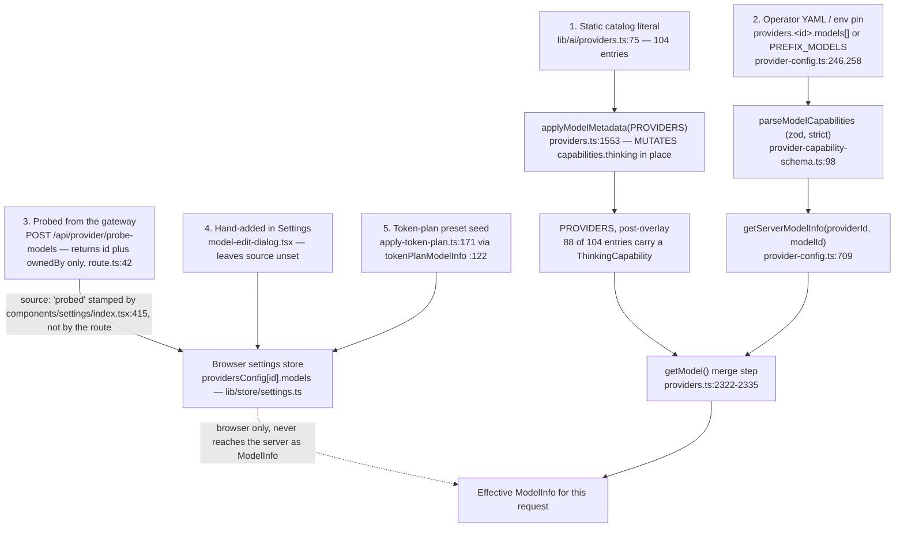

# Model Registry: Where Entries Come From

Five independent paths put a model into the registry, and only two of them are server-side. This
file names all five and traces the YAML operator-declaration path in depth. The capability types
those entries carry — the verbatim `ThinkingCapability` shape, the per-provider tables, and which
of the four declared flags actually gate runtime behaviour — are in
[./02b-capability-shapes-and-gating.md](./02b-capability-shapes-and-gating.md).

**Sources:** `lib/types/provider.ts`, `lib/ai/providers.ts`, `lib/ai/model-metadata.ts`,
`lib/server/provider-capability-schema.ts`, `lib/server/provider-config.ts`,
`lib/config/apply-token-plan.ts`, `lib/store/settings.ts`, `components/settings/*`;
[../appendix/research/ai-provider-layer/01a-modules-catalog.md](../appendix/research/ai-provider-layer/01a-modules-catalog.md).

## Where a model entry comes from



Only paths 1 and 2 exist server-side. Paths 3–5 write into the browser settings store; the server
never receives a `ModelInfo` from the client, only a model *string* in `x-model`. That asymmetry
is what makes [./04-credential-flow.md](./04-credential-flow.md) tractable. The `'manual'` arm of
`source` is declared in the type (`lib/types/provider.ts:158`) but never assigned anywhere in the
repo: `'probed'` is the only value ever written, and hand-added models leave the field unset by
design — exactly what the docstring reproduced in
[./02b-capability-shapes-and-gating.md](./02b-capability-shapes-and-gating.md) says.

`applyModelMetadata` is the only mutation of the registry (`lib/ai/model-metadata.ts:471`, called
once at module load from `lib/ai/providers.ts:1553`). It walks every provider's `models[]` and, if
`getCatalogThinkingCapability(provider.id, model.id)` returns something, replaces
`model.capabilities` with a spread that adds `thinking`. Everything downstream reads the merged
shape.

## Operator-declared capabilities

An operator can declare per-model capabilities inside `server-providers.yml` under
`providers.<id>.models[]`. The schema is a zod object at
`lib/server/provider-capability-schema.ts:90`:

```yaml
providers:
  myGateway:
    apiKey: sk-...
    baseUrl: https://gateway.internal/v1
    models:
      - "plain-model-id"
      - id: "model-with-capabilities"
        vision: true
        thinking:
          control: effort
          requestAdapter: openai
          effortValues: [low, high]
          defaultEffort: high
```

Validation is genuinely strict:

- `.strict()` (`:65`, `:96`) rejects unknown keys.
- `.refine` (`:66`) requires `thinking` to declare at least one field.
- `.superRefine` (`:69`–`:85`) cross-checks `defaultEffort ∈ effortValues`,
  `defaultLevel ∈ levelValues`, and that `budgetRange.min <= max` with `defaultBudgetTokens`
  inside the range.
- Two compile-time assertions pin the schema and the hand-written interface to each other in both
  directions (`:87`–`:88`): adding a field to one without the other fails typecheck. This is the
  nicest thing in the file.

Two silent-drop paths to know about:

1. An invalid declaration is warned and dropped individually — the rest of the model list survives
   (`lib/server/provider-config.ts:269`).
2. A declaration for a model that is not in the `<PREFIX>_MODELS` env allowlist is discarded with
   a warning (`retainModelCapabilities`, `lib/server/provider-config.ts:277`–`:292`). Env wins over
   YAML for the model list, so pinning models via env silently invalidates YAML capability
   declarations for anything not in the env list.

`getServerModelInfo` (`lib/server/provider-config.ts:709`) turns a surviving declaration into a
`ModelInfo` carrying only `vision` and `thinking`. `getModel()` then merges it over the catalog
entry, with `thinking` preferring the operator value (`lib/ai/providers.ts:2323`–`:2335`). When
there is no catalog entry, the operator's `ModelInfo` *is* the result — which is how a
gateway-only model id gets a capability at all. What `vision` and `thinking` actually do once
merged is traced in
[./02b-capability-shapes-and-gating.md](./02b-capability-shapes-and-gating.md).
