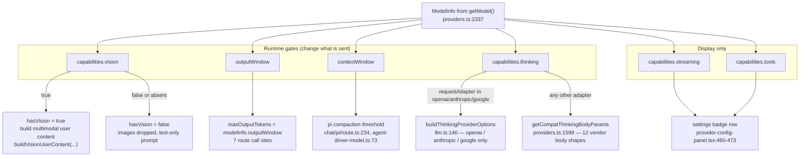

# Capability Shapes and Gating

Four declared capability flags, and exactly one of them changes runtime behaviour. This file
reproduces the capability types verbatim, tabulates what every catalog model declares, and traces
every gate. How an entry gets into the registry in the first place — five sourcing paths and the
operator-YAML declaration pipeline — is
[./02-model-registry-and-capabilities.md](docs/04-ai-provider-layer/02-model-registry-and-capabilities.md).

**Sources:** `lib/types/provider.ts`, `lib/ai/providers.ts`, `lib/ai/model-metadata.ts`,
`lib/ai/thinking-config.ts`, `lib/ai/llm.ts`, `lib/config/apply-token-plan.ts`,
`lib/config/token-plan-presets.ts`, `app/api/generate/scene-content/route.ts`,
`app/api/generate/scene-actions/route.ts`, `app/api/generate/scene-outlines-stream/route.ts`,
`app/api/pbl/v2/evaluate/route.ts`, `app/api/chat/pi/route.ts`,
`lib/server/agent-runtime/generation-ai-call.ts`, `lib/server/agent-runtime/agent-driver-model.ts`,
`lib/server/classroom-generation.ts`, `components/scene-renderers/pbl/v2/submission.tsx`,
`components/settings/*`;
[../appendix/research/ai-provider-layer/01a-modules-catalog.md](docs/appendix/research/ai-provider-layer/01a-modules-catalog.md).

## The capability types, verbatim

```ts
// lib/types/provider.ts:141
export interface ModelInfo {
  id: string;
  name: string;
  contextWindow?: number;
  outputWindow?: number;
  capabilities?: {
    streaming?: boolean;
    tools?: boolean;
    vision?: boolean;
    thinking?: ThinkingCapability;
  };
  /**
   * Where this model entry came from. `'probed'` marks entries auto-discovered
   * by fetching the provider's /models endpoint — these are replaced wholesale
   * on a re-fetch (after a base-URL/key change) instead of accumulating stale
   * ids. Catalog and manually-added models leave this unset and are preserved.
   */
  source?: 'probed' | 'manual';
}

// lib/types/provider.ts:73
export interface ThinkingCapability {
  /** Which UI control should be rendered for this model. */
  control?: ThinkingControlType;
  /** Which provider-specific adapter maps the unified config to request params. */
  requestAdapter?: ThinkingRequestAdapter;
  /** Default mode when OpenMAIC does not send an explicit config. */
  defaultMode?: ThinkingMode;
  /** Allowed effort values for effort-based models. */
  effortValues?: ThinkingEffort[];
  /** Default effort for effort-based models. */
  defaultEffort?: ThinkingEffort;
  /** Allowed level values for level-based models. */
  levelValues?: ThinkingLevel[];
  /** Default level for level-based models. */
  defaultLevel?: ThinkingLevel;
  /** Allowed budget range for budget-based models. */
  budgetRange?: {
    min: number;
    max: number;
    step?: number;
    allowDynamic?: boolean;
    disableValue?: number;
  };
  /** Default token budget used when the user enables thinking without a value. */
  defaultBudgetTokens?: number;
  /** Anthropic-specific thinking transport metadata. */
  anthropicThinking?: {
    type: 'adaptive' | 'enabled';
    budgetByEffort?: Partial<Record<ThinkingEffort, number>>;
  };
  /** Can thinking be fully disabled via API? */
  toggleable?: boolean;
  /** Can thinking budget/effort intensity be adjusted? */
  budgetAdjustable?: boolean;
  /** Is thinking enabled by default (when no config is passed)? */
  defaultEnabled?: boolean;
}

// lib/types/provider.ts:40
export type ThinkingControlType =
  | 'none' | 'toggle' | 'toggle-budget' | 'effort' | 'level' | 'mode' | 'budget-only';

// lib/types/provider.ts:53
export type ThinkingRequestAdapter =
  | 'none' | 'openai' | 'anthropic' | 'google' | 'qwen' | 'deepseek' | 'kimi'
  | 'glm' | 'siliconflow' | 'doubao' | 'openrouter' | 'hunyuan' | 'xiaomi' | 'lemonade';
```

`control` drives the settings UI; `requestAdapter` drives the wire format. They are orthogonal —
`kimi:kimi-k3` has `control: 'effort'` with `requestAdapter: 'openai'`
([`lib/ai/model-metadata.ts:162`](lib/ai/model-metadata.ts#L162)), while `deepseek:deepseek-v4-pro` has `control: 'effort'` with
`requestAdapter: 'deepseek'` (`:167`).

## Declared capabilities per provider

Computed by evaluating the `PROVIDERS` literal, then applying the same overlay
`applyModelMetadata` applies. "Thinking (literal)" is what the object literal declares inline;
"Thinking (effective)" is what a request actually sees.

| Provider | Models | `streaming` | `tools` | `vision` | Thinking (literal) | Thinking (effective) |
| --- | --- | --- | --- | --- | --- | --- |
| `openai` | 8 | 8 | 8 | 8 | 8 | 8 |
| `azure` | 0 | – | – | – | – | – |
| `atlascloud` | 2 | 2 | 1 | 0 | 1 | 1 |
| `anthropic` | 9 | 9 | 9 | 9 | 9 | 9 |
| `bedrock` | 8 | 8 | 8 | 6 | 0 | **0** |
| `google` | 8 | 8 | 8 | 8 | 8 | 8 |
| `glm` | 10 | 10 | 10 | 3 | 1 | **10** |
| `qwen` | 12 | 12 | 12 | 5 | 8 | **12** |
| `deepseek` | 2 | 2 | 2 | 0 | 2 | 2 |
| `kimi` | 6 | 6 | 6 | 5 | 6 | 6 |
| `minimax` | 2 | 2 | 2 | 1 | 0 | **2** |
| `siliconflow` | 7 | 7 | 7 | 2 | 0 | **6** |
| `doubao` | 8 | 8 | 8 | 8 | 0 | **8** |
| `openrouter` | 2 | 2 | 2 | 0 | 0 | **2** |
| `grok` | 10 | 10 | 10 | 9 | 7 | 7 |
| `tencent-hunyuan` | 1 | 1 | 1 | 0 | 0 | **1** |
| `xiaomi` | 5 | 5 | 5 | 2 | 5 | 5 |
| `ollama` | 3 | 3 | 2 | 1 | 0 | **0** |
| `lemonade` | 1 | 1 | 1 | 0 | 0 | **1** (wildcard) |
| **Total** | **104** | **104** | **102** | **67** | **55** | **88** |

Facts that follow:

- `streaming: true` on **all 104** entries. Nothing in the codebase reads it except the settings
  UI badge ([`components/settings/provider-config-panel.tsx:470`](components/settings/provider-config-panel.tsx#L470)). It is decorative.
- `tools` is false on exactly two entries (`azure`'s placeholder aside): `atlascloud`'s
  non-function-calling entry ([`lib/ai/providers.ts:240`](lib/ai/providers.ts#L240)) and one `ollama` entry. Also read only by
  the settings UI ([`provider-config-panel.tsx:465`](components/settings/provider-config-panel.tsx#L465)).
- **16 catalog models have no thinking capability at all**: all 8 `bedrock`, all 3 `ollama`, 1
  `atlascloud`, 1 `siliconflow`, 3 `grok`. For those, `buildThinkingProviderOptions` returns
  `undefined` ([`lib/ai/llm.ts:149`](lib/ai/llm.ts#L149)) and `getCompatThinkingBodyParams` returns `undefined`
  ([`lib/ai/providers.ts:1618`](lib/ai/providers.ts#L1618)) — thinking config is accepted, normalised and then silently
  discarded.
- **`lemonade` has a wildcard**: `getCatalogThinkingCapability` ([`lib/ai/model-metadata.ts:464`](lib/ai/model-metadata.ts#L464))
  returns `lemonadeToggleBudget` for *any* unknown `lemonade` model id, so a self-hosted model the
  catalog has never heard of still gets a thinking control.
- **16 `THINKING_CAPABILITIES` keys reference models absent from the catalog**: 12 `doubao` keys
  for the Volcengine Ark Agent Plan aliases (`doubao-seed-2.0-*`, `deepseek-v4-*`, `glm-5.2`,
  `kimi-k2.*`, `minimax-m*`, `ark-code-latest`) and 4 `lemonade` ids the wildcard already covers.
  The Ark keys are load-bearing: the token-plan preset seeds those ids into the store
  ([`lib/config/token-plan-presets.ts:145`](lib/config/token-plan-presets.ts#L145) onward) and `tokenPlanModelInfo`
  ([`lib/config/apply-token-plan.ts:122`](lib/config/apply-token-plan.ts#L122)) overlays the capability so a seeded model does not lose
  its reasoning control. The comment at [`lib/ai/model-metadata.ts:393`](lib/ai/model-metadata.ts#L393)–[`:399`](lib/ai/model-metadata.ts#L399) documents exactly
  this.

### The 28 capability shapes

`THINKING_CAPABILITIES` ([`lib/ai/model-metadata.ts:264`](lib/ai/model-metadata.ts#L264)) has 104 keys built from 5 constructors
and 23 named constants. Frequency of use:

| Shape | Uses | `control` | `requestAdapter` | Notes |
| --- | --- | --- | --- | --- |
| `toggleCapability(...)` | 18 | `toggle` | `glm` / `kimi` / `xiaomi` / `doubao` / `anthropic` | on/off only, no intensity |
| `doubaoSeed20Effort` | 18 | `effort` | `doubao` | `minimal\|low\|medium\|high`, default `medium` (`:240`) |
| `qwenBudgetEnabled` / `qwenBudgetDisabled` | 9 / 3 | `toggle-budget` | `qwen` | `0..81920` step 1024, `disableValue: 0` (`:206`, `:212`) |
| `effortCapability(...)` | 7 | `effort` | `openai` / `openrouter` | `defaultMode` derives from whether `none ∈ effortValues` (`:25`) |
| `fixedThinkingCapability` | 7 | `none` | `none` | reasoning cannot be controlled (`:97`) |
| `levelCapability(...)` | 5 | `level` | `google` | Gemini 3 `thinkingLevel` (`:32`) |
| `lemonadeToggleBudget` | 5 | `toggle-budget` | `lemonade` | `0..81920`, also the wildcard default (`:200`) |
| `siliconflowBudget` / `siliconflowToggleBudget` | 4 / 2 | `budget-only` / `toggle-budget` | `siliconflow` | `128..32768`, default 4096 (`:218`, `:224`) |
| `deepseekEffort` | 3 | `effort` | `deepseek` | `none\|high\|max` only (`:167`) |
| `openaiGpt56Effort` | 3 | `effort` | `openai` | `none\|low\|medium\|high\|xhigh\|max` (`:253`) |
| `anthropic*Effort` family | 8 | `effort` | `anthropic` | see below |
| `grok46/45/43Effort`, `glm52Effort`, `kimiK3Effort`, `hunyuanHy3Effort`, `doubaoMode`, `minimaxM3Thinking`, `anthropicBudget`, `toggleBudgetCapability`, `budgetOnlyCapability` | 1–2 each | mixed | mixed | one-offs |

The Anthropic family is the subtlest:

- `anthropicManualEffort` (`:113`) maps effort → `budgetTokens` through
  `anthropicManualBudgetByEffort` = `{low:4096, medium:10240, high:32768, max:64000}` (`:106`) and
  sends `thinking: {type:'enabled', budgetTokens}`.
- `anthropicAdaptiveEffort` (`:128`) sends `thinking: {type:'adaptive'}` plus `effort`, letting the
  API pick the budget.
- `anthropicFable5Effort` (`:154`) is `toggleable: false, budgetAdjustable: false` because the API
  rejects both disabled thinking and `budget_tokens`; the code comment at `:152` says so.

### Model → capability index

All 104 catalog ids, grouped by the effective `ThinkingCapability` the overlay leaves on each —
the per-model answer the two aggregate tables above only summarise. Computed by evaluating the
`PROVIDERS` literal and resolving each id through `getCatalogThinkingCapability`. **Bold** marks an
entry that declares `vision: true` (67 of 104); `streaming` is `true` on all 104 and `tools` is
`false` only on the two entries named above, so neither is repeated per row. `contextWindow` /
`outputWindow` are per-entry numbers in the literal, not capability flags.

| `control` · `requestAdapter` | Shape (`lib/ai/model-metadata.ts`) | n | Models (`provider:id`) |
| --- | --- | --- | --- |
| `effort` · `openai` | `effortCapability` (`:15`) | 5 | **`openai:gpt-5.5`**, **`openai:gpt-5.4-pro`**, **`openai:gpt-5.4`**, **`openai:gpt-5.4-mini`**, **`openai:gpt-5.4-nano`** |
| `effort` · `openai` | `openaiGpt56Effort` (`:253`) | 3 | **`openai:gpt-5.6`**, **`openai:gpt-5.6-terra`**, **`openai:gpt-5.6-luna`** |
| `effort` · `deepseek` | `deepseekEffort` (`:167`) | 3 | `atlascloud:deepseek-ai/deepseek-v4-pro`, `deepseek:deepseek-v4-pro`, `deepseek:deepseek-v4-flash` |
| `effort` · `anthropic` | `anthropicAdaptiveEffort` (`:128`) | 2 | **`anthropic:claude-opus-4-6`**, **`anthropic:claude-sonnet-4-6`** |
| `toggle-budget` · `anthropic` | `anthropicBudget` (`:133`) | 1 | **`anthropic:claude-haiku-4-5`** |
| `effort` · `anthropic` | `anthropicClaude5Effort` (`:145`) | 2 | **`anthropic:claude-opus-5`**, **`anthropic:claude-sonnet-5`** |
| `effort` · `anthropic` | `anthropicFable5Effort` (`:154`) | 1 | **`anthropic:claude-fable-5`** |
| `effort` · `anthropic` | `anthropicManualEffort` (`:113`) | 1 | **`anthropic:claude-sonnet-4-5`** |
| `effort` · `anthropic` | `anthropicOpus47Effort` (`:140`) | 2 | **`anthropic:claude-opus-4-8`**, **`anthropic:claude-opus-4-7`** |
| `budget-only` · `google` | `budgetOnlyCapability` (`:80`) | 1 | **`google:gemini-2.5-pro`** |
| `level` · `google` | `levelCapability` (`:32`) | 5 | **`google:gemini-3.6-flash`**, **`google:gemini-3.5-flash-lite`**, **`google:gemini-3.5-flash`**, **`google:gemini-3.1-pro-preview`**, **`google:gemini-3-flash-preview`** |
| `toggle-budget` · `google` | `toggleBudgetCapability` (`:62`) | 2 | **`google:gemini-2.5-flash`**, **`google:gemini-2.5-flash-lite`** |
| `effort` · `glm` | `glm52Effort` (`:178`) | 1 | `glm:glm-5.2` |
| `toggle` · `glm` | `toggleCapability` (`:48`) | 9 | `glm:glm-5.1`, **`glm:glm-5v-turbo`**, `glm:glm-5`, `glm:glm-4.7`, `glm:glm-4.7-flashx`, `glm:glm-4.7-flash`, `glm:glm-4.6`, **`glm:glm-4.6v`**, **`glm:glm-4.6v-flash`** |
| `toggle-budget` · `qwen` | `qwenBudgetDisabled` (`:212`) | 3 | `qwen:qwen3.6-max-preview`, `qwen:qwen3-max`, **`qwen:qwen3-vl-plus`** |
| `toggle-budget` · `qwen` | `qwenBudgetEnabled` (`:206`) | 9 | **`qwen:qwen3.7-plus`**, `qwen:qwen3.7-max`, `qwen:qwen3.6-plus`, `qwen:qwen3.6-plus-2026-04-02`, `qwen:qwen3.6-flash`, `qwen:qwen3.6-flash-2026-04-16`, **`qwen:qwen3.6-35b-a3b`**, **`qwen:qwen3.5-flash`**, **`qwen:qwen3.5-plus`** |
| `none` · `none` | `fixedThinkingCapability` (`:97`) | 7 | **`kimi:kimi-k2.7-code`**, **`kimi:kimi-k2.7-code-highspeed`**, `minimax:MiniMax-M2.7`, **`grok:grok-build-0.1`**, **`grok:grok-4.20-reasoning`**, **`grok:grok-4.20-multi-agent`**, **`grok:grok-4-1-fast-reasoning`** |
| `effort` · `openai` | `kimiK3Effort` (`:162`) | 1 | **`kimi:kimi-k3`** |
| `toggle` · `kimi` | `toggleCapability` (`:48`) | 3 | **`kimi:kimi-k2.6`**, **`kimi:kimi-k2.5`**, `kimi:kimi-k2-thinking` |
| `toggle` · `anthropic` | `minimaxM3Thinking` (`:251`) | 1 | **`minimax:MiniMax-M3`** |
| `budget-only` · `siliconflow` | `siliconflowBudget` (`:218`) | 4 | `siliconflow:deepseek-ai/DeepSeek-R1`, `siliconflow:deepseek-ai/DeepSeek-R1-Distill-Qwen-7B`, **`siliconflow:THUDM/GLM-4.1V-9B-Thinking`**, `siliconflow:THUDM/GLM-Z1-Rumination-32B-0414` |
| `toggle-budget` · `siliconflow` | `siliconflowToggleBudget` (`:224`) | 2 | `siliconflow:deepseek-ai/DeepSeek-V3.2`, **`siliconflow:Qwen/Qwen3-VL-32B-Instruct`** |
| `mode` · `doubao` | `doubaoMode` (`:231`) | 1 | **`doubao:doubao-seed-1-8-251228`** |
| `effort` · `doubao` | `doubaoSeed20Effort` (`:240`) | 6 | **`doubao:doubao-seed-2-1-pro-260628`**, **`doubao:doubao-seed-2-1-turbo-260628`**, **`doubao:doubao-seed-evolving`**, **`doubao:doubao-seed-2-0-pro-260215`**, **`doubao:doubao-seed-2-0-lite-260215`**, **`doubao:doubao-seed-2-0-mini-260215`** |
| `toggle` · `doubao` | `toggleCapability` (`:48`) | 1 | **`doubao:doubao-seed-character-260628`** |
| `effort` · `openrouter` | `effortCapability` (`:15`) | 2 | `openrouter:deepseek/deepseek-v4-pro`, `openrouter:deepseek/deepseek-v4-flash` |
| `effort` · `openai` | `grok43Effort` (`:165`) | 1 | **`grok:grok-4.3`** |
| `effort` · `openai` | `grok45Effort` (`:164`) | 1 | **`grok:grok-4.5`** |
| `effort` · `openai` | `grok46Effort` (`:163`) | 1 | **`grok:grok-4.6`** |
| `effort` · `hunyuan` | `hunyuanHy3Effort` (`:189`) | 1 | `tencent-hunyuan:hy3-preview` |
| `toggle` · `xiaomi` | `toggleCapability` (`:48`) | 5 | `xiaomi:mimo-v2.5-pro`, `xiaomi:mimo-v2-pro`, **`xiaomi:mimo-v2.5`**, **`xiaomi:mimo-v2-omni`**, `xiaomi:mimo-v2-flash` |
| `toggle-budget` · `lemonade` | `lemonadeToggleBudget` (`:200`) | 1 | `lemonade:Gemma-4-26B-A4B-it-GGUF` |
| none | no `THINKING_CAPABILITIES` key | 16 | `atlascloud:qwen/qwen3.5-flash`, **`bedrock:us.anthropic.claude-sonnet-5`**, **`bedrock:us.anthropic.claude-opus-4-8`**, **`bedrock:us.anthropic.claude-opus-4-7`**, **`bedrock:us.anthropic.claude-sonnet-4-6`**, **`bedrock:us.amazon.nova-pro-v1:0`**, **`bedrock:us.amazon.nova-lite-v1:0`**, `bedrock:us.amazon.nova-micro-v1:0`, `bedrock:us.meta.llama3-3-70b-instruct-v1:0`, `siliconflow:Pro/moonshotai/Kimi-K2.5`, **`grok:grok-4.20`**, **`grok:grok-4-1-fast-non-reasoning`**, `grok:grok-code-fast-1`, `ollama:llama3.3`, **`ollama:gemma3`**, `ollama:deepseek-r1` |

The last row is the 16 ids whose thinking config is normalised and then discarded. The `lemonade`
row lists the single catalog id; any *other* `lemonade` id — a self-hosted model the catalog has
never seen — still gets `lemonadeToggleBudget` from the wildcard at [`model-metadata.ts:464`](lib/ai/model-metadata.ts#L464).
`azure` contributes no rows: it ships zero catalog models.

## What actually gates behaviour

Four flags are declared. Only `vision` reaches a runtime branch. `contextWindow` and
`outputWindow` are not "capabilities" but are consumed the most.



### `vision` — five gates

| Site | Line | Effect when false |
| --- | --- | --- |
| `app/api/generate/scene-content/route.ts` | `:121`, used `:137` | Images are never resolved to bytes; the prompt goes out as `prompt: userPrompt` with no attachments |
| `app/api/generate/scene-actions/route.ts` | `:96`, used `:104` | Same, for the actions step |
| `app/api/generate/scene-outlines-stream/route.ts` | `:323`, used `:337` | Outline prompt keeps only the text placeholder for each document image; no vision slice is split off |
| `app/api/pbl/v2/evaluate/route.ts` | `:90`, passed as `hasVision` `:101` | Task evaluation receives no image content |
| `components/scene-renderers/pbl/v2/submission.tsx` | `:927`–`:930` | Image-caption affordance is hidden. Reads the *client* store reactively, so switching models in Settings updates the UI live |

The four server gates read `modelInfo?.capabilities?.vision` off the `ResolvedModel`, so the
operator's YAML `vision: true` declaration is enough to light up vision for a model absent from
the catalog. The client gate reads `findModelById(...)` against the settings store instead — two
different sources of truth for the same question.

### `outputWindow` — the de-facto response cap

`maxOutputTokens: modelInfo?.outputWindow` appears at 7 generation call sites
([`scene-content/route.ts:153,167`](app/api/generate/scene-content/route.ts#L153), [`scene-actions/route.ts:115,129`](app/api/generate/scene-actions/route.ts#L115),
[`scene-outlines-stream/route.ts:501,510`](app/api/generate/scene-outlines-stream/route.ts#L501), [`chat/pi/route.ts:233`](app/api/chat/pi/route.ts#L233)) plus
[`lib/server/agent-runtime/generation-ai-call.ts:29`](lib/server/agent-runtime/generation-ai-call.ts#L29) and four sites in
`lib/server/classroom-generation.ts` (`:226` off `modelInfo?.outputWindow`; `:322`, `:348`, `:372`
off the `resolveStageModel` destructure) — twelve caps in total. The only other `maxOutputTokens`
in that file is the hardcoded `256` at `:392`. When it is `undefined` — an Azure deployment, a
probed id, a
`custom-*` provider — the SDK sends no `max_tokens` and the provider's own default applies.

### `contextWindow` — compaction only

Two consumers, both pi-based: [`app/api/chat/pi/route.ts:234`](app/api/chat/pi/route.ts#L234) and
[`lib/server/agent-runtime/agent-driver-model.ts:73`](lib/server/agent-runtime/agent-driver-model.ts#L73), where the chain is
`route.contextWindow ?? modelInfo.contextWindow ?? 128_000`. The comment at `:68`–`:72` is
explicit that the value is an *internal* estimate for deciding when to compact and is never sent
to the model API.

## Open questions

- `capabilities.streaming` is `true` for every one of the 104 entries and is read only by a
  settings badge. Whether it is intended as a future gate or is vestigial is not recoverable from
  the code.
- The vision gate has two sources of truth: server routes read the resolved `ModelInfo`, the PBL
  submission modal reads the browser settings store. A model that the operator declared
  `vision: true` in YAML but that the browser catalog says is text-only will hide the client
  affordance while the server would happily accept images. No test covers that skew.
