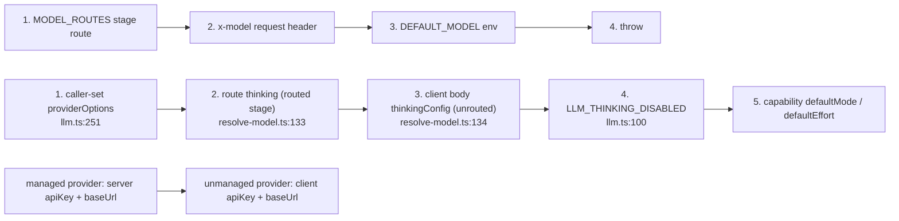

# Per-Stage Model Routing and Precedence

The 20 routable generation stages, how `MODEL_ROUTES` is parsed, and the exact precedence between
operator route, client header and `DEFAULT_MODEL` — including which client-supplied fields are
discarded when a route wins.

**Sources:** `lib/server/model-routes.ts`, `lib/server/resolve-model.ts`,
`lib/server/agent-runtime/agent-driver-model.ts`, `lib/server/classroom-generation.ts`,
`lib/server/agent-runtime/generation-ai-call.ts`, [`.env.example:411-449`](.env.example#L411-L449);
[../appendix/research/ai-provider-layer/03-flows.md](docs/appendix/research/ai-provider-layer/03-flows.md).

## Surface: one env var

`MODEL_ROUTES` is a single JSON object. Keys must be one of the 20 `LLM_STAGES`; values are either
a model string or an object.

```ts
// lib/server/model-routes.ts:52
export interface StageRoute {
  model: string;
  /**
   * Explicit pi transport dialect (for example openai-completions). Consumed only
   * by the agent-driver stage; inert on every other routable stage.
   */
  api?: string;
  /**
   * Effective context window for this stage, overriding the provider catalog
   * value. ... Consumed only by the agent-driver stage; inert on every other routable stage.
   */
  contextWindow?: number;
  /**
   * Full thinking config for this stage (the unified ThinkingConfig abstraction:
   * mode / effort / level / enabled / budgetTokens / excludeReasoningOutput).
   * Passed through to callLLM, which normalizes it against the model's capability.
   */
  thinking?: ThinkingConfig;
}

// lib/server/model-routes.ts:131
export const LLM_STAGES = [
  'scene-outlines-stream',
  'scene-content',
  'scene-content:slide',
  'scene-content:quiz',
  'scene-content:interactive',
  'scene-content:pbl',
  'scene-actions',
  'agent-profiles',
  'quiz-grade',
  'pbl-chat',
  'pbl-v2-runtime',
  'pbl-v2-runtime:instructor',
  'pbl-v2-runtime:open-task',
  'pbl-v2-runtime:evaluate',
  'pbl-v2-runtime:simulator',
  'chat-adapter',
  'generate-classroom',
  'web-search-query-rewrite',
  'maic-agent',
  'maic-agent-driver',
] as const;
```

`thinking` is the only field honoured by the generic `callLLM` stages. `api` / `dialect` and
`contextWindow` are parsed for every stage and consumed only by `maic-agent-driver`; the docstring
at `:48`–`:51` says so, and no other reader exists.

## Every stage's real call site

Traced by locating each `resolveModel*` call in `app/` and `lib/`.

| Stage | Resolution call site | `callLLM` source label |
| --- | --- | --- |
| `scene-outlines-stream` | [`app/api/generate/scene-outlines-stream/route.ts:299`](app/api/generate/scene-outlines-stream/route.ts#L299) | `scene-outlines-stream` |
| `scene-content` + 4 composites | [`app/api/generate/scene-content/route.ts:116`](app/api/generate/scene-content/route.ts#L116) (key built at [`:110`](app/api/generate/scene-content/route.ts#L110)); [`lib/server/agent-runtime/generation-ai-call.ts:23`](lib/server/agent-runtime/generation-ai-call.ts#L23) via `sceneContentStage()` [`:9`](lib/server/agent-runtime/generation-ai-call.ts#L9) | `scene-content` |
| `scene-actions` | [`app/api/generate/scene-actions/route.ts:91`](app/api/generate/scene-actions/route.ts#L91) | `scene-actions` |
| `agent-profiles` | [`app/api/generate/agent-profiles/route.ts:166`](app/api/generate/agent-profiles/route.ts#L166) | `agent-profiles` |
| `quiz-grade` | [`app/api/quiz-grade/route.ts:47`](app/api/quiz-grade/route.ts#L47) | `quiz-grade` |
| `pbl-chat` | **none** | — |
| `pbl-v2-runtime` | reachable only as composite fallback | — |
| `pbl-v2-runtime:instructor` | [`app/api/pbl/v2/instructor/route.ts:55`](app/api/pbl/v2/instructor/route.ts#L55) | — |
| `pbl-v2-runtime:open-task` | [`app/api/pbl/v2/open-task/route.ts:57`](app/api/pbl/v2/open-task/route.ts#L57) | — |
| `pbl-v2-runtime:evaluate` | [`app/api/pbl/v2/evaluate/route.ts:84`](app/api/pbl/v2/evaluate/route.ts#L84) | — |
| `pbl-v2-runtime:simulator` | [`app/api/pbl/v2/simulator/route.ts:53`](app/api/pbl/v2/simulator/route.ts#L53) | — |
| `chat-adapter` | [`app/api/chat/route.ts:72`](app/api/chat/route.ts#L72) and [`app/api/chat/pi/route.ts:98`](app/api/chat/pi/route.ts#L98) | `pi-chat-director`, `pi-chat-child`, `pi-chat-native-child` |
| `generate-classroom` | [`lib/server/classroom-generation.ts:199`](lib/server/classroom-generation.ts#L199) | `generate-classroom` |
| `web-search-query-rewrite` | [`app/api/web-search/route.ts:127`](app/api/web-search/route.ts#L127); [`lib/server/classroom-generation.ts:427`](lib/server/classroom-generation.ts#L427) | — |
| `maic-agent` | **none** | — |
| `maic-agent-driver` | [`lib/server/agent-runtime/agent-driver-model.ts:102`](lib/server/agent-runtime/agent-driver-model.ts#L102) | `agent-runtime` |

Two dead routing keys:

- **`pbl-chat`** appears in `LLM_STAGES` and in the [`.env.example:446`](.env.example#L446) example, but no
  `resolveModel({stage: 'pbl-chat'})` call exists anywhere in `app/` or `lib/`. Boot validation
  accepts the key, `getStageRoute('pbl-chat')` would return the route — nothing asks.
- **`maic-agent`** exists only as the *default* `callLLM` source label at
  [`lib/agent/runtime/stream-fn.ts:417`](lib/agent/runtime/stream-fn.ts#L417) (`opts.source ?? 'maic-agent'`). All four
  `createCallLlmStreamFn` call sites set `source` explicitly
  ([`lib/server/agent-runtime/runner.ts:1268`](lib/server/agent-runtime/runner.ts#L1268) → `agent-runtime`,
  [`lib/chat/pi/director-loop.ts:122`](lib/chat/pi/director-loop.ts#L122) → `pi-chat-director`,
  [`lib/chat/pi/tools/call-agent.ts:775`](lib/chat/pi/tools/call-agent.ts#L775)/[`:877`](lib/chat/pi/tools/call-agent.ts#L877) → `pi-chat-native-child`/`pi-chat-child`), so the
  default never fires and `maic-agent` is unreachable as both a route key and a usage label.

## Composite keys resolve most-specific-first

```ts
// lib/server/model-routes.ts:253
export function getStageRoute(stage?: string): StageRoute | undefined {
  if (!stage) return undefined;
  const routes = loadRoutes();
  let key: string | undefined = stage;
  while (key) {
    const route = routes[key];
    if (route) return route;
    const lastColon = key.lastIndexOf(':');
    key = lastColon > 0 ? key.slice(0, lastColon) : undefined;
  }
  return undefined;
}
```

`scene-content:quiz` tries `scene-content:quiz`, then `scene-content`, then gives up. The loop is
generic over any number of colon segments, but only two levels exist in `LLM_STAGES`.

The composite key for scene content is built in two places from the same rule — `outline.type`
must be one of the four core scene types:

- [`app/api/generate/scene-content/route.ts:110`](app/api/generate/scene-content/route.ts#L110):
  `` outline.type ? `scene-content:${outline.type}` : 'scene-content' ``
- [`lib/server/agent-runtime/generation-ai-call.ts:9`](lib/server/agent-runtime/generation-ai-call.ts#L9): `sceneContentStage()` guards against
  `CONTENT_TYPES = new Set(['slide','quiz','interactive','pbl'])` (`:7`) before building the key.

The route version does **not** guard, so an `outline.type` outside the four would produce a key
that is not in `LLM_STAGES`; `getStageRoute` simply misses it and falls back to `scene-content`.
Harmless, but the two implementations are not identical.

## Parsing and memoisation

`loadRoutes()` ([`lib/server/model-routes.ts:214`](lib/server/model-routes.ts#L214)) memoises into the module-level `_routes`
(`:157`), so `MODEL_ROUTES` is read **once per process**. Changing it requires a restart; tests
reset via `vi.resetModules`, per the comment at `:156`.

`parseRouteValue` (`:160`) accepts either form and degrades field-by-field:

| Input | Behaviour | Line |
| --- | --- | --- |
| `"provider:model"` | trimmed; empty string → route dropped | `:161` |
| `{model: ""}` or missing `model` | warn `has no model string`, route dropped | `:168` |
| `api` and `dialect` both present and equal | `api` used | `:174` |
| `api` and `dialect` both present and different | warn `api wins` | `:189` |
| `api` present but not a string | warn; falls back to `dialect` if usable | `:175`–`:181` |
| `contextWindow` not a finite integer ≥ 1 | warn, field dropped, rest of route kept | `:204` |
| `thinking` not an object | warn, field dropped | `parseThinking` `:77` |
| `thinking.mode` / `.effort` / `.level` outside the enum | warn per field, that field dropped | `:84`–`:95` |
| `thinking.enabled` / `.budgetTokens` / `.excludeReasoningOutput` wrong type | warn per field, that field dropped | `:96`–`:114` |
| top-level value neither string nor object | warn `Invalid route value`, route dropped | `:210` |
| key not in `LLM_STAGES` | warn `Unknown stage`, key skipped | `:224` |
| `MODEL_ROUTES` not valid JSON | `log.error`, `routes = {}`, silent fallback to `DEFAULT_MODEL` | `:237` |
| `MODEL_ROUTES` valid JSON but not an object | `log.error`, `routes = {}` | `:234` |

Note the failure asymmetry: a bad *field* keeps the route, a bad *route* keeps the rest of the
object, and bad *JSON* discards everything. Only the last one is silent at request time — the
warning happens once at parse.

## The precedence resolution, every decision point

`resolveModel` at [`lib/server/resolve-model.ts:41`](lib/server/resolve-model.ts#L41). The order is fixed and there is no
configuration for it.

```mermaid
flowchart TD
  start["resolveModel({modelString, stage, apiKey, baseUrl, providerType, thinkingConfig})<br/>resolve-model.ts:41"]
  route["stageRoute = getStageRoute(params.stage)<br/>:63"]
  pick{"stageRoute?.model set?"}
  useRoute["modelString = stageRoute.model<br/>routed = true"]
  hdr{"params.modelString set?<br/>(x-model header)"}
  useHdr["modelString = params.modelString<br/>routed = false"]
  env{"process.env.DEFAULT_MODEL set?"}
  useEnv["modelString = DEFAULT_MODEL<br/>routed = false"]
  throwNone["throw: 'No model could be resolved. Configure DEFAULT_MODEL (and/or a MODEL_ROUTES entry for this stage), or send a model via x-model.'<br/>:67"]

  drop["routed: clientApiKey / clientProviderType / clientBaseUrlParam all forced to undefined<br/>:79-81"]
  keep["unrouted: client values retained"]
  parse["parseModelString(modelString)<br/>providers.ts:2370 — bare id defaults to openai"]
  managed["managed = isServerConfiguredProvider('providers', providerId)<br/>provider-config.ts:646"]

  typechk{"clientProviderType set AND registry type set<br/>AND they differ?"}
  throwType["throw 'Provider type mismatch for id'<br/>:94"]
  bedrockchk{"effectiveProviderType is bedrock<br/>AND (providerId not bedrock OR not managed)?"}
  throwBedrock["throw 'Amazon Bedrock must be enabled by the server operator before it can be used.'<br/>:102"]

  urlchk{"managed?"}
  dropUrl["clientBaseUrl = undefined<br/>:104"]
  keepUrl["clientBaseUrl = client value"]
  prod{"NODE_ENV === 'production'?"}
  ssrf["await validateUrlForSSRF(clientBaseUrl)<br/>throw on any error string :106-109"]
  skipSsrf["no SSRF check (dev convenience)"]

  creds["resolveApiKey / resolveBaseUrl / resolveProxy<br/>provider-config.ts:725,730,735"]
  build["getModel({...}) with getServerModelInfo overlay<br/>:115-123"]

  think{"routed?"}
  thinkRoute["thinkingConfig = stageRoute?.thinking<br/>(undefined drops the client's config)"]
  thinkClient["thinkingConfig = params.thinkingConfig"]
  out["return ResolvedModel"]

  start --> route --> pick
  pick -- yes --> useRoute --> drop
  pick -- no --> hdr
  hdr -- yes --> useHdr --> keep
  hdr -- no --> env
  env -- yes --> useEnv --> keep
  env -- no --> throwNone
  drop --> parse
  keep --> parse
  parse --> managed --> typechk
  typechk -- yes --> throwType
  typechk -- no --> bedrockchk
  bedrockchk -- yes --> throwBedrock
  bedrockchk -- no --> urlchk
  urlchk -- yes --> dropUrl --> creds
  urlchk -- no --> keepUrl --> prod
  prod -- yes --> ssrf --> creds
  prod -- no --> skipSsrf --> creds
  creds --> build --> think
  think -- yes --> thinkRoute --> out
  think -- no --> thinkClient --> out
```



### Why routing drops the client's connection params

The comment at [`lib/server/resolve-model.ts:73`](lib/server/resolve-model.ts#L73)–[`:77`](lib/server/resolve-model.ts#L77) is the whole argument: the client's
`apiKey` / `baseUrl` / `providerType` belong to the client's *other* model. Without the drop, a
route to `anthropic:claude-sonnet-5` would be built with the browser's OpenAI `providerType` and
key. A routed model therefore resolves purely from server config, "as if no x-model was sent".

That has an operational consequence worth stating plainly: **routing a stage makes the operator
responsible for that stage's credentials.** Boot validation reflects it —
`checkModelString(..., routed=true)` emits a hard warning ("requests using it will fail") when a
routed provider has no server key, while the same condition on `DEFAULT_MODEL` is only a note
because a client key can still fill in ([`lib/server/config-validation.ts:89`](lib/server/config-validation.ts#L89)–[`:99`](lib/server/config-validation.ts#L99)).

### Why a route wins over `x-model`

The browser always sends its saved model in `x-model` ([`lib/hooks/use-scene-generator.ts:79`](lib/hooks/use-scene-generator.ts#L79),
[`app/generation-preview/page.tsx:261`](app/generation-preview/page.tsx#L261), etc.). If `x-model` outranked the route, every route would
be shadowed by the UI. The comment at [`resolve-model.ts:56`](lib/server/resolve-model.ts#L56)–`:62` states this and the absence of
any vendor fallback: *"There is intentionally no hardcoded model fallback — if nothing resolves we
fail loud rather than silently pick a vendor default."*

### Header reading

```ts
// lib/server/resolve-model.ts:162
export async function resolveModelFromHeaders(
  req: NextRequest,
  stage?: LlmStage,
  thinkingConfig?: ThinkingConfig,
): Promise<ResolvedModel>;
```

Reads exactly four headers: `x-model`, `x-api-key`, `x-base-url`, `x-provider-type` (`:168`–`:172`).
`requiresApiKey` is deliberately **never** taken from a header — it is derived server-side from the
registry, and the docstring at `:159`–`:160` names auth-bypass prevention as the reason. (The
settings UI does send a `requiresApiKey` body field via `createVerifyModelRequest`
([`components/settings/utils.ts:103`](components/settings/utils.ts#L103)); `app/api/verify-model/route.ts` never reads it.)

`resolveModelFromRequest` (`:183`) additionally pulls the body's `thinkingConfig` or legacy
`thinking` through `getThinkingConfigFromBody` (`:148`) and hands it to the single arbiter.

## Thinking arbitration mirrors model routing

Three cases, documented at [`lib/server/resolve-model.ts:125`](lib/server/resolve-model.ts#L125)–[`:134`](lib/server/resolve-model.ts#L134) and implemented at [`:132`](lib/server/resolve-model.ts#L132):

| Case | Result |
| --- | --- |
| routed, route sets `thinking` | route's thinking wins over the client's |
| routed, route has no `thinking` | routed model uses its own capability default; **client thinking is dropped** |
| unrouted | client thinking honoured |

Downstream, `callLLM` resolves `effectiveThinking = thinking ?? getGlobalThinkingConfig()`
([`lib/ai/llm.ts:342`](lib/ai/llm.ts#L342)). Because that is `??` and not the other way round, an explicit per-call
thinking config **overrides** the `LLM_THINKING_DISABLED` kill switch rather than being overridden
by it. [`app/api/verify-model/route.ts:47`](app/api/verify-model/route.ts#L47) depends on that: it forces
`{ mode: 'disabled', enabled: false }` and gets it regardless of the env var.

`injectProviderOptions` ([`lib/ai/llm.ts:247`](lib/ai/llm.ts#L247)) returns the params untouched if the caller already
set `providerOptions` (`:251`), so a caller-supplied `providerOptions` is the true top of the
thinking chain.



## Stage-level degradation in the headless path

`lib/server/classroom-generation.ts` is the one caller that treats a broken route as recoverable.
`resolveStageModel(stage)` (`:257`) caches per stage and:

1. If `getStageModel(stage)` is falsy, reuses the already-resolved `generate-classroom` model
   without a second resolution (`:268`–`:275`).
2. Otherwise calls `resolveModel({stage})` and caches the result (`:279`–`:287`).
3. On a throw, logs a warning naming the route and falls back to the classroom model
   (`:288`–`:300`).

The same pattern guards the optional `web-search-query-rewrite` route (`:424`–`:436`): it is
re-resolved lazily, only inside the web-search branch and only when a route exists, so a
misconfigured optional route cannot abort classroom generation. The comment at `:210`–`:214`
explains the intent. Note the boundary this leaves: a route whose provider has **no key** resolves
fine and fails later inside `callLLM`; only a resolution error (unknown provider, type mismatch)
is caught here. The comment at `:420`–`:423` says exactly that.

## Open questions

- `pbl-chat` and `maic-agent` are advertised as routable in both `LLM_STAGES` and
  [`.env.example:423-426`](.env.example#L423-L426) but have no consumer. Whether they are forward declarations or leftovers
  from a removed path is not determinable from the code.
- `contextWindow` and `api` are parsed for all 20 stages and honoured by one. There is no warning
  when an operator sets them on an inert stage, so the misconfiguration is invisible.
- The two `scene-content:<type>` key builders differ (one validates the type against a set, one
  does not). No test pins them together.
