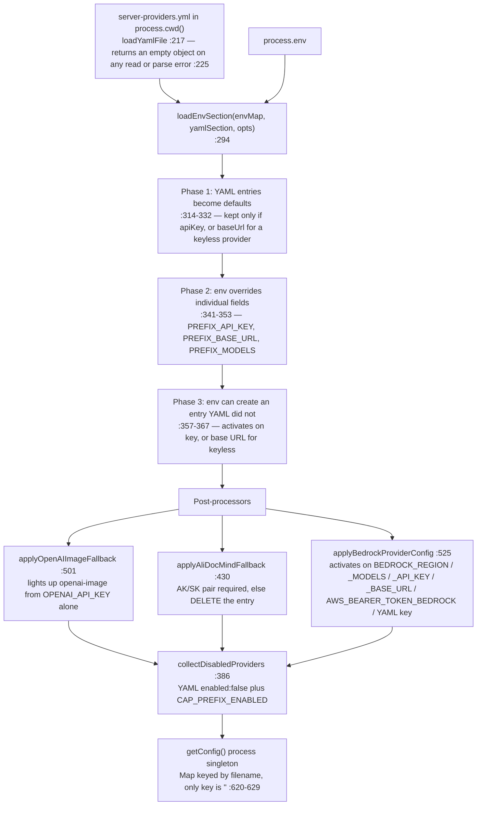
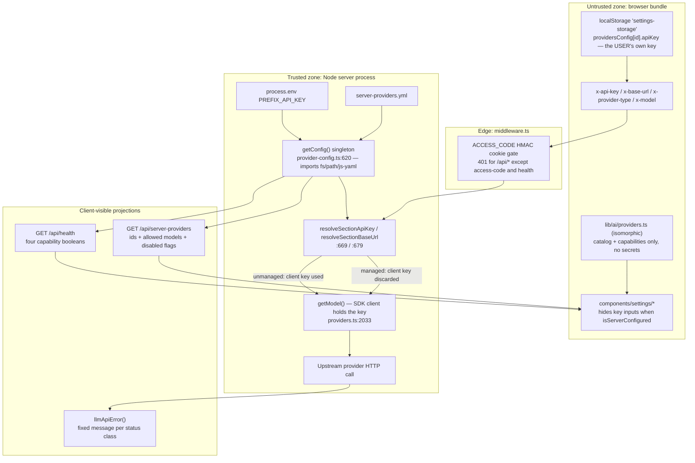
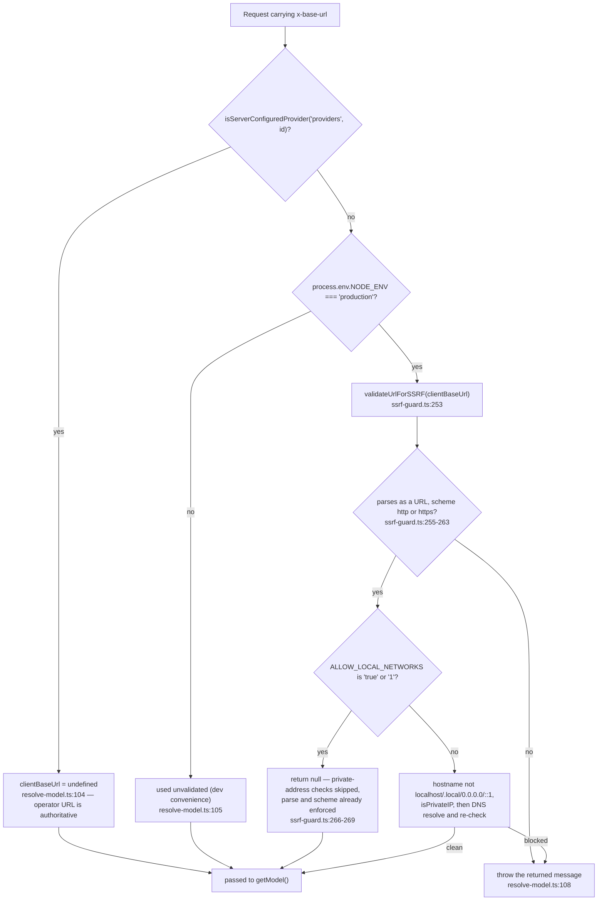

# Credential Flow and the Trust Boundary

Where an API key comes from in each deployment mode, the exact read sites, and what the code does
and does not guarantee about a browser bundle seeing an operator's key.

**Sources:** `lib/server/provider-config.ts`, `lib/server/resolve-model.ts`,
`app/api/server-providers/route.ts`, `app/api/health/route.ts`, `app/api/verify-*/route.ts`,
`lib/store/settings.ts`, `lib/store/kv-persist.ts`, `components/settings/provider-config-panel.tsx`,
`lib/server/ssrf-guard.ts`;
[../appendix/research/ai-provider-layer/01b-modules-server.md](docs/appendix/research/ai-provider-layer/01b-modules-server.md),
[../appendix/research/persistence-storage-state/00-overview.md](docs/appendix/research/persistence-storage-state/00-overview.md).

## The single rule

A provider is **server-managed** iff an entry for it exists in the loaded server config. There is
no third state.

```ts
// lib/server/provider-config.ts:646
export function isServerConfiguredProvider(section: ProviderSection, providerId: string): boolean {
  return !!getConfig()[section][providerId];
}

// lib/server/provider-config.ts:669
function resolveSectionApiKey(section, providerId, clientKey?): string {
  const entry = getConfig()[section][providerId];
  if (entry) return entry.apiKey || '';   // managed: server key is authoritative
  return clientKey || '';                  // unmanaged: client-supplied key only
}

// lib/server/provider-config.ts:679
function resolveSectionBaseUrl(section, providerId, clientBaseUrl?): string | undefined {
  const entry = getConfig()[section][providerId];
  if (entry) return entry.baseUrl;   // managed: server base URL is authoritative
  return clientBaseUrl;              // unmanaged: client-supplied base URL only
}
```

The header comment at [`lib/server/provider-config.ts:631`](lib/server/provider-config.ts#L631)–[`:641`](lib/server/provider-config.ts#L641) records why there are exactly two
branches: *"This single rule removes the tri-state where a client base URL could partially override
server config (the bug class #533 patched route-by-route)."*

Note the consequence at `:675`: a managed entry with an empty `apiKey` returns `''`, **not** the
client's key. A provider the operator configured with only a base URL (Ollama, Lemonade, Bedrock)
therefore locks the client out of supplying a key for it. That is deliberate for keyless providers
and is the reason `applyAliDocMindFallback` deletes a bare YAML-only entry (`:443`) — a managed
entry with unusable credentials would both lock out the client and silently discard the client's
AK/SK.

The three LLM-facing wrappers are one-liners over those helpers:

| Export | Line | Section |
| --- | --- | --- |
| `resolveApiKey(providerId, clientKey?)` | `:725` | `providers` |
| `resolveBaseUrl(providerId, clientBaseUrl?)` | `:730` | `providers` |
| `resolveProxy(providerId)` | `:735` | `providers`, server-only, **no client parameter** |

`ProviderSection` is `'providers' | 'tts' | 'asr' | 'pdf' | 'image' | 'video' | 'webSearch'`
(`:643`); every capability has the same pair (`resolveTTSApiKey` `:768`, `resolveImageApiKey`
`:934`, `resolveVideoApiKey` `:993`, `resolvePDFApiKey` `:903`, `resolveASRApiKey` `:866`,
`resolveWebSearchApiKey` `:1055`).

## How the server config is built



Two properties of that build worth remembering:

- **Env wins per field, not per entry.** A YAML entry supplying `apiKey` + `baseUrl` + `models`
  and an env supplying only `<PREFIX>_BASE_URL` yields the YAML key with the env URL
  (`:343`–`:345`).
- **`proxy` is YAML-only.** Phase 1 copies `proxy: entry.proxy` (`:328`); phase 3 does not
  (`:363`–`:367`). There is no `<PREFIX>_PROXY` variable anywhere in the codebase.
- **`getConfig()` is a process singleton.** Once read, `server-providers.yml` and every
  `<PREFIX>_*` variable are frozen for the process lifetime. Rotating a key requires a restart.

## The three credential origins

| Origin | Read site | Reaches the provider how |
| --- | --- | --- |
| **Env var** `<PREFIX>_API_KEY` | [`lib/server/provider-config.ts:336`](lib/server/provider-config.ts#L336) | Becomes `ServerProviderEntry.apiKey`, returned by `resolveApiKey` for a managed provider |
| **`server-providers.yml`** `providers.<id>.apiKey` | [`lib/server/provider-config.ts:322`](lib/server/provider-config.ts#L322) | Same, unless an env var overrides the field |
| **User settings** (`providersConfig[id].apiKey` in the browser) | sent as `x-api-key`; read at [`lib/server/resolve-model.ts:170`](lib/server/resolve-model.ts#L170) | Used only when the provider is **unmanaged** ([`:112`](lib/server/resolve-model.ts#L112) passes it as `clientApiKey`) |

Special cases:

- **`bedrock` never uses a key for signing.** `requiresApiKey: false`
  ([`lib/ai/providers.ts:418`](lib/ai/providers.ts#L418)), and `getModel()`'s bedrock branch passes
  `apiKey: effectiveApiKey || undefined` plus a `fromNodeProviderChain()` credential provider
  ([`lib/ai/providers.ts:2276`](lib/ai/providers.ts#L2276)–[`:2281`](lib/ai/providers.ts#L2281)). Credentials come from the AWS default chain (instance role,
  `AWS_*` env, shared config). `resolveModel` additionally refuses Bedrock unless
  `providerId === 'bedrock'` **and** the provider is server-managed
  ([`lib/server/resolve-model.ts:101`](lib/server/resolve-model.ts#L101)) — a browser cannot opt itself into the host's IAM role.
- **`minimax` with an `sk-cp-` key** goes into Anthropic's `authToken` rather than `apiKey`
  ([`lib/ai/providers.ts:2237`](lib/ai/providers.ts#L2237)).
- **AliDocMind uses AK/SK.** `resolveManagedAliDocMindCredentials()`
  ([`lib/server/provider-config.ts:469`](lib/server/provider-config.ts#L469)) returns the pair only when both halves are present.

## Where user keys live

`lib/store/settings.ts` persists the whole state (there is no `partialize`) under the key
`settings-storage` (`:1984`) through `createKVPersistStorage<Partial<SettingsState>>('account', …)`
(`:1987`). No `kv` backend is passed, so the adapter falls back to
`defaultKv ??= new BrowserKVStore()` ([`lib/store/kv-persist.ts:473`](lib/store/kv-persist.ts#L473)) — i.e. `localStorage`.
`providersConfig[<id>].apiKey` therefore sits in the browser's `localStorage`, on the user's own
machine, in plaintext, and is sent per-request in `x-api-key`.

Client-side `x-api-key` producers, all reading the settings store:
[`app/generation-preview/page.tsx:262`](app/generation-preview/page.tsx#L262), [`lib/hooks/use-scene-generator.ts:80`](lib/hooks/use-scene-generator.ts#L80),
[`lib/media/media-orchestrator.ts:282`](lib/media/media-orchestrator.ts#L282) and [`:332`](lib/media/media-orchestrator.ts#L332),
[`components/scene-renderers/pbl/v2/submission.tsx:456`](components/scene-renderers/pbl/v2/submission.tsx#L456),
[`components/scene-renderers/pbl/v2/use-instructor-stream.ts:296`](components/scene-renderers/pbl/v2/use-instructor-stream.ts#L296),
[`components/scene-renderers/quiz-view.tsx:104`](components/scene-renderers/quiz-view.tsx#L104), [`components/settings/image-settings.tsx:128`](components/settings/image-settings.tsx#L128),
[`components/settings/video-settings.tsx:90`](components/settings/video-settings.tsx#L90).

The settings panel hides the key and base-URL inputs entirely when a provider is server-managed
([`components/settings/provider-config-panel.tsx:222`](components/settings/provider-config-panel.tsx#L222), with the comment at [`:220`](components/settings/provider-config-panel.tsx#L220)–[`:221`](components/settings/provider-config-panel.tsx#L221)), and
renders a "server configured" notice at `:214`–`:218`.

## Can a user bundle see a server key?

**No, and the containment is structural rather than declarative.** Four independent facts, each
verifiable:

1. **The only client-reachable projection of the LLM config withholds credentials by
   construction.** `getServerProviders()` ([`lib/server/provider-config.ts:698`](lib/server/provider-config.ts#L698)) builds a fresh
   object containing at most `{ models }` per provider id. Its docstring at `:693`–`:697` states
   the reason: *"never the API key or the base URL, which can reveal internal gateway/proxy
   infrastructure."* `GET /api/server-providers` returns exactly the seven such projections plus
   `generation.parallelSceneConcurrency` ([`app/api/server-providers/route.ts:18`](app/api/server-providers/route.ts#L18)–[`:28`](app/api/server-providers/route.ts#L28)).
2. **`GET /api/health` publishes only booleans.** Four `Object.values(...).some(info => !info.disabled)`
   expressions ([`app/api/health/route.ts:18`](app/api/health/route.ts#L18)–[`:21`](app/api/health/route.ts#L21)).
3. **No route echoes a credential.** A scan of all `route.ts` files under `app/api` found no
   `apiSuccess(...)` payload within 12 lines of an `apiKey`, `accessKeySecret` or `Bearer`
   reference. Upstream error bodies are also withheld: `messageForStatus`
   ([`lib/server/llm-error-response.ts:49`](lib/server/llm-error-response.ts#L49)) emits fixed strings, and the docstring at [`:59`](lib/server/llm-error-response.ts#L59)–[`:62`](lib/server/llm-error-response.ts#L62)
   names "credential-adjacent details" as the thing being suppressed.
4. **`lib/server/provider-config.ts` cannot be bundled for the browser.** It imports `fs`, `path`
   and `js-yaml` at module top level (`:8`–`:10`), so a client component importing it fails the
   Next build. A scan of every `'use client'` file under `app/`, `lib/` and `components/` found
   **zero** imports from `@/lib/server/*`.

What is **not** in place, stated plainly so nobody assumes it:

- There is no `server-only` package in the repo — no dependency in `package.json`, no importer
  anywhere. Containment relies on the Node-builtin imports and on `instrumentation.ts` importing
  `config-validation` dynamically ([`instrumentation.ts:28`](instrumentation.ts#L28), with the comment at `:26`–`:27`
  explaining that the dynamic form keeps `fs`/`js-yaml` out of the Edge bundle).
- `lib/ai/providers.ts` **is** in the client bundle (`lib/store/settings.ts` imports it). It
  contains no credential and reads no env var for one; its only env reads are
  `OPENAI_COMPAT_USE_STREAMING_CHAT` (`:1842`) and the three Bedrock region variables (`:1775`–`:1777`),
  none of which are secrets. This is also why it cannot import `lib/ai/thinking-context.ts` — see
  the comment at `:59`–`:62`.
- The one auth gate is `ACCESS_CODE` in `middleware.ts`, a shared password with no per-user
  identity. Any client that clears that gate can send any `x-api-key` and use any **unmanaged**
  provider at the deployment's expense — but it still cannot read a managed provider's key.



## The unmanaged path is SSRF-gated, in production only



`ALLOW_LOCAL_NETWORKS` is a single global switch that disables the hostname and private-address
checks at all 20 `validateUrlForSSRF` call sites ([`lib/server/ssrf-guard.ts:266`](lib/server/ssrf-guard.ts#L266)–[`:269`](lib/server/ssrf-guard.ts#L269)), not just
this layer's — and not the strict `normalizeUrlForStrictFetch` / `assertSafeIp` path, which it does
not reach.
[`.env.example:461`](.env.example#L461)–[`:463`](.env.example#L463) documents it as required for self-hosted Ollama and says "Do NOT enable
on public deployments".

Two asymmetries inside this layer:

- [`resolve-model.ts:105`](lib/server/resolve-model.ts#L105), [`verify-image-provider/route.ts:57`](app/api/verify-image-provider/route.ts#L57), [`verify-video-provider/route.ts:52`](app/api/verify-video-provider/route.ts#L52)
  and [`verify-pdf-provider/route.ts:58`](app/api/verify-pdf-provider/route.ts#L58)/[`:83`](app/api/verify-pdf-provider/route.ts#L83)/[`:132`](app/api/verify-pdf-provider/route.ts#L132) all gate the check on `NODE_ENV === 'production'`.
  [`provider/probe-models/route.ts:33`](app/api/provider/probe-models/route.ts#L33) validates **unconditionally** — the only route in this layer
  that does.
- `probe-models` sets `redirect: 'manual'` and rejects any 3xx ([`lib/server/model-fetch.ts:127`](lib/server/model-fetch.ts#L127),
  `:132`). `getModel()`'s provider fetches set no `redirect` option, so they follow the platform
  default.

## Per-capability credential separation

`verify-pdf-provider` shows the intended shape most clearly. For AliDocMind
([`app/api/verify-pdf-provider/route.ts:30`](app/api/verify-pdf-provider/route.ts#L30)–[`:78`](app/api/verify-pdf-provider/route.ts#L78)):

- managed → server AK/SK/endpoint only, client values ignored entirely (`:35`–`:44`);
- unmanaged → client AK/SK only, and the comment at `:45`–`:46` states it never falls back to
  server env. A missing half is a 400, not a silent server-credential borrow.

The image and video verify routes follow the same discipline: `managed ? undefined : header`
for both key and base URL ([`verify-image-provider/route.ts:54`](app/api/verify-image-provider/route.ts#L54)–[`:55`](app/api/verify-image-provider/route.ts#L55),
[`verify-video-provider/route.ts:49`](app/api/verify-video-provider/route.ts#L49)–[`:50`](app/api/verify-video-provider/route.ts#L50)), plus a force-disable check that answers 403 before any
credential is touched (`:48`, `:43`).

## Open questions

- Rotating a managed key requires a process restart, because `getConfig()` caches for the process
  lifetime ([`lib/server/provider-config.ts:620`](lib/server/provider-config.ts#L620)–[`:629`](lib/server/provider-config.ts#L629)). No reload path or cache-invalidation hook
  exists. Whether deployments accept that or restart on rotation is outside the repo.
- User keys sit in `localStorage` unencrypted and are transmitted per request. There is no
  server-side per-user key vault; the `account` KV scope is capable of being server-backed
  ([`lib/store/kv-persist.ts:9`](lib/store/kv-persist.ts#L9)) but nothing in `lib/persistence/bootstrap.ts` switches it, so in
  the shipped configuration the key never leaves the machine except as `x-api-key`.
- `ALLOW_LOCAL_NETWORKS=true` disables SSRF validation globally for 13 routes across the codebase,
  not just for the provider base URL that motivates it. No narrower per-provider allowlist exists.
