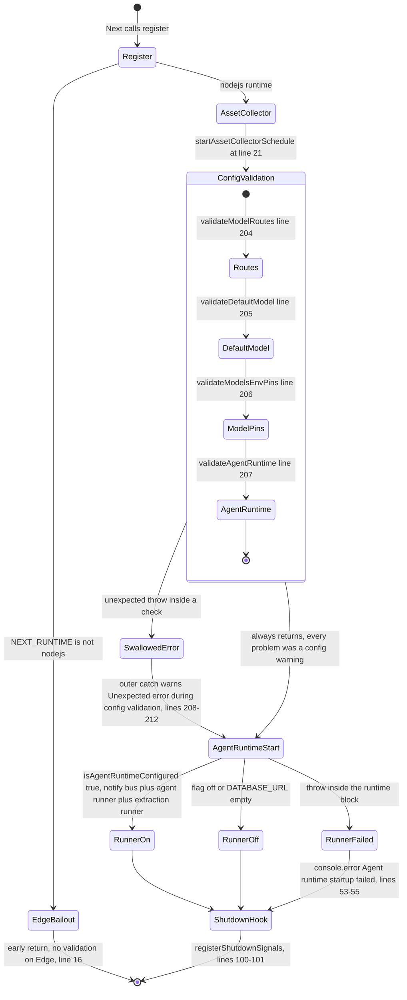
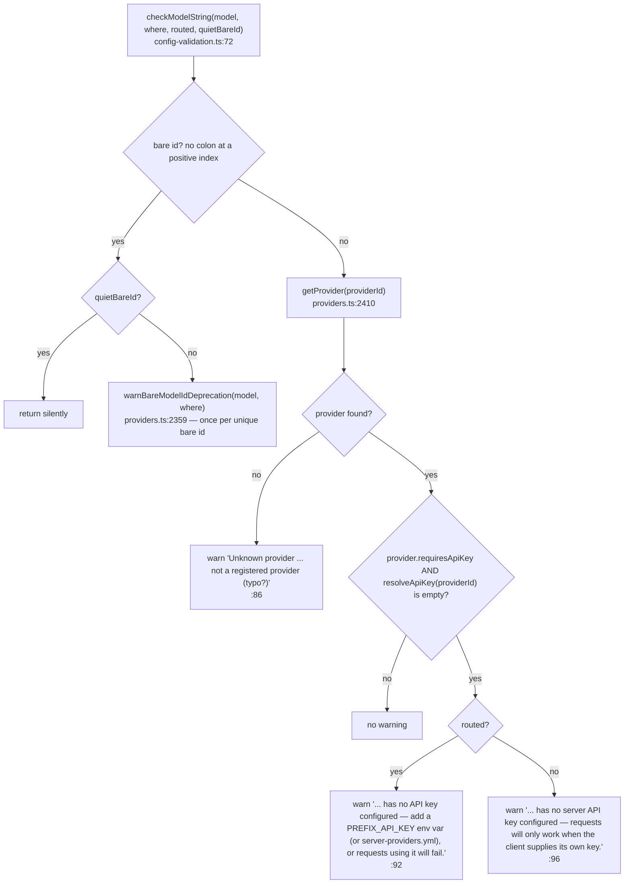
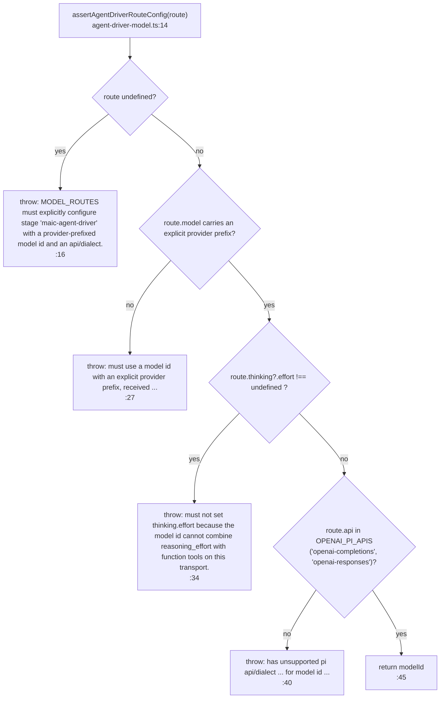

# Boot-Time Configuration Validation

What runs once per server instance before the first request, which of the four checks can produce
which warning, and the single place in this layer where a configuration error is fatal rather than
advisory.

**Sources:** `instrumentation.ts`, `lib/server/config-validation.ts`,
`lib/server/agent-runtime/agent-driver-model.ts`, `lib/server/model-routes.ts`,
`lib/server/provider-config.ts`, `lib/config/feature-flags.ts`, [`lib/ai/providers.ts:2347-2365`](lib/ai/providers.ts#L2347-L2365),
[`.env.example:340-372`](.env.example#L340-L372);
[../appendix/research/ai-provider-layer/03-flows.md](docs/appendix/research/ai-provider-layer/03-flows.md),
[../appendix/research/ai-provider-layer/05-failure-modes.md](docs/appendix/research/ai-provider-layer/05-failure-modes.md).

## Where it hangs off

`instrumentation.ts` exports `register()` (`:13`), which Next calls **once per server instance,
before it serves a request** — the file header at `:1`–`:12` explains that this is the only place in
the app where a process-scoped schedule can live, because a route module has no such guarantee.



Two ordering facts matter:

1. Validation is imported **dynamically** ([`instrumentation.ts:28`](instrumentation.ts#L28)) precisely so the Edge bundle
   never pulls in the `fs`/`js-yaml`-backed provider config it reads — the comment at `:26`–`:27`
   says so. The `NEXT_RUNTIME` guard at `:16` means Edge instances never validate at all.
2. Validation runs **before** the agent-runtime startup block (`:36` onward), so the
   `maic-agent-driver` route warning is printed before the runner would have failed on it.

## The contract: warn, never throw

```ts
// lib/server/config-validation.ts:202
export function validateServerConfig(): void {
  try {
    validateModelRoutes();
    validateDefaultModel();
    validateModelsEnvPins();
    validateAgentRuntime();
  } catch (err) {
    // Boot-time validation must never take the server down.
    const detail = err instanceof Error ? err.message : String(err);
    warn(`Unexpected error during config validation: ${detail}`);
  }
}
```

Every message is emitted by `warn()` (`:44`) with the fixed prefix `[config]` (`WARN_PREFIX`,
`:42`) via `console.warn` — not through the app logger, so it is unconditional and appears
regardless of `LOG_LEVEL`. The file header at `:22`–`:24` states the design intent: *"operators
with partial config still get a running app, and the warnings name exactly what is broken."*

## The four checks

### 1. `validateModelRoutes()` — `:102`

Re-parses `process.env.MODEL_ROUTES` independently of `lib/server/model-routes.ts` (it does not
call `loadRoutes()`), so the two parsers can disagree in principle.

| Condition | Message shape | Line |
| --- | --- | --- |
| unset / blank | silent return | `:104` |
| not valid JSON | `MODEL_ROUTES is not valid JSON — check the value (model routing falls back to DEFAULT_MODEL).` | `:110` |
| valid JSON, not an object (or an array) | `MODEL_ROUTES must be a JSON object mapping stage -> model; ignoring it.` | `:116` |
| key not in `LLM_STAGES` | `Unknown stage "<key>" in MODEL_ROUTES — not a routable stage (typo?). Valid stages: …` | `:122` |
| value has no extractable model string | silent `continue` — `model-routes.ts` warns about bad values at parse | `:128` |
| otherwise | `checkModelString(model, 'MODEL_ROUTES stage "<key>"', routed=true, quietBareId)` | `:133` |

`routeModel(value)` (`:49`) extracts the model from either the string or the `{model}` form.

`quietBareId` (`:132`) is true only for the `maic-agent-driver` key when the agent runtime flag is
on, because `assertAgentDriverRouteConfig` already reports a bare driver model id — the comment at
`:129`–`:131` explains that only the duplicate is suppressed, and the provider-registration and
key checks still run.

### 2. `validateDefaultModel()` — `:137`

Same `checkModelString` with `routed=false`.

### `checkModelString` — the routed/unrouted split — `:72`



The split is the useful part: a routed stage can only ever use the server's key (client params are
dropped, see [./03-stage-routing.md](docs/04-ai-provider-layer/03-stage-routing.md)), so a missing key there is a hard
warning. On `DEFAULT_MODEL` the same condition is only a note because the browser's own key can
still make the request work.

`warnBareModelIdDeprecation` ([`lib/ai/providers.ts:2359`](lib/ai/providers.ts#L2359)) dedupes on a module-level
`Set<string>` (`:2351`) and returns a boolean so callers can tell whether the warning fired. Its
docstring at `:2353`–`:2358` restricts callers to **config-derived** ids only, because the dedupe
set is unbounded and a request-derived id would let a client grow it. The message constant is
`BARE_MODEL_ID_DEPRECATION_MSG` at `:2347`.

### 3. `validateModelsEnvPins()` — `:148`

Walks all 21 `LLM_ENV_MAP` prefixes. For each with `<PREFIX>_MODELS` set:

| Condition | Result | Line |
| --- | --- | --- |
| provider id not in the registry | `<PREFIX>_MODELS is set for provider "<id>" — not a registered provider (typo?).` | `:153` |
| key-requiring provider with no `resolveApiKey` | warn naming the missing `<PREFIX>_API_KEY` | `:163` |
| keyless provider that is neither server-configured nor has a `defaultBaseUrl` | warn naming the missing `<PREFIX>_BASE_URL` | `:162`–`:165` |

The `configured` expression at `:158`–`:160` is why `OLLAMA_MODELS` alone never warns: `ollama` has
a `defaultBaseUrl` ([`lib/ai/providers.ts:1508`](lib/ai/providers.ts#L1508)), so it counts as configured.

Because `TENCENT` and `TENCENT_HUNYUAN` both map to `tencent-hunyuan`, and `XIAOMI` and `MIMO` both
map to `xiaomi` ([`lib/server/provider-config.ts:88`](lib/server/provider-config.ts#L88)–[`:91`](lib/server/provider-config.ts#L91)), setting the pin under one prefix and
the key under the other produces a warning that names a prefix the operator did not use.

### 4. `validateAgentRuntime()` — `:177`

| Condition | Result | Line |
| --- | --- | --- |
| runtime flag off, `NEXT_PUBLIC_PRO_WORKBENCH_ENABLED` on | warn that the Workbench UI is enabled but its API routes answer 404, then return | `:179`–`:184` |
| runtime flag off, public flag off | silent return | `:184` |
| flag on, `DATABASE_URL` blank | warn that the runtime is enabled but unusable — probe reports disabled, routes answer 404, no runner starts | `:187`–`:189` |
| always, when the flag is on | `assertAgentDriverRouteConfig(getStageRoute('maic-agent-driver'))` inside a try/catch; the thrown message becomes a `[config]` warning | `:191`–`:195` |

The two flags come from `lib/config/feature-flags.ts`: `isAgentRuntimeEnabled()` reads
`OPENMAIC_AGENT_RUNTIME_ENABLED` (`:19`) and `isProWorkbenchEnabled()` reads
`NEXT_PUBLIC_PRO_WORKBENCH_ENABLED` (`:33`), both through a strict `readBoolean` that accepts only
`'true'` or `'1'` (`:10`–`:12`). `isAgentRuntimeConfigured()` (`:23`) is the conjunction with a
non-empty `DATABASE_URL` and is what [`instrumentation.ts:38`](instrumentation.ts#L38) gates the runner on.

## The one strict contract: the agent driver route

`assertAgentDriverRouteConfig` ([`lib/server/agent-runtime/agent-driver-model.ts:14`](lib/server/agent-runtime/agent-driver-model.ts#L14)) is the only
function in this layer that **throws** on bad configuration. It returns the bare model id on
success.



The reason each guard exists is written into the code:

- **Provider prefix required** (`:21`–`:23`): `parseModelString` silently defaults a bare id to
  `openai`, so the driver must fail before `resolveModel` reaches that fallback and routes to the
  wrong provider.
- **No `thinking.effort`** (`:35`–`:36`): the transport cannot combine `reasoning_effort` with
  function tools.
- **`api` must be an OpenAI pi dialect** (`OPENAI_PI_APIS`, `:12`). `buildPiDriverModel` re-checks
  the same set at `:53` and throws its own copy of the message at `:55` — belt and braces, since
  `buildPiDriverModel` is exported and callable independently.

### Boot vs runtime: the same assertion, two fates

| Caller | Behaviour on a bad driver route |
| --- | --- |
| [`lib/server/config-validation.ts:192`](lib/server/config-validation.ts#L192) | wrapped in try/catch → downgraded to a `[config]` warning; the server boots and the runner starts |
| [`lib/server/agent-runtime/agent-driver-model.ts:92`](lib/server/agent-runtime/agent-driver-model.ts#L92) | **not** caught → `resolveAgentDriverModel()` rejects, and `runSession` fails at [`lib/server/agent-runtime/runner.ts:1262`](lib/server/agent-runtime/runner.ts#L1262) |

So a deployment with the runtime flag on, a database, and a malformed driver route starts cleanly,
accepts sessions, and fails every session at run start. The boot warning is the only advance
notice. [`.env.example:355`](.env.example#L355)–[`:365`](.env.example#L365) calls the route "REQUIRED while the runtime is enabled" and spells
out the constraints.

## What boot validation does *not* check

| Not checked | Where it surfaces instead |
| --- | --- |
| That a routed model id exists in the provider's catalog | Nowhere. An unknown model id is sent to the provider verbatim; a 404 comes back as `Upstream endpoint not found.` ([`lib/server/llm-error-response.ts:53`](lib/server/llm-error-response.ts#L53)) |
| That `server-providers.yml` parses | `loadYamlFile` returns an empty object on any error and warns from [`provider-config.ts:226`](lib/server/provider-config.ts#L226); every provider then becomes unmanaged |
| That a managed provider's key is valid | Only `POST /api/verify-model` — see [./06-verify-routes.md](docs/04-ai-provider-layer/06-verify-routes.md) |
| That `api`/`contextWindow` on a non-driver stage will ever be read | Nothing warns; they are inert by design ([`lib/server/model-routes.ts:48`](lib/server/model-routes.ts#L48)–[`:51`](lib/server/model-routes.ts#L51)) |
| That `DEFAULT_MODEL` is set at all | Only the request throws, from [`lib/server/resolve-model.ts:66`](lib/server/resolve-model.ts#L66) |
| Anything on the Edge runtime | [`instrumentation.ts:16`](instrumentation.ts#L16) returns before validating |

## Related failure modes

`lib/server/model-routes.ts` degrades separately from validation because it is lazy: `loadRoutes()`
runs on the first `getStageRoute()` call, which for most stages is the first request. So an invalid
`MODEL_ROUTES` produces **two** log lines — a `[config]` warning at boot ([`config-validation.ts:110`](lib/server/config-validation.ts#L110))
and a `model-routes` `log.error` on first use ([`model-routes.ts:237`](lib/server/model-routes.ts#L237)). Same for an unknown stage key
(`:225`).

## Open questions

- `validateModelRoutes` and `loadRoutes` parse the same env var with two independent
  implementations. They agree today; nothing pins them together.
- The boot warnings go to `console.warn` and are not structured, so they are not queryable in a log
  aggregator the way `createLogger` output is. Whether that is deliberate (visibility during
  container start) or an oversight is not recorded.
