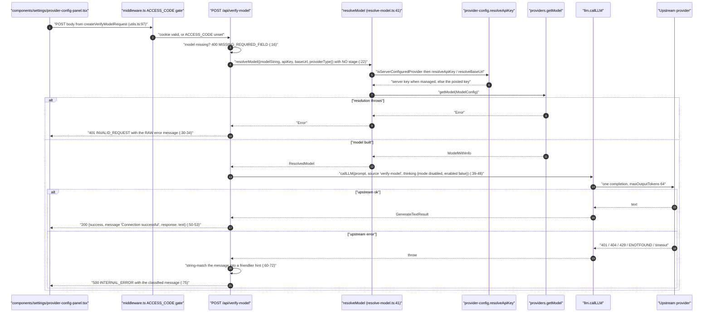
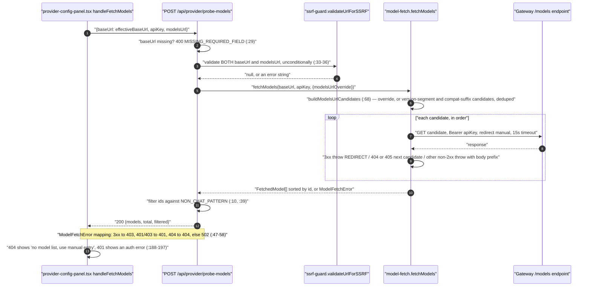

# The verify-* Handshake Routes

Four `verify-*` routes plus one discovery route. For each: what it verifies, the exact probe it
issues upstream, the status mapping, and how a failure reaches the settings UI.

**Sources:** `app/api/verify-model/route.ts`, `app/api/verify-image-provider/route.ts`,
`app/api/verify-video-provider/route.ts`, `app/api/verify-pdf-provider/route.ts`,
`app/api/provider/probe-models/route.ts`, `lib/server/model-fetch.ts`,
`lib/server/api-response.ts`, `lib/media/adapters/openai-image-adapter.ts`,
`components/settings/{provider-config-panel,model-edit-dialog,image-settings,video-settings,pdf-settings,utils}.*`;
[../appendix/research/ai-provider-layer/03-flows.md](docs/appendix/research/ai-provider-layer/03-flows.md).

## The five routes

| Route | Verifies | Probe issued | UI caller |
| --- | --- | --- | --- |
| `POST /api/verify-model` | An LLM `provider:model` + credentials actually answer | One `callLLM` with `prompt: 'Say "OK" if you can hear me.'`, `maxOutputTokens: 64`, thinking forced off | [`provider-config-panel.tsx:136`](components/settings/provider-config-panel.tsx#L136), [`model-edit-dialog.tsx:73`](components/settings/model-edit-dialog.tsx#L73) |
| `POST /api/provider/probe-models` | A base URL exposes an OpenAI-style `/models` list | ordered candidate `GET`s with `redirect: 'manual'`, 15 s timeout | [`provider-config-panel.tsx:173`](components/settings/provider-config-panel.tsx#L173) |
| `POST /api/verify-image-provider` | Image provider credentials | per-adapter `test*Connectivity`; e.g. OpenAI Image does `GET {baseUrl}/models/{model}` | [`image-settings.tsx:123`](components/settings/image-settings.tsx#L123) |
| `POST /api/verify-video-provider` | Video provider credentials | per-adapter `testVideoConnectivity` | [`video-settings.tsx:85`](components/settings/video-settings.tsx#L85) |
| `POST /api/verify-pdf-provider` | PDF/extraction provider credentials | three branches: AliDocMind AK/SK sign, MinerU Cloud bearer probe, self-hosted root `GET` | [`pdf-settings.tsx:78`](components/settings/pdf-settings.tsx#L78) |

There is **no** verify route for TTS, ASR or web search. [`asr-settings.tsx:165`](components/settings/asr-settings.tsx#L165) tests ASR by
posting a real clip to `/api/transcription`; TTS is exercised by generating a sample through
`/api/generate/tts`. Anything a `verify-*` route would have centralised — the force-disable check,
the managed-credential discard — is duplicated inside those production routes instead.

## `POST /api/verify-model`

### Deliberate: no `stage`

`resolveModel` is called with no `stage` ([`app/api/verify-model/route.ts:22`](app/api/verify-model/route.ts#L22)), so `getStageRoute`
returns `undefined`, `routed` is false, and the user's posted `apiKey` / `baseUrl` /
`providerType` are honoured. A stage route cannot shadow the model the user is trying to test. The
managed/unmanaged rule still applies, so testing a managed provider tests the **operator's** key,
not whatever the user typed — which is consistent with the UI hiding those inputs
([`components/settings/provider-config-panel.tsx:222`](components/settings/provider-config-panel.tsx#L222)).

### Deliberate: thinking forced off

`{ mode: 'disabled', enabled: false }` is passed as the fourth `callLLM` argument (`:47`). Because
`callLLM` resolves `thinking ?? getGlobalThinkingConfig()` ([`lib/ai/llm.ts:342`](lib/ai/llm.ts#L342)), an explicit
config wins over `LLM_THINKING_DISABLED`; and because the value is `disabled`,
`getCompatThinkingBodyParams` emits the model's disable shape rather than nothing at all. A verify
probe therefore also exercises the thinking-disable path for compatible providers.

### The status asymmetry

| Failure | HTTP | Body `error` |
| --- | --- | --- |
| `model` field absent | 400 | `Model name is required` |
| `resolveModel` throws (unknown provider, missing key, type mismatch, Bedrock refusal, SSRF) | **401** | the raw thrown message |
| upstream 401 / `Unauthorized` in the message | **500** | `API key is invalid or expired` |
| upstream 404 / `not found` | 500 | `Model not found or API endpoint error` |
| upstream 429 | 500 | `API rate limit exceeded, please try again later` |
| `ENOTFOUND` / `ECONNREFUSED` | 500 | `Cannot connect to API server, please check the Base URL` |
| message contains `timeout` | 500 | `Connection timed out, please check your network` |
| anything else | 500 | `error.message` verbatim |

Two things stand out:

1. **A resolution failure is 401 and an authentication failure is 500** — the inverse of what a
   caller would expect. The UI does not read the status for this route (it branches on
   `data.success`, [`provider-config-panel.tsx:153`](components/settings/provider-config-panel.tsx#L153)), so the mismatch is invisible in practice.
2. **`verify-model` deliberately does not use `llmApiError`** ([`lib/server/llm-error-response.ts:63`](lib/server/llm-error-response.ts#L63)),
   the helper that maps SDK errors to sanitised codes for the generation routes. It string-matches
   `error.message` instead, and the `else` branch at `:71` returns the raw provider message —
   which for some gateways includes the request URL. This is the one place in the layer where an
   upstream body can reach the browser.

### Classification is substring matching, not status inspection

`error.message.includes('401')` (`:60`) matches any message containing the literal `401`,
including a model id like `qwen3-401b`. `statusFromError` in [`lib/server/llm-error-response.ts:24`](lib/server/llm-error-response.ts#L24)
does the structural walk (`APICallError.statusCode`, then `RetryError.lastError` and `errors[]`,
then generic `statusCode`/`status`/`status_code`, then `cause`, with a `seen` set for cyclic error
graphs) and is not used here.

## `POST /api/provider/probe-models`

### The candidate ladder

`buildModelsUrlCandidates` ([`lib/server/model-fetch.ts:68`](lib/server/model-fetch.ts#L68)), ported from cc-switch:

1. A `modelsUrlOverride` short-circuits to that single candidate (`:73`).
2. If the base URL ends in a version segment (`/v1`, `.../paas/v4`): `{base}/models`, plus
   `{base}/v1/models` when the segment is not exactly `/v1` (`:80`–`:84`).
3. Otherwise `{base}/v1/models` (`:86`).
4. If the base ends in one of nine `KNOWN_COMPAT_SUFFIXES` (`:23`, ordered longest-first so
   `/api/anthropic` wins over `/anthropic`), also add the stripped root plus `/v1/models` and
   `/models` (`:89`–`:96`).
5. Linear dedupe preserving first occurrence (`:99`).

`fetchModels` (`:114`) treats 404/405 as "wrong path, try the next" (`:143`) and any other non-2xx
as terminal, carrying the upstream status and the first 512 bytes of the body into
`ModelFetchError` (`:149`). Exhausting all candidates raises `ModelFetchError(404, 'No /models
endpoint found (tried: …)')` (`:152`).

### The 404 is a protocol, not an error

[`app/api/provider/probe-models/route.ts:54`](app/api/provider/probe-models/route.ts#L54)–[`:57`](app/api/provider/probe-models/route.ts#L57) re-emits a `ModelFetchError` 404 as HTTP 404 with
the comment "signal the UI (via 404) to use manual model entry". The UI honours it at
[`components/settings/provider-config-panel.tsx:188`](components/settings/provider-config-panel.tsx#L188). That is why the Volcengine Ark token plan
ships a curated model list instead of probing — the plan endpoint 404s on `/models`, documented at
[`lib/config/token-plan-presets.ts:134`](lib/config/token-plan-presets.ts#L134).

### Non-chat filtering

`NON_CHAT_PATTERN = /(tts|asr|whisper|embedding|rerank|mineru|image|video|voxcpm|moderation)/i`
(`:10`). It matches anywhere in the id, so a legitimate chat model whose name contains one of those
substrings is dropped silently — only the `filtered` count in the response hints at it.

## The three capability verify routes

`verify-image-provider` and `verify-video-provider` are the same shape, differing only in
provider registry and probe function:

| Step | Image (`verify-image-provider/route.ts`) | Video (`verify-video-provider/route.ts`) |
| --- | --- | --- |
| Provider id | `x-image-provider` header, else `resolveServerImageProviderId()` (`:41`) | `x-video-provider`, else `resolveServerVideoProviderId()` (`:36`) |
| No provider | 400 `MISSING_PROVIDER` (`:44`) | 400 `MISSING_PROVIDER` (`:39`) |
| Force-disabled | **403 `PROVIDER_DISABLED`** (`:48`) | 403 `PROVIDER_DISABLED` (`:43`) |
| Managed check | `managed ? undefined : header` for key and base URL (`:53`–`:55`) | same (`:48`–`:50`) |
| SSRF | client base URL, production only (`:57`) | same (`:52`) |
| Missing key | 400 `MISSING_API_KEY` when `provider.requiresApiKey` (`:68`) | 400 unconditionally when no key (`:62`) |
| Missing model | 400 `MISSING_MODEL`, skipped for workflow providers with no catalog (`:75`) | 400 `MISSING_MODEL` (`:67`) |
| Probe | `testImageConnectivity` ([`lib/media/image-providers.ts:163`](lib/media/image-providers.ts#L163)) — 8-way switch | `testVideoConnectivity` |
| Probe failed | 500 `UPSTREAM_ERROR` with `result.message` (`:91`) | 500 `UPSTREAM_ERROR` (`:83`) |
| Route ceiling | `export const maxDuration = 30` (`:37`), with the reason in the comment at `:34`–`:36` | none declared |

A representative probe: `testOpenAIImageConnectivity`
([`lib/media/adapters/openai-image-adapter.ts:26`](lib/media/adapters/openai-image-adapter.ts#L26)) does a `GET {baseUrl}/models/{model}` with
`redirect: 'manual'` and classifies 401/403 as auth failure, 404 as "model not found", anything
else non-OK as an API error. It never generates an image — the route docstring at
[`verify-image-provider/route.ts:4`](app/api/verify-image-provider/route.ts#L4) says "without generating images".

`verify-pdf-provider` is the strictest about credential separation, with three branches
(`app/api/verify-pdf-provider/route.ts`):

- **AliDocMind** (`:30`–`:78`): managed → server AK/SK/endpoint only; unmanaged → client AK/SK only,
  with the comment at `:45`–`:46` stating it never falls back to server env. A missing half is a
  400 `MISSING_REQUIRED_FIELD`. Bad credentials become 400 `INVALID_CREDENTIALS` (`:75`).
- **MinerU Cloud** (`:81`–`:128`): `GET {cloudBase}/extract-results/batch/test-connection` with a
  bearer token, 10 s timeout, `redirect: 'manual'`. Any 3xx is 403 `REDIRECT_NOT_ALLOWED`; only
  401/403 is treated as failure, because a 4xx "batch not found" still proves auth works — the
  comment at `:113`–`:114` says so.
- **Self-hosted** (`:130`–`:166`): `GET resolvedBaseUrl` with an optional bearer, 10 s timeout,
  `redirect: 'manual'`. Any HTTP response including 404 counts as success, because MinerU's FastAPI
  root has no route (`:161`–`:162`).

## How failures surface in the UI

All five callers follow the same three-state local pattern (`idle | testing | success | error`) and
render a message string. But they do not read the same field.

| Caller | Success message | Failure message | Correct? |
| --- | --- | --- | --- |
| [`provider-config-panel.tsx:153`](components/settings/provider-config-panel.tsx#L153) | `t('settings.connectionSuccess')` | `data.error \|\| t('settings.connectionFailed')` | yes — `apiError` sets `error` |
| [`model-edit-dialog.tsx:90`](components/settings/model-edit-dialog.tsx#L90) | same | `data.error \|\| …` | yes |
| [`pdf-settings.tsx:92`](components/settings/pdf-settings.tsx#L92) | same | `` `${t('settings.connectionFailed')}: ${data.error}` `` | yes |
| [`image-settings.tsx:133`](components/settings/image-settings.tsx#L133) | `t('settings.imageConnectivitySuccess')` | `` `${t('settings.imageConnectivityFailed')}: ${data.message}` `` | **no** |
| [`video-settings.tsx:95`](components/settings/video-settings.tsx#L95) | `t('settings.videoConnectivitySuccess')` | `` `${t('settings.videoConnectivityFailed')}: ${data.message}` `` | **no** |

`ApiErrorBody` is `{ success: false; errorCode; error; details? }`
([`lib/server/api-response.ts:44`](lib/server/api-response.ts#L44)) — there is no `message` field on the error envelope. `message`
exists only on the *success* envelope, because `apiSuccess({ message: result.message })` puts it
there ([`verify-image-provider/route.ts:94`](app/api/verify-image-provider/route.ts#L94)). So the image and video panels render
`"Image connectivity failed: undefined"` for every failure, discarding the diagnostic the route
went to the trouble of producing. The provider, model and PDF panels read `error` and are correct.

The `probe-models` caller is the only one that branches on HTTP status rather than the envelope
([`provider-config-panel.tsx:179`](components/settings/provider-config-panel.tsx#L179)–[`:197`](components/settings/provider-config-panel.tsx#L197)), which it must, because 404 there means "no model list"
rather than "failure".

## Open questions

- [`image-settings.tsx:138`](components/settings/image-settings.tsx#L138) and [`video-settings.tsx:100`](components/settings/video-settings.tsx#L100) read a field the error envelope never
  carries. This is a one-word fix (`data.message` → `data.error`) and has no test coverage on
  either side.
- There is no verify route for TTS, ASR or web search, so the force-disable and managed-credential
  checks for those capabilities exist only inside their production routes. Whether that is a
  deliberate scoping decision or an omission is not recorded anywhere in the code.
- `verify-model` returns raw upstream messages in its fallback branch while every generation route
  sanitises through `llmApiError`. The inconsistency is not commented, so it is unclear whether the
  raw message is intentional operator-facing diagnostics or an oversight.
