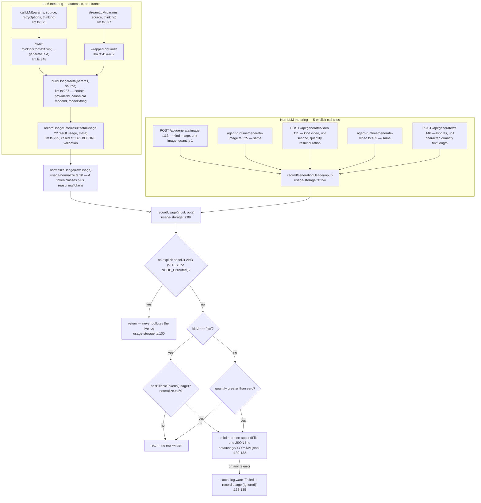
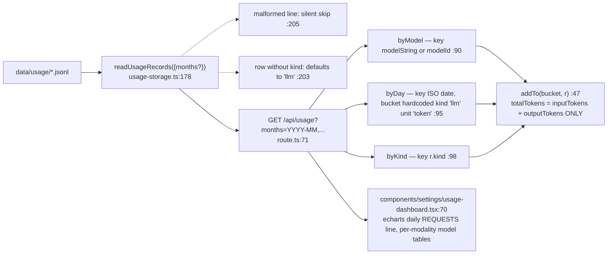

# Usage Accounting

What is metered, where the row lands, what reads it back, and the four places where a billed call
produces no row. Pure usage — there is no cost model anywhere in the codebase.

**Sources:** `lib/ai/llm.ts`, `lib/usage/normalize.ts`, `lib/server/usage-storage.ts`,
`app/api/usage/route.ts`, `components/settings/usage-dashboard.tsx`,
`app/api/generate/{image,video,tts}/route.ts`,
`lib/server/agent-runtime/generate-{image,video}.ts`, `eslint.config.mjs:575-667`,
`docker-compose.yml:40`;
[../appendix/research/ai-provider-layer/01b-modules-server.md](../appendix/research/ai-provider-layer/01b-modules-server.md).

## The metering path



## Why the funnel holds

Every server-side **text-generation** call goes through `callLLM` / `streamLLM`, and that much is
machine-enforced, not conventional. `eslint.config.mjs:608`–`:634` bans
`import { generateText, streamText } from 'ai'` everywhere except `lib/ai/llm.ts`, `eval/**` and
`tests/**`; `:650`–`:667` bans the dynamic `import('ai')` form via `AI_SDK_DYNAMIC_IMPORT_BAN`
(`:13`), which is spread into every block that sets `no-restricted-syntax` because flat config
*replaces* rule options per key rather than merging them (comment at `:584`–`:588`). `require('ai')`
is covered by the inherited `@typescript-eslint/no-require-imports`.

The comment at `eslint.config.mjs:575`–`:582` records why the rule exists: the PBL v2 runtime
drifted exactly this way in issue #1003 — five direct `generateText` calls meant zero usage records
for the busiest traffic in the product, plus three different meanings for one thinking config.

### What the rule does not reach

The ban is keyed on two names: `importNames: ['generateText', 'streamText']` from the `ai` package
(`:627`). Three classes of server-side model call therefore sit outside it, and none of them is a
lint violation:

| Call | Where | How usage is recorded |
| --- | --- | --- |
| Image and video generation | `app/api/generate/image/route.ts:114`, `generate/video/route.ts:112`, `lib/server/agent-runtime/generate-image.ts:326`, `generate-video.ts:410`, `lib/server/material-extraction/extract.ts:158` | `recordGenerationUsage` (`usage-storage.ts:154`), a sibling entry point to `callLLM`'s `recordUsageSafe` — not the funnel above |
| TTS | `app/api/generate/tts/route.ts:147` | same sibling entry point |
| ASR / transcription | `lib/audio/asr-providers.ts:149` imports `experimental_transcribe` from `'ai'` and calls the model directly | **not recorded at all.** `UsageKind` declares `'asr'` (`usage-storage.ts:21`) but no call site anywhere writes a row with that kind |

So the funnel holds for LLM rows. Non-LLM rows depend on each route remembering to call
`recordGenerationUsage`, which nothing enforces, and transcription currently does not.
`experimental_transcribe` is a name the `importNames` list does not cover, so a future modality added
the same way would also pass lint while writing no usage row.

## What a row looks like

```ts
// lib/server/usage-storage.ts:42
export interface UsageRecord {
  id: string;             // `${now.getTime()}-${counter.toString(36)}`, counter mod 1e6 (:68)
  createdAt: number;      // epoch ms
  kind: UsageKind;        // 'llm' | 'image' | 'video' | 'tts' | 'asr'  (:21)
  source: string;         // the callLLM `source` label, or the kind for non-LLM (:159)
  providerId: string;
  modelId: string;
  modelString: string;    // `${providerId}:${modelId}`
  inputTokens: number;
  outputTokens: number;
  cacheReadTokens: number;
  cacheCreationTokens: number;
  reasoningTokens: number;
  quantity?: number;      // images / seconds / characters
  unit?: UsageUnit;       // 'token' | 'image' | 'second' | 'character'  (:23)
}
```

Storage is one JSONL file per UTC month: `data/usage/<YYYY>-<MM>.jsonl`
(`monthlyFile`, `:14`; base dir `:10`). In Docker this lands in the `openmaic-data` volume mounted
at `/app/data` (`docker-compose.yml:40`), which the comment at `usage-storage.ts:8` names. There is
no database table, no index, no rotation and no retention job.

`normalizeUsage` (`lib/usage/normalize.ts:30`) prefers the AI SDK v6 nested
`inputTokenDetails.cacheReadTokens` / `inputTokenDetails.cacheWriteTokens` /
`outputTokenDetails.reasoningTokens` and falls back to the deprecated flat `cachedInputTokens` /
`reasoningTokens` (`:41`–`:43`). Every missing field becomes 0 via `num()` (`:18`), never `NaN`, so a
partial usage object yields an all-zero record rather than corrupting arithmetic. The docstring at
`:5`–`:8` says the four-class shape mirrors cc-switch's `TokenUsage` so the same per-class pricing
model could apply — but no pricing exists in this repo.

## Three deliberate behaviours in `callLLM`

1. **Record before validating.** `recordUsageSafe(...)` runs at `lib/ai/llm.ts:361`, before the
   `validate(result.text)` check at `:364`. The comment at `:352`–`:355` states the reason: an
   attempt that reaches a response was billed, including one that fails validation and one handed
   back after retries are exhausted. Recording only on success would drop both. So with
   `retries: 2`, a three-attempt call writes three rows.
2. **`totalUsage ?? usage`.** `usage` is the LAST step only; on a multi-step tool run (`stopWhen`)
   every earlier step would go unaccounted. `totalUsage` aggregates across steps and equals `usage`
   for a single-step call (comment at `:357`–`:360`). `streamLLM` does the same at `:415`.
3. **Fire-and-forget, never awaited.** `recordUsageSafe` (`:295`) wraps everything in
   `void (async () => { … })()` with `import('@/lib/usage/normalize')` and
   `import('@/lib/server/usage-storage')` inside — the dynamic imports keep the `fs`-backed storage
   out of anything that transitively imports `llm.ts` (comment at `:283`–`:284`). A failure logs
   `Usage capture failed (ignored)` (`:312`) and generation proceeds.

`recordUsage` itself also never throws (`:133`–`:135`) and short-circuits under test unless an
explicit `baseDir` is passed (`:100`). The comment at `:93`–`:99` is worth reading: test runs were
writing rows named `minimax-auth-test` and `serialization-test` into the live `data/usage/` file
next to production traffic.

## Source labels

`buildUsageMeta` (`lib/ai/llm.ts:287`) puts the `source` argument straight into the row and
canonicalises the model id through `getCanonicalModelId` (`:290`), so `openai:gpt-5.6-sol` is
recorded as `openai:gpt-5.6`. `providerId` comes from `getModelProviderId` → `normalizeProviderId`
(`:117`), which reverse-maps SDK provider strings back to registry ids with two special cases:
`anthropic.messages` plus a `MiniMax-*` model id → `minimax` (`:122`), and `amazon-bedrock` →
`bedrock` (`:123`). Anything unrecognised becomes `'unknown'` (`:289`).

Labels actually written, traced from the call sites:

| Label | Emitter |
| --- | --- |
| `scene-outlines-stream`, `scene-content`, `scene-actions`, `agent-profiles`, `quiz-grade`, `generate-classroom` | the matching generation route / `generation-ai-call.ts:33` |
| `verify-model` | `app/api/verify-model/route.ts:45` |
| `agent-runtime` | durable agent runner, `lib/server/agent-runtime/runner.ts:1268` |
| `pi-chat-director` | `lib/chat/pi/director-loop.ts:122` |
| `pi-chat-child`, `pi-chat-native-child` | `lib/chat/pi/tools/call-agent.ts:877`, `:775` |
| `image`, `video`, `tts` | `recordGenerationUsage` derives `source = input.kind` (`usage-storage.ts:159`) |

Note the mismatch with `LLM_STAGES`: the routing vocabulary and the accounting vocabulary overlap
but are not the same set. `chat-adapter` is a routable stage whose calls are recorded under three
different `pi-chat-*` labels, and `maic-agent` / `pbl-chat` appear in neither.

## The read side



`addTo` (`app/api/usage/route.ts:47`) deliberately excludes cache read/write from `totalTokens`
(`:57`): the provider-reported `inputTokens` already includes cached input for OpenAI-compatible
providers, so adding the cache counts again would double-count. They remain as separate breakdown
fields. The comment at `:53`–`:56` says exactly this.

`readUsageRecords` (`:178`) lists `*.jsonl` in the directory, returns `[]` when the directory is
absent (`:183`), filters by `opts.months` prefix when given (`:186`), skips malformed lines
silently (`:205`), and defaults a legacy row without `kind` to `'llm'` (`:203`). Every file is read
fully into memory and every record is returned — there is no pagination, no streaming and no cap.

The single consumer is `components/settings/usage-dashboard.tsx` (`:70`). It renders a daily
**requests** line chart, explicitly "unit-agnostic so it works across all modalities" (comment at
`:108`–`:109`), plus per-modality tables where `usageValue` picks `totalTokens` for `llm` rows and
`quantity` for everything else (`:87`). Nothing else in the codebase reads `/api/usage` or the JSONL
files.

## Where a billed call produces no row

| Situation | Why | Evidence |
| --- | --- | --- |
| Streamed OpenAI-compatible response that omits usage | `hasBillableTokens` is false, row skipped | `usage-storage.ts:107`; `normalize.ts:59` |
| `data/usage/` not writable (read-only FS, EACCES, disk full) | `recordUsage` swallows and warns; `/api/usage` reports zeros | `usage-storage.ts:133` |
| Dynamic import of `normalize` or `usage-storage` fails | `Usage capture failed (ignored)` | `llm.ts:311`–`:313` |
| **ASR / transcription** | `UsageKind` includes `'asr'` (`:21`) and the dashboard has a label for it (`usage-dashboard.tsx:45`), but no call site writes an `asr` row anywhere in `app/` or `lib/` | grep for `kind: 'asr'` returns nothing |
| Any call from `eval/**` or `tests/**` | those paths are exempt from the ESLint funnel and may call the SDK directly | `eslint.config.mjs:616`–`:617` |

## Known distortions in the aggregate

- **`byDay` mislabels non-LLM rows.** The bucket is created as `emptyBucket(dk, 'llm', 'token')`
  (`app/api/usage/route.ts:95`) regardless of the record's actual kind, then every row of every kind
  is added to it. So a day's `byDay` entry claims `kind: 'llm'`/`unit: 'token'` while its `quantity`
  field silently accumulates TTS characters plus video seconds plus image counts. The dashboard
  avoids the trap only because its daily chart plots `requests`.
- **Retries inflate request counts.** Each attempt that reaches a response is its own row
  (`llm.ts:361`), so `totals.requests` counts attempts, not logical calls.
- **`modelString` is the grouping key, `modelId` the fallback** (`:90`). A row whose provider could
  not be normalised is grouped under `unknown:<modelId>`.
- **Nothing is per-user.** The log is deployment-wide; there is no owner id, no session id and no
  `anonymous_id` on a row, so usage cannot be attributed. `/api/usage` sits behind the same single
  `ACCESS_CODE` gate as everything else, so any client that clears that gate reads the whole
  deployment's usage.

## Open questions

- `'asr'` is a declared `UsageKind` with a dashboard label and no writer. Whether transcription was
  metered and the call site was lost, or was never wired, is not recoverable from the code.
- `readUsageRecords` loads every matching month fully into memory on every `GET /api/usage`. No
  bound, no rotation, no retention. At what row count that becomes a problem is untested.
- The four-class token shape exists "so the same per-class pricing model applies"
  (`lib/usage/normalize.ts:5`–`:8`) but no pricing table ships. Whether cost is planned or the
  reference was aspirational is not stated.
