# Environment Variables Read by This Layer

Every variable the AI provider layer reads: exact read site, whether it is required, its default,
and what changes when it is set. Variables belonging to other subsystems appear only where this
layer reads them.

**Sources:** exhaustive `process.env` scan of `lib/ai/*`, `lib/types/provider.ts`, `lib/server/*`
(provider-config, model-routes, resolve-model, config-validation, usage-storage, model-fetch,
llm-error-response, agent-runtime/agent-driver-model), `lib/config/*`, `lib/usage/normalize.ts`,
`app/api/{server-providers,verify-*,provider/probe-models,usage,health}/route.ts`,
`instrumentation.ts`; plus `.env.example` and `lib/server/ssrf-guard.ts`.
See also [../appendix/research/ai-provider-layer/04-dependencies-and-config.md](docs/appendix/research/ai-provider-layer/04-dependencies-and-config.md).

## Which variable enables which capability

```mermaid
flowchart TD
  subgraph modelChoice["Model selection"]
    dm["DEFAULT_MODEL"]
    mr["MODEL_ROUTES"]
  end
  subgraph creds["Provider activation (dynamic, per prefix)"]
    pk["PREFIX_API_KEY"]
    pb["PREFIX_BASE_URL"]
    pm["PREFIX_MODELS"]
    pe["CAP_PREFIX_ENABLED"]
  end
  subgraph special["Provider-specific activation"]
    oai["OPENAI_API_KEY"]
    brk["BEDROCK_REGION / BEDROCK_MODELS / BEDROCK_API_KEY / BEDROCK_BASE_URL / AWS_BEARER_TOKEN_BEDROCK"]
    ali["ALIDOCMIND_ACCESS_KEY_ID + ALIDOCMIND_ACCESS_KEY_SECRET"]
  end
  subgraph behaviour["Behaviour switches"]
    ltd["LLM_THINKING_DISABLED"]
    ocs["OPENAI_COMPAT_USE_STREAMING_CHAT"]
    psc["PARALLEL_SCENE_CONCURRENCY"]
    aln["ALLOW_LOCAL_NETWORKS"]
    ne["NODE_ENV"]
    nr["NEXT_RUNTIME"]
    vt["VITEST"]
  end
  subgraph runtimeFlags["Agent runtime gates"]
    are["OPENMAIC_AGENT_RUNTIME_ENABLED"]
    du["DATABASE_URL"]
    npw["NEXT_PUBLIC_PRO_WORKBENCH_ENABLED"]
  end

  managed["Provider becomes server-managed<br/>isServerConfiguredProvider true"]
  routing["Per-stage routing active<br/>getStageRoute returns a StageRoute"]
  resolve["resolveModel can resolve a model"]
  thinking["Reasoning control on the wire"]
  ssrfOff["Private-network egress permitted"]
  noRow["Usage rows suppressed"]
  driver["maic-agent-driver contract enforced"]
  imgProv["openai-image provider lit up"]
  pdfProv["alidocmind counted as managed"]
  bedProv["bedrock entry created"]

  pk --> managed
  pb --> managed
  pm --> managed
  pe -->|"only tts, asr, image, video, webSearch"| managed
  oai --> imgProv
  ali --> pdfProv
  brk --> bedProv
  managed --> resolve
  dm --> resolve
  mr --> routing --> resolve
  ltd --> thinking
  ocs -->|"openai slot with a custom base URL"| thinking
  aln --> ssrfOff
  ne -->|"production enables client-baseUrl SSRF checks"| ssrfOff
  ne -->|"test suppresses writes"| noRow
  vt --> noRow
  are --> driver
  du --> driver
  npw -.->|"on without are: boot warning only"| driver
  nr -->|"non-nodejs skips boot validation entirely"| driver
  psc --> parallelGen["Parallel scene-content generation<br/>published to the browser by GET /api/server-providers"]
```



## Static variables, named in code

| Variable | Required | Default | Effect | Read site |
| --- | --- | --- | --- | --- |
| `DEFAULT_MODEL` | no, but see note | none | Last-resort model string. Without it **and** without a stage route **and** without `x-model`, `resolveModel` throws. | [`lib/server/resolve-model.ts:65`](lib/server/resolve-model.ts#L65); validated [`lib/server/config-validation.ts:138`](lib/server/config-validation.ts#L138); [`.env.example:409`](.env.example#L409) |
| `MODEL_ROUTES` | no (**yes** when the agent runtime is on) | none | JSON object mapping one of the 20 `LLM_STAGES` to `"provider:model"` or `{model, api?, dialect?, contextWindow?, thinking?}`. Invalid JSON is logged and ignored. Parsed once per process. | [`lib/server/model-routes.ts:218`](lib/server/model-routes.ts#L218); validated [`lib/server/config-validation.ts:103`](lib/server/config-validation.ts#L103); [`.env.example:449`](.env.example#L449) |
| `LLM_THINKING_DISABLED` | no | unset | Exactly `'true'` makes every call that passes no explicit thinking config use `{mode:'disabled', enabled:false}`. An explicit per-call config overrides it. | [`lib/ai/llm.ts:100`](lib/ai/llm.ts#L100); [`.env.example:453`](.env.example#L453) |
| `OPENAI_COMPAT_USE_STREAMING_CHAT` | no | unset | Exactly `'true'` routes non-streaming requests on the `openai` slot with a custom base URL through `fetchCustomOpenAIChat`, which forces `stream: true` and reassembles a synthetic `chat.completion`. | [`lib/ai/providers.ts:1842`](lib/ai/providers.ts#L1842); [`.env.example:17`](.env.example#L17) |
| `BEDROCK_REGION` | no | – | First choice for the Bedrock region; also activates the `bedrock` server entry. | [`lib/ai/providers.ts:1775`](lib/ai/providers.ts#L1775), [`lib/server/provider-config.ts:536`](lib/server/provider-config.ts#L536); [`.env.example:108`](.env.example#L108) |
| `AWS_REGION` | no | – | Second choice for the Bedrock region. | [`lib/ai/providers.ts:1776`](lib/ai/providers.ts#L1776) |
| `AWS_DEFAULT_REGION` | no | `us-east-1` (literal fallback) | Third choice for the Bedrock region. | [`lib/ai/providers.ts:1777`](lib/ai/providers.ts#L1777)–[`:1778`](lib/ai/providers.ts#L1778) |
| `AWS_BEARER_TOKEN_BEDROCK` | no | – | Its mere **presence** activates the `bedrock` server-provider entry. Never read as a value by this layer. | [`lib/server/provider-config.ts:543`](lib/server/provider-config.ts#L543); [`.env.example:111`](.env.example#L111) |
| `BEDROCK_API_KEY` | no | `''` | Bedrock entry key; also activates the entry. | [`lib/server/provider-config.ts:534`](lib/server/provider-config.ts#L534) |
| `BEDROCK_BASE_URL` | no | – | Bedrock base URL override; also activates the entry. | [`lib/server/provider-config.ts:535`](lib/server/provider-config.ts#L535) |
| `BEDROCK_MODELS` | no | – | Comma-separated allowlist; also activates the entry. | [`lib/server/provider-config.ts:537`](lib/server/provider-config.ts#L537) |
| `OPENAI_API_KEY` | no | – | Standard LLM prefix key **and** a standalone fallback that lights up the `openai-image` provider when the image section has no entry. | [`lib/server/provider-config.ts:336`](lib/server/provider-config.ts#L336) (as `OPENAI_`), [`:507`](lib/server/provider-config.ts#L507) (image fallback); [`.env.example:11`](.env.example#L11) |
| `OPENAI_BASE_URL` | no | – | LLM base URL, and the second-choice base URL for the `openai-image` fallback. | [`lib/server/provider-config.ts:337`](lib/server/provider-config.ts#L337), [`:514`](lib/server/provider-config.ts#L514) |
| `IMAGE_OPENAI_BASE_URL` | no | – | Preferred base URL for the `openai-image` fallback, ahead of `OPENAI_BASE_URL`. | [`lib/server/provider-config.ts:514`](lib/server/provider-config.ts#L514); [`.env.example:207`](.env.example#L207) |
| `ALIDOCMIND_ACCESS_KEY_ID` | no | – | Half of the AK/SK pair. **Both** halves are required for AliDocMind to count as server-managed; otherwise the entry is deleted so the provider stays unmanaged. | [`lib/server/provider-config.ts:435`](lib/server/provider-config.ts#L435), delete at [`:443`](lib/server/provider-config.ts#L443); [`.env.example:200`](.env.example#L200) |
| `ALIDOCMIND_ACCESS_KEY_SECRET` | no | – | Other half. | [`lib/server/provider-config.ts:436`](lib/server/provider-config.ts#L436); [`.env.example:201`](.env.example#L201) |
| `ALIDOCMIND_BASE_URL` | no | – | Endpoint fallback, after an existing entry's URL and the YAML value. | [`lib/server/provider-config.ts:457`](lib/server/provider-config.ts#L457); [`.env.example:202`](.env.example#L202) |
| `TTS_QWEN_VOICE_CLONE_MODEL` | no | `DEFAULT_QWEN_TTS_VOICE_CLONE_MODEL` | Server-only override of the Qwen voice-clone model, resolved without exposing the env value to clients. | [`lib/server/provider-config.ts:786`](lib/server/provider-config.ts#L786); [`.env.example:130`](.env.example#L130) |
| `PARALLEL_SCENE_CONCURRENCY` | no | `0` (serial) | Integer clamped to `[0, 10]`; `0` or a non-integer keeps serial generation. Published to the browser through `GET /api/server-providers`. | [`lib/server/provider-config.ts:1113`](lib/server/provider-config.ts#L1113)–[`:1115`](lib/server/provider-config.ts#L1115); [`.env.example:458`](.env.example#L458) |
| `DATABASE_URL` | no | – | Not consumed for model resolution, but `isAgentRuntimeConfigured()` requires it and boot validation warns when the runtime flag is on without it. | [`lib/config/feature-flags.ts:24`](lib/config/feature-flags.ts#L24), [`lib/server/config-validation.ts:186`](lib/server/config-validation.ts#L186); [`.env.example:353`](.env.example#L353) |
| `OPENMAIC_AGENT_RUNTIME_ENABLED` | no | off | Server-only gate. When on, boot validation enforces the `maic-agent-driver` route contract. Truthy values are exactly `'true'` or `'1'`. | [`lib/config/feature-flags.ts:19`](lib/config/feature-flags.ts#L19), [`lib/server/config-validation.ts:178`](lib/server/config-validation.ts#L178); [`.env.example:347`](.env.example#L347) |
| `NEXT_PUBLIC_PRO_WORKBENCH_ENABLED` | no | off | Build-time public flag. On without the server flag produces a boot warning only. | [`lib/config/feature-flags.ts:33`](lib/config/feature-flags.ts#L33), [`lib/server/config-validation.ts:179`](lib/server/config-validation.ts#L179); [`.env.example:310`](.env.example#L310) |
| `ALLOW_LOCAL_NETWORKS` | no | off | `'true'` or `'1'` makes `validateUrlForSSRF` return `null` after the URL-parse and http/https checks, disabling the hostname and private-address checks at all 20 of its call sites across 16 modules — the 13 API route files plus [`lib/server/resolve-model.ts:106`](lib/server/resolve-model.ts#L106) and the redirect-hop loops in [`lib/server/agent-runtime/generate-image.ts:111`](lib/server/agent-runtime/generate-image.ts#L111) and [`generate-video.ts:155`](lib/server/agent-runtime/generate-video.ts#L155). It does **not** affect `normalizeUrlForStrictFetch` / `assertSafeIp`, which have no such switch. Required for self-hosted Ollama; [`.env.example:462`](.env.example#L462) says do not enable on public deployments. | [`lib/server/ssrf-guard.ts:266`](lib/server/ssrf-guard.ts#L266)–[`:269`](lib/server/ssrf-guard.ts#L269); [`.env.example:463`](.env.example#L463) |
| `NODE_ENV` | set by Next | – | `'production'` enables SSRF validation of client-supplied base URLs; `'test'` suppresses usage writes. | [`lib/server/resolve-model.ts:105`](lib/server/resolve-model.ts#L105), [`lib/server/usage-storage.ts:100`](lib/server/usage-storage.ts#L100), [`app/api/verify-image-provider/route.ts:57`](app/api/verify-image-provider/route.ts#L57), [`app/api/verify-video-provider/route.ts:52`](app/api/verify-video-provider/route.ts#L52), [`app/api/verify-pdf-provider/route.ts:58`](app/api/verify-pdf-provider/route.ts#L58)/[`:83`](app/api/verify-pdf-provider/route.ts#L83)/[`:132`](app/api/verify-pdf-provider/route.ts#L132) |
| `NEXT_RUNTIME` | set by Next | – | `register()` returns immediately unless `'nodejs'`, so boot validation never runs on Edge. | [`instrumentation.ts:16`](instrumentation.ts#L16) |
| `VITEST` | set by Vitest | – | Suppresses usage-log writes unless an explicit `baseDir` is passed. | [`lib/server/usage-storage.ts:100`](lib/server/usage-storage.ts#L100) |
| `npm_package_version` | set by npm/pnpm | `'0.1.0'` | The `version` field in `GET /api/health`. | [`app/api/health/route.ts:9`](app/api/health/route.ts#L9) |

Variables read by `lib/config/feature-flags.ts` but not by this layer's logic —
`NEXT_PUBLIC_MAIC_EDITOR_ENABLED`, `NEXT_PUBLIC_MAIC_PLAYBACK_RENDERER_ENABLED`,
`NEXT_PUBLIC_MAIC_EDITOR_RENDERER_ENABLED`, `NEXT_PUBLIC_PI_CHAT_ENABLED`,
`OPENMAIC_ENABLE_PI_NATIVE_CHILD_RUNTIME`, `OPENMAIC_ENABLE_PI_NATIVE_CHILD_SPOTLIGHT`,
`OPENMAIC_ENABLE_VOCATIONAL`, `NEXT_PUBLIC_SHOW_VOCATIONAL_TEST_UI`,
`NEXT_PUBLIC_ENABLE_VIDEO_EXPORT`, `NEXT_PUBLIC_ENABLE_PPTX_IMPORT` — belong to
[../15-cross-cutting/index.md](docs/15-cross-cutting/index.md) and the subsystems that own them.
They are listed here only because the file is shared.

## Dynamic variables, built from a prefix

`loadEnvSection` reads three variables per prefix ([`lib/server/provider-config.ts:336`](lib/server/provider-config.ts#L336)–[`:338`](lib/server/provider-config.ts#L338)) and
`collectDisabledProviders` reads a fourth (`:402`).

| Pattern | Effect |
| --- | --- |
| `<PREFIX>_API_KEY` | Activates the provider (makes it server-managed) and becomes the authoritative key |
| `<PREFIX>_BASE_URL` | Overrides the base URL; for a keyless provider it alone activates the provider (`:360`) |
| `<PREFIX>_MODELS` | Comma-separated allowlist, trimmed with empty entries dropped (`normalizeModelList`, `:246`). For TTS/ASR/image/video/web-search the **first entry is the managed default model**; it also invalidates YAML capability declarations for models not on the list (`retainModelCapabilities`, `:277`) |
| `<CAP>_<PREFIX>_ENABLED` | Force-off switch. Only for `tts`, `asr`, `image`, `video`, `webSearch` (`DISABLE_ENV_MAPS`, `:175`). Unset or blank is "no opinion"; an explicit truthy value can re-enable a YAML disable; it can never create an entry (`:405`–`:407`) |

`parseBooleanEnv` (`:374`) is deliberately looser than the feature-flag reader: `false|0|no|off`
(case-insensitive, trimmed) is false, **anything else is true**. [`lib/config/feature-flags.ts:10`](lib/config/feature-flags.ts#L10)
uses the opposite convention — only `'true'` or `'1'` is true. Two boolean grammars in one codebase.

### LLM prefixes — `LLM_ENV_MAP` ([`lib/server/provider-config.ts:73`](lib/server/provider-config.ts#L73))

21 prefixes for 19 provider ids.

| Prefix | Provider id | | Prefix | Provider id |
| --- | --- | --- | --- | --- |
| `OPENAI` | `openai` | | `SILICONFLOW` | `siliconflow` |
| `AZURE_OPENAI` | `azure` | | `DOUBAO` | `doubao` |
| `ATLASCLOUD` | `atlascloud` | | `OPENROUTER` | `openrouter` |
| `ANTHROPIC` | `anthropic` | | `GROK` | `grok` |
| `GOOGLE` | `google` | | `TENCENT` | `tencent-hunyuan` |
| `DEEPSEEK` | `deepseek` | | `TENCENT_HUNYUAN` | `tencent-hunyuan` |
| `QWEN` | `qwen` | | `XIAOMI` | `xiaomi` |
| `KIMI` | `kimi` | | `MIMO` | `xiaomi` |
| `MINIMAX` | `minimax` | | `OLLAMA` | `ollama` |
| `GLM` | `glm` | | `LEMONADE` | `lemonade` |
| | | | `BEDROCK` | `bedrock` |

The two aliased pairs (`TENCENT`/`TENCENT_HUNYUAN`, `XIAOMI`/`MIMO`) are iterated in map order, so
if both are set the later one wins per field. Keyless providers for the LLM section are
`ollama`, `lemonade` and `bedrock` (`:573`), meaning a base URL alone activates them.

**LLM and PDF have no `_ENABLED` switch.** The comment at [`lib/server/provider-config.ts:160`](lib/server/provider-config.ts#L160)–[`:164`](lib/server/provider-config.ts#L164)
states the reason: their enablement stays purely credential-driven.

### Other capability sections

| Section | Prefix map | Line | Prefixes |
| --- | --- | --- | --- |
| TTS | `TTS_ENV_MAP` | `:97` | `TTS_OPENAI`, `TTS_AZURE`, `TTS_GLM`, `TTS_QWEN`, `TTS_VOXCPM`, `TTS_DOUBAO`, `TTS_ELEVENLABS`, `TTS_MINIMAX`, `TTS_LEMONADE` |
| ASR | `ASR_ENV_MAP` | `:109` | `ASR_OPENAI`, `ASR_QWEN`, `ASR_AZURE`, `ASR_FUNASR`, `ASR_LEMONADE` |
| PDF | `PDF_ENV_MAP` | `:117` | `PDF_UNPDF`, `PDF_MINERU`, `PDF_MINERU_CLOUD` |
| Image | `IMAGE_ENV_MAP` | `:123` | `IMAGE_OPENAI`, `IMAGE_SEEDREAM`, `IMAGE_QWEN_IMAGE`, `IMAGE_NANO_BANANA`, `IMAGE_MINIMAX`, `IMAGE_GROK`, `IMAGE_LEMONADE` |
| Video | `VIDEO_ENV_MAP` | `:133` | `VIDEO_SEEDANCE`, `VIDEO_KLING`, `VIDEO_VEO`, `VIDEO_MINIMAX`, `VIDEO_GROK`, `VIDEO_HAPPYHORSE` |
| Web search | `WEB_SEARCH_ENV_MAP` | `:142` | `TAVILY`, `EXA`, `BOCHA`, `BRAVE`, `BAIDU`, `WEB_SEARCH_CLAUDE`, `WEB_SEARCH_MINIMAX`, `WEB_SEARCH_DOUBAO`, `SEARXNG` |

Two prefixes exist purely to avoid collisions, both documented in the source:
`WEB_SEARCH_CLAUDE` so it does not clash with `ANTHROPIC_*` (`:148`), and `WEB_SEARCH_DOUBAO` so it
does not clash with the Doubao LLM variables (`:151`).

`DISABLE_ENV_MAPS` (`:175`) extends the per-capability maps with two credential-free providers so
operators can force them off fleet-wide: `TTS_BROWSER_NATIVE` → `browser-native-tts` (`:178`),
`ASR_BROWSER_NATIVE` → `browser-native` (`:182`), `IMAGE_COMFYUI` → `comfyui-image` (`:188`).

### PDF is the one section requiring a base URL

`loadEnvSection(PDF_ENV_MAP, …, { requiresBaseUrl: true, baseUrlOptionalProviders: new Set(['mineru-cloud']) })`
([`lib/server/provider-config.ts:588`](lib/server/provider-config.ts#L588)–[`:591`](lib/server/provider-config.ts#L591)). For `unpdf` and `mineru` a `_BASE_URL` is mandatory —
a key alone does not activate them. `mineru-cloud` is exempted.

## Not read: the variables people expect to exist

| Assumed variable | Reality |
| --- | --- |
| `<PREFIX>_PROXY` | Does not exist. `proxy` is copied only from YAML ([`lib/server/provider-config.ts:328`](lib/server/provider-config.ts#L328)); the env branch at [`:363`](lib/server/provider-config.ts#L363)–[`:367`](lib/server/provider-config.ts#L367) omits it. And only the `google` transport reads `config.proxy` ([`lib/ai/providers.ts:2291`](lib/ai/providers.ts#L2291)) |
| `LLM_ENABLED` / `PDF_..._ENABLED` | Deliberately absent — `DISABLE_ENV_MAPS` covers only tts/asr/image/video/webSearch (`:165`, `:175`) |
| `HTTP_PROXY` / `HTTPS_PROXY` / `NO_PROXY` | Documented at [`.env.example:392`](.env.example#L392)–[`:397`](.env.example#L397) but not read anywhere in *this* layer — here only the per-provider YAML `proxy` field reaches `undici`'s `ProxyAgent` ([`lib/ai/providers.ts:2291`](lib/ai/providers.ts#L2291)). Other subsystems do read them, through `getProxyUrl()` in [`lib/server/proxy-fetch.ts:30`](lib/server/proxy-fetch.ts#L30)–[`:38`](lib/server/proxy-fetch.ts#L38): the nine `lib/web-search/*` adapters, `lib/server/render-service.ts`, `lib/server/agent-runtime/scene-preview.ts` and the three `app/api/export-video/render*` routes |
| A cost or price variable | None exists. Usage is metered without cost — see [./07-usage-accounting.md](docs/04-ai-provider-layer/07-usage-accounting.md) |
| A key-rotation or config-reload variable | None. `getConfig()` caches for the process lifetime (`:620`–`:629`) |

## Configuration files

| File | Present in repo | Read by |
| --- | --- | --- |
| `.env.example` | yes, 525 lines | documentation only; nothing loads it |
| `server-providers.yml` | **no** — must be created by the operator in `process.cwd()` | `loadYamlFile('server-providers.yml')`, [`lib/server/provider-config.ts:217`](lib/server/provider-config.ts#L217) with the constant at [`:417`](lib/server/provider-config.ts#L417) |

The YAML schema is only inferable from the loader (`YamlData`, `:207`; `YAML_SECTION_KEY`, `:195`;
`ServerProviderEntry`, `:30`; the capability schema at
[`lib/server/provider-capability-schema.ts:90`](lib/server/provider-capability-schema.ts#L90)):

```yaml
providers:                  # LLM — the only section that allows per-model capability objects
  <providerId>:             # allowModelCapabilities: true is passed only here (:574)
    apiKey: string
    baseUrl: string
    proxy: string
    models:
      - "plain-model-id"
      - id: "model-with-capabilities"
        vision: true
        thinking: { control: effort, requestAdapter: openai, effortValues: [low, high], defaultEffort: high }
tts:         { <providerId>: { apiKey, baseUrl, models, proxy, enabled } }
asr:         { <providerId>: { ... } }
pdf:         { <providerId>: { ..., accessKeyId, accessKeySecret } }
image:       { <providerId>: { ... } }
video:       { <providerId>: { ... } }
web-search:  { <providerId>: { ... } }   # hyphenated in YAML, camelCase in the config object (:195)
```

Any read or parse error makes `loadYamlFile` return an empty object and warn (`:225`–`:228`), which
silently turns every provider unmanaged.

## Open questions

- Two boolean conventions coexist: `parseBooleanEnv` ([`lib/server/provider-config.ts:374`](lib/server/provider-config.ts#L374), anything
  not falsey-worded is true) and `readBoolean` ([`lib/config/feature-flags.ts:10`](lib/config/feature-flags.ts#L10), only `'true'` or
  `'1'`). An operator writing `TTS_OPENAI_ENABLED=yes` gets `true`, while
  `OPENMAIC_AGENT_RUNTIME_ENABLED=yes` gets `false`. Nothing documents the split.
- `.env.example` documents `HTTP_PROXY`/`HTTPS_PROXY`/`NO_PROXY` (`:392`–`:397`) but no code in this
  layer reads them. Whether another subsystem or the runtime consumes them was not traced here.
- `server-providers.yml` has no committed example and no schema artifact, so the only specification
  is the loader plus the zod capability schema.
