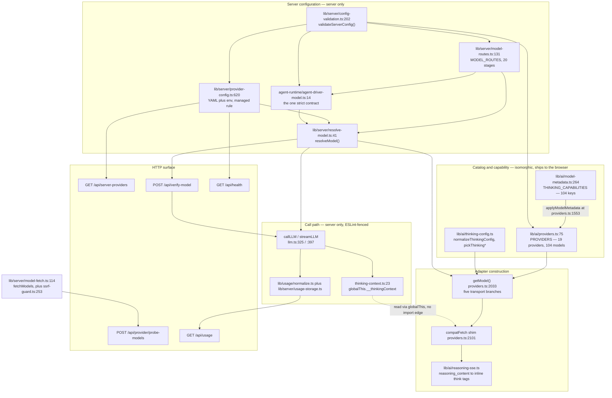
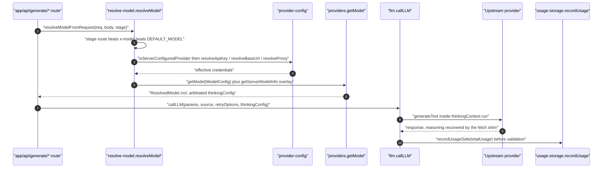

# Component View: AI Provider Abstraction and Model Registry

## What this topic covers

The AI provider layer is the single seam between OpenMAIC's generation code and every
text-LLM vendor the product can talk to. It owns five things and nothing else:

1. **A static provider + model registry** — 19 providers, 104 model entries, one object literal at
   `lib/ai/providers.ts:75`.
2. **A capability model** — `streaming` / `tools` / `vision` booleans plus a 13-field
   `ThinkingCapability` describing how each model's reasoning control is wired on the wire
   (`lib/types/provider.ts:73`).
3. **Adapter construction** — `getModel()` (`lib/ai/providers.ts:2033`) turns a
   `(providerId, modelId, apiKey, baseUrl, proxy)` tuple into a Vercel AI SDK `LanguageModel` over
   one of five transports, installing per-vendor `fetch` shims and reasoning middleware.
4. **Credential and routing arbitration** — `lib/server/provider-config.ts` decides whose API key
   wins; `model-routes.ts` plus `resolve-model.ts` decide which model a generation *stage* uses.
5. **Accounting and handshakes** — the append-only JSONL usage log, the `verify-*` probes, and
   boot-time config validation.

Everything that actually calls a model funnels through `callLLM` / `streamLLM`
(`lib/ai/llm.ts:325`, `lib/ai/llm.ts:397`). That funnel is machine-enforced: an ESLint block at
`eslint.config.mjs:608-667` bans `generateText` / `streamText` imports (and `import('ai')`) from
`ai` everywhere except `lib/ai/llm.ts`, `eval/**` and `tests/**`.

## Component overview

C4 level 3 for this container slice: components as nodes, zones as subgraphs. Dashed edges are
reads that deliberately avoid an import edge.

## Charter boundary

**In scope.** Provider registration, the model catalog, capability declaration, thinking /
reasoning transport adaptation, server-vs-client credential arbitration, per-stage model
routing, boot-time config validation, the `verify-*` and `probe-models` handshakes, and token /
usage accounting.

**Out of scope but sharing machinery.** TTS/ASR (`lib/audio/`), image and video generation
(`lib/media/`), PDF and media extraction (`lib/pdf/`, `lib/document/`) and web search
(`lib/web-search/`) each keep their own provider catalogs — see
[../09-media-and-export/index.md](../09-media-and-export/index.md). They appear here only where
they share `lib/server/provider-config.ts`: the seven-section server config, the managed /
unmanaged rule, and the `verify-*` route family are common to all of them.

**`configs/` is not part of this layer** — every file there is whiteboard / DSL presentation data
(`configs/theme.ts` imports `@openmaic/dsl` presentation types, `configs/symbol.ts` is a glyph
table, `configs/mime.ts` is a MIME→extension map). A negative finding, so nobody goes looking.

## Who this is for

A staff engineer who needs one of these answers without reading 5 000 lines. Why did this request
go to Anthropic when the browser sent an OpenAI model? →
[./03-stage-routing.md](./03-stage-routing.md). Can a user's browser see the operator's API key? →
[./04-credential-flow.md](./04-credential-flow.md). Why is this model not sending
`reasoning_effort`? → [./02b-capability-shapes-and-gating.md](./02b-capability-shapes-and-gating.md).
Why does the server log `[config] …` warnings and start anyway? →
[./05-boot-validation.md](./05-boot-validation.md). What env var adds a provider? →
[./08-env-vars.md](./08-env-vars.md).

## Shape of the layer, in numbers

Measured at commit `c2c9553a` on `main`.

| Fact | Value | Evidence |
| --- | --- | --- |
| Providers in the registry | 19 | `lib/ai/providers.ts:75`–`:1551` |
| Model entries in the registry | 104 | counted across the 19 `models[]` arrays |
| Distinct transports / on the `openai` one | 5 / 14 of 19 | `lib/types/provider.ts:38`; [./01-provider-registry.md](./01-provider-registry.md) |
| `THINKING_CAPABILITIES` entries | 104 | `lib/ai/model-metadata.ts:264`–`:454` |
| Catalog models with a thinking capability after overlay | 88 of 104 | `applyModelMetadata`, `lib/ai/providers.ts:1553` |
| Routable generation stages | 20 | `LLM_STAGES`, `lib/server/model-routes.ts:131` |
| Env-var prefixes mapping to LLM providers | 21 | `LLM_ENV_MAP`, `lib/server/provider-config.ts:73` |
| Largest two files | `providers.ts` 2 420 lines, `provider-config.ts` 1 116 | `wc -l` |

## The one-paragraph mental model

A generation route calls `resolveModelFromRequest()` (`lib/server/resolve-model.ts:183`), which picks
a model string with precedence **stage route > `x-model` header > `DEFAULT_MODEL`**, then asks
`lib/server/provider-config.ts` whether the operator manages that provider. If managed, the
operator's key and base URL are authoritative and the client's are discarded wholesale; if
unmanaged, the client's are used and SSRF-validated in production. `getModel()` builds the SDK
client, installs a `fetch` shim for OpenAI-compatible gateways and wraps the model in
`extractReasoningMiddleware`. The route hands the model to `callLLM`, which resolves a
`ThinkingConfig`, maps it to `providerOptions` for the three native providers, publishes it on an
`AsyncLocalStorage` so the `fetch` shim can pick it up (compatible providers strip unknown
`providerOptions`), and appends one JSONL usage row.

## Sources

Code read: all 8 files of `lib/ai/`; `lib/types/provider.ts`; `lib/usage/normalize.ts`;
`lib/config/{feature-flags,token-plan-presets,apply-token-plan}.ts`; `lib/server/`
(`provider-config`, `model-routes`, `resolve-model`, `config-validation`,
`provider-capability-schema`, `model-fetch`, `llm-error-response`, `usage-storage`, `ssrf-guard`,
`agent-runtime/agent-driver-model`); the 8 routes under `app/api/` listed in
[./06-verify-routes.md](./06-verify-routes.md) and [./07-usage-accounting.md](./07-usage-accounting.md);
7 files under `components/settings/`; plus `instrumentation.ts`, `eslint.config.mjs`,
`.env.example`, `docker-compose.yml`, `package.json`. Evidence: all 7 files of
[`ai-provider-layer/`](../appendix/research/ai-provider-layer/00-overview.md),
[`api-surface/02a`](../appendix/research/api-surface/02a-interfaces-envelope-identity-model.md),
[`persistence-storage-state/00`](../appendix/research/persistence-storage-state/00-overview.md).

## Section files

| File | What it answers |
| --- | --- |
| [./01-provider-registry.md](./01-provider-registry.md) | Every provider, the abstraction's verbatim types, and the ordered decision procedure `getModel()` follows. |
| [./01b-adapter-transports.md](./01b-adapter-transports.md) | Inside the five transport branches: the `openai` predicates, the `compatFetch` seam, the 12 vendor thinking body shapes, and the SDK packages. |
| [./02-model-registry-and-capabilities.md](./02-model-registry-and-capabilities.md) | The five paths a model entry can come from, and the operator-YAML capability-declaration pipeline. |
| [./02b-capability-shapes-and-gating.md](./02b-capability-shapes-and-gating.md) | The verbatim capability types, the per-provider capability tables, and which capabilities actually gate behaviour. |
| [./03-stage-routing.md](./03-stage-routing.md) | The 20 routable stages, `MODEL_ROUTES`, and the exact precedence between defaults, server config and client headers. |
| [./04-credential-flow.md](./04-credential-flow.md) | Where API keys come from in each mode, the exact read sites, and the trust boundary between browser bundle and server config. |
| [./05-boot-validation.md](./05-boot-validation.md) | `validateServerConfig()`, the agent-driver route contract, and what a bad config does to a boot. |
| [./06-verify-routes.md](./06-verify-routes.md) | The four `verify-*` routes plus `probe-models`: probe issued, status mapping, and how failures reach the settings UI. |
| [./07-usage-accounting.md](./07-usage-accounting.md) | What is metered, the JSONL storage format, and the single consumer. |
| [./08-env-vars.md](./08-env-vars.md) | Every environment variable this layer reads: name, default, effect, read site. |

## Related topics

[../03-app-and-api/index.md](../03-app-and-api/index.md) (the HTTP surface that calls this layer,
and the one auth gate in `middleware.ts`) ·
[../05-agent-runtime/index.md](../05-agent-runtime/index.md) (the `maic-agent-driver` stage's only
consumer) · [../06-generation-pipeline/index.md](../06-generation-pipeline/index.md) (the `AICallFn`
seam that keeps `@openmaic/generation` provider-agnostic) ·
[../09-media-and-export/index.md](../09-media-and-export/index.md) (the TTS/ASR/image/video catalogs
sharing `lib/server/provider-config.ts`) ·
[../13-dependencies/index.md](../13-dependencies/index.md) (SDK versions and licences) ·
[../15-cross-cutting/index.md](../15-cross-cutting/index.md) (SSRF, logging, error envelopes) ·
[../README.md](../README.md) (set root).
