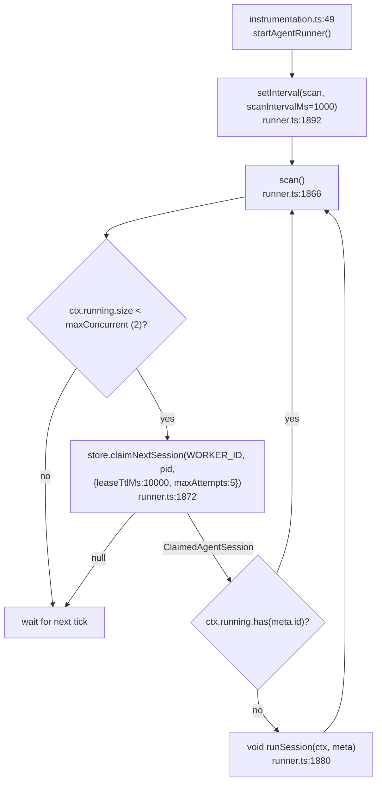
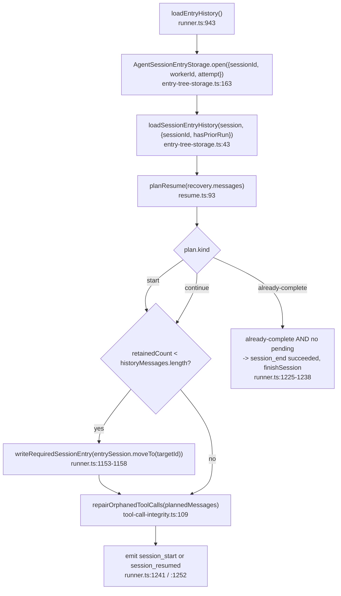
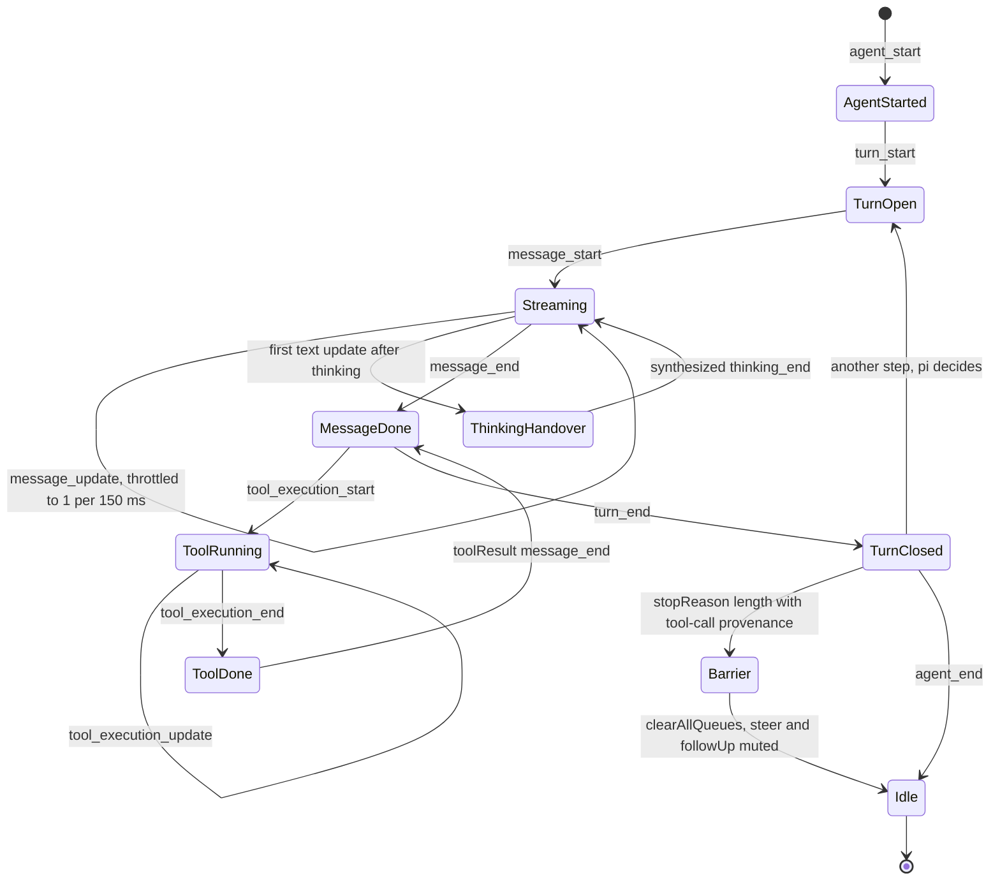

# The Durable Agent Loop

The spine of the authoring runtime, in execution order: claim, recover, assemble,
prompt, dispatch, drain, settle. One function — `runSession` — is 970 lines of
one state machine, and the file argues for that shape explicitly
([`lib/server/agent-runtime/runner.ts:886-888`](lib/server/agent-runtime/runner.ts#L886-L888): "its nested finally blocks pair
every timer, subscription, and agent listener with the exact lifetime in which it
can fire").

**Sources:** `lib/server/agent-runtime/runner.ts`, `lib/server/agent-runtime/resume.ts`,
`lib/server/agent-runtime/entry-tree-storage.ts`, `lib/server/agent-runtime/config.ts`,
`lib/server/agent-runtime/runner-contract.ts`, `lib/agent/runtime/build-agent.ts`,
`lib/agent/runtime/stream-fn.ts`, `app/api/agent/sessions/route.ts`,
`app/api/agent/sessions/[id]/events/route.ts`, `instrumentation.ts`.
Evidence: [`../appendix/research/agent-runtime/03-flows.md`](docs/appendix/research/agent-runtime/03-flows.md).

## Zero: there is no request in the loop

The HTTP request that starts a conversation does not execute it. `POST /api/agent/sessions`
writes a row and returns 202 ([`app/api/agent/sessions/route.ts:37`](app/api/agent/sessions/route.ts#L37), response at
`:168-175`). A background timer picks it up later. The consequence is stated in
the runner's own header ([`runner.ts:2-7`](lib/server/agent-runtime/runner.ts#L2-L7)): "PostgreSQL is the authority for claims,
lease generations, event ordering, cancellation, and conversation recovery. A client
connection is never part of the execution lifetime."

The timer is installed exactly once per server instance, from Next's
`instrumentation.ts` — `register()` is the only place in the app with a
once-per-process guarantee ([`instrumentation.ts:3-8`](instrumentation.ts#L3-L8)), it returns early on the
Edge runtime so `pg` never enters that bundle (`:16`), and
`startAgentRunner()` installs only a `setInterval` so `register()` never blocks
on I/O (`:46-49`).

`WORKER_ID` is `<8 hex of a fresh uuid>:<pid>` ([`runner.ts:100`](lib/server/agent-runtime/runner.ts#L100)), so two processes
on one host are distinguishable. The `ctx.running.has` check at `:1878` is a
process-local fence layered on top of the store's lease exclusion.

## One: claim and the verdict gate

`runSession(ctx, meta)` ([`runner.ts:889`](lib/server/agent-runtime/runner.ts#L889)) captures three values off the claim that
fence everything after: `meta.attempt`, `meta.claimSeq` and `meta.ownerId`.

The very first branch is the attempt cap. `isOverAttemptCap(meta)` is
`meta.attempt > config.maxAttempts` ([`runner.ts:305-307`](lib/server/agent-runtime/runner.ts#L305-L307)), and when it is true the
run is a **verdict-only claim**: it emits a terminal `session_end failed` carrying
`session failed 5 consecutive unattended attempts; send a new message to retry`
and returns without ever constructing a model ([`runner.ts:1070-1088`](lib/server/agent-runtime/runner.ts#L1070-L1088)). The comment
at `:1068-1069` names the escape hatch — a message posted *after* the claim still
gets one attended redemption via the common `requeueIfUndelivered` check.

## Two: the write chain, and the only event writer

Before any I/O, `runSession` builds the two primitives every later step uses.

`enqueue(write, critical)` ([`runner.ts:915-934`](lib/server/agent-runtime/runner.ts#L915-L934)) serialises every durable write
onto a single promise chain. It has three distinct failure behaviours:

| Condition | Behaviour | Line |
| --- | --- | --- |
| lease already lost | write skipped silently | `:917` |
| `critical` and the tree is already unhealthy | write skipped | `:917` |
| lease-loss error thrown | `markLeaseLost()`, swallow | `:922-925` |
| `critical` write fails otherwise | `entryWritesHealthy = false`, record `criticalWriteError`, `abort.abort()` | `:927-931` |
| non-critical write fails | logged at `error`, swallowed — losing telemetry must not kill the conversation | `:926` |

`flushAll(propagateEntryFailure = true)` awaits the chain and rethrows a recorded
critical error, so a run cannot settle *successfully* on a broken entry tree
(`:935-940`).

`emit(type, data)` ([`runner.ts:983-1044`](lib/server/agent-runtime/runner.ts#L983-L1044)) is the only event writer, and it does five
things beyond appending:

1. **Event-order tripwire.** `markRunEventEmitted(runEventEmitted, type)`
   (`:317-319`) requires the first frame of a run to be one of
   `session_start` / `session_resumed` / `session_interrupted` / `session_end`.
   A violation logs `TRIPWIRE VIOLATION session <id>: first runner event must be
   lifecycle, got <type>` and aborts the run (`:984-993`). This is an assertion
   about the runner's own code, not about the model.
2. **Lease drop.** Once `leaseLost`, `emit` returns immediately (`:999`) — the new
   owner's `session_resumed` frame *is* the durable interruption marker.
3. **`thinking_end` synthesis.** It tracks whether the current assistant message
   had a non-empty `thinking` block and then produced non-empty text, and
   synthesises a `thinking_end` frame at that transition (`:1009-1043`).
4. **`message_update` throttle.** One update per `MESSAGE_UPDATE_MIN_INTERVAL_MS`
   = 150 ms (`:102`, applied `:1030`), and empty start frames are dropped by
   `hasRenderableAssistantUpdate` (`:292-302`) so they do not consume the slot
   before the first real delta.
5. **Snapshot at emission.** `snapshotEventDataForLog` (`:269`) shallow-clones the
   pi event and its content blocks, because pi mutates the shared partial message
   after every token while durable writes run asynchronously (`:263-268`).

`appendEvent` also prunes superseded `message_update` rows once the owning
`message_end` lands (`store.pruneMessageUpdates`, `:973-979`).

## Three: session load and recovery

Three separate contracts meet here:

- **`planResume`** ([`resume.ts:93`](lib/server/agent-runtime/resume.ts#L93)) returns `{kind:'start'}`,
  `{kind:'continue', messages, repairedToolCalls}` or
  `{kind:'already-complete', messages}`. It pops the incomplete assistant suffix
  first, then classifies the tail. A trailing *successful* `ask_user` or
  `create_skill` result is terminal — the run is waiting on the user and a takeover
  must not `continue()` past it. Its header states the whole-system consequence
  ([`resume.ts:33-37`](lib/server/agent-runtime/resume.ts#L33-L37)): tool execution is **at-least-once**, therefore every tool
  must be idempotent.
- **Truncation is durable.** If `planResume` retained fewer messages than the tree
  held, `entrySession.moveTo(targetId)` records that in the append-only tree, via
  `writeRequiredSessionEntry` — a *required* write, so lease loss aborts rather
  than degrading ([`runner.ts:1153-1159`](lib/server/agent-runtime/runner.ts#L1153-L1159)).
- **Missing tool results are a read-time view.** `repairOrphanedToolCalls`
  ([`tool-call-integrity.ts:109`](lib/server/agent-runtime/tool-call-integrity.ts#L109)) rebuilds a provider-safe message list: existing
  results move next to their owning assistant frame, incomplete unwind frames are
  dropped, genuinely missing results are synthesised as `interruptedToolResult`
  (`:64`). A healthy transcript is returned **by reference** (`:154`). The entry
  tree is never mutated — it stays an audit trail (`:104-107`).

`session_resumed`'s `reason` field distinguishes the two ways a run resumes:
`'follow_up'` when the plan is `start` or the claim reason is `queued`, `'crash'`
otherwise ([`runner.ts:1256`](lib/server/agent-runtime/runner.ts#L1256)).

## Four: message assembly

Everything the model will see is assembled between `session_start` and
`agent.prompt`. Four independent inputs feed it.

| Input | Function | Notes |
| --- | --- | --- |
| Driver model | `resolveAgentDriverModel()` ([`agent-driver-model.ts:92`](lib/server/agent-runtime/agent-driver-model.ts#L92)) | reads only `MODEL_ROUTES` stage `maic-agent-driver`; `DEFAULT_MODEL` is never consulted |
| Pending durable messages | `listAgentUserMessages` + filter `seq > deliveredThrough` → `toFollowUp` ([`runner.ts:1204-1222`](lib/server/agent-runtime/runner.ts#L1204-L1222), `:860`) | each `@`-named classroom is re-resolved to its **current** name by `resolveCourseRefsForContext` (`:704`) |
| Selected slide/interactive elements | `resolveFollowUpElementContext` → `resolveElementRefsForContext` ([`runner.ts:1320`](lib/server/agent-runtime/runner.ts#L1320), `:412`) | five-status, six-variant result — `resolved` splits by `kind` (`:376-410`); every captured field is wrapped in `<untrusted-live-element-data>` by `untrustedElementDataBlock` (`:502`) |
| Skill bodies | `buildSkillPreload` ([`skill-preload.ts:224`](lib/server/agent-runtime/skill-preload.ts#L224)) | synthesises an `assistant(toolCall read)` + `toolResult(SKILL.md)` pair — "a read that already happened" |

`planRunStart` ([`runner.ts:772-827`](lib/server/agent-runtime/runner.ts#L772-L827)) decides whether this run opens with a prompt
or a `continue()`, and which text. Four guards, six outcomes, in order:

1. `start` + pending + `idleAttach` (`meta.existingCourse`) → prompt from the
   pending message.
2. `start` + the opening message carries `courseRefs` or `elementRefs` → prompt
   from `meta.prompt` with those blocks appended.
3. `start` → prompt = `meta.prompt` verbatim.
4. `already-complete` + pending → prompt from the pending message (a worker died
   after the `ask_user` checkpoint but before `finishSession`).
5. `claimReason === 'queued'` + pending → prompt from the pending message.
6. otherwise → `{kind:'continue'}`.

The system prompt is `buildRunnerCoursePrompt(blocks)`
([`runner-contract.ts:14`](lib/server/agent-runtime/runner-contract.ts#L14)), which is `courseSystemPrompt` with the DSL
compatibility block forced on. Every other block is present only when its
capability is ([`runner.ts:1463-1472`](lib/server/agent-runtime/runner.ts#L1463-L1472)): `availableSkills`, `curriculum`, `search`,
`fetch`, `untrustedContent`, `materials`, `roster`, `voice`.

## Five: the model call

`buildAgent` ([`build-agent.ts:65`](lib/agent/runtime/build-agent.ts#L65)) is the only place a pi `Agent` is constructed in
this repository — the durable runner, the classroom director and the classroom
child agent all go through it. It fixes four things:

- `toolExecution: 'sequential'` (`:71`) — pi never runs a tool batch in parallel.
- every tool wrapped in `withAgentToolTimeout` (`:77`).
- `beforeToolCall = makeAllowlistGate(opts.allowedToolNames)` (`:82`).
- `afterToolCall` composes the quota hook with the caller's hook and normalises
  a `{isError:true}` marker in the *result body* into pi's `isError` flag
  (`:83-100`).

`STUB_MODEL` (`:28-39`) is the *default* metadata placeholder with
`contextWindow: 1_000_000` so the harness never tries to compact on its own; the
injected `StreamFn` ignores it and uses OpenMAIC's resolved model. The durable
runner does not take that default — it passes `model: driver.piModel`
([`runner.ts:1473`](lib/server/agent-runtime/runner.ts#L1473)), so STUB_MODEL only applies to a caller that omits `model`.

`createCallLlmStreamFn` ([`stream-fn.ts:250`](lib/agent/runtime/stream-fn.ts#L250)) is the integration seam. pi's
`StreamFn` signature is `(model, context, options) => AssistantMessageEventStream`;
this implementation calls `streamLLM` with `stopWhen: stepCountIs(1)`
([`stream-fn.ts:413`](lib/agent/runtime/stream-fn.ts#L413)) so **pi's loop owns multi-step, not the AI SDK's**, and maps
`fullStream` parts back to pi events. Finish-reason mapping is explicit
(`:329-367`):

| AI SDK `finishReason` | pi `stopReason` | Extra |
| --- | --- | --- |
| `length` | `length` | executable tool calls stripped; the message is registered in `lengthToolCallMessages` when it had any (`:332`) |
| `content-filter` / `error` / `other` | error | `settleError('error', …)` |
| `tool-calls` with no parsed call | error | "reported tool-calls without a complete parsed tool call" |
| `tool-calls` with a call | `toolUse` | — |
| `stop` | `toolUse` if a tool call is present, else `stop` | — |
| anything else | error | "invalid finish reason" |

That `length`-with-tool-calls case is what arms the **terminal barrier**:
[`build-agent.ts:103-125`](lib/agent/runtime/build-agent.ts#L103-L125) sees the `turn_end` frame, calls `agent.clearAllQueues()`,
and monkey-patches `steer` and `followUp` into no-ops until `agent_end`, so a
queued follow-up is not fed into a wedged turn.

### Turn states, as the event vocabulary sees them

Ten pi event types reach the durable log verbatim
(`PI_EVENT_TYPES`, [`lib/workbench/use-workbench-session.ts:50-61`](lib/workbench/use-workbench-session.ts#L50-L61)). Read as a state
machine, one turn looks like this — and every arrow below is an event the runner's
`emit` writes and the browser fold subscribes to by name:

The `thinking_end` state is synthetic: it is not a pi event, it is a frame the
runner manufactures at the first text-carrying update of a message that already
carried thinking ([`runner.ts:1009-1043`](lib/server/agent-runtime/runner.ts#L1009-L1043)), so the chat's thinking bar stops at the
same instant live and on replay.

## Continued

Steps six through nine — tool dispatch and the durable receipt protocol, the two
stop mechanisms, the settle sequence, and why the SSE stream sits outside the
loop — are in [`01b-loop-dispatch-and-settle.md`](docs/05-agent-runtime/01b-loop-dispatch-and-settle.md),
together with this part's open questions.
