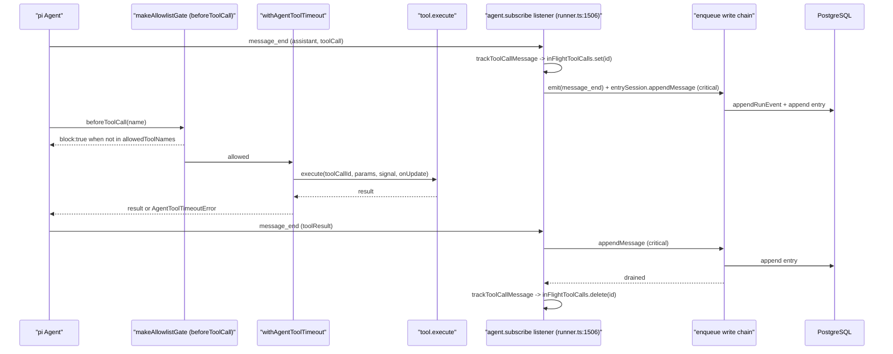
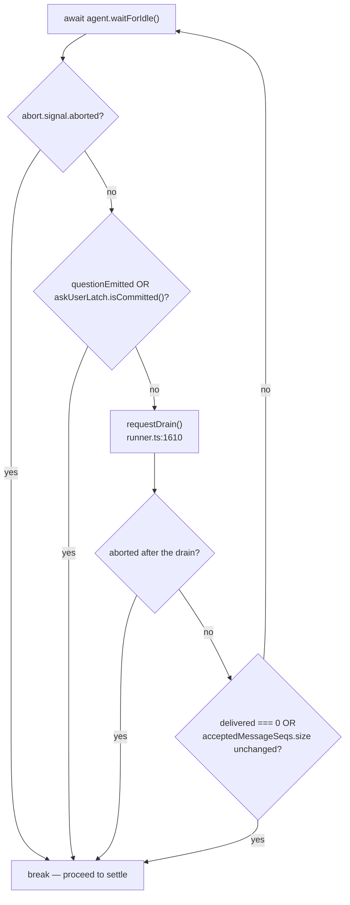
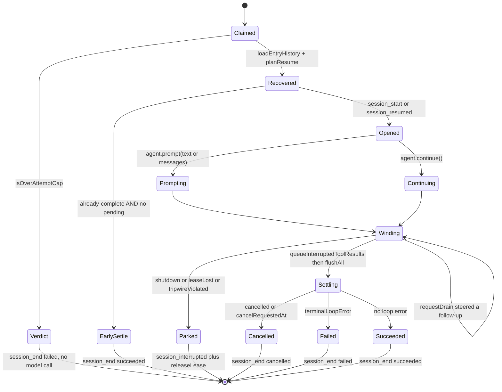
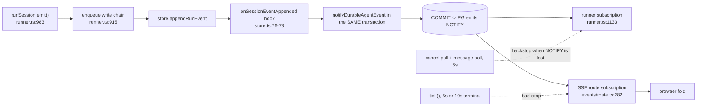

# The Durable Agent Loop, Part 2: Dispatch, Stop and Settle

Continues [`01-agent-loop.md`](docs/05-agent-runtime/01-agent-loop.md) at step six. Tool dispatch and
the durable receipt protocol, the two mechanisms that end a run, the settle
sequence, and why the SSE stream is not part of the loop at all.

**Sources:** `lib/server/agent-runtime/runner.ts`,
`lib/server/agent-runtime/tool-call-integrity.ts`,
`lib/agent/runtime/{allowlist,tool-timeout}.ts`,
`app/api/agent/sessions/[id]/events/route.ts`.
Evidence: [`../appendix/research/agent-runtime/03-flows.md`](docs/appendix/research/agent-runtime/03-flows.md).

## Six: tool dispatch and the durable receipt



Two orderings in that diagram are load-bearing and commented as such
([`runner.ts:1509-1513`](lib/server/agent-runtime/runner.ts#L1509-L1513)): a tool call becomes *pending* as soon as its assistant
frame is emitted, so an abort can queue its receipt while the frame is still on
the write chain; and it stops being pending only **after** its fenced append
succeeds, because clearing it at event time would reopen the orphan race during
chain drain.

The same listener also advances the delivery cursor: a `user` frame tagged with
`durableUserMessageSeq` (`:687`) triggers `store.markUserMessageDelivered`, and a
`false` return means the lease is gone — thrown as `AgentSessionLeaseLostError`
inside the critical write (`:1520-1532`).

`userFramesSeen` is incremented on the same `message_end` (`:1517`), which is what
makes the skill-preload pin window ("valid through user frame N") meaningful —
see [`04-session-and-context.md`](docs/05-agent-runtime/04-session-and-context.md).

The five authorisation layers a call passes through before `tool.execute` are
documented in [`03-tool-catalogue.md`](docs/05-agent-runtime/03-tool-catalogue.md).

## Seven: loop / stop

Two mechanisms decide when the run is over.

**The wind-down loop** ([`runner.ts:1732-1740`](lib/server/agent-runtime/runner.ts#L1732-L1740)) is not a turn loop — pi owns turns.
It exists to catch a follow-up message that arrived while the agent was going idle:

```
for (;;) {
  await agent.waitForIdle();
  if (abort.signal.aborted) break;
  if (questionEmitted || askUserLatch.isCommitted()) break;
  const before = acceptedMessageSeqs.size;
  const delivered = await requestDrain();
  if (abort.signal.aborted) break;
  if (delivered === 0 || acceptedMessageSeqs.size === before) break;
}
```

The comment above it (`:1729-1731`) explains the deliberate limit: pi is already
idle at that point, so an accepted steer is durably detected and requeued by the
settle check for the *next* claim rather than extending this run.

**The `ask_user` latch** (`createAskUserTerminateLatch`, [`runner.ts:834`](lib/server/agent-runtime/runner.ts#L834)) makes a
successful `ask_user` terminal and *sticky* across a mixed tool batch: once
committed, `afterToolCall` returns `{terminate:true}` for the rest of the batch
(`:1493-1499`). The predicate itself is one line —
`shouldTerminateAfterToolCall(name, isError)` is
`name === 'ask_user' && !isError` (`:829-831`). `questionEmitted` is set inside the
tool's `onUserQuestion` callback rather than after it returns, specifically to
fence the live steer drain at the same instant the question enters the write chain
(`:1272-1280`).



Follow-up drains are serialised by `requestDrain` (`:1610-1626`) — a request
arriving mid-drain sets `drainQueued` and is absorbed into the same cycle rather
than starting a second one — and `drainMessages` (`:1563`) re-verifies
`leaseMatches(current, WORKER_ID, attempt)` (`:878`) before steering anything. The
two reads inside it deliberately avoid a shared transaction (`:1565-1567`): a
message added between them is left for the next drain, while the lease snapshot
prevents steering after ownership already changed.

## Eight: settle and persist



The settle sequence, in order ([`runner.ts:1746-1789`](lib/server/agent-runtime/runner.ts#L1746-L1789)):

1. `queueInterruptedToolResults()` — receipts for any still-pending call, appended
   through the same attempt-fenced storage as normal messages, resolved only after
   preceding appends drain so a result that *did* land removes itself first
   (`:1540-1556`).
2. `await flushAll()` — rethrows a critical write failure.
3. `terminalLoopError(agent.state.messages, agent.state.errorMessage)` (`:324`) —
   pi's error message wins; failing that, a last assistant frame with
   `stopReason === 'length'` yields `LENGTH_STOP_ERROR` (`:321`).
4. Park check: `shutdown || tripwireViolated || (leaseLost && aborted)` →
   `session_interrupted` + `releaseLease` (skipped when the lease is already
   gone) + `return`. **`session_interrupted` is not terminal** — the row stays
   `running`.
5. `cancelRequestedAt ??= await store.getCancelRequestedAt(id)` — one last durable
   read, so a cancel that raced the settle still wins (`:1766`).
6. `emit(session_end, {status, toolCalls, error?})` then
   `store.finishSession(id, WORKER_ID, {status, resetAttempt: status !== 'failed',
   expectedAttempt: attempt, consumeCancelRequestedAt?})`.
7. `requeueIfUndelivered('settle')` — skipped for a cancelled settle (`:1786`).

A `finishSession` that returns false means the lease moved between the flush and
the write: the run calls `markLeaseLost()` and returns without further writes
(`:1782-1785`).

### The requeue classifier

`requeueIfUndelivered` (`:1047`) delegates to the pure `planUndeliveredRequeue`
(`:338-348`):

| Condition | Action | Effect |
| --- | --- | --- |
| no message with `seq > deliveredThrough` | `none` | nothing |
| some undelivered message has `seq > claimSeq` | `reset` | `store.requeueSession(id)`, attempt reset |
| all undelivered messages sit inside the claim window, and this is not a verdict claim | `retry` | `store.requeueForRetry(id)`, attempt preserved |
| same, but `atVerdict` | `none` | the verdict stands |

A failure of the check itself is logged at `warn` and swallowed (`:1063-1065`).

The outer `finally` (`:1850-1857`) clears the heartbeat and cancel-poll timers,
unsubscribes the NOTIFY wakeup, nulls `drainOnWake`, does a final
non-propagating `flushAll(false)`, and removes the session from `ctx.running`.

## Nine: the stream is a separate reader

Nothing in the loop writes to a client. `GET /api/agent/sessions/:id/events`
([`app/api/agent/sessions/[id]/events/route.ts:62`](app/api/agent/sessions/[id]/events/route.ts#L62)) is a **pure reader of the
store** (`:30-33`): a disconnect closes the reader and nothing else. The wakeup is
the same `subscribeAgentEventWakeup({kind:'session', sessionId})` bus the runner
uses (`:282`), registered *before* the initial backlog read so a commit racing
backlog exhaustion cannot fall into the 5 s fallback window (`:279-281`).



The hook fires inside the business transaction on purpose
([`lib/server/agent-runtime/store.ts:69-75`](lib/server/agent-runtime/store.ts#L69-L75)): PG emits `NOTIFY` only at commit, so
the reader wakes exactly when the row becomes visible, and a dropped notification
degrades latency rather than correctness because every stream keeps its fallback
poll.

See [`02-client-server-split.md`](docs/05-agent-runtime/02-client-server-split.md) for the frame
format and the fold, and [`08-failure-modes.md`](docs/05-agent-runtime/08-failure-modes.md) for the
degraded-catch-up path.

## Open questions

- **Compaction is unwired.** `agentRuntimeConfig.compaction` ([`config.ts:27-42`](lib/server/agent-runtime/config.ts#L27-L42))
  reads three env vars and has zero consumers; `runner.ts` never passes
  `transformContext` to `buildAgent`. The config comment admits it
  ([`config.ts:20-26`](lib/server/agent-runtime/config.ts#L20-L26)), but an operator setting
  `OPENMAIC_AGENT_COMPACTION_ENABLED=true` gets no context transformation at all.
  Whether enabling it is a one-line wiring or needs the "later slice" cannot be
  answered from the tree.
- **`meta.stageId` is never read by the runner.** It is persisted
  ([`app/api/agent/sessions/route.ts:139-143`](app/api/agent/sessions/route.ts#L139-L143)) and streamed to the client, but no
  `meta.stageId` reference exists in `runner.ts`. The route defers validation
  "until a later slice consumes stageId" ([`route.ts:133-136`](app/api/agent/sessions/route.ts#L133-L136)); what that consumer
  is meant to be is not derivable.
- **Store guarantees.** `claimNextSession` ordering/fairness, whether
  `requeueSession` resets `attempt` to 0 or 1, and whether
  `finishSession(..., expectedAttempt)` is a compare-and-set are implemented in
  `packages/@openmaic/storage` — see [`../10-persistence-and-state/index.md`](docs/10-persistence-and-state/index.md).
