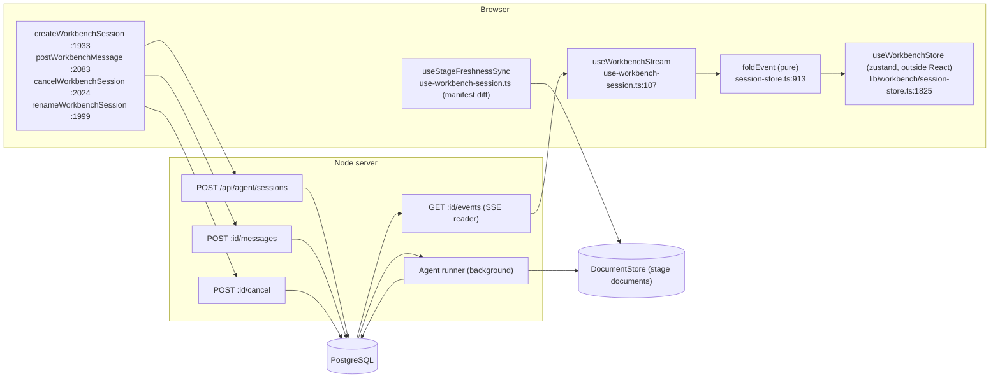
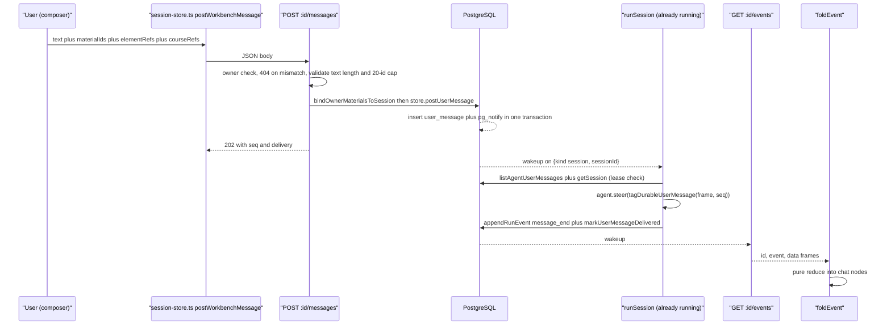
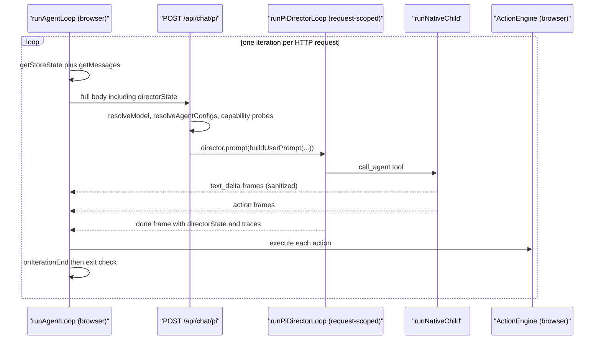
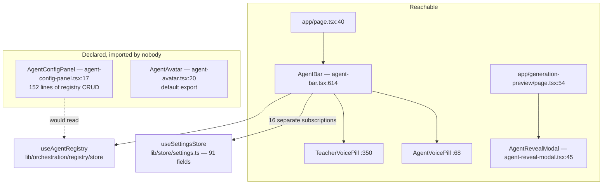

# Client / Server Split and the Wire Protocols

Which half of each runtime runs in the browser, which runs in Node, and the two
completely different wire protocols between them. The asymmetry is deliberate:
the durable runtime never streams *to* a client, while the classroom runtime keeps
no server state at all.

**Sources:** `lib/agent/client/*`, `lib/workbench/use-workbench-session.ts`,
`lib/workbench/session-store.ts`, `lib/workbench/owner-session-client.ts`,
`lib/chat/agent-loop.ts`, `lib/action/engine.ts`,
`app/api/agent/sessions/**`, `app/api/chat/pi/route.ts`,
`lib/agent-runtime/lifecycle.ts`, `components/workbench/chat/tool-presentation.ts`,
`components/agent/{agent-bar,agent-reveal-modal,agent-config-panel,agent-avatar}.tsx`.

## Naming: `lib/agent/client` is not the client half

`lib/agent/client/` is two small pure modules, 187 lines total, and neither of
them talks to the server:

| File | Lines | What it is |
| --- | --- | --- |
| `lib/agent/client/apply-regenerate.ts` | 157 | pure `planRegenerateApply(details, scene, toolName)` — converts a `regenerate_scene` / `edit_interactive_html` tool result into a `ScenePatch` plus a restore snapshot; kept side-effect-free so it unit-tests without React or Dexie (`:1-9`) |
| `lib/agent/client/resolve-scene-outline.ts` | 30 | pure outline resolution helper |

The browser half of the **durable** runtime is `lib/workbench/`; the browser half
of the **classroom** runtime is `lib/chat/agent-loop.ts` plus `lib/action/engine.ts`.

## Durable runtime: the log is the protocol



Two invariants make this work, both stated in the source:

1. **The rendered UI is a pure function of the applied event prefix.** `foldEvent`
   is exported for tests and no event handler queries the status endpoint
   ([`session-store.ts:16-21`](lib/workbench/session-store.ts#L16-L21)). That is what makes `Last-Event-ID` resumption exact
   rather than approximate: reattaching at N and applying N+1… equals applying
   1… from scratch.
2. **The chat and the course travel on different wires.** The event log carries
   "page 3 landed"; it does **not** carry the page
   ([`use-workbench-session.ts:10-14`](lib/workbench/use-workbench-session.ts#L10-L14)). The canvas reads the course through the
   app's real `DocumentStore` and keeps it fresh with a manifest diff plus a
   narrow scene re-fetch. Putting the slide DSL in the event log would give the
   browser two disagreeing copies of the course.

The store lives outside React on purpose ([`session-store.ts:22-24`](lib/workbench/session-store.ts#L22-L24)): unmounting
the chat tree tears down the `EventSource`, the folded state survives in the
zustand store, and re-attaching resumes from `lastEventId`.

### Frame format

Every durable frame is `id:` + `event:` + `data:`
([`app/api/agent/sessions/[id]/events/route.ts:161-168`](app/api/agent/sessions/[id]/events/route.ts#L161-L168)). The `data` payload is
the persisted event row plus one synthetic field, `phase: 'live' | 'backlog'`,
so the fold can tell replay from live. There is one extra named frame,
`caught_up`, deliberately a real event rather than an SSE comment because
`EventSource` drops comments (`:136-148`); it carries
`{type, replayed, fromEventId, degraded?}`.

### The subscription list is a hazard, and it is guarded

A native `EventSource` routes `event: user_question` **only** to a listener
registered for that exact name — an unlisted type is silently dropped before any
application code runs. That is not hypothetical: the first `ask_user` question
card shipped completely invisible for exactly this reason
([`use-workbench-session.ts:63-76`](lib/workbench/use-workbench-session.ts#L63-L76)). The fix was to *derive* the lifecycle half of
the list from the shared constant:

```ts
export const WORKBENCH_EVENT_TYPES: readonly string[] = [
  ...Object.values(LIFECYCLE),            // use-workbench-session.ts:93
  ...LEGACY_WORKBENCH_EVENT_TYPES,        // :94
  ...PI_EVENT_TYPES,                      // :95
];
```

`LIFECYCLE` is `HOST_AGENT_LIFECYCLE` from [`lib/agent-runtime/lifecycle.ts:37`](lib/agent-runtime/lifecycle.ts#L37) —
isomorphic on purpose, because the browser needs the same constant and importing
it must not pull `pg` into the client bundle ([`lifecycle.ts:5-12`](lib/agent-runtime/lifecycle.ts#L5-L12)).
`PI_EVENT_TYPES` ([`use-workbench-session.ts:50-61`](lib/workbench/use-workbench-session.ts#L50-L61)) is hand-listed because those
ten names come from the agent library, not from this repo.
`LEGACY_WORKBENCH_EVENT_TYPES` (`:84-90`) keeps `course_link` and
`active_stage_changed` subscribed: their emitters are gone, historical logs still
carry the frames, and the reducer accepts them with their original semantics.
`tests/workbench/session-events-subscription.test.ts` pins the relationship.

### Backlog is buffered, not applied incrementally

Until `caught_up` arrives, frames go into a local `backlog` array through
`appendCompactedReplayEvent` ([`session-store.ts:1800`](lib/workbench/session-store.ts#L1800)); on `caught_up` the whole
compacted batch is applied at once via `applyEvents(compactReplayEvents(backlog))`
([`use-workbench-session.ts:213-234`](lib/workbench/use-workbench-session.ts#L213-L234)). Two side effects are replayed explicitly in
that same block because they are not pure fold state: `media_ready` frames
(a failed detached video job never lands in the document, so without this replay a
re-attached client would keep the placeholder skeleton) and `finishReplayState()`,
which records which stage links were historical so opening an old chat does not
replay its classroom navigation into the right pane.

A 20-second `replayWatchdog` (`:241`) forces `finishReplay()` if `caught_up` never
arrives.

### Reconnect semantics

`source.onerror` distinguishes two cases ([`use-workbench-session.ts:244-255`](lib/workbench/use-workbench-session.ts#L244-L255)):
during a native auto-reconnect it only clears `attached` (the server snapshot is
more current than the frozen fold, and the next frame re-marks it), while
`readyState === EventSource.CLOSED` is a hard failure that finishes replay and
sets an error string.

### The client write path

Four functions, all in `session-store.ts`, all plain `fetch`:

| Function | Route | Result |
| --- | --- | --- |
| `createWorkbenchSession` (`:1933`) | `POST /api/agent/sessions` (`:1947`) | 202 + session meta |
| `renameWorkbenchSession` (`:1999`) | `PATCH /api/agent/sessions/:id` (`:2003`) | manual title |
| `cancelWorkbenchSession` (`:2024`) | `POST /api/agent/sessions/:id/cancel` (`:2025`) | 202, or 409 `SESSION_ALREADY_TERMINAL` |
| `postWorkbenchMessage` (`:2083`) | `POST /api/agent/sessions/:id/messages` (`:2090`) | 202 `{message:{seq, text, delivery}, elementRefsAccepted, courseRefsAccepted}` |

None of them returns agent output. They return receipts; the output arrives on the
SSE tail. `cancel` is durable-only by design — the route writes no event, the
lease holder does, keeping the event log single-writer
([`app/api/agent/sessions/[id]/cancel/route.ts:3-6`](app/api/agent/sessions/[id]/cancel/route.ts#L3-L6)).

A second, sparser stream exists for the session *list*:
`GET /api/agent/owner-events`, consumed by
[`lib/workbench/owner-session-client.ts:222`](lib/workbench/owner-session-client.ts#L222).

### End-to-end: one follow-up message



Note the ordering: the browser's POST does **not** wait for the agent. The
`user_message` durable event is what the fold renders as the user's bubble, and
the runner's later `message_end` for the same `seq` is what marks it delivered.

## Classroom runtime: the browser owns the loop

The classroom split is the mirror image. `runAgentLoop`
([`lib/chat/agent-loop.ts:154`](lib/chat/agent-loop.ts#L154)) runs **in the browser** and is shared with the eval
harness (`:6-9`). Each iteration re-reads store state
(`callbacks.getStoreState()`, `:170-177`) and POSTs the full picture again:
`{messages, storeState, config, directorState, userProfile, apiKey, baseUrl,
model, providerType, thinkingConfig}` (`:181-192`). The server keeps nothing
between iterations.

SSE parsing is hand-rolled: split the decoded buffer on `\n\n`, keep the trailing
partial, take lines starting with `data: `, `JSON.parse`, hand each to
`callbacks.onEvent`; a parse failure is skipped silently because heartbeats look
the same (`:214-228`).



There is deliberately **no client-side max-turn cap** ([`agent-loop.ts:151-152`](lib/chat/agent-loop.ts#L151-L152));
the LLM director bounds the round. Five exit reasons:

| `reason` | Condition | Line |
| --- | --- | --- |
| `aborted` | `signal.aborted` at any of three checkpoints | `:164`, `:174`, `:234` |
| `no_done` | `onIterationEnd()` returned null | `:242` |
| `cue_user` | `iterationResult.cueUserReceived` | `:251` |
| `end` | `iterationResult.totalAgents === 0` | `:256` |
| `empty_turns` | two consecutive turns with `!agentHadContent` | `:261-268` |

A non-2xx response is not an exit reason — it **throws**
`API error: <status> - <body>` (`:197-200`).

`awaitOrAbort` (`:118-143`) is the abort primitive: it races a promise against the
signal with a `settled` latch and removes its own listener on every path.

### The client-side UI surface: `components/agent/`

`runAgentLoop` is the classroom runtime's *logic* in the browser. Its **UI** is one
directory, 1 544 lines across four files, and it is the whole in-class agent surface —
who is in the room, what voice each teacher has, and the reveal animation when a roster is
generated.

| File | Lines | Components | Mounted at |
| --- | --- | --- | --- |
| `components/agent/agent-bar.tsx` | 941 | three in one file — `AgentVoicePill` (`:68`), `TeacherVoicePill` (`:350`), and the only export `AgentBar` (`:614`) | [`app/page.tsx:40`](app/page.tsx#L40) |
| `components/agent/agent-reveal-modal.tsx` | 403 | `AgentRevealModal` (`:45`) | [`app/generation-preview/page.tsx:54`](app/generation-preview/page.tsx#L54) |
| `components/agent/agent-config-panel.tsx` | 152 | `AgentConfigPanel` (`:17`) — registry CRUD over `useAgentRegistry` | **nowhere** |
| `components/agent/agent-avatar.tsx` | 48 | `AgentAvatar`, a default export | **nowhere** |



Two facts about this directory are worth carrying.

**`agent-bar.tsx` is the widest single consumer of the settings store.**
`grep -oE "use[A-Z][A-Za-z]*\(" components/agent/agent-bar.tsx | sort | uniq -c` gives 16
`useSettingsStore`, 5 `useState`, 4 `useEffect`, 4 `useCallback`, plus `useAllVoiceProfiles`
and `useAgentRegistry` — 31 hook calls across three components in one file. Each of the 16
is an independent selector against the 91-field settings store
([`../10-persistence-and-state/03-client-state-stores.md`](docs/10-persistence-and-state/03-client-state-stores.md)),
so a change to that store's shape is felt here first. It has no component test; three
suites exercise the state it writes (`tests/classroom/agent-selection-restore.test.ts`,
`tests/config/settings-agent-voice-overrides.test.ts`, `tests/store/stage-agents.test.ts`)
and nothing renders it. Recorded as an honourable mention in
[`../14-code-quality/08-complexity-hotspots.md`](docs/14-code-quality/08-complexity-hotspots.md).

**Half the directory is unreachable.** `grep -rn "AgentConfigPanel\|agent-config-panel" app components lib tests`
and `grep -rn "agent-avatar\|AgentAvatar" app components lib` each return only the
declaration (the other `AgentAvatar` hits are a `presentationAgentAvatarRef` in
`components/roundtable/index.tsx`, an unrelated name). 200 of the directory's 1 544 lines
are reachable from no route. See
[`../14-code-quality/10-duplication-and-dead-code.md`](docs/14-code-quality/10-duplication-and-dead-code.md).

Neither runtime's *server* half has a UI counterpart here: the durable runtime's browser UI
is `components/workbench/**` and its chat rows come from `presentTool`
([`components/workbench/chat/tool-presentation.ts:271`](components/workbench/chat/tool-presentation.ts#L271)), which is a different surface with a
different failure mode.

## Comparison

| Dimension | Durable runtime | Classroom runtime |
| --- | --- | --- |
| Loop owner | server ([`runner.ts:889`](lib/server/agent-runtime/runner.ts#L889)) | browser ([`agent-loop.ts:154`](lib/chat/agent-loop.ts#L154)) |
| Requests per conversation | 1 create + N messages, all fire-and-forget | 1 per director round |
| Server state between calls | PostgreSQL (authoritative) | none |
| Stream direction | server → browser, long-lived, resumable | server → browser, one per request |
| Resumability | exact, via `Last-Event-ID` over a durable log | none; a dropped stream loses the round |
| Client state | pure fold in zustand, outside React | React state + `directorState` echoed back each turn |
| Output sink | chat rows via `presentTool` ([`components/workbench/chat/tool-presentation.ts:271`](components/workbench/chat/tool-presentation.ts#L271)) | `ActionEngine` ([`lib/action/engine.ts:178`](lib/action/engine.ts#L178)) |
| Survives a browser close | yes | no |

## Open questions

- **`presentTool` is keyed on structured `details`, never prose** ([`tool-presentation.ts:18-24`](components/workbench/chat/tool-presentation.ts#L18-L24)),
  and a reconciliation test is supposed to fail the build when a registered tool
  has no row. Three registered tools (`import_pptx`, `generate_image`,
  `generate_video`) have no case and therefore render their raw wire name; the
  test's `runnerTools` fixture is hand-maintained and never imports their name
  constants. See [`08-failure-modes.md`](docs/05-agent-runtime/08-failure-modes.md).
- Whether a deployment ships the Pi classroom path or the LangGraph one is a
  build-time public flag with no default in `.env.example` — see
  [`06-orchestration-registry.md`](docs/05-agent-runtime/06-orchestration-registry.md).
