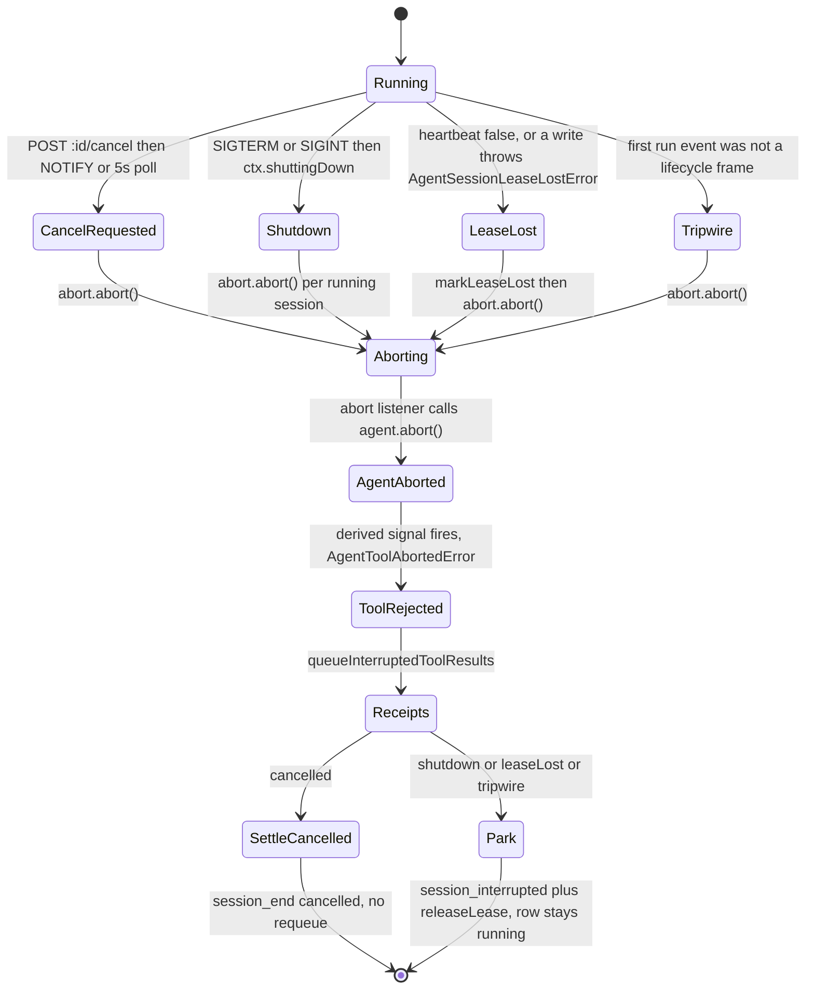
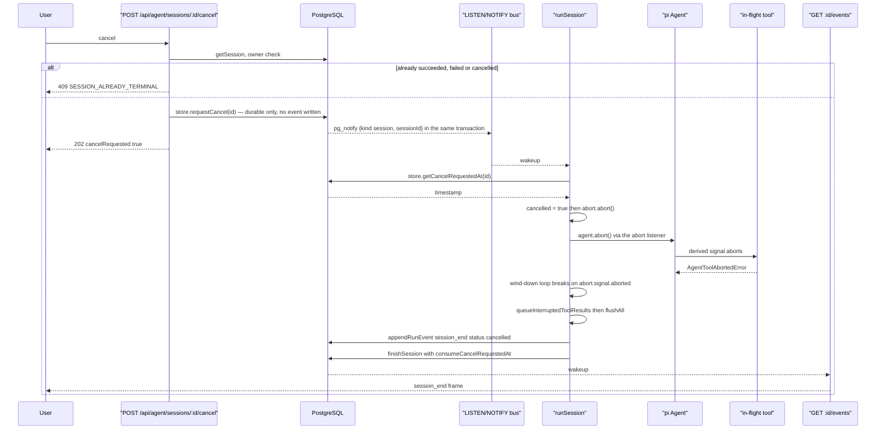
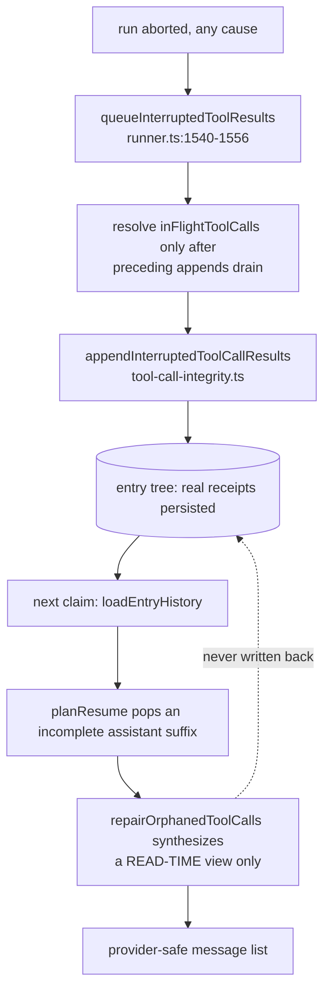

# Abort, Cancellation and Interruption

Four different things can stop a run — user cancel, process shutdown, lease loss
and tool timeout — and they have four different durable outcomes. Getting them
confused is the fastest way to write a bug here, so this file is organised by
"what actually cancels, what does not, and what state survives".

**Sources:** `lib/server/agent-runtime/runner.ts`, `lib/agent/runtime/tool-timeout.ts`,
`lib/server/agent-runtime/tool-call-integrity.ts`, `lib/agent-runtime/lifecycle.ts`,
`app/api/agent/sessions/[id]/cancel/route.ts`, `lib/server/agent-runtime/event-notify-bus.ts`,
`instrumentation.ts`, `lib/agent/runtime/run-native-child.ts`, `lib/chat/agent-loop.ts`.

## The central distinction: terminal vs parked

| Frame | Terminal? | Row status after | Who writes the next frame |
| --- | --- | --- | --- |
| `session_end` | **yes** | `succeeded` / `failed` / `cancelled` | nobody, until a new user message requeues |
| `session_interrupted` | **no** | stays `running` | the instance that steals the lease, as `session_resumed` |

[`lifecycle.ts:42-47`](lib/agent-runtime/lifecycle.ts#L42-L47) states it: "The run stopped WITHOUT a terminal status: the
runner is shutting down (deploy) or lost the lease. Not terminal — the session row
stays `running`, and the instance that steals it appends `session_resumed`."

And there is a fifth case with **no frame at all**: a lease steal. Once
`leaseLost` is set, `emit` returns immediately ([`runner.ts:999`](lib/server/agent-runtime/runner.ts#L999)) because both the
event log and the entry tree reject this generation's writes. The comment at
`:996-998` names the substitute: "The new owner's session_resumed frame is
therefore the durable interruption marker for a lease steal."

## One abort controller, four triggers



`runSession` owns exactly one `AbortController` ([`runner.ts:893`](lib/server/agent-runtime/runner.ts#L893)). Every trigger
funnels into `abort.abort()`, and one listener translates that into pi's own
cancellation:

```
const abortAgent = () => agent.abort();
abort.signal.addEventListener('abort', abortAgent);   // runner.ts:1557-1558
```

removed in the inner `finally` (`:1819`). The same signal is also passed into
`createCallLlmStreamFn` as `abortSignal` (`:1269`), into
`buildDslCourseToolset` as `abortSignal` (`:1365`), and reaches every tool through
`withAgentToolTimeout`'s derived controller.

## Cancel: durable request, lease-holder verdict



Five properties of this design worth naming:

1. **The route writes no event.** It only makes the request durable; the lease
   holder writes the terminal frame, keeping the event log single-writer
   ([`app/api/agent/sessions/[id]/cancel/route.ts:3-6`](app/api/agent/sessions/[id]/cancel/route.ts#L3-L6)).
2. **NOTIFY is an optimisation, the 5 s poll is the correctness backstop.** The
   wakeup is lossy by design — signals sent while the LISTEN connection is down
   are dropped — so `cancelPoll` at `SESSION_WAKEUP_FALLBACK_MS` = 5 000 ms was
   *demoted*, not deleted ([`runner.ts:1103-1119`](lib/server/agent-runtime/runner.ts#L1103-L1119), timer at `:1138`). Worst-case
   cancel latency is therefore one poll interval.
3. **One subscription serves both cancel and follow-up drain.** A message and a
   cancel are indistinguishable at the route level, so each wake runs both cheap
   point reads ([`runner.ts:1133-1136`](lib/server/agent-runtime/runner.ts#L1133-L1136)). Two subscriptions to the same route would
   sit in the same subscriber set and both fire anyway.
4. **The settle re-reads the flag.** `cancelRequestedAt ??= await
   store.getCancelRequestedAt(id)` (`:1766`) — a cancel that raced the settle
   still wins, and the error from the loop is suppressed when it does
   (`:1769-1770`).
5. **A cancelled settle deliberately skips the undelivered-message requeue**
   (`:1786-1788`), so cancelling does not immediately restart the session on a
   queued message.

### What cancel does *not* do

- It does not roll anything back. Every `patch_stage`, `generate_scene` and
  `generate_tts` that already committed stays committed.
- It does not stop a detached `generate_video` job. That job runs against the
  lease-free `mediaJobStore` ([`runner.ts:1317`](lib/server/agent-runtime/runner.ts#L1317)) and still emits `media_ready` on
  the control channel afterwards.
- It does not close the SSE stream. The events route never closes at
  `session_end` ([`app/api/agent/sessions/[id]/events/route.ts:19-23`](app/api/agent/sessions/[id]/events/route.ts#L19-L23)); it switches
  to the 10 s terminal cadence and switches back on any later frame (`:174-185`).
- It is refused once the row is terminal — 409 `SESSION_ALREADY_TERMINAL`
  ([`cancel/route.ts:28-36`](app/api/agent/sessions/[id]/cancel/route.ts#L28-L36)).

## Shutdown: park, do not fail

[`instrumentation.ts:57-101`](instrumentation.ts#L57-L101) orders the drain so nothing is lost:
`extractionRunner.stop()` → `runner.stop()` → notify-bus stop → asset-collector
stop → **then** `pool.end()`. The comment at `:60-61` gives the reason: "Park
sessions before any pool they use is closed. This preserves the last durable
entry-tree checkpoint for immediate takeover."

`stop()` ([`runner.ts:1909-1921`](lib/server/agent-runtime/runner.ts#L1909-L1921)) sets `ctx.shuttingDown`, clears the scan timer,
aborts every running session, then waits in 200 ms steps up to `timeoutMs`
(default 15 000) and warns if sessions are still settling.

In `runSession` the park branch (`:1750-1764`) requires
`ctx.shuttingDown && abort.signal.aborted && !cancelled` — so a cancel that
arrives during shutdown still settles as `cancelled`, not as a park. The park
emits `session_interrupted{reason:'runner shutdown', attempt}`, flushes, calls
`releaseLease` (skipped when the lease is already gone), logs
`session <id> parked at attempt <attempt>`, and returns.

## Lease loss: the quietest path

Two detectors:

| Detector | Site |
| --- | --- |
| `store.heartbeat(id, WORKER_ID)` returns false | [`runner.ts:1090-1100`](lib/server/agent-runtime/runner.ts#L1090-L1100) |
| any write throws something whose `cause` chain reaches `AgentSessionLeaseLostError` (`isLeaseLostError`, `:117-126`) | `enqueue` catch `:922`, `writeRequiredSessionEntry` `:136`, `markUserMessageDelivered` `:1528-1530` |

Both call `markLeaseLost()` = `leaseLost = true; abort.abort()` (`:911-914`).
After that:

- every `emit` is a no-op (`:999`);
- `enqueue` skips every queued write (`:917`);
- `releaseLease` is **skipped** on both exit paths (`:1761`, `:1804`) — releasing a
  lease you no longer hold would clobber the new owner;
- `flushAll(true)` does not rethrow a recorded critical error when `leaseLost`
  (`:937`), because a broken write on a stolen generation is expected.

## Tool timeout: bounded without killing the session

`withAgentToolTimeout` ([`tool-timeout.ts:98`](lib/agent/runtime/tool-timeout.ts#L98)) exists because pi awaits
`tool.execute` with no deadline, and "a tool await that neither resolves nor
rejects … wedges the session forever — the lease keeps heartbeating and no repair
ever runs while the process lives" (`:5-9`).

The race is unusually careful; four properties, each commented:

| Property | Mechanism | Line |
| --- | --- | --- |
| exactly one settlement wins | `settled` latch inside `finish(apply)` | `:151-156` |
| the timeout beats a tool that rejects synchronously from the abort it was just handed | the same latch, set *before* `abortWork` | `:148-150`, `:166-172` |
| a throwing abort listener cannot wedge the race | `abortWork` swallows | `:130-138` |
| a zombie tool's progress updates are dropped | `guardedUpdate` checks `!settled` | `:190-194` |

The tool sees a **derived** signal (`:120-125`): the caller's signal is forwarded
into it and the timeout fires it too, so abort is actually delivered to in-flight
work even though the agent loop keeps running afterwards.

Outcomes: `AgentToolTimeoutError` (`:63`) carries a message that tells the model
what to do — "the call did not complete. Retry the call or proceed without its
result" — and pi converts the rejection into a structured error tool result, so
**the session survives** (`:18-22`). Caller abort yields
`AgentToolAbortedError` (`:79`).

## What survives an interruption



Two different mechanisms, deliberately asymmetric:

- **Write-time.** `queueInterruptedToolResults` appends real
  `interruptedToolResult` messages through the same attempt-fenced storage as
  normal messages, and resolves the pending set only *after* all preceding appends
  have drained — so a result that did land removes itself first
  ([`runner.ts:1543-1548`](lib/server/agent-runtime/runner.ts#L1543-L1548)). The body is
  `{"ok":false,"error":"interrupted","message":"This tool call was interrupted
  before a result was recorded."}` (`tool-call-integrity.ts:20-24`).
- **Read-time.** `repairOrphanedToolCalls` ([`tool-call-integrity.ts:109`](lib/server/agent-runtime/tool-call-integrity.ts#L109)) builds a
  provider-safe *view* and never persists it, so the entry tree stays an immutable
  audit trail (`:104-107`). It exists because parallel tools may finish while pi
  unwinds an aborted assistant frame, producing
  `assistant(A,B), result(A), assistant(aborted), result(B)` — legal to store,
  rejected by strict providers because all results for one assistant frame must be
  contiguous (`:92-103`).

`isInterruptedAssistantFrame` (`:53-62`) is what identifies an unwind frame to
drop: an assistant message with no tool calls whose `stopReason` is `aborted`,
`length` or `error`, or which carries a non-empty `errorMessage`.

Survival table:

| State | Survives an abort? | Where |
| --- | --- | --- |
| Committed stage-document writes | yes | `DocumentStore` |
| Committed durable events up to the abort | yes | event log |
| Entry-tree messages already appended | yes | entry tree |
| Interrupted tool-call receipts | yes, written at abort | entry tree |
| The partially-streamed assistant text | yes as events; the frame is popped by `planResume` on resume | both |
| `deliveredUserMessageSeq` cursor | yes | session row |
| Undelivered user messages | yes, and requeued unless the settle was `cancelled` | `planUndeliveredRequeue` ([`runner.ts:338`](lib/server/agent-runtime/runner.ts#L338)) |
| Run-scoped registered voices | **no** — a plain in-memory array ([`runner.ts:1398`](lib/server/agent-runtime/runner.ts#L1398)) | — |
| `pendingSceneEvidence` and any classroom director state | **no** — request-scoped | — |
| The synthetic interrupted-result *view* | not applicable; never persisted | — |

## Classroom runtime: nothing survives

The classroom side has no durable log, so abort is much simpler and much less
forgiving.

| Layer | Bound | Result |
| --- | --- | --- |
| Browser loop | `signal.aborted` checked at three points | `AgentLoopOutcome.reason = 'aborted'` ([`lib/chat/agent-loop.ts:164`](lib/chat/agent-loop.ts#L164), [`:174`](lib/chat/agent-loop.ts#L174), [`:234`](lib/chat/agent-loop.ts#L234)) |
| HTTP request | `req.signal` | the SSE writer closes silently, with no `error` frame, when the request was aborted ([`app/api/chat/pi/route.ts:261-283`](app/api/chat/pi/route.ts#L261-L283)) |
| Director tool budget | `directorToolCalls >= max(maxAgentTurns*3, maxAgentTurns+3)` | `afterToolCall` returns `terminate: true` ([`director-loop.ts:238`](lib/chat/pi/director-loop.ts#L238)) |
| Child wall clock | `timeoutMs: 60_000` | `status:'exhausted'`, `stopReason:'native_timeout'` |
| Child provider transports | `maxProviderTransports: 5` | `stopReason:'native_provider_transport_budget'` |
| Child duplicate tool call | same `toolCallId` reissued | `stopReason:'native_duplicate_tool_call'` |

`runNativeChild` has a three-way settlement owner (`caller | deadline | internal`,
unset until claimed, [`run-native-child.ts:206`](lib/agent/runtime/run-native-child.ts#L206)) and returns
`status: 'completed' | 'failed' | 'exhausted' | 'cancelled'` (`:27`).

`awaitOrAbort` ([`agent-loop.ts:118-143`](lib/chat/agent-loop.ts#L118-L143)) is the browser-side primitive: it races a
promise against the signal with a `settled` latch and removes its own listener on
every path, including the synchronous already-aborted case (`:131`).

Whiteboard writes are the one classroom side effect that **is** durable — they land
in the runtime store — so an aborted classroom round can leave board elements
behind. See [`../09-media-and-export/index.md`](docs/09-media-and-export/index.md).

## Open questions

- **Two workers racing on one session.** The runner's behaviour is fully specified
  above, but what `claimNextSession` / `finishSession(expectedAttempt)` guarantee
  is implemented in `packages/@openmaic/storage` and is asserted here only by the
  runner's comments and `tests/agent-runtime/runner-*.test.ts`.
- **`material_extraction` interleaving.** `HOST_AGENT_LIFECYCLE.materialExtraction`
  ([`lifecycle.ts:66`](lib/agent-runtime/lifecycle.ts#L66)) is declared here but written by
  `lib/server/material-extraction/runner.ts`, started alongside the agent runner
  ([`instrumentation.ts:51`](instrumentation.ts#L51)). The ordering guarantees between an extraction event
  and a run event on the same session were not traced.
