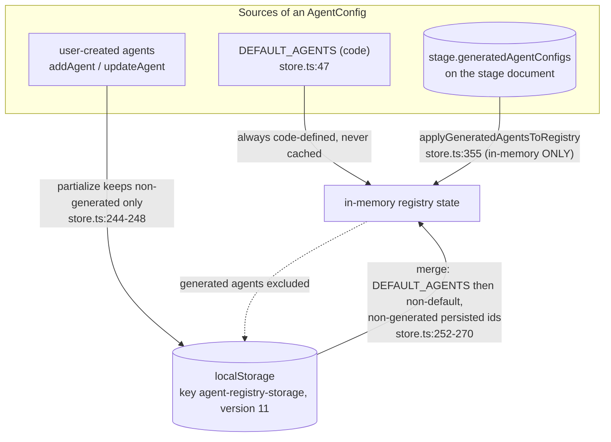
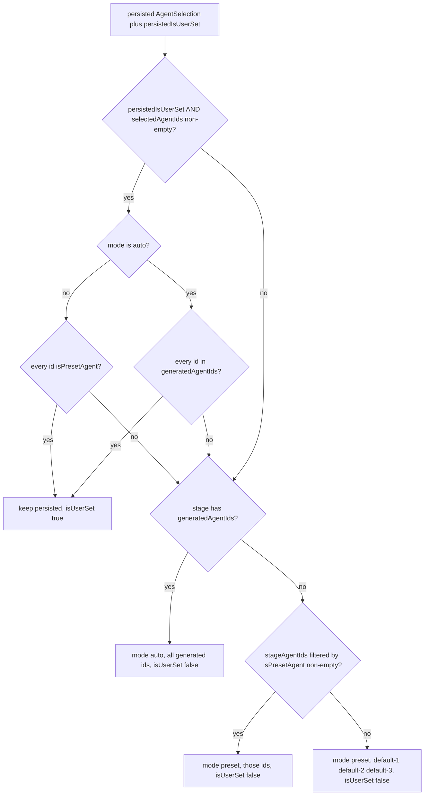
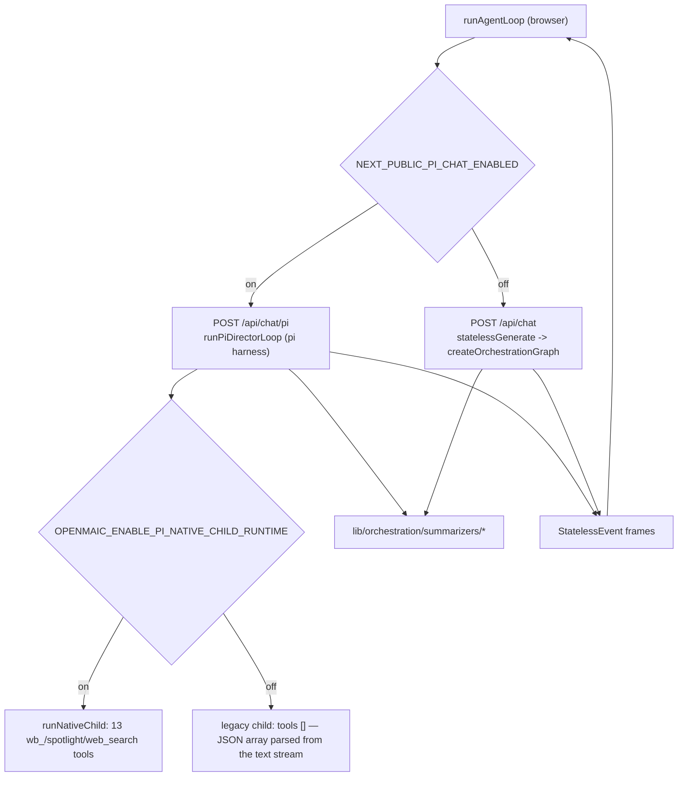
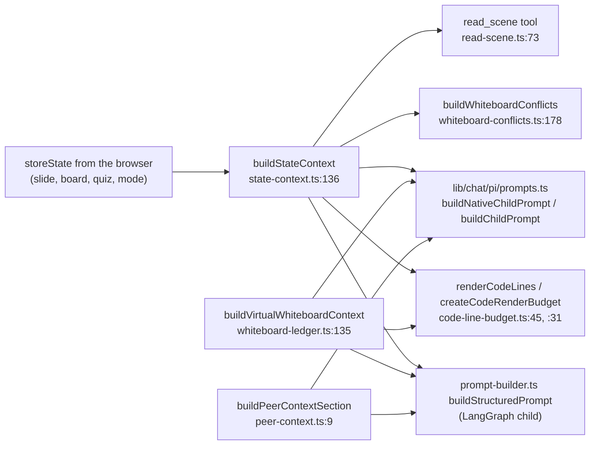

# Orchestration: the Agent Registry, Selection and Summarizers

`lib/orchestration/` (3 477 lines) is the classroom orchestration layer: the
browser-side registry of classroom personas, the rules that decide which personas
are active for a given stage, the older LangGraph director, and a set of pure
prompt-context builders shared by **both** classroom paths. Note the naming trap:
there is no "orchestration registry" of *runtimes* — the registry registers
**agent personas**, not orchestrations.

**Sources:** `lib/orchestration/registry/{store,types,agent-selection}.ts`,
`lib/orchestration/director-graph.ts`, `lib/orchestration/stateless-generate.ts`,
`lib/orchestration/director-prompt.ts`, `lib/orchestration/prompt-builder.ts`,
`lib/orchestration/tool-schemas.ts`, `lib/orchestration/summarizers/*`,
`lib/config/feature-flags.ts`, `lib/chat/pi/prompts.ts`.

## What the registry registers

`useAgentRegistry` (`lib/orchestration/registry/store.ts:207`) is a zustand store
with `persist` over `localStorage`, holding `Record<agentId, AgentConfig>`. An
`AgentConfig` (`registry/types.ts:9-29`) is a persona plus a capability list:

| Field | Meaning |
| --- | --- |
| `id`, `name`, `role`, `persona` | identity and the full system prompt fragment |
| `avatar`, `color` | UI identity |
| `allowedActions` | the classroom actions this agent may emit — the capability boundary |
| `priority` | 1–10, used for director selection and teacher-seat resolution |
| `voiceConfig` / `voiceDesign` | per-agent TTS binding, or a provider-neutral vocal descriptor |
| `isDefault`, `isGenerated`, `boundStageId` | provenance |

Six built-in agents ship in `DEFAULT_AGENTS` (`store.ts:47`): `default-1`
(`teacher`), `default-2` (`assistant`) and `default-3` … `default-6` (`student`).
Only `default-1` gets slide actions.

`ROLE_ACTIONS` (`registry/types.ts:83-87`) is the canonical role → action map:

```
teacher   : SLIDE_ACTIONS (spotlight, laser, play_video) + 12 WHITEBOARD_ACTIONS
assistant : WHITEBOARD_ACTIONS
student   : WHITEBOARD_ACTIONS
```

`getActionsForRole(role)` (`:93`) falls back to whiteboard-only for an unknown
role — capability-closed by default.

### Persistence rules, and the one that matters



`applyGeneratedAgentsToRegistry(stageId, agents)` (`store.ts:355`) is a pure
in-memory side effect: it deletes every currently-loaded generated agent first —
even when the incoming roster is empty, so a prior classroom's roster cannot leak
— re-derives `allowedActions` from the role rather than trusting the document,
drops a `voiceConfig` whose `providerId` is not a known TTS provider, and
fire-and-forget warms each generated agent's auto voice. Nothing it writes becomes
durable; `stage.generatedAgentConfigs` is the persisted truth
(`store.ts:340-353`).

`agentsToParticipants(agentIds, t)` (`store.ts:280`) is the UI projection: teacher
first, then by descending `priority`; the first `role === 'teacher'` takes the
teacher seat, and if none has that role the highest-priority agent does
(`:298-307`). A `user-1` participant is always appended from the user-profile store.

## How a selection is made when a classroom loads

`restoreAgentSelection(params)` (`registry/agent-selection.ts:27`) is a pure
function with one non-obvious rule.



The rule (`agent-selection.ts:12-25`): **only an explicit user choice may cross
classrooms**, and only while it is still valid for the loaded stage. Stage-derived
defaults written by previous classroom loads are not user choices and must never be
re-read as one — otherwise "visiting a preset classroom would permanently downgrade
every auto classroom to preset agents."

## Which classroom orchestration runs

Two live paths behind three flags.

| Flag | Function | Selects | Default |
| --- | --- | --- | --- |
| `NEXT_PUBLIC_PI_CHAT_ENABLED` | `isPiChatEnabled()` (`feature-flags.ts:72`) | the Pi director path **and** gates `POST /api/chat/pi` (404 when off) | OFF |
| `OPENMAIC_ENABLE_PI_NATIVE_CHILD_RUNTIME` | `isPiNativeChildRuntimeEnabled()` (`:80`) | native tool-calling child vs the legacy JSON-action child | OFF |
| `OPENMAIC_ENABLE_PI_NATIVE_CHILD_SPOTLIGHT` | `isPiNativeChildSpotlightEnabled()` (`:88`) | the native `spotlight` tool; **never** selects the child runtime and has no effect on the legacy harness | OFF |

All three are commented out in `.env.example` (`:298`, `:300`, `:324`), so the
shipped default is the **LangGraph** director with the **legacy** JSON-action
child. Only `NEXT_PUBLIC_PI_CHAT_ENABLED` is public; the other two are declared
"Server-only" (`feature-flags.ts:76-90`). Both paths emit
the same `StatelessEvent` SSE protocol, which is what lets one browser loop
(`lib/chat/agent-loop.ts:154`) drive either.



## The LangGraph director

`createOrchestrationGraph()` (`director-graph.ts:484-493`) is two nodes —
`director` (`:486`) and `agent_generate` (`:487`); START and END are LangGraph
sentinels, not nodes:

```
START → director ──directorCondition──→ END
                 └────────────────────→ agent_generate → END
```

One director→agent cycle per request **by topology**, with no `maxTurns` cap: "the
topology is the bound" (`:10-12`). The client serialises requests to get a
discussion.

`OrchestratorState` (`:51-77`) is a LangGraph `Annotation.Root` whose two
accumulating channels use append reducers: `agentResponses` and
`whiteboardLedger` (`:67-74`).

`directorNode` (`:103`) adapts to agent count (`:91-102`):

| Case | Behaviour | LLM call |
| --- | --- | --- |
| `availableAgentIds.length <= 1`, turn 0 | dispatch the sole agent (falls back to `default-1`) | none |
| single agent, turn 1+ | cue the user, keeping the session active | none |
| multi-agent, turn 0 with a `triggerAgentId` | dispatch the trigger agent | none |
| multi-agent otherwise | LLM decision parsed by `parseDirectorDecision` (`director-prompt.ts:216`) | one |

`resolveAgent(state, agentId)` (`:85-87`) reads `state.agentConfigOverrides` first
and only then the global registry. That is what keeps the server stateless:
generated agent configs travel with the request instead of being looked up.

Node output reaches the client through LangGraph's **custom** stream mode — each
node pushes `StatelessEvent` chunks via `config.writer()` (`:20-21`), wrapped in a
try/catch so a controller closed after an abort cannot throw (`:108-114`).

`parseStructuredChunk(chunk, state)` (`stateless-generate.ts:136`) is the
incremental JSON-array parser (over `partial-json`) that turns a legacy child's
`[{"type":"action",…},{"type":"text",…}]` stream into action and text events.
`finalizeParser` (`:327`) structurally recovers visible text when the model never
produced a valid array, and `looksLikeStructuredFragment` (`:264`) suppresses
residue rather than leaking `{"type":"text"…}` into a chat bubble.

## The summarizers: pure prompt-context builders, shared by both paths

Seven modules under `lib/orchestration/summarizers/`. They are the one part of
`lib/orchestration/` that both classroom paths depend on — `lib/chat/pi/prompts.ts`
imports three of them directly (`prompts.ts:4-6`), as does
`lib/chat/pi/tools/read-scene.ts:4`.

| Module | Lines | Entry | What it produces | Consumers |
| --- | --- | --- | --- | --- |
| `state-context.ts` | 271 | `buildStateContext(storeState)` (`:136`), `summarizeElements` (`:103`) | the request-start slide + board summary | `prompt-builder.ts:11`, `lib/chat/pi/prompts.ts:5`, `read-scene.ts:4` |
| `whiteboard-ledger.ts` | 316 | `buildVirtualWhiteboardContext` (`:135`) | this round's mutations as a *virtual* board the child can address | `prompt-builder.ts:12`, `lib/chat/pi/prompts.ts:6` |
| `whiteboard-conflicts.ts` | 242 | `buildWhiteboardConflicts(elements)` (`:178`) | geometric overlap / line-intersection / edge-clipping findings as prose | `state-context.ts:2` |
| `peer-context.ts` | 33 | `buildPeerContextSection` (`:9`) | what peers already said this round | `prompt-builder.ts:13`, `lib/chat/pi/prompts.ts:4` |
| `code-line-budget.ts` | 83 | `renderCodeLines` (`:45`), `createCodeRenderBudget` (`:31`) | the **single** truncation rule shared by the two board summarizers | `state-context.ts:3`, `whiteboard-ledger.ts:3` |
| `conversation-summary.ts` | 69 | `summarizeConversation` (`:35`) | condensed prior conversation for the director | `director-graph.ts:36` |
| `message-converter.ts` | 114 | `convertMessagesToOpenAI` (`:9`) | UI messages → OpenAI format, including tool-call info | `director-graph.ts:37` |

Two of these carry real design content.

**`whiteboard-conflicts.ts`** exists because "the agent reads bbox coordinates
poorly when left to compute intersections itself; this surfaces the conflicts
directly so the model can act on them instead of inferring them" (`:1-11`).
Constants: canvas `1000 × 563` (`:13-14`), `OVERLAP_THRESHOLD = 0.3` measured as
intersection over the *smaller* element's area (`:15`, applied `:200`). The emitted
line is prose, e.g. `OVERLAP: <label><id> and <label><id> share N% of the smaller
one's area — they sit on top of each other.` (`:202`).

**`code-line-budget.ts`** is a deliberate single-source-of-truth: both the
request-start summary and the per-round ledger can carry code blocks whose line
count and id length have no schema cap, so rendering every line would grow the
child prompt without bound (`:1-8`). Its two character tiers are
`MAX_CODE_CONTENT_CHARS = 1200` (lines with truncated content, fully editable) and
`MAX_CODE_IDLIST_CHARS = 400` (remaining lines as bare ids, still editable), with
`MAX_LINE_CONTENT_CHARS = 80` per line (`:17-19`). Past both tiers the tail is
reported as an omitted count only — bounded and no longer individually
addressable. `whiteboard-ledger.ts` allocates the budget most-recently-touched
first, so the block the agent just drew wins.



`getEffectiveActions(allowedActions, sceneType)` (`tool-schemas.ts:16`) is the last
capability filter before a prompt: it strips slide-only actions for non-slide
scenes. `getActionDescriptions` (`:29`) is the prose action catalogue injected into
structured-output prompts.

## Open questions

- **Two live classroom paths with overlapping responsibility.** `lib/chat/pi/` and
  `lib/orchestration/director-graph.ts` both implement a director that dispatches
  classroom agents, both emit `StatelessEvent`, and both consume the summarizers.
  Whether the LangGraph path is scheduled for removal is not stated anywhere in the
  tree.
- **`WHITEBOARD_ACTIONS` / `SLIDE_ACTIONS` are duplicated.**
  `registry/store.ts:29-44` re-declares both locally even though
  `registry/types.ts:62-77` exports exactly those two constants. They currently
  agree; nothing enforces that.
- **Which path the hosted deployment actually runs** is not determinable from this
  repository — all three path flags are commented out in `.env.example`.
