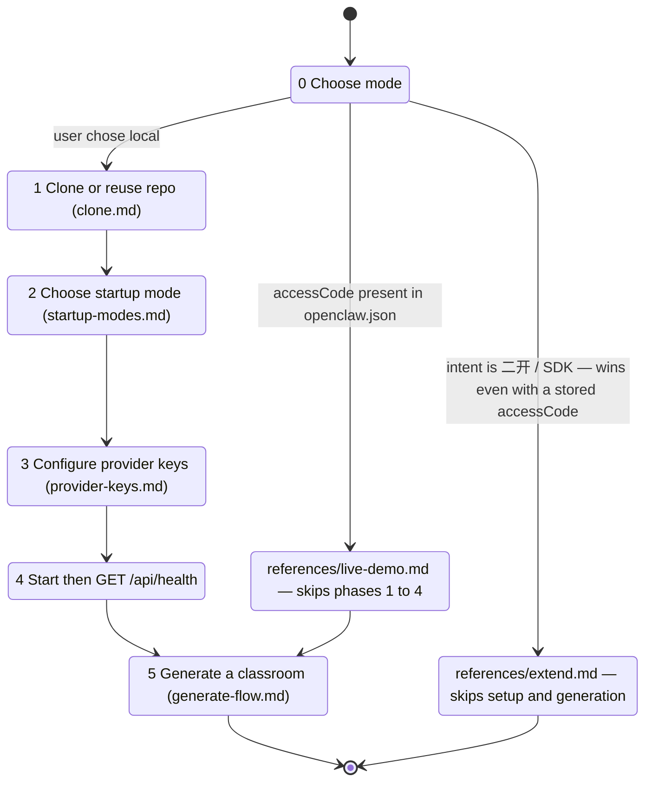
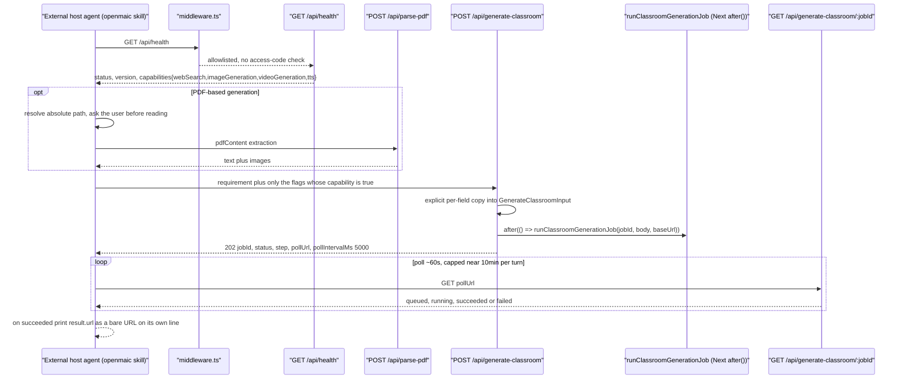
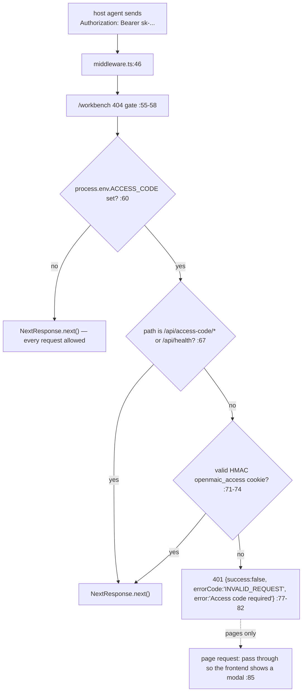

# The `openmaic` Driver Skill

`skills/openmaic/` is the one skill in this repository that **no OpenMAIC runtime
loads**. It is a skill for an *external* host agent (an OpenClaw-style workbench)
that drives an OpenMAIC deployment over HTTP: set it up, verify it, submit a
classroom generation job, and poll it to completion.

**Sources:** `skills/openmaic/SKILL.md` and its eight `references/*.md`,
`app/api/skills/[id]/route.ts`, `app/api/health/route.ts`,
`app/api/generate-classroom/route.ts`, `app/api/generate-classroom/[jobId]/route.ts`,
`lib/server/classroom-generation.ts`, `middleware.ts`,
`lib/server/agent-runtime/config.ts`.

## Why it is not a runtime skill

`agentRuntimeConfig.skillsDir` defaults to `<cwd>/skills/agent-runtime`
(`lib/server/agent-runtime/config.ts:44`), and `skills/openmaic/` is not under it.
It is therefore never in `listSkills()`, never allowlisted for the durable
runtime's `read` tool, and never activatable by an OpenMAIC agent.

Its only in-repo consumer is the export route: `GET /api/skills/openmaic` special-cases
the id and returns `buildOpenClawSkillZip()`
(`app/api/skills/[id]/route.ts:28-31`). That route is itself gated on
`isAgentRuntimeConfigured()` (`:24`) and rejects an unsafe id with 400 (`:26`).

## Package contents

802 lines across nine files.

| File | Lines | Role |
| --- | --- | --- |
| `SKILL.md` | 104 | frontmatter, core rules, and the six-phase SOP |
| `references/generate-flow.md` | 170 | the generation contract, polling loop and reliability rules |
| `references/provider-keys.md` | 159 | which server-side config file to edit for each provider |
| `references/extend-sdk.md` | 83 | consuming the `@openmaic/*` packages |
| `references/extend-cookbook.md` | 82 | worked customisation recipes |
| `references/startup-modes.md` | 69 | available ways to run the app |
| `references/extend.md` | 56 | fork-and-customise branch entry |
| `references/live-demo.md` | 41 | hosted-deployment mode |
| `references/clone.md` | 38 | clone or reuse an existing checkout |

Frontmatter (`SKILL.md:1-6`): `name: openmaic`, `user-invocable: true`, and
`metadata: { "openclaw": { "emoji": "🏫" } }` — the metadata key names the intended
host.

## The SOP is a state machine with two shortcuts

The precedence rule at `SKILL.md:56` is the interesting one: a stored `accessCode`
normally short-circuits to Live Demo, **but** an expressed intent to extend or
consume the SDK overrides it, because "a returning Live Demo user who now wants to
do 二开 should be routed to extend, not silently sent back to Live Demo."

Four rules constrain the host agent's autonomy over provider config
(`SKILL.md:17-23`):

- do not assume the host agent's own model or API key will be reused by OpenMAIC;
- generation uses **OpenMAIC server-side** provider config only;
- the skill must not rely on any request-time model or provider overrides;
- do not default to asking the user to paste keys into chat, and do not offer to
  write keys into config files on their behalf.

One rule loosens it deliberately (`SKILL.md:24`): once setup is complete and the
user has clearly asked to generate, do **not** ask a second time before submitting.

## End-to-end generation path

### Capability probe

`GET /api/health` (`app/api/health/route.ts:11`) returns
`{status, version, capabilities}` where each capability is true only when at least
one **non-force-disabled** provider exists for it (`:16-21`). The skill's rule
(`generate-flow.md:69`) is: only set a feature flag to `true` if the corresponding
capability is `true`, and send no new fields at all if the server did not return
`capabilities` — forward compatibility with an older deployment.

`/api/health` is one of exactly three route files the middleware allowlists — the
other two are `access-code/status` and `access-code/verify`, matched by the
`/api/access-code/` prefix (`middleware.ts:65-68`) — and the only one of the three
that is not part of the access-code flow. That is why the probe works before any
access-code handling.

### Submission

`POST /api/generate-classroom` (`app/api/generate-classroom/route.ts:14`) builds
`GenerateClassroomInput` by **explicit per-field copy** (`:19-36`), returns 202 with
`{jobId, status, step, message, pollUrl, pollIntervalMs: 5000}` (`:50-60`), and
schedules the real work with Next's `after()` so the job outlives the response
(`:48`). `maxDuration = 30` applies to the submission handler only (`:12`).

Fields accepted by `GenerateClassroomInput`
(`lib/server/classroom-generation.ts:48-60`): `requirement`, `pdfContent`,
`enableWebSearch`, `webSearchProviderId`, `webSearchApiKey`, `webSearchModelId`,
`baiduSubSources`, `enableImageGeneration`, `enableVideoGeneration`, `enableTTS`,
`agentMode`.

### Polling and job steps

The skill's polling discipline (`generate-flow.md:104-127`) is deliberately more
conservative than the server's own hint: prefer ~60 s between polls even though
`pollIntervalMs` is 5 000; never resubmit; retry the same `pollUrl` on a transient
`5xx`; cap active polling at ~10 min per agent turn and hand the `jobId` forward
so a later turn can resume; report progress only when `status`, `step` or visible
progress meaningfully changes.

Job steps come from `ClassroomGenerationStep`
(`lib/server/classroom-generation.ts:62-70`):
`initializing → researching → generating_outlines → generating_scenes →
generating_media → generating_tts → persisting → completed`.

### Output formatting is part of the contract

`generate-flow.md:139-159` and `SKILL.md:104` both require the classroom URL to be
a raw absolute URL on its own line — no bold, no markdown link, no code
formatting, no angle brackets, no table. That is a rendering constraint of the host
chat surface, expressed as a skill rule.

## Two documented-vs-code discrepancies

These matter more than ordinary drift because this is the *externally published*
contract.

### 1. `language` is documented and silently dropped

`generate-flow.md:37` documents `optional language ("zh-CN" | "en-US", defaults to
"zh-CN") — any other value silently falls back to "zh-CN"`.
`GenerateClassroomInput` (`lib/server/classroom-generation.ts:48-60`) has **no**
`language` member, and the route builds its input by explicit field copy
(`app/api/generate-classroom/route.ts:19-36`), so the value never reaches the
generator. A driver that sets `language: "en-US"` gets no error and no effect; the
generator derives a language directive internally instead.

### 2. `Authorization: Bearer <access-code>` is not an auth mechanism in this repo

The `Bearer` header is never read. The only access gate in the tree is
`middleware.ts:46-90`, which requires an HMAC-signed `openmaic_access` **cookie**
(minted by `POST /api/access-code/verify`) and 401s any other `/api/*` request.
A self-hosted OpenMAIC with `ACCESS_CODE` set will reject a Bearer-only driver on
its very first `POST /api/generate-classroom`.

Likewise, `live-demo.md:30-33` documents "10 generations per day" and a
`403 Daily quota exhausted` response. Nothing in `app/api/generate-classroom/`
implements a quota, and no route in this repository returns that error.

*Inferred:* the hosted Live Demo at `open.maic.chat` terminates the Bearer header
and enforces the quota at a gateway or in a fork that is not in this repository.
The skill documents the **hosted deployment's** contract, not this codebase's.

## Open questions

- **Where is Bearer terminated for the Live Demo?** Not in this tree. What a
  self-hosted OpenMAIC with `ACCESS_CODE` set is supposed to do with a Bearer-only
  driver is unresolved either way.
- **Is the quota enforced anywhere?** No `403 Daily quota exhausted` and no
  per-identity counter exists in `app/api/**`.
- **Is `buildOpenClawSkillZip` the only publication path?** The route serves it,
  but whether the hosted host-agent marketplace pulls from there or from a mirror
  is not visible here. See [`../12-api-reference/index.md`](../12-api-reference/index.md).
