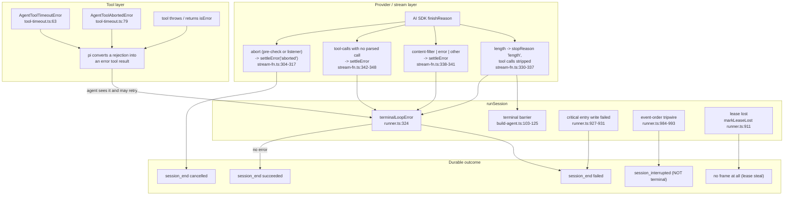
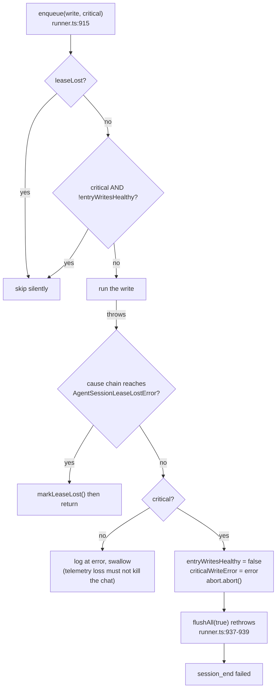
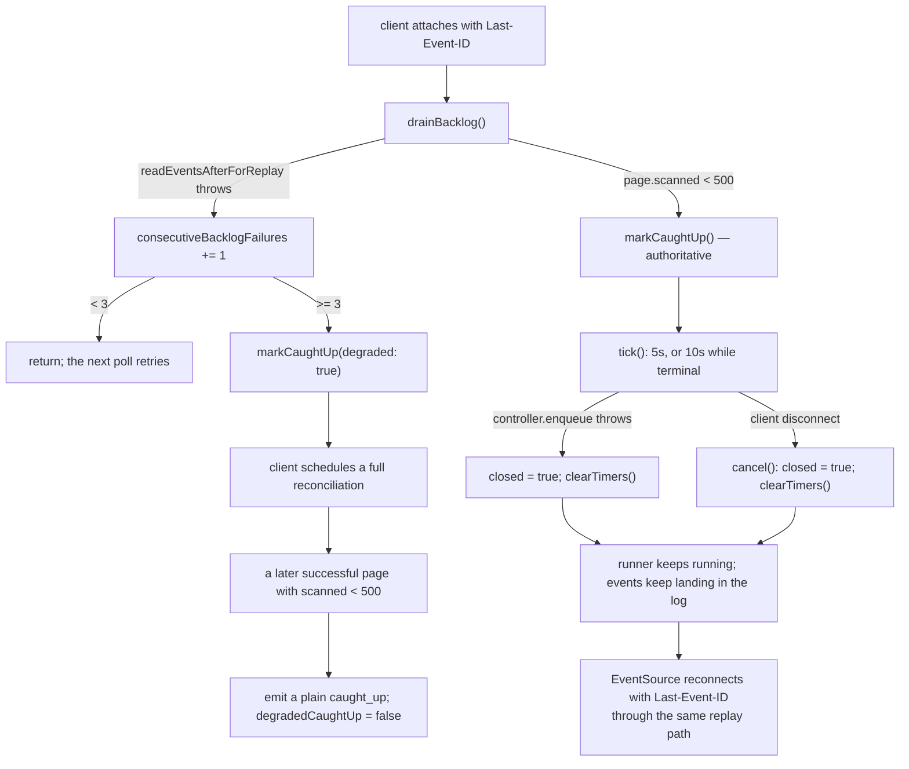
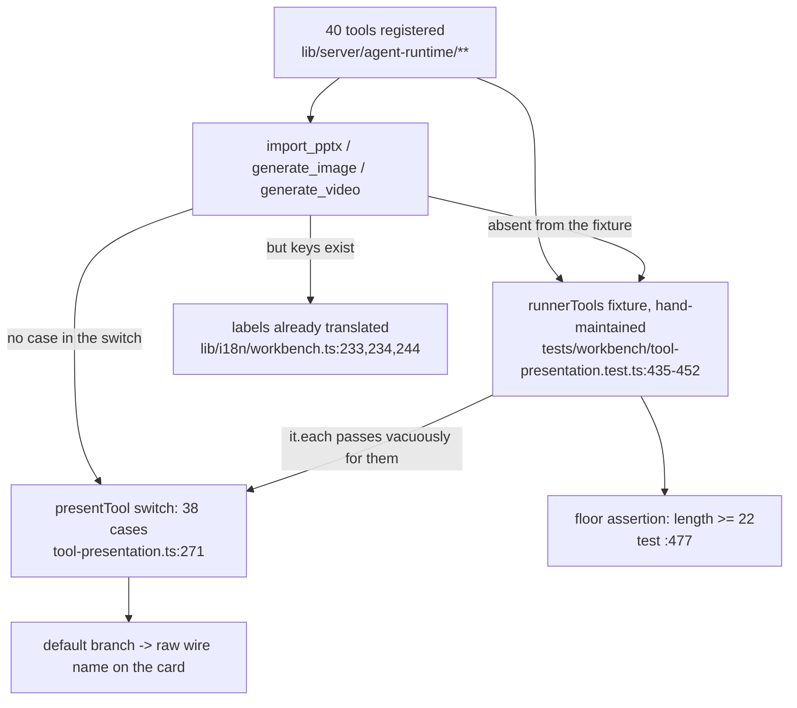

# Failure Modes and Gaps

What actually happens on a model error, a tool throw, a stream disconnect and a
session-store failure — plus the gaps, named and located. This file is the
"page at 3 a.m." reference.

**Sources:** `lib/server/agent-runtime/runner.ts`, `lib/server/agent-runtime/store.ts`,
`lib/server/agent-runtime/entry-tree-storage.ts`, `lib/agent/runtime/{stream-fn,tool-timeout,build-agent}.ts`,
`app/api/agent/sessions/[id]/events/route.ts`, `app/api/chat/pi/route.ts`,
`components/workbench/chat/tool-presentation.ts`,
`tests/workbench/tool-presentation.test.ts`.
Evidence: [`../appendix/research/agent-runtime/05-failure-modes.md`](../appendix/research/agent-runtime/05-failure-modes.md).

## Error propagation

The single most important shape: **a tool failure is not a session failure.** pi
converts a rejected `tool.execute` into a structured error tool result, so the
model sees the failure and can retry or proceed (`tool-timeout.ts:18-22`). Only a
loop-level error, a critical write failure, or a truncated model turn ends a run.

## Model errors

| Failure | Detected by | Behaviour |
| --- | --- | --- |
| Output truncated at the token limit | `terminalLoopError` sees the last assistant frame's `stopReason === 'length'` (`runner.ts:324-333`) | `status = 'failed'` with `LENGTH_STOP_ERROR` = "model output hit the max token limit and was truncated; this run did not finish" (`:321`) |
| Truncated **while emitting tool calls** | `settleFinish` registers the message in `lengthToolCallMessages` (`stream-fn.ts:332`); `build-agent.ts:104-116` sees `turn_end` + `hasLengthToolCallProvenance` | **terminal barrier**: `agent.clearAllQueues()`, and `steer`/`followUp` become no-ops until `agent_end` (`:118-125`), so a queued follow-up is not fed into a wedged turn |
| Content filter / provider error / unknown finish reason | `settleFinish` default and `content-filter` / `error` / `other` branches | `settleError('error', …)` → pi surfaces `state.errorMessage` → `terminalLoopError` returns it → `session_end failed` |
| `tool-calls` reported with no complete parsed call | `stream-fn.ts:342-348` | error, message names the condition explicitly |
| Provider aborted mid-stream | pre-check at `stream-fn.ts:373-377`, listener at `:380-392` | `stopReason: 'aborted'`, executable tool calls stripped |

Note `removeExecutableToolCalls()` (`stream-fn.ts:300-302`) runs on both the
`length` and error paths: a partially-parsed tool call must never be handed to the
executor.

## Tool errors

| Failure | Behaviour |
| --- | --- |
| Tool hangs | `withAgentToolTimeout` rejects with `AgentToolTimeoutError` after 10 min (15 for `generate_scene`/`generate_actions`/`extract_material`); the derived signal aborts the tool's in-flight work; a throwing abort listener cannot break settlement (`tool-timeout.ts:130-138`); post-settlement progress updates are dropped (`:190-194`) |
| Tool aborted by cancel / shutdown / lease loss | `AgentToolAbortedError` (`:79`) |
| Foreign / missing / tombstoned stage | one `isError` result, `details.refused = true`, message never reveals which of the three (`course-tools.ts:174-185`) |
| Patch batch partially valid | nothing persisted; the result names `failedOp`; same for the media-placeholder final-state guard and structure validation (`dsl-tools.ts:793-834`) |
| `grep_stage` blows the time/char budget | truncated result plus a continuation cursor bound to `{stageId, query, scope}`; a mismatched cursor returns `Invalid or mismatched grep_stage cursor.` |
| Whiteboard write races another writer | `RuntimeAppendConflictError` caught in the tool (`native-whiteboard.ts:500`); the model is told to re-read `expectedLastSeq` |
| `create_skill` database failure | `isError` with `details.error = 'database-error'` and user-facing text ending "**Nothing was created or overwritten.**" (`create-skill.ts:66-79`) |
| Orphaned tool call | write-time receipts via `queueInterruptedToolResults`; read-time view via `repairOrphanedToolCalls` — see [`05-abort-and-interruption.md`](./05-abort-and-interruption.md) |

## Session-store and entry-tree failures

| Failure | Detected by | Behaviour |
| --- | --- | --- |
| `DATABASE_URL` unset | `getAgentSessionStore` (`store.ts:91-95`) | rejects with `Agent runtime requires DATABASE_URL`; every `/api/agent/*` route is already 404 via `isAgentRuntimeConfigured()` |
| Store construction / schema provisioning fails | `getAgentSessionStore` catch (`store.ts:101-107`) | the cached promise **and** the cached connection string are cleared so a later request retries after the database comes back |
| Corrupt / inconsistent entry tree | `loadSessionEntryHistory` (`entry-tree-storage.ts:43`) | throws `SessionEntryHistoryError` for an empty tree after a prior run (`:48-51`), a non-backward `firstKeptEntryId` (`:66-72`), or a context↔entry length mismatch (`:109-114`); lands in the outer setup catch → `session_end failed`, or a park when shutting down |
| Session vanished mid-open (concurrent soft-delete) | `translateStorageError` (`:148-150`) | classified as pi `SessionError('not_found')` rather than an opaque failure |
| Session's frozen skill unavailable for its owner | `runner.ts:1181-1183` | hard error `session skill "<id>" is unavailable for its owner` → `session_end failed`. Also validated at create time so a typo does not sit queued (`app/api/agent/sessions/route.ts:100-116`) |
| Attempt cap exceeded | `isOverAttemptCap` (`runner.ts:305`) | verdict-only claim, no model call, `session_end failed` with "send a new message to retry" |
| `runSession` itself crashes | `void runSession(...).catch(...)` (`runner.ts:1880-1883`) | logged, `ctx.running.delete(meta.id)` so the slot is not leaked; the lease then expires normally |
| Claim scan throws | `scan()` catch (`runner.ts:1885-1889`) | logged as `claim scan failed`; `scanning` reset in `finally` so the next tick retries |
| Post-terminal requeue check fails | `requeueIfUndelivered` catch (`runner.ts:1063-1065`) | logged at `warn` and swallowed |

Note the deliberate asymmetry in `flushAll`: it does **not** rethrow when
`leaseLost` (`runner.ts:937`), because a rejected write on a stolen generation is
the expected outcome, not a fault.

## Stream disconnect

Five properties of the reader, all commented in place:

1. **A disconnect closes the reader and nothing else** — the runner keeps running
   (`events/route.ts:30-33`).
2. **The stream does not close at `session_end`** — a run boundary is just another
   frame (`:19-23`). Terminal switches to the 10 s cadence, and any later durable
   frame switches back (`:174-185`).
3. **Pagination judges the raw page size**, not the compacted length, because a
   page of pure `message_update` frames compacts to two frames and would otherwise
   look exhausted mid-log (`:202-205`).
4. **Polls are serialised**: the next poll is scheduled only after the previous one
   *settles*, because two concurrent polls share the cursor and the slower one
   would rewind it (`:255-272`).
5. **A broken socket does not always call `cancel()`**, so `write` sets `closed`
   and clears the timers the moment `controller.enqueue` throws (`:127-133`).

On the browser side, `source.onerror` distinguishes an auto-reconnect (clear
`attached` only) from `readyState === CLOSED` (finish replay, set an error string)
— `lib/workbench/use-workbench-session.ts:244-255`.

## Classroom runtime failures

| Failure | Behaviour |
| --- | --- |
| Feature flag off | `POST /api/chat/pi` → 404 (`app/api/chat/pi/route.ts:43-45`) |
| Missing `messages` / `storeState` / `config.agentIds` | 400 `MISSING_REQUIRED_FIELD` (`:56-66`) |
| `agentIds` not unique / blank / untrimmed | 400 with the exact constraint spelled out (`:79-90`) |
| Unknown agent ids after `resolveAgentConfigs` | 400 listing them (`:116-122`) |
| Provider needs a key, none resolved | 401 `MISSING_API_KEY` (`:109-111`) |
| Bad element reference | 400 from `ElementReferenceValidationError` (`:72-75`) |
| Persistence init fails during the whiteboard probe | warn `Native whiteboard capability unavailable: persistence initialization failed`; the `wb_*` tools are simply not registered (`:183-186`) |
| Idle SSE connection | `:heartbeat` every 15 s; the ticker stops itself on a write failure (`:212-218`) |
| Mid-stream error | `send({type:'error', data:{message}})` then close — **unless** the request was aborted, in which case it closes silently with no error frame (`:262-283`) |
| Child hangs | `timeoutMs: 60_000` → `status:'exhausted'`, `stopReason:'native_timeout'` |
| Child loops on provider calls | `maxProviderTransports: 5` → `stopReason:'native_provider_transport_budget'` |
| Child reissues a `toolCallId` | `stopReason:'native_duplicate_tool_call'` |
| Child hits the output token limit | `status:'exhausted'`, `stopReason:'output_token_limit'` |
| Any non-`completed` child status | `consecutiveEmptyTurns += 1` and the `call_agent` result is marked `isError` |
| Director exceeds its tool budget | `afterToolCall` returns `terminate: true` (`director-loop.ts:238`) |
| Compaction fails | the message is pushed onto `trace.failures` and the **pre-compaction** context is returned, so the turn still runs |
| Malformed structured output (legacy child) | `finalizeParser` recovers visible text where possible; `looksLikeStructuredFragment` suppresses residue rather than leaking `{"type":"text"…}` into a bubble |
| Unknown action or bad params | `validateActionParams` rejects it and an `actionWarnings` entry (`unknown_action` / `invalid_params` / `raw_structured_fallback`) rides in the turn summary |
| Non-2xx from `/api/chat*` | the browser loop **throws** `API error: <status> - <body>` (`agent-loop.ts:197-200`) |

## The gaps

### 1. Three registered tools render their raw wire name in the chat

Severity: medium. `presentTool` states the rule itself
(`components/workbench/chat/tool-presentation.ts:29-39`): every tool the runtime
can call has a copy key, the `default` branch is "a fallback for a tool this file
has not been told about, never a shipping state", and
`tests/workbench/tool-presentation.test.ts` "reconciles the runner's allowlist
against this switch, so a newly registered tool without a label fails that test
rather than shipping its wire name."

Measured: 38 `case` labels against 40 registered tools. The three without rows are
`import_pptx`, `generate_image`, `generate_video` — and their i18n labels already
exist in both locales (`lib/i18n/workbench.ts:233-234`, `:244` English;
`:526-527`, `:537` Chinese; error variants at `:309-310`, `:318` and `:602-603`,
`:611`). Only the switch cases are missing.

The reconciliation does not fail because the fixture is composed by hand from ten
imported constants plus four literals (`test:435-453`) and never imports
`IMPORT_PPTX_TOOL_NAME`, `GENERATE_IMAGE_TOOL_NAME`, `GENERATE_VIDEO_TOOL_NAME` or
`PERSONAL_HISTORY_TOOL_NAMES`. The floor assertion
`expect(runnerTools.length).toBeGreaterThanOrEqual(22)` (`:477`) guards the fixture
against shrinking, not against a tool being added elsewhere. The stale note at
`tool-presentation.ts:9-11` — "PPT-import and video/image tools are not registered
upstream and have no rows" — explains how it happened; those tools *are* registered
here (`course-tools.ts:212-214`).

Fix shape: import the three name constants into the fixture. The switch cases then
fail the test until they are written.

*(`generate_roster` is the opposite case and is not a bug: it has a row with no
registered tool, deliberately, so historical transcripts replay cleanly — the test
asserts it is absent from the allowlist at `:481-484`.)*

### 2. The allowlist is a second, partly hand-written expression over the same tools

Severity: medium. `runner.ts:1475-1491` derives two entries from the built arrays
but spells out the rest as constants. A tool registered in one of those groups and
omitted from its `*_TOOL_NAMES` constant is silently blocked at runtime by
`makeAllowlistGate` with "not enabled in this build" — which reads to the model as
a deployment restriction, not a bug. `tests/agent-runtime/runner-contract.test.ts`
only asserts that `assembleRunnerTools` flattens groups in order; nothing pins
registration ↔ allowlist. `buildCourseAllowlist` (`course-tools.ts:223`) is a
self-consistent alternative that the runner does not use.

Also undocumented at its declaration: `MATERIAL_TOOL_NAMES`
(`material-tools.ts:604-611`) contains `fetch_url`, which is built by a different
factory.

### 3. Compaction config is dead

Severity: medium — an operator can set three env vars and reasonably believe
compaction is on. `agentRuntimeConfig.compaction` (`config.ts:27-42`) has zero
consumers, and `runner.ts` never passes `transformContext` to `buildAgent`. The
config comment admits it (`config.ts:20-26`) but the env var reads as a working
switch. Detail in [`04-session-and-context.md`](./04-session-and-context.md).

### 4. No quota on turns, tokens or spend

Severity: low today, high for a paid deployment. `quota.ts:8-13` is a 13-line stub
wired open with `remaining: () => Number.MAX_SAFE_INTEGER` (`build-agent.ts:66`).
The only cost controls in the durable runtime are `maxConcurrent` (2),
`maxAttempts` (5), the per-tool timeout, and the 100 000-character text limit —
whose own doc comment says the plan is "no credit gate and no per-identity quota,
so an anonymous identity could otherwise post unbounded text and drive unbounded
database bloat and unbounded LLM spend" (`limits.ts:3-8`). The identity in question
is a cookie anyone can discard (`owner.ts`).

The only per-owner ceilings that exist anywhere in the tree are the material
quotas — 100 records and 2 GiB per owner (`config.ts:50`, `:52-55`), enforced with
a 429 `MaterialQuotaExceededError` on upload (`app/api/materials/route.ts:274-284`).
Nothing bounds turns, tokens or spend, and no `/api/agent/**` or `/api/chat*` route
rate-limits at all: the only other 429s in `app/api/**` relay an upstream
service's own rate limit (`app/api/generate/tts/route.ts:167-168`,
`app/api/export-video/render/route.ts:89-96`). See
[`../15-cross-cutting/index.md`](../15-cross-cutting/index.md).

### 5. `register_voice` results are unreachable after the run ends

Severity: low-medium, documented as intentional. Registered voices live in a
run-local array shared by the roster and voice-clone toolsets
(`runner.ts:1394-1419`, "in-session loop by design, no persistence"). A user who
clones a voice in one conversation and opens a new one cannot bind it, and nothing
in the tool result says so — contrast `patch_skill`, which attaches a scope note to
every result (`skill-edit-tools.ts:47`).

### 6. `meta.stageId` is stored, streamed, and never read by the runner

Severity: low, explicitly deferred (`app/api/agent/sessions/route.ts:133-136`). An
`existingCourse` session reaches the model with `existingCourse` as its only signal;
the actual stage is conveyed by the opening message's `courseRefs` or discovered via
`list_folder_stages`.

## Open questions

- **What the store guarantees under a two-worker race.** Everything above
  describes what the *runner* does with `claimNextSession` / `finishSession` /
  `requeueSession`; the guarantees live in `packages/@openmaic/storage`.
- **Whether the durable runner can run on a serverless platform.** Both SSE routes
  set `maxDuration = 300` with a note that self-hosted `next start` does not
  enforce it (`events/route.ts:44-46`), but `startAgentRunner` is a `setInterval`
  in `instrumentation.ts`, which only makes sense in a long-lived Node process.
  The intended production topology is not documented in the tree — see
  [`../17-deployment-view/index.md`](../17-deployment-view/index.md).
- **Baseline test state.** No test run was performed while writing this topic;
  every "tests cover X" statement here is derived from test file names, case names
  and imports.
