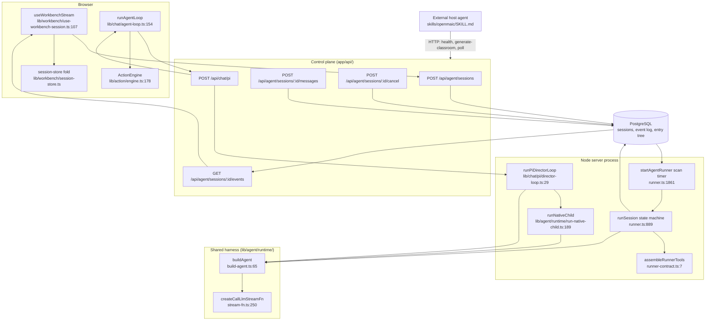

# Component View: Agent Runtime, Tools, Orchestration

C4 level 3 for the agent subsystem: the durable background authoring runtime, the
request-scoped in-class chat runtime, the shared pi harness both sit on, the 40+17
tool catalogue, and the externally-consumed driver skill. This is the code that
turns a chat message into a persisted stage document, and the code that turns a
classroom scene into a multi-agent conversation.

**Sources:** `lib/server/agent-runtime/**` (16 154 lines), `lib/agent/runtime/**`,
`lib/agent-runtime/**`, `lib/chat/**`, `lib/orchestration/**`, `lib/action/engine.ts`,
`lib/workbench/{use-workbench-session,session-store,owner-session-client}.ts`,
`app/api/agent/**`, `app/api/chat/**`, `app/api/skills/**`, `skills/**`,
`instrumentation.ts`. Evidence pack: [`../appendix/research/agent-runtime/`](docs/appendix/research/agent-runtime/00-overview.md).

## The one thing to know first

There are **two** independent agent runtimes in this repository. They share exactly
two things — the pi harness (`@earendil-works/pi-agent-core` 0.78.0, pinned exact,
[`package.json:52-53`](package.json#L52-L53)) and the LLM adapter ([`lib/agent/runtime/stream-fn.ts:250`](lib/agent/runtime/stream-fn.ts#L250)) —
and nothing else. Their lifetime models are opposites:

| | Durable background runtime | In-class chat runtime |
| --- | --- | --- |
| Also called | "agent runtime", "workbench agent" | "Pi chat", "director loop" |
| Purpose | authors and edits stage documents | runs the classroom conversation a learner sees |
| Lifetime owner | PostgreSQL lease, kept alive by a per-session heartbeat `setInterval` ([`lib/server/agent-runtime/runner.ts:1090`](lib/server/agent-runtime/runner.ts#L1090)) and handed out by the claim-scan `setInterval` ([`:1892`](lib/server/agent-runtime/runner.ts#L1892)) | the HTTP request (`req.signal`) |
| Server state | PostgreSQL is the authority | none — fully stateless per request |
| Who owns the loop | the server ([`runner.ts:889`](lib/server/agent-runtime/runner.ts#L889)) | the browser ([`lib/chat/agent-loop.ts:154`](lib/chat/agent-loop.ts#L154)) |
| Client transport | SSE tail over a durable event log, `Last-Event-ID` | SSE per iteration, full state re-posted each time |
| Entry | [`instrumentation.ts:49`](instrumentation.ts#L49) | [`app/api/chat/pi/route.ts:42`](app/api/chat/pi/route.ts#L42) |

A third, older classroom path still ships: the LangGraph `StateGraph` director at
[`lib/orchestration/director-graph.ts:484`](lib/orchestration/director-graph.ts#L484), behind `POST /api/chat`. It emits the same
SSE protocol, so the browser loop drives either one; `NEXT_PUBLIC_PI_CHAT_ENABLED`
selects which ([`lib/config/feature-flags.ts:72`](lib/config/feature-flags.ts#L72)).

## Topic overview

## Who this is for

A staff engineer about to change agent behaviour: add a tool, change the loop,
debug a stuck session, or reason about what survives a crash. Read
[`01-agent-loop.md`](docs/05-agent-runtime/01-agent-loop.md) and its second half first — everything
else assumes them.

Fast lookups:

| I need to… | Go to |
| --- | --- |
| add a tool to the durable runtime | [`03-tool-catalogue.md`](docs/05-agent-runtime/03-tool-catalogue.md) (five auth layers, and the two places a name must be registered) |
| understand why a session is stuck at `running` | [`05-abort-and-interruption.md`](docs/05-agent-runtime/05-abort-and-interruption.md) (`session_interrupted` is not terminal) |
| understand why a chat row shows a raw tool name | [`08-failure-modes.md`](docs/05-agent-runtime/08-failure-modes.md) gap 1 |
| know what the model actually sees this turn | [`04-session-and-context.md`](docs/05-agent-runtime/04-session-and-context.md) |
| change classroom personas or turn-taking | [`06-orchestration-registry.md`](docs/05-agent-runtime/06-orchestration-registry.md) |
| drive OpenMAIC from an external agent | [`07-skill-package.md`](docs/05-agent-runtime/07-skill-package.md) |

## Section files

| File | Contents |
| --- | --- |
| [`01-agent-loop.md`](docs/05-agent-runtime/01-agent-loop.md) | The durable loop, part 1: claim, the write chain and `emit`, session load and recovery, message assembly, the model call, turn states. |
| [`01b-loop-dispatch-and-settle.md`](docs/05-agent-runtime/01b-loop-dispatch-and-settle.md) | The durable loop, part 2: tool dispatch and the durable receipt protocol, the two stop mechanisms, the settle sequence, and why the SSE stream sits outside the loop. |
| [`02-client-server-split.md`](docs/05-agent-runtime/02-client-server-split.md) | What runs in the browser vs the server for both runtimes, and the two wire protocols between them. |
| [`03-tool-catalogue.md`](docs/05-agent-runtime/03-tool-catalogue.md) | Every registered tool group and tool: purpose, what it may mutate, and the five authorisation layers. |
| [`04-session-and-context.md`](docs/05-agent-runtime/04-session-and-context.md) | Session state, the entry tree, skill preloading, and the token/size budgets that stand in for context folding. |
| [`05-abort-and-interruption.md`](docs/05-agent-runtime/05-abort-and-interruption.md) | Cancel, shutdown, lease loss and tool timeout: what each one stops, and what survives. |
| [`06-orchestration-registry.md`](docs/05-agent-runtime/06-orchestration-registry.md) | The classroom agent registry, agent selection, the LangGraph director, and the summarizers. |
| [`07-skill-package.md`](docs/05-agent-runtime/07-skill-package.md) | [`skills/openmaic/SKILL.md`](skills/openmaic/SKILL.md): the driver skill an external workbench uses to build a classroom over HTTP. |
| [`08-failure-modes.md`](docs/05-agent-runtime/08-failure-modes.md) | Model error, tool throw, stream disconnect, store failure — current handling and the gaps. |

## Related topics

- [`../03-app-and-api/index.md`](docs/03-app-and-api/index.md) — the HTTP surface these routes live in, and the single auth gate.
- [`../04-ai-provider-layer/index.md`](docs/04-ai-provider-layer/index.md) — `streamLLM`, `MODEL_ROUTES`, and what `resolveAgentDriverModel` resolves against.
- [`../06-generation-pipeline/index.md`](docs/06-generation-pipeline/index.md) — what `generate_scene` / `generate_actions` call into.
- [`../07-dsl-renderer-editor/index.md`](docs/07-dsl-renderer-editor/index.md) — the stage document `patch_stage` writes.
- [`../08-classroom-runtime/index.md`](docs/08-classroom-runtime/index.md) — the `ActionEngine` sink and the playback engine.
- [`../10-persistence-and-state/index.md`](docs/10-persistence-and-state/index.md) — `PgAgentSessionStore`, the entry tree, and the client fold.
- [`../11-data-flows/index.md`](docs/11-data-flows/index.md) — end-to-end traces that cross this subsystem.
- [`../01-system-context/index.md`](docs/01-system-context/index.md) — the set's entry point: the L1 context, the actor list, and the notation legend every diagram here uses.
- [`../18-decisions/01-two-agent-runtimes.md`](docs/18-decisions/01-two-agent-runtimes.md) — why there are two runtimes rather than one with a `durable` flag, the three alternatives rejected, and the signal that would mean the split is now wrong.
- [`../glossary.md`](docs/glossary.md) — the two senses of "agent", and the four of "stage".
- [`../README.md`](docs/README.md) — the documentation set root.
