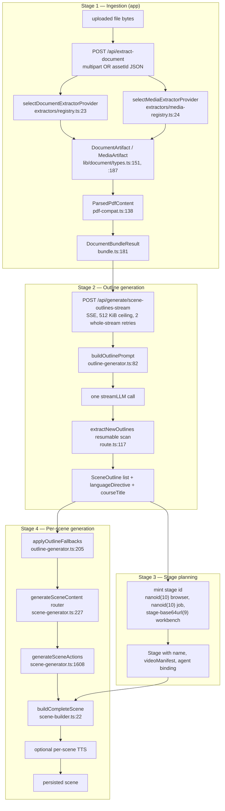
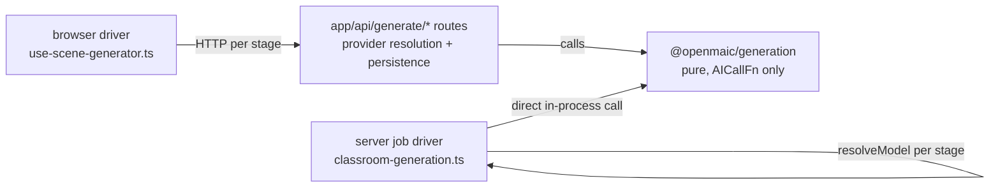
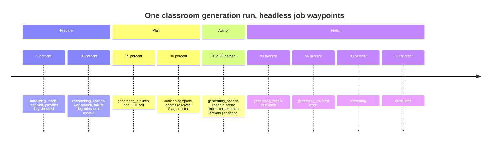
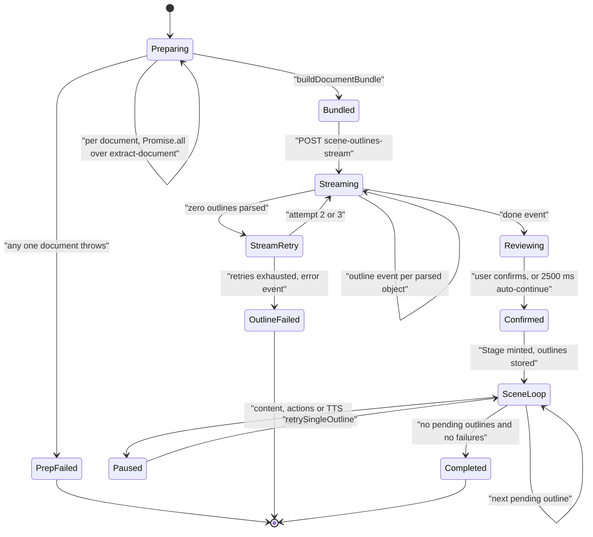

# Pipeline Overview

The whole pipeline at one glance: four sequential stages, the artefact each hands to the
next, and the two independent drivers that execute them. Read the stage boundaries as
*artefact* boundaries — each one is a concrete type you can log, diff, and test against.

**Sources:** `packages/@openmaic/generation/src/{outline-generator,scene-generator,scene-builder}.ts`,
`app/api/generate/{scene-outlines-stream,scene-content,scene-actions}/route.ts`,
`lib/document/{bundle,pdf-compat}.ts`, `lib/hooks/use-scene-generator.ts`,
`lib/server/classroom-generation.ts`, `app/generation-preview/page.tsx`;
evidence: [`00-overview.md`](../appendix/research/generation-pipeline/00-overview.md),
[`03a-flows-ingestion-outline.md`](../appendix/research/generation-pipeline/03a-flows-ingestion-outline.md).

## The four stages and their artefacts

| # | Stage | Input | Output artefact | Owner |
| --- | --- | --- | --- | --- |
| 1 | Ingestion | uploaded bytes | `DocumentArtifact` / `MediaArtifact` → `ParsedPdfContent` → `DocumentBundleResult` | app (`lib/document`) |
| 2 | Outline generation | requirement + bundle | `{ languageDirective, courseTitle?, outlines: SceneOutline[] }` | package (`outline-generator.ts:120`) |
| 3 | Stage planning | outlines + course title | a `Stage` with an id, name, and video manifest | app (three different call sites) |
| 4 | Per-scene generation | one `SceneOutline` | `Generated*Content` → `Action[]` → `CompleteScene` | package (`scene-generator.ts`, `scene-builder.ts`) |

Stage 4 is itself three hops with a hard boundary between the first two, because the app
exposes them as two separate HTTP routes with different `maxDuration` budgets (300 s for
content at `app/api/generate/scene-content/route.ts:39`, 60 s for actions at
`app/api/generate/scene-actions/route.ts:35`).

## End to end

Two things the diagram makes explicit that the prose above does not:

- The **bundle is the only ingestion output the model ever sees.** Raw provider text is
  never handed to a prompt directly on the multi-document path; it goes through the
  budgeting and image-renumbering in `buildDocumentBundle`
  (`lib/document/bundle.ts:181`).
- **Stage 3 does not gate stage 4.** The stage id feeds `buildCompleteScene` as a plain
  string; scene generation does not read anything else off the stage. On the browser path
  the stage exists in memory before the first scene is generated
  (`app/generation-preview/page.tsx:534`, `:944`).

## Two execution drivers over the same primitives

| | Interactive (default UI) | Headless one-shot job |
| --- | --- | --- |
| Entry | `/generation-preview` → `app/generation-preview/page.tsx:306` | `POST /api/generate-classroom` → `app/api/generate-classroom/route.ts:14` |
| Scene loop | `lib/hooks/use-scene-generator.ts:627`, optionally parallel | `lib/server/classroom-generation.ts:558`, strictly serial |
| Model plumbing | per-request headers (`x-model`, `x-api-key`, …) resolved by `resolveModelFromRequest` | server-side only, `resolveModel({stage})`, lazily per stage |
| Retry owner | client, `withGenerationRetry` around each `fetch`; routes pass `maxRetries: 0` to `callLLM` | server, `withGenerationRetry` around the package call directly |
| Progress | outline SSE, then Zustand store state | job row polled every 5000 ms |
| Partial failure | parallel mode: failed scene marked, batch ends `paused`; serial mode: batch pauses at the failure | scene skipped with `continue`; job succeeds if ≥ 1 scene exists |
| Agents | resolved from the client registry before outlines | resolved *after* outlines so personas honour `languageDirective` (`classroom-generation.ts:505`) |
| Media/TTS | fire-and-forget alongside the loop (`use-scene-generator.ts:672`) | discrete post-loop phases, each best-effort |

Both call the *same* package functions. The duplication is real and is the subsystem's
largest open maintenance question — see [Open questions](#open-questions).

## Timeline of a typical run

Waypoints are the actual progress percentages the headless job emits
(`lib/server/classroom-generation.ts:186`–`:728`); the browser driver uses the step index
from `app/generation-preview/types.ts:90` instead of a percentage.

The browser run has a different shape because it interleaves a human gate and paints the
first scene before the rest exist:

| Phase | What the user sees | Code |
| --- | --- | --- |
| `preparing` | per-document extraction fan-out, then bundling | `page.tsx:340`, `:419` |
| outline stream | outlines appear one at a time as they parse | `page.tsx:613` |
| `review` or `outline-ready` | either the editor opens, or a 2500 ms auto-continue timer runs | `page.tsx:680`, `OUTLINE_REVIEW_AUTO_CONTINUE_MS` |
| `generating-content` | first scene only: content → actions → TTS, then navigate | `page.tsx:969`–`:1052` |
| classroom | remaining scenes generated behind the live classroom | `use-scene-generator.ts:627` |

The first scene is generated with a *reduced* retry budget —
`FOREGROUND_SCENE_RETRY_OPTIONS` is `{ maxRetries: 2 }`
(`app/generation-preview/foreground-retry.ts`) — because a user is watching it, versus
the default 5 retries used for the background batch.

## Where the boundaries are enforced

`PrepFailed` is worth naming: `app/generation-preview/page.tsx:340` wraps per-document
extraction in `Promise.all`, so one unsupported or provider-erroring file discards the
successful extractions of up to four others. Every *other* boundary in the pipeline
degrades instead. See
[`./02b-bundling-and-egress.md`](./02b-bundling-and-egress.md#partial-failure-inside-ingestion).

## What is deliberately not in this subsystem

- Provider implementations for TTS, images, and video — see [`../09-media-and-export/index.md`](../09-media-and-export/index.md). Only their call sites appear here.
- The PBL *runtime* kernel (`packages/@openmaic/generation/src/pbl/operations/kernel/*`, 2368 LOC). It is exported by this package but consumed during classroom playback, not generation — see [`../08-classroom-runtime/index.md`](../08-classroom-runtime/index.md).
- `lib/document/transforms/**`. A complete normalise/noise-removal framework whose only caller is `lib/rag/ingest/document.ts:138`; generation feeds raw provider text into the prompt.
- `lib/import/**`. Classroom-ZIP and PPTX import build scenes without the LLM at all — see [`../07-dsl-renderer-editor/index.md`](../07-dsl-renderer-editor/index.md).

## Open questions

- **Which execution driver is canonical.** Both are live, with different retry wiring,
  different partial-failure semantics, different progress transports, and different agent
  handling. Nothing in the code marks either as a deprecation target.
- **Whether `lib/document/transforms/` was meant to run before outline generation.** Its
  `DocumentTransformPurpose` union names `'course-generation'` as its first member
  (`lib/document/transforms/types.ts:3`), but no generation code path calls
  `transformDocument`.
