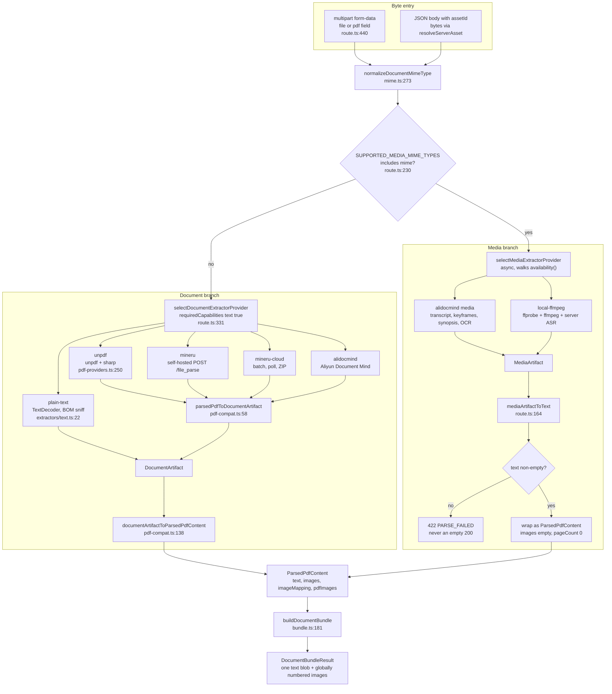
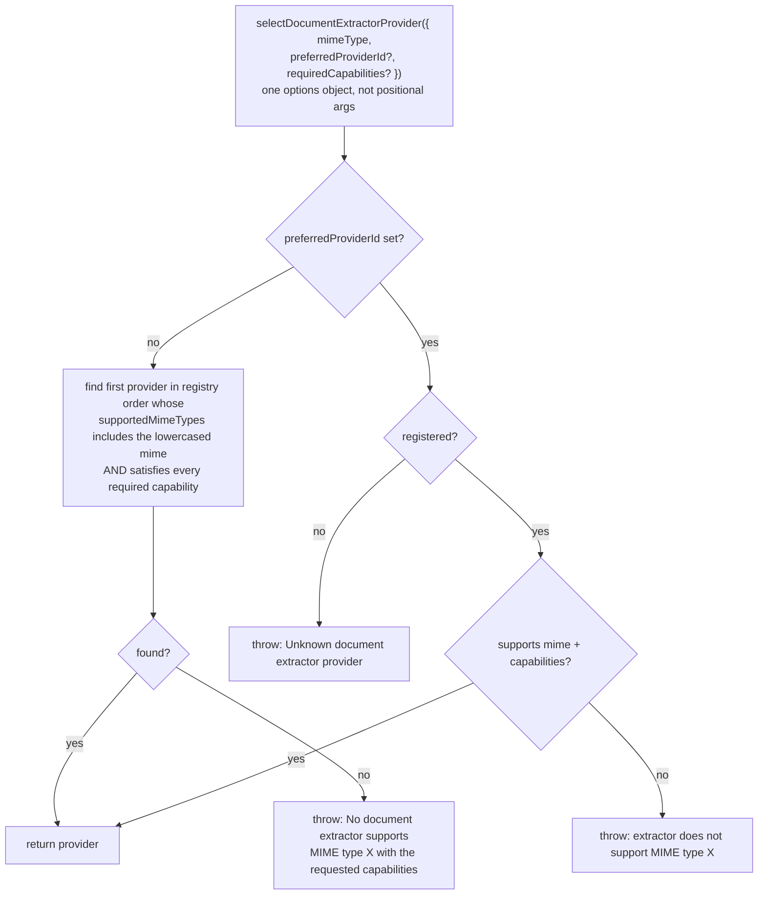
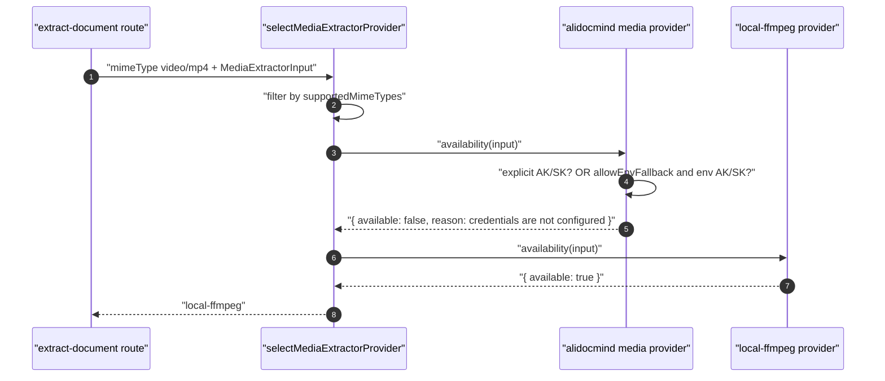
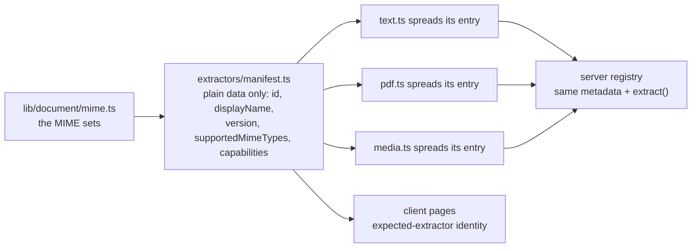
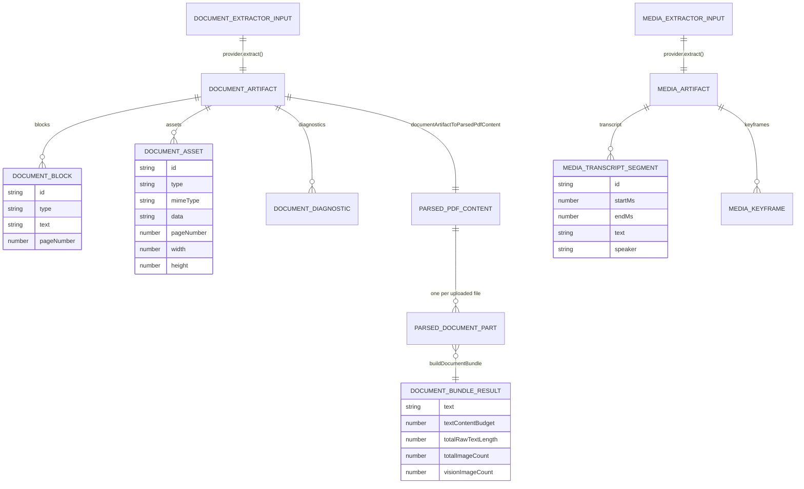

# Document Ingestion

Stage 1: bytes to prompt input. Five document extractors, two media extractors, the
selection algorithm that picks one, the credential-aware availability probe, and the
normalised intermediate representation everything converges on before the model sees it.

**Sources:** `lib/document/{types,mime,bundle,pdf-compat}.ts`,
`lib/document/extractors/{registry,media-registry,manifest,text,pdf,media,local-media}.ts`,
`lib/pdf/{constants,pdf-providers,mineru-cloud,alidocmind-client}.ts`,
`app/api/extract-document/route.ts`; evidence:
[`01b-modules-app-ingestion.md`](docs/appendix/research/generation-pipeline/01b-modules-app-ingestion.md),
[`02c-interfaces-ingestion.md`](docs/appendix/research/generation-pipeline/02c-interfaces-ingestion.md).

## Format to extractor to normalised document

The media branch deliberately rejoins the document path: after
`mediaArtifactToText` flattens transcript + keyframes + synopsis into Markdown sections,
the result is wrapped in a `ParsedPdfContent` with `images: []` and `pageCount: 0`
([`app/api/extract-document/route.ts:301`](app/api/extract-document/route.ts#L301)). Everything downstream is identical.

## Selection: registry order is the algorithm

`selectDocumentExtractorProvider` ([`lib/document/extractors/registry.ts:23`](lib/document/extractors/registry.ts#L23)) is
synchronous with no availability concept. Its scan order is the array order at
[`registry.ts:5`](lib/document/extractors/registry.ts#L5): `[textDocumentExtractorProvider, ...pdfDocumentExtractorProviders]`,
where the PDF group follows `Object.keys(PDF_PROVIDERS)` — `unpdf`, `mineru`,
`mineru-cloud`, `alidocmind` ([`lib/pdf/constants.ts:14`](lib/pdf/constants.ts#L14)).

Consequences of that order, with no caller hint:

| Upload | Resolves to | Why |
| --- | --- | --- |
| `.txt`, `.md` | `plain-text` | first in the registry and the only one declaring those MIMEs ([`mime.ts:158`](lib/document/mime.ts#L158)) |
| `.pdf` | `unpdf` | first PDF provider; `PROVIDER_SUPPORTED_MIME_TYPES.unpdf` is `[pdf]` only ([`mime.ts:179`](lib/document/mime.ts#L179)) |
| `.docx`, `.pptx`, `.xlsx` | `mineru` | `unpdf` does not declare them; `MINERU_SELFHOST_MIMES` does ([`mime.ts:141`](lib/document/mime.ts#L141)) |
| `.doc`, `.ppt`, `.xls` | `mineru-cloud` | legacy OLE is cloud-only ([`mime.ts:150`](lib/document/mime.ts#L150)) |
| `.webp`, `.jp2` | `mineru` | in `MINERU_IMAGE_MIMES` but not `ALIDOCMIND_IMAGE_MIMES` ([`mime.ts:138`](lib/document/mime.ts#L138), `:165`) |

The route always calls selection with `requiredCapabilities: { text: true }`
([`app/api/extract-document/route.ts:333`](app/api/extract-document/route.ts#L333)), which is satisfied by all five providers, so
today it only filters a hypothetical future extractor.

### The media selector is asymmetric

`selectMediaExtractorProvider` ([`lib/document/extractors/media-registry.ts:24`](lib/document/extractors/media-registry.ts#L24)) is
**async** and adds an availability probe, then walks the supported providers until one
reports available ([`media-registry.ts:66-69`](lib/document/extractors/media-registry.ts#L66-L69)). It also accepts an injected `providers`
list so tests can substitute the registry.

If both are unavailable the terminal error names both remedies verbatim
([`media-registry.ts:70-72`](lib/document/extractors/media-registry.ts#L70-L72)): configure AliDocMind credentials, or install ffmpeg
including ffprobe plus a server ASR provider. That is the whole point of the probe — a
credential-less deployment silently falls through to local extraction instead of
failing with an opaque AliDocMind auth error.

## The five document extractors

| id | Backing service | Async | MIME set | Notable |
| --- | --- | --- | --- | --- |
| `plain-text` | none, in-process | no | `PLAIN_TEXT_MIMES` | BOM-sniffed `TextDecoder` (UTF-16LE/BE/UTF-8), one block typed `markdown` for `.md` ([`extractors/text.ts:24`](lib/document/extractors/text.ts#L24)) |
| `unpdf` | `unpdf` npm + `sharp` | no | `[application/pdf]` | per page `extractImages` → `sharp(raw).png()` → `data:image/png;base64,…`, ids `img_1..N` ([`pdf-providers.ts:279-326`](lib/pdf/pdf-providers.ts#L279-L326)) |
| `mineru` | self-hosted `POST {baseUrl}/file_parse` | no | `MINERU_SELFHOST_MIMES` | every type incl. PDF routes through `/file_parse` ([`extractors/pdf.ts:46`](lib/document/extractors/pdf.ts#L46)) |
| `mineru-cloud` | `https://mineru.net/api/v4` | yes | `MINERU_CLOUD_MIMES` | batch upload → poll → result ZIP unpacked with `jszip` |
| `alidocmind` | Aliyun Document Mind | yes | `ALIDOCMIND_MIMES` | one flow for pdf/docx/pptx/xlsx/images ([`extractors/pdf.ts:38`](lib/document/extractors/pdf.ts#L38)) |

`unpdf` in `textOnly` mode skips the image loop entirely and caps `maxImageSize` at
16 000 000 px against pathological rasters in the untrusted path
([`pdf-providers.ts:254-258`](lib/pdf/pdf-providers.ts#L254-L258)).

### Provider metadata is not duplicated

Every implementation *spreads* its own entry from a browser-safe manifest rather than
declaring metadata twice: `...getDocumentExtractorManifestEntry('plain-text')!`
([`extractors/text.ts:21`](lib/document/extractors/text.ts#L21)), `...pdfManifestEntry(id)` ([`extractors/pdf.ts:26`](lib/document/extractors/pdf.ts#L26)),
`...mediaManifestEntry(id)` ([`extractors/media.ts:23`](lib/document/extractors/media.ts#L23)). `pdfManifestEntry` and
`mediaManifestEntry` **throw at module init** if a registry entry has no manifest entry
([`extractors/pdf.ts:13`](lib/document/extractors/pdf.ts#L13), [`extractors/media.ts:10`](lib/document/extractors/media.ts#L10)).

The manifest imports only `../mime` and `../types`, so client bundles cannot pull `sharp`,
`@alicloud/*`, `child_process`, `fs`, or `net` ([`extractors/manifest.ts:20-23`](lib/document/extractors/manifest.ts#L20-L23)), and
`tests/document/extractor-manifest.test.ts` guards that purity while
`tests/document/extractor-registry.test.ts` pins both directions of the sync.

## The two media extractors

- **`alidocmind` media** ([`extractors/media.ts:39`](lib/document/extractors/media.ts#L39) → `lib/media-parse`) — cloud transcript,
  keyframes, synopsis, OCR. Its `availability()` accepts either explicit AK/SK on the
  request config or, when `allowEnvFallback` is set, `ALIDOCMIND_ACCESS_KEY_ID` +
  `ALIDOCMIND_ACCESS_KEY_SECRET` from the environment ([`extractors/media.ts:24-38`](lib/document/extractors/media.ts#L24-L38)).
- **`local-ffmpeg`** (`extractors/local-media.ts`) — resolves `ffmpeg`/`ffprobe` on
  `PATH`, probes duration, splits audio into `MEDIA_ASR_CHUNK_SEC = 600` s chunks
  ([`local-media.ts:32`](lib/document/extractors/local-media.ts#L32)), sends each to the configured server ASR provider, samples
  keyframes. Hard limits, all module constants:

| Constant | Value | Line |
| --- | --- | --- |
| `MEDIA_ASR_CHUNK_SEC` | 600 s | [`local-media.ts:32`](lib/document/extractors/local-media.ts#L32) |
| `MEDIA_COMMAND_TIMEOUT_MS` | 20 min per ffmpeg invocation | `:33` |
| `FFPROBE_TIMEOUT_MS` | 30 s | `:34` |
| `MEDIA_JOB_TIMEOUT_MS` | 45 min per job | `:35` |
| `MEDIA_ASR_TIMEOUT_MS` | 8 min per ASR call | `:36` |
| `MEDIA_MAX_DURATION_SEC` | 90 min of media | `:37` |
| `MAX_KEYFRAME_CANDIDATES` | 50 000 | `:39` |

Local-media failures are raised as `MaterialExtractionError` with an explicit `retryable`
flag, re-exported here as `LocalMediaExtractionError` ([`local-media.ts:75`](lib/document/extractors/local-media.ts#L75)).

## The normalised intermediate representation

Two artifact shapes, then one lossy bridge to the shape the prompts actually consume.

`DocumentBlockType` is `text | markdown | image | table | formula | layout`
([`lib/document/types.ts:94`](lib/document/types.ts#L94)). `pdf-compat.ts` is bidirectional and lossy by design:

- **Forward** (`parsedPdfToDocumentArtifact`, `:58`) — one `document-text` block typed
  `markdown` when `metadata.parser` is `mineru`/`mineru-cloud`, else `text` (`:67`); plus
  `table_N`, `formula_N`, `layout_N` blocks. Assets come from `metadata.pdfImages` when
  present, otherwise from the flat `images[]` with synthesised `img_N` ids (`:104-121`).
  The whole `ParsedPdfContent` is stashed in `providerRaw` (`:134`).
- **Back** (`documentArtifactToParsedPdfContent`, `:138`) — concatenates `text` and
  `markdown` block text with `\n\n` (`:142-146`), rebuilds `images`, `imageMapping` and
  `pdfImages` from image assets, and re-derives `tables`/`formulas`/`layout`. The
  `providerRaw` round-trip is what preserves `metadata.parser` (`:188`).

Because the reverse pass filters to `text | markdown` blocks, **table, formula and layout
text never reaches the concatenated `text` field** — those blocks survive only in the
separate `tables`/`formulas`/`layout` arrays.

`ExtractionResult`, `ExtractionError` (with its `retryable` flag) and `ExtractionJob` are
fully declared ([`lib/document/types.ts:205-233`](lib/document/types.ts#L205-L233)) and **never constructed**: both routes
call `provider.extract()` directly and let throws reach the route's `try/catch`, so
provider-declared retryability never reaches a caller.

## Continued

This section outgrew the file-size ceiling and was split. Multi-document bundling, the
managed-credential and SSRF rules on outbound extractor traffic, the two request forms,
ingestion's partial-failure behaviour, and the open questions are in
[`./02b-bundling-and-egress.md`](docs/06-generation-pipeline/02b-bundling-and-egress.md).
