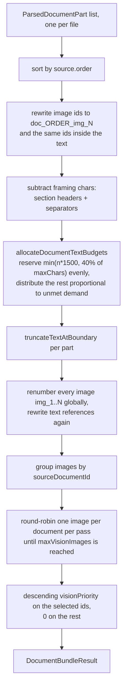
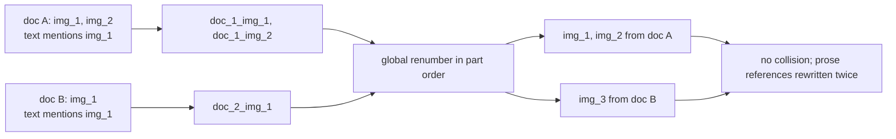
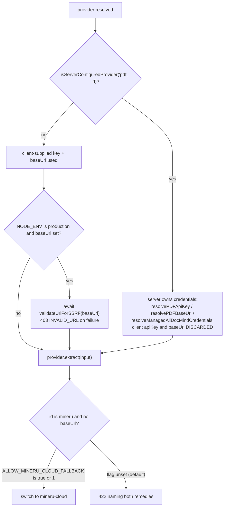
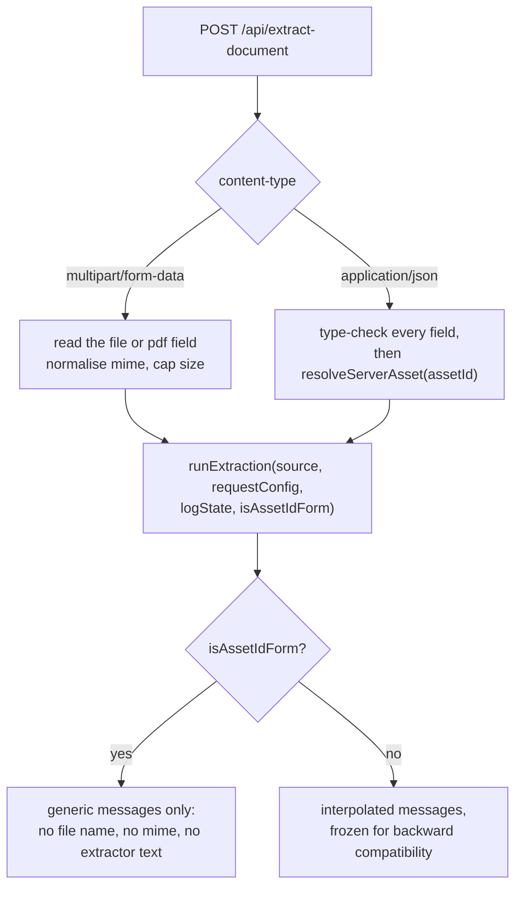
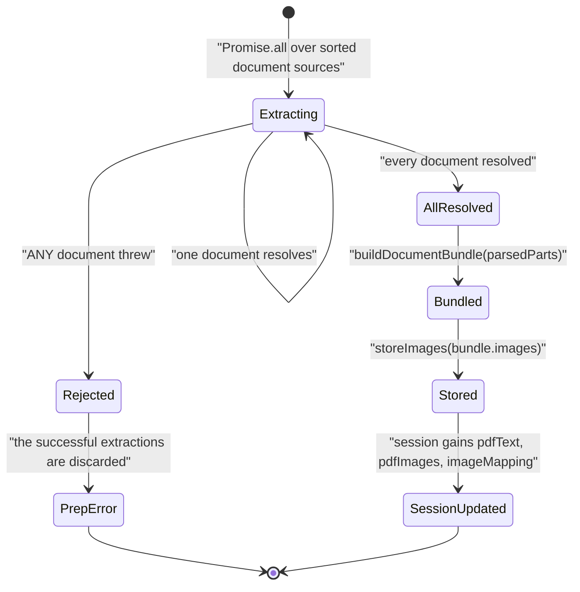

# Ingestion, Part 2: Bundling and Egress

Part 2 of the ingestion walkthrough. Extractors, selection, and the normalised
intermediate representation are in [`./02-document-ingestion.md`](./02-document-ingestion.md).
This half covers the multi-document bundler, the managed-credential and SSRF rules on
outbound extractor traffic, the two request forms, and ingestion's partial-failure
behaviour.

**Sources:** `lib/document/bundle.ts`, `lib/constants/generation.ts`,
`app/api/extract-document/route.ts`, `lib/server/provider-config.ts`,
`lib/server/ssrf-guard.ts`, `app/generation-preview/page.tsx:340`; evidence:
[`01b-modules-app-ingestion.md`](../appendix/research/generation-pipeline/01b-modules-app-ingestion.md),
[`04-dependencies-and-config.md`](../appendix/research/generation-pipeline/04-dependencies-and-config.md).

## Multi-document bundling

`buildDocumentBundle` (`lib/document/bundle.ts:181`) is the only place several uploaded
documents become one prompt input. Four passes, in order:

1. **Stable ids** — sort by `source.order`, rewrite each part's image ids to
   `doc_<order>_img_<n>`, and rewrite the same ids inside the part's text using a
   lookbehind/lookahead-guarded regex so `img_1` never matches inside `img_12`
   (`replaceImageIds`, `:36-45`).
2. **Text budgets** — subtract framing (per-document section headers plus
   `\n\n---\n\n` separators) first (`:212-215`), then `allocateDocumentTextBudgets` (`:72`)
   reserves `min(nDocs * 1500, floor(maxChars * 0.4))` split evenly and distributes the
   remainder proportionally to unmet demand, with a `distributed === 0` break so the loop
   always terminates (`:102`).
3. **Truncate and renumber** — each part is cut at a word boundary
   (`truncateTextAtBoundary`, `:47`, using `\p{L}\p{N}_-` so it works on CJK too), then
   every image is globally renumbered `img_1..N` and text references rewritten again
   (`:223-233`).
4. **Vision priority** — `pickVisionImageIds` (`:127`) groups images by
   `sourceDocumentId`, sorts each group by `compareImagesForVision` (has-description,
   then source order, then page, then descending pixel area, `:111`), and **round-robins
   across documents** so one large PDF cannot monopolise the 20 vision slots. The selected
   ids get a descending `visionPriority`; everything else gets `0` (`:241-250`).

Caps: `MAX_DOCUMENT_BUNDLE_FILES = 5`, `MAX_DOCUMENT_BUNDLE_TOTAL_SIZE_BYTES = 150 MiB`
(`bundle.ts:4-5`); defaults `maxChars = MAX_PDF_CONTENT_CHARS` (50 000) and
`maxVisionImages = MAX_VISION_IMAGES` (20) from `lib/constants/generation.ts:7,10`.

### Why the id renumbering happens twice

Once per part (`doc_<order>_img_<n>`) and once globally (`img_1..N`). The intermediate pass
exists so the second pass cannot produce a collision: two documents that both extracted
`img_1` are disambiguated before the global numbering runs, and `replaceImageIds` is applied
to the text after *each* rename so a reference in the prose always names the current id.

The `visionPriority` this pass emits is the *only* input to the ordering used downstream by
`sortDocumentImagesForVision` and `partitionImagesForVision` — see
[`./03-outline-generation.md`](./03-outline-generation.md#the-vision-split) and
[`./05-scene-generation.md`](./05-scene-generation.md#vision-pre-resolution).

## Managed credentials and third-party egress

The self-hosted-MinerU branch is the strongest privacy default in the subsystem: a
deployment that selected self-hosted MinerU but has no base URL configured fails loudly
rather than silently forwarding documents to a third-party cloud. The 422 message names
both remedies explicitly (`app/api/extract-document/route.ts:375-383`), and the opt-in is
a separate env var read at `:144`.

The same managed/unmanaged decision, including the SSRF check, is applied to the media
branch at `route.ts:248-263` — a separate code path, but the same rules.

Note the ordering: the SSRF check runs on the **client-supplied** base URL only, and only
in production (`route.ts:386`, `:258`). A managed provider's own base URL, resolved from
`resolvePDFBaseUrl` or `resolveManagedAliDocMindCredentials`, is trusted without a check
because the operator configured it.

### Environment surface for ingestion

| Var | Required for | Effect |
| --- | --- | --- |
| `PDF_MINERU_API_KEY`, `PDF_MINERU_BASE_URL` | self-hosted `mineru` | absence of the base URL is what triggers the 422-or-cloud-fallback branch |
| `PDF_MINERU_CLOUD_API_KEY`, `PDF_MINERU_CLOUD_BASE_URL` | `mineru-cloud` | base defaults to `https://mineru.net/api/v4` (`lib/pdf/constants.ts:8`) |
| `ALIDOCMIND_ACCESS_KEY_ID`, `ALIDOCMIND_ACCESS_KEY_SECRET`, `ALIDOCMIND_BASE_URL` | `alidocmind`, document **and** media | also the credential the media `availability()` probe checks |
| `ALLOW_MINERU_CLOUD_FALLBACK` | nothing (default OFF) | `'true'` or `'1'` opts a self-hosted deployment into the cloud fallback |
| `PDF_MINERU_BACKEND` | nothing (default `pipeline`) | value of the `backend` multipart field on `POST {baseUrl}/file_parse` |
| `ALLOW_LOCAL_NETWORKS` | nothing | relaxes the shared SSRF guard for self-hosted extractors and models |
| `NODE_ENV` | — | `production` is what turns the client-base-URL SSRF check on |
| `DATABASE_URL` | the asset-id request form | absent means no server asset store, so only the multipart form works |

`unpdf` needs neither key nor base URL (`requiresApiKey: false`,
`lib/pdf/constants.ts:15-21`), and `plain-text` needs nothing at all — which is why a
deployment with zero ingestion credentials can still generate from `.txt`, `.md` and PDF.

## Two request forms, deliberately different error text

| | multipart form | asset-id JSON form |
| --- | --- | --- |
| Bytes from | `file` or `pdf` form field | `resolveServerAsset(assetId)` |
| Size cap | `MAX_EXTRACT_DOCUMENT_FILE_SIZE_BYTES` (50 MiB) | same |
| Unsupported MIME | 400 naming the file | 400 with a fixed generic message |
| Selection throw | 400 with the registry's interpolated message | 400 `"The requested document extractor cannot process this course material."` |
| Empty media artifact | 422 naming the file | 422 with a generic message |
| Asset store failure | n/a | logged server-side, fixed generic 500 |
| Persistence off / unauthenticated / asset missing | n/a | 503 / 401 / 404 from `resolveServerAsset` |

Both share one `runExtraction` helper (`route.ts:219`) so the paths cannot drift; the
`isAssetIdForm` flag switches only the handful of messages that must not echo
caller-controlled input or raw extractor text (`route.ts:215-218`).

The multipart form's observable behaviour is explicitly frozen (`route.ts:442-444`); the
asset-id form was added later and does not inherit its information leakage.

## Partial failure inside ingestion

| Failure | Behaviour |
| --- | --- |
| One page's image extraction throws (`unpdf`) | logged, remaining pages continue (`pdf-providers.ts:312`) |
| One image's `sharp` conversion throws | logged, remaining images continue (`pdf-providers.ts:308`) |
| Media artifact with no synopsis, transcript or keyframes | 422, deliberately not an empty 200 (`route.ts:292`) |
| Unknown extractor id | 400; the asset-id form pre-blocks it with a static message |
| No extractor for the MIME | 400, interpolated on multipart, generic on asset-id |
| No available media extractor | throws a message naming both setup paths (`media-registry.ts:70`) |
| One document of up to five fails | **the whole preparation step fails** — `Promise.all` at `app/generation-preview/page.tsx:340` |

That last row is the one inconsistency with the pipeline's own degrade-don't-fail
convention. `Promise.allSettled` plus a per-file warning would match it.

## Open questions

- **What `DocumentExtractorProvider.version` is for.** Its doc comment calls it the
  version half of a derivation cache key and says "Nothing consumes it yet"
  (`lib/document/types.ts:40-46`), while `extractors/manifest.ts:5-8` says the client
  pages need it for `resolveExpectedExtractor` / `extractorVersionFor` in
  `lib/document/extraction-cache.ts` — a file that does not exist in this checkout. All
  five manifest versions are `'1'`, so nothing observable depends on the answer today.
- **Which extractor a given deployment resolves to.** Selection depends on
  `isServerConfiguredProvider('pdf', id)`, which reads env vars plus a
  `server-providers.yml` that is not in the repo. The algorithm and registry order are
  documented in part 1; the resolved answer is deployment-specific.
- **The relationship between `/api/extract-document` and `lib/server/material-extraction/`.**
  The latter is a claim/extract/complete queue over the *same* provider registries,
  started from `instrumentation.ts` when the agent runtime is configured. Nothing in the
  generation UI reaches it, and it duplicates provider selection, media flattening and
  error classification. Whether the two converge is undecided — see
  [`../05-agent-runtime/index.md`](../05-agent-runtime/index.md).
- **Whether `lib/document/transforms/` was meant to run between extraction and bundling.**
  Its `DocumentTransformPurpose` union names `'course-generation'` first
  (`lib/document/transforms/types.ts:3`) but its only caller is
  `lib/rag/ingest/document.ts:138`, so generation bundles raw provider text.
