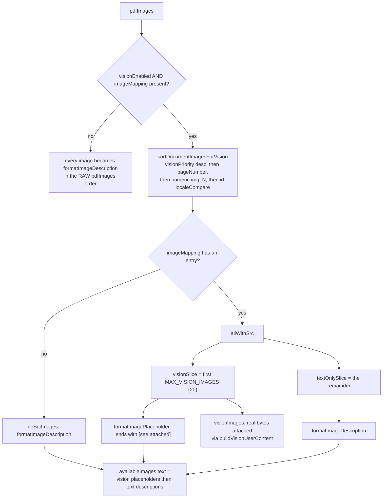
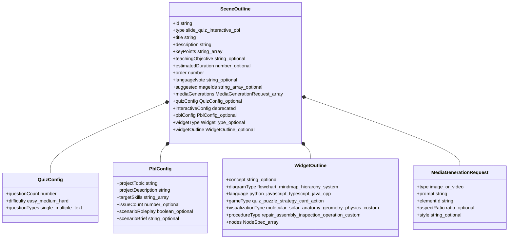
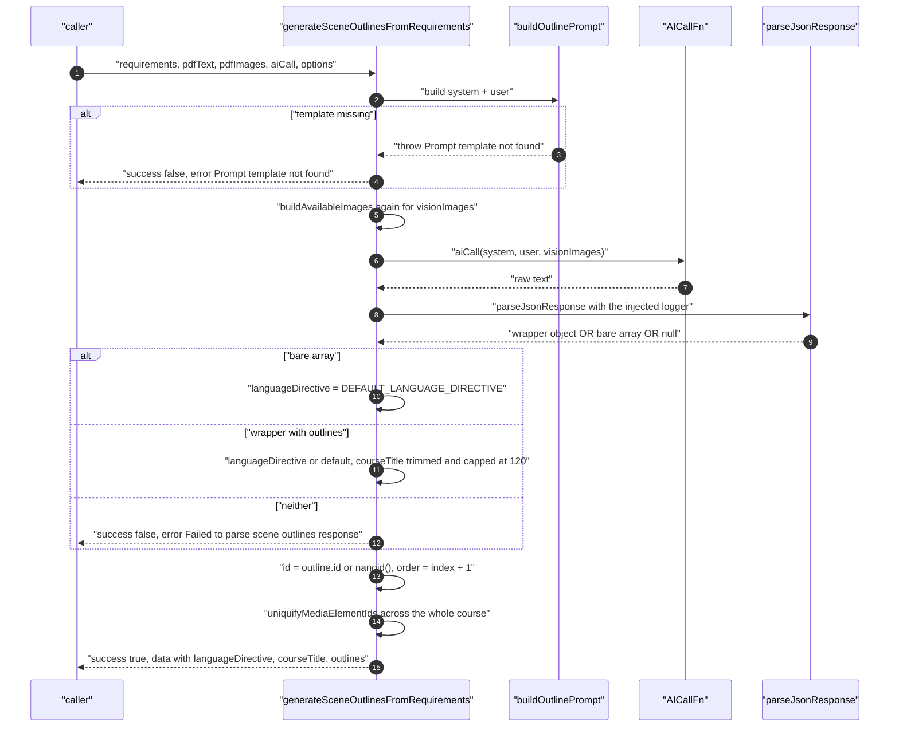
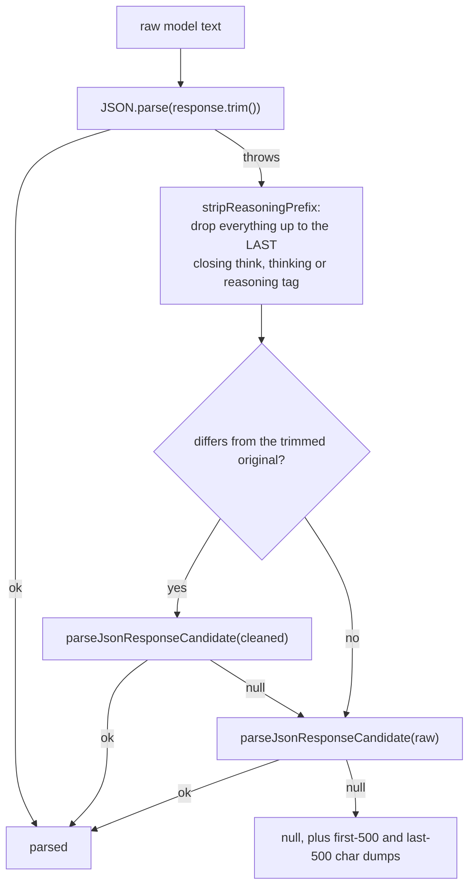
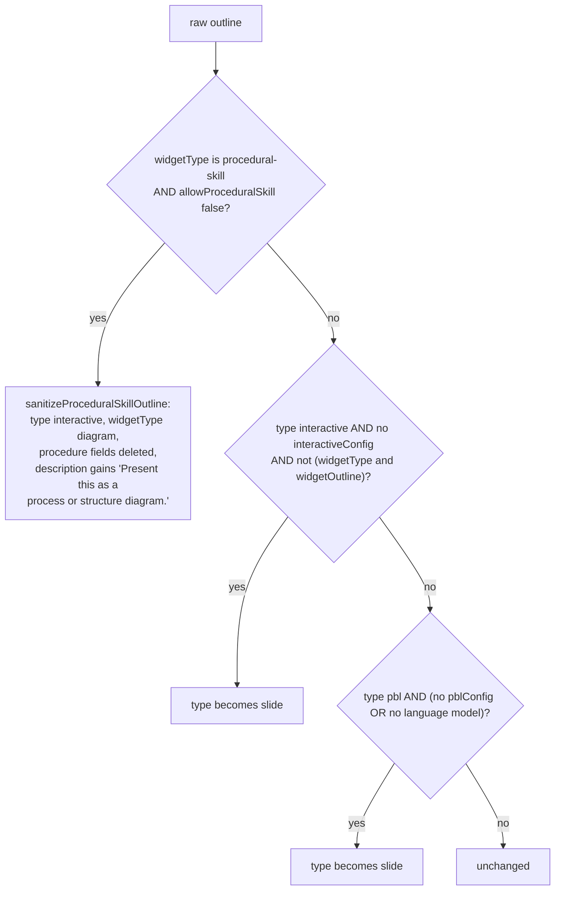

# Outline Generation

Stage 2: one LLM call turns the requirement plus the document bundle into
`{ languageDirective, courseTitle?, outlines: SceneOutline[] }`. This section covers the
prompt inputs, the output schema, the validation and repair ladder, the streaming variant
that the UI actually uses, and how output language is controlled.

**Sources:** `packages/@openmaic/generation/src/outline-generator.ts`,
`.../outline-types.ts`, `.../json-repair.ts`, `.../outline-formatters.ts`,
`.../outline-media.ts`, `app/api/generate/scene-outlines-stream/route.ts`,
`app/generation-preview/page.tsx`; evidence:
[`02a-interfaces-package.md`](docs/appendix/research/generation-pipeline/02a-interfaces-package.md),
[`03a-flows-ingestion-outline.md`](docs/appendix/research/generation-pipeline/03a-flows-ingestion-outline.md).

## Two entry points, one prompt

| Entry | Used by | Streaming | Retry |
| --- | --- | --- | --- |
| `generateSceneOutlinesFromRequirements` ([`outline-generator.ts:120`](packages/@openmaic/generation/src/outline-generator.ts#L120)) | the headless job ([`lib/server/classroom-generation.ts:474`](lib/server/classroom-generation.ts#L474)) and package consumers | no | none inside; caller may wrap |
| `POST /api/generate/scene-outlines-stream` ([`route.ts:287`](app/api/generate/scene-outlines-stream/route.ts#L287)) | the browser driver ([`app/generation-preview/page.tsx:568`](app/generation-preview/page.tsx#L568)) | SSE | up to 2 whole-stream retries |

Both build the prompt with the *same* package function, `buildOutlinePrompt`
([`outline-generator.ts:82`](packages/@openmaic/generation/src/outline-generator.ts#L82)), which the route calls at [`route.ts:421`](app/api/generate/scene-outlines-stream/route.ts#L421). That is deliberate:
the route's default branch is byte-identical to the package path, so the four golden
snapshots in `packages/@openmaic/generation/test/__snapshots__/outline-prompt.test.ts.snap`
pin both.

## Prompt inputs

`buildOutlinePrompt(requirements, context)` fills the `requirements-to-outlines` template
with exactly ten variables ([`outline-generator.ts:99-110`](packages/@openmaic/generation/src/outline-generator.ts#L99-L110)):

| Variable | Source | Fallback |
| --- | --- | --- |
| `requirement` | `requirements.requirement` | — (required) |
| `pdfContent` | `pdfText.substring(0, MAX_PDF_CONTENT_CHARS)` (50 000) | literal `None` |
| `availableImages` | `buildAvailableImages` (`:46`) | literal `No images available` |
| `userProfile` | synthesised **in TypeScript**, not in the template (`:89-92`) | `''` |
| `researchContext` | web-search context supplied by the caller | literal `None` |
| `teacherContext` | `formatTeacherPersonaForPrompt(agents)` | `''` |
| `hasSourceImages` | `(pdfImages?.length ?? 0) > 0` | conditional flag |
| `imageEnabled` | `context.imageGenerationEnabled ?? false` | conditional flag |
| `videoEnabled` | `context.videoGenerationEnabled ?? false` | conditional flag |
| `mediaEnabled` | `imageEnabled \|\| videoEnabled` | conditional flag |

A missing template throws `Error('Prompt template not found')` (`:113`), which
`generateSceneOutlinesFromRequirements` catches by exact message and converts to
`{ success: false, error: 'Prompt template not found' }` (`:136-138`) — every other throw
propagates.

### The vision split

`buildAvailableImages` (`:46`) decides per image whether the model gets a picture or a
sentence. Vision mode requires **both** `visionEnabled` and an `imageMapping`
(`:54`); otherwise every image is a plain text description in the raw `pdfImages` order
(`:74`).



The invariant this enforces: **the text says `[see attached]` only for images that are
actually attached.** The streaming route goes further and resolves the slice's asset ids
to bytes *before* prompt assembly, then rebuilds `resolvedPdfImages` and
`resolvedImageMapping` naming only the ids that resolved
([`route.ts:383-388`](app/api/generate/scene-outlines-stream/route.ts#L383-L388)), so an unresolvable asset drops both its attachment and its text
mention. The route's own comment notes that shift-in is impossible here because
`visionImages` *is* the resolved slice and is never re-sliced ([`route.ts:389-397`](app/api/generate/scene-outlines-stream/route.ts#L389-L397)) —
unlike the scene-content route, which does re-slice and therefore needs a refill loop
(see [05](docs/06-generation-pipeline/05-scene-generation.md#vision-pre-resolution)).

## Output schema

The template states the required shape three times — the JSON skeleton at
[`templates/requirements-to-outlines/user.md:54-60`](packages/@openmaic/generation/templates/requirements-to-outlines/user.md), a "Never return a bare array" sentence
at `:62`, and a "Final reminder" at `:98`:

```json
{
  "languageDirective": "2-5 sentence instruction describing the course language behavior",
  "courseTitle": "concise course name, ≤30 chars, in the teaching language",
  "outlines": [ /* array of scene objects */ ]
}
```

The parser accepts a bare array anyway ([`outline-generator.ts:154`](packages/@openmaic/generation/src/outline-generator.ts#L154)), defaulting
`languageDirective` to `DEFAULT_LANGUAGE_DIRECTIVE`
(`'Teach in the language that matches the user requirement.'`, `:20`).

`SceneOutline` ([`outline-types.ts:70`](packages/@openmaic/generation/src/outline-types.ts#L70)) is the pivot type of the whole subsystem:



Two shape facts worth internalising:

- **`WidgetOutline` has no discriminant.** It is a flat union of every widget's fields; the
  discriminant is the sibling `outline.widgetType` ([`outline-types.ts:33`](packages/@openmaic/generation/src/outline-types.ts#L33)). Nothing stops
  a `diagramType` and a `gameType` coexisting on one outline.
- **`quizConfig.questionTypes` allows `'text'`** ([`outline-types.ts:85`](packages/@openmaic/generation/src/outline-types.ts#L85)) while
  `generateQuizContent` branches on `q.type === 'short_answer'`
  ([`scene-generator.ts:896`](packages/@openmaic/generation/src/scene-generator.ts#L896)). The outline vocabulary and the question vocabulary are not
  the same enum — see [09](docs/06-generation-pipeline/09-quiz-and-grading.md).

## Post-parse normalisation



Note the ordering quirk: `order` is **re-assigned from the array index**
(`:174`), so a model that emits `order: 7` first still gets `order: 1`. And any throw
from `aiCall` becomes `{ success: false, error: String(error) }` (`:181`) — the error
object is stringified, so a status code carried on the error is lost on this path (the
streaming route keeps it, and the app's `llmApiError` recovers it for the two scene
routes).

`courseTitle` is capped at **120** characters (`:161`) while the template asks for ≤ 30
([`user.md:57`](packages/@openmaic/generation/templates/requirements-to-outlines/user.md)). The streaming normaliser applies the same 120 cap
([`route.ts:87`](app/api/generate/scene-outlines-stream/route.ts#L87)).

## Validation and repair on invalid output

There is no schema validator. There are three layers of tolerance instead.

### 1. JSON recovery — `parseJsonResponse`



`parseJsonResponseCandidate` ([`json-repair.ts:85`](packages/@openmaic/generation/src/json-repair.ts#L85)) tries every markdown fenced block that
starts with `{` or `[`, then a brace/bracket-matched substring located by a string-aware
scanner, then the whole text. Each candidate runs the four-attempt `tryParseJson` ladder
([`json-repair.ts:177`](packages/@openmaic/generation/src/json-repair.ts#L177)):

| Attempt | Fix |
| --- | --- |
| 1 | plain `JSON.parse` |
| 2 | `repairQuotedPropertyFragments` (`"height: 76"` → `"height": 76`), then double-escape LaTeX backslashes while preserving `\b \f \n \r \t \u`, then close a truncated array/object at the last complete `}` |
| 3 | `jsonrepair(jsonStr)` from the `jsonrepair` package |
| 4 | strip/escape control characters |

Every failed attempt logs a window around the reported error position
(`logJsonParseError`, [`json-repair.ts:19`](packages/@openmaic/generation/src/json-repair.ts#L19)).

### 2. Shape guards

`parsed.outlines` must exist and be an array, otherwise
`'Failed to parse scene outlines response'` (`:157`, `:167`). No per-outline field is
validated at this stage.

### 3. Type demotion — `applyOutlineFallbacks`

Runs later, once per outline, immediately before content generation (called at
[`app/api/generate/scene-content/route.ts:179`](app/api/generate/scene-content/route.ts#L179) and
[`lib/server/classroom-generation.ts:559`](lib/server/classroom-generation.ts#L559)). Three demotions, checked in this order
([`outline-generator.ts:205-233`](packages/@openmaic/generation/src/outline-generator.ts#L205-L233)):



The result is echoed back to the client as `effectiveOutline`
([`app/api/generate/scene-content/route.ts:355`](app/api/generate/scene-content/route.ts#L355)) so the actions call and the assembled
scene use the demoted type, not the original.

A fourth, editor-side path exists: `changeOutlineType(outline, newType)`
([`outline-type.ts:13`](packages/@openmaic/generation/src/outline-type.ts#L13)) rebuilds an outline that is valid by construction for the new type
(quiz gets a default `quizConfig`, interactive gets `simulation` plus a `concept`, pbl gets
a `pblConfig` synthesised from title and key points). That is what the outlines editor
calls when a human retypes a scene.

## Continued

This section outgrew the file-size ceiling and was split. The SSE route — wire format,
incremental parser, whole-stream retry, client-side reduction rules, the two app-only
prompt variants — plus end-to-end output-language control and the open questions are in
[`./03b-outline-streaming.md`](docs/06-generation-pipeline/03b-outline-streaming.md).
