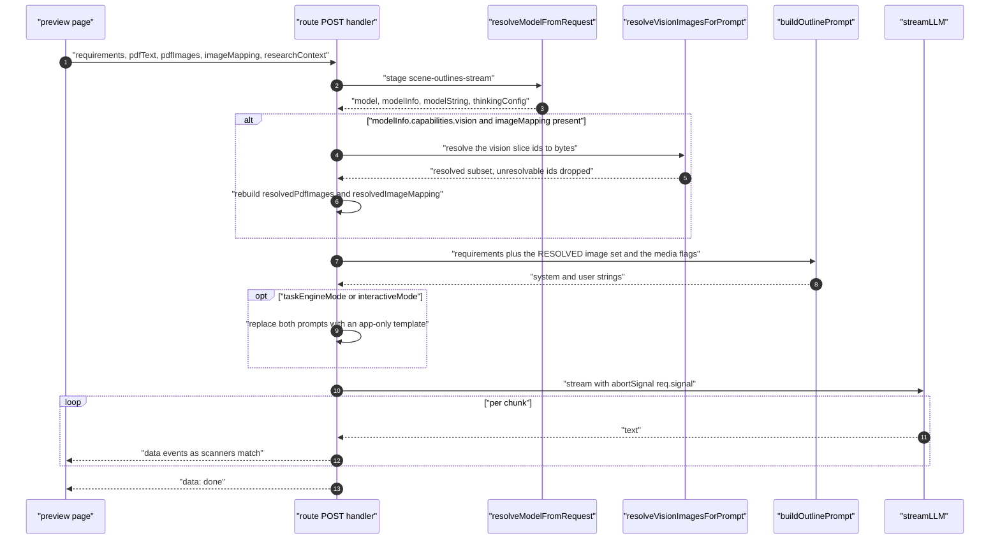
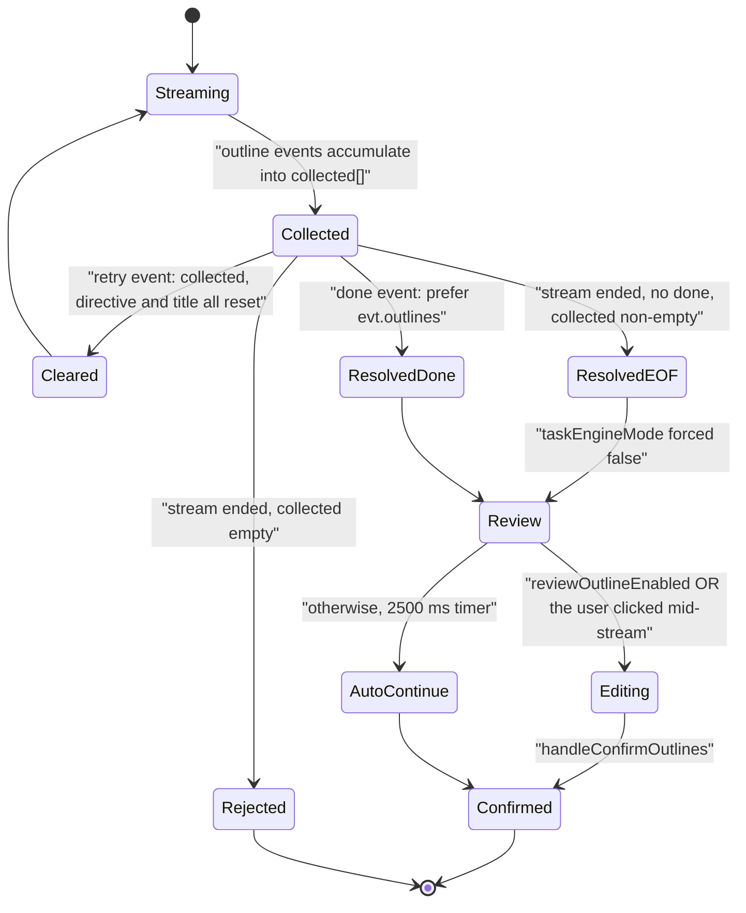
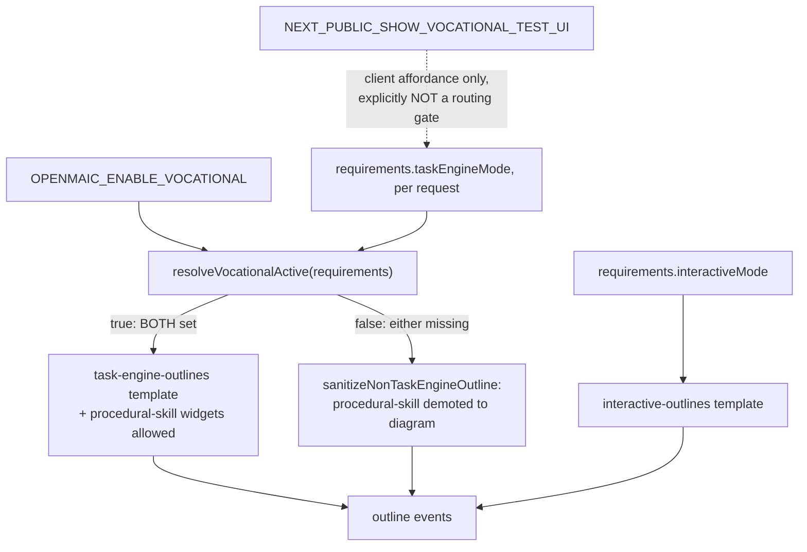
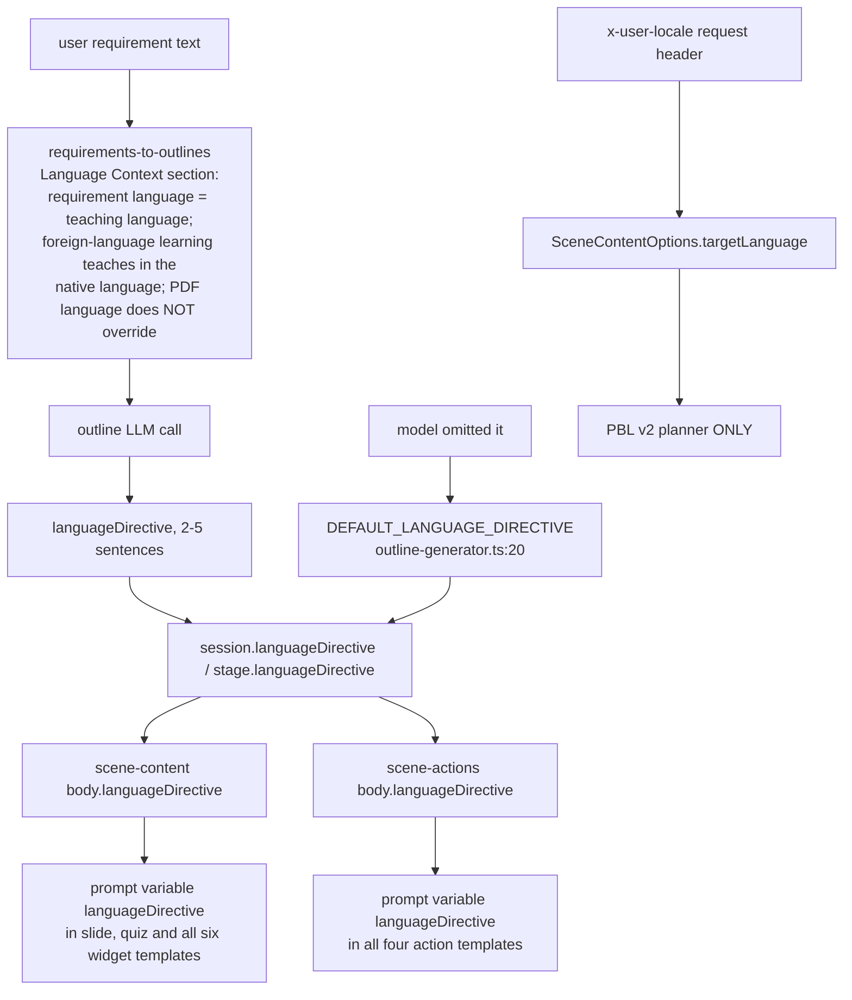

# Outline Generation, Part 2: Streaming and Language Control

Part 2 of the outline walkthrough. Prompt inputs, the output schema, and the
validation/repair ladder are in [`./03-outline-generation.md`](./03-outline-generation.md).
This half covers the SSE route the UI actually uses — its wire format, incremental parser,
whole-stream retry, and two app-only prompt variants — plus end-to-end output-language
control.

**Sources:** `app/api/generate/scene-outlines-stream/route.ts`,
`app/generation-preview/page.tsx:598-667`, `lib/config/feature-flags.ts:97-113`,
`packages/@openmaic/generation/src/prompt-formatters.ts:145`,
`lib/server/scene-generation.ts:53`, `eval/outline-language/runner.ts`; evidence:
[`03a-flows-ingestion-outline.md`](../appendix/research/generation-pipeline/03a-flows-ingestion-outline.md),
[`01c-modules-app-generation.md`](../appendix/research/generation-pipeline/01c-modules-app-generation.md).

## The streaming route

`POST /api/generate/scene-outlines-stream` is the only streaming generation endpoint,
`maxDuration = 300` (`route.ts:45`). Wire format:

```
{ type: 'languageDirective', data: string }
{ type: 'courseTitle',       data: string }
{ type: 'outline',           data: SceneOutline, index: number }
{ type: 'retry',             attempt: number, maxAttempts: number }
{ type: 'done',              outlines, languageDirective, courseTitle?, taskEngineMode }
{ type: 'error',             error: string }
```

Framing is `data: <json>\n\n` plus bare `:heartbeat\n\n` comments every 15 000 ms
(`route.ts:460`, `:469`). Response headers: `text/event-stream`, `no-cache`,
`keep-alive` (`route.ts:702-707`).



### Incremental parsing is O(n), on purpose

Three scanners run per chunk over the growing buffer:

| Scanner | Bound | Line |
| --- | --- | --- |
| `extractLanguageDirective` | first 8192 bytes only | `:52-57` |
| `extractCourseTitle` | first 8192 bytes only | `:90` |
| `extractNewOutlines` | resumable `scanFrom` cursor, so total work is O(n) not O(n²) | `:117` |

The two head-bounded scanners are correct because both keys are top-level members of the
wrapper object and therefore can only appear in the buffer head — the comment at `:53-56`
states that a full-buffer scan on every chunk would be O(n²) over the stream.
`extractNewOutlines` resumes "just past the last fully-parsed object (between array
elements, so not inside a string and at brace depth 0)" (`:125-127`).

A once-only full-buffer title rescan (`extractCourseTitleFromComplete`, `:102`) runs after
the stream ends if the head scan found nothing (`:604-609`) — this recovers a title the
model emitted after the `outlines` array or past the 8 KiB window.

### Whole-stream retry

```mermaid
stateDiagram-v2
  [*] --> Streaming: "start(controller), heartbeat on"
  Streaming --> Streaming: "chunk: scan directive, title, outlines; emit events"
  Streaming --> Capped: "fullText over 512 KiB"
  Capped --> Finalize: "break the read loop"
  Streaming --> Aborted: "req.signal.aborted checked per chunk"
  Aborted --> [*]: "stopHeartbeat and return"
  Streaming --> EmptyAttempt: "stream ended with zero parsed outlines"
  Streaming --> Threw: "streamLLM threw"
  Threw --> Aborted: "req.signal.aborted"
  Threw --> EmptyAttempt: "otherwise"
  EmptyAttempt --> Streaming: "attempt 1 or 2: emit retry event, restart"
  EmptyAttempt --> ErrorEvent: "attempt 3: retries exhausted"
  Streaming --> Finalize: "outlines parsed"
  Finalize --> DoneEvent: "uniquifyMediaElementIds, emit done"
  DoneEvent --> [*]
  ErrorEvent --> [*]
```



`MAX_STREAM_RETRIES = 2` (`route.ts:482`) so three attempts total, and each attempt
**resets** `parsedOutlines`, `languageDirective` and `courseTitle` (`route.ts:523-525`).
`MAX_OUTLINE_STREAM_BYTES = 512 * 1024` (`:486`) is a heap guard: past it the route stops
reading and finalises with whatever parsed rather than growing unbounded. `req.signal` is
propagated into `streamLLM` as `abortSignal` (`:504`, `:511`) **and** checked per chunk
(`:536`) and in the catch (`:636`), so a closed tab stops burning tokens without burning a
retry.

The retry has no backoff — it restarts immediately (`route.ts:621-632`). Given that a rate
limit is a likely cause of an empty attempt, this is worth knowing.

Teardown discipline is worth copying: the heartbeat's own `controller.enqueue` is wrapped so
an enqueue on a closed controller calls `stopHeartbeat()` instead of throwing into the timer
(`:468-472`), and `controller.close()` sits in a `finally` inside its own `try/catch` because
the controller may already be closed (`:690-697`).

### Client-side reduction rules

The browser consumes the stream at `app/generation-preview/page.tsx:598-667`. Three rules
matter:

- A `retry` event **clears the collected outlines and the latched directive and title**
  (`:617-624`), because the server resets them per attempt; inheriting stale values would
  attach the failed attempt's directive to a succeeding attempt that omitted it.
- `done` prefers `evt.outlines` over the collected array (`:629`).
- A stream that ends **without** a `done` event still resolves from the collected array,
  carrying a latched `courseTitle` but forcing `taskEngineMode: false` (`:646-658`).

After the stream resolves, the page decides whether a human reviews the outlines
(`:679-696`): the sticky mid-stream intent ref OR the `reviewOutlineEnabled` setting opens the
editor; otherwise a 2500 ms auto-continue timer runs.



### Two app-only prompt variants

When `taskEngineMode` or `interactiveMode` is active the route replaces the package prompt
entirely (`route.ts:432-448`) with `task-engine-outlines` or `interactive-outlines` from
`lib/prompts/templates/`, built by the app's own loader. Per-outline normalisation then
branches too (`route.ts:587-589`):

| Mode | Per-outline normaliser | Effect |
| --- | --- | --- |
| `taskEngineMode` | `normalizeTaskEngineOutline` (`:227`) | slides pass through a slide normaliser, `procedural-skill` gets its procedure fields filled, the five ordinary widget types pass through, everything else is demoted to slide (`:244`) |
| otherwise | `sanitizeNonTaskEngineOutline` (`:247`) | a `procedural-skill` widget is demoted to a `diagram` widget with its procedure fields deleted |



`taskEngineMode` is not client-settable: `resolveVocationalActive(requirements)` is
`Boolean(requirements?.taskEngineMode) && isVocationalTaskEngineEnabled()`
(`lib/config/feature-flags.ts:101-105`) — the request opt-in AND the server flag
`OPENMAIC_ENABLE_VOCATIONAL`. Neither alone enables the path. `shouldShowVocationalTestUi()`
(`:111`) is documented as "not a security or routing gate".

The route echoes the *effective* mode back in the `done` event's `taskEngineMode` field, and
`app/generation-preview/vocational-mode.ts` reads it — so the client learns whether the
server honoured its request rather than assuming it did.

Outline ids are uniquified against a per-run `Set` (`ensureUniqueOutlineId`, `:272`) so a
model that repeats `scene_1` cannot collide, and `uniquifyMediaElementIds` rewrites
sequential `gen_img_1` / `gen_vid_1` placeholders to `gen_img_<nanoid(8)>` across the whole
course before the `done` event (`route.ts:663`).

## Output-language control

Two distinct language signals exist and are **not** interchangeable.



| Signal | Type | Reaches | Authority |
| --- | --- | --- | --- |
| `languageDirective` | model-inferred prose | every downstream prompt, as a template variable | inferred, defaulted if absent |
| `targetLanguage` | UI locale from `x-user-locale` (`app/api/generate/scene-content/route.ts:322`) | only the PBL v2 planner (`scene-generator.ts:1018`) | authoritative |

A third path exists but is dead: `buildLanguageText` (`prompt-formatters.ts:145`) merges
the course directive with a per-scene `outline.languageNote`, and its only caller is
`buildSceneFromOutline` (`lib/server/scene-generation.ts:53`), which no production code
path invokes. So `SceneOutline.languageNote` is a field the outline model can populate
that never reaches a live prompt.

Neither signal reaches the canned fallbacks: the four default action lists
(`scene-generator.ts:1766`, `:1877`, `:1908`, `:1922`) and `generateSlideContent`'s
`assignedImagesText` sentinel (`:618`) ship hard-coded Chinese that a learner sees regardless
of the inferred directive. See
[`./05b-scene-types-and-assembly.md`](./05b-scene-types-and-assembly.md#the-canned-fallbacks).

Language quality is measured by an eval harness rather than a unit test:
`eval/outline-language/runner.ts`, run as `pnpm eval:outline-language`.

## Open questions

- **Why the outline stream retries without backoff** while every scene call uses
  exponential backoff plus jitter. It may be intentional (an SSE client is waiting, so
  latency matters more than politeness) but nothing in the code says so.
- **Whether the 120-char `courseTitle` cap is a defensive margin or a stale number**,
  given the template asks for ≤ 30.
- **The intended relationship between `languageDirective` and `targetLanguage`** when they
  disagree, and whether the narrow PBL-only scope of `targetLanguage` is deliberate or an
  unfinished rollout.
- **Why `task-engine-outlines` receives media conditional flags it declares no `{{#if}}`
  sites for** (`route.ts:442-444`). See
  [`./06-prompt-architecture.md`](./06-prompt-architecture.md#where-each-prompt-id-is-built).
