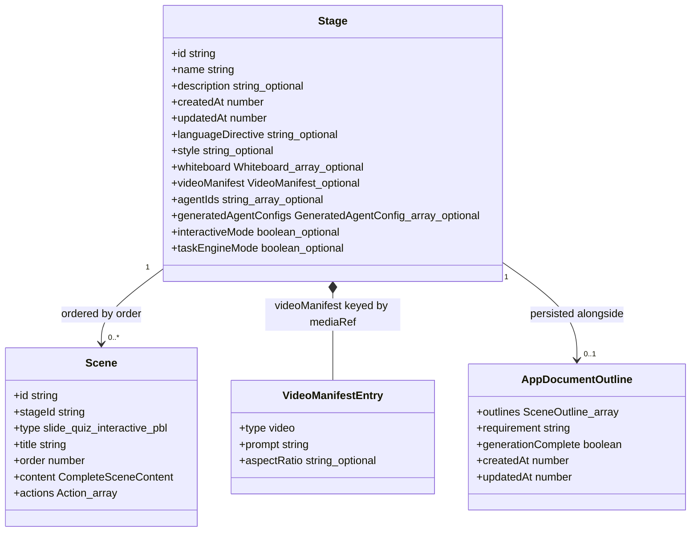
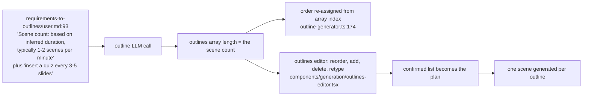
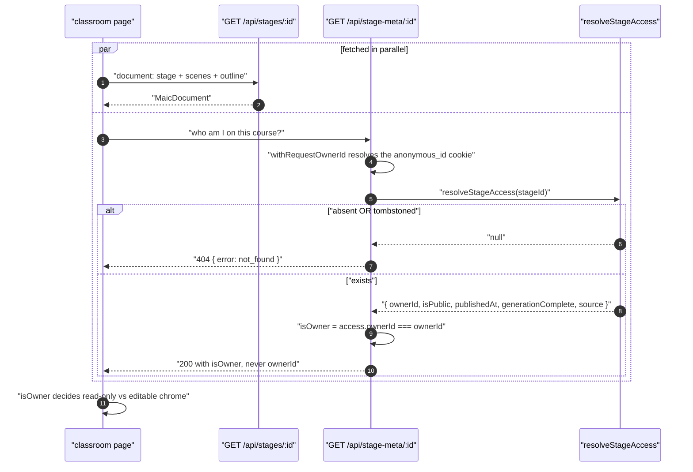

# Stage Planning

Stage 3 is the smallest stage and the most surprising: there is no planner. "How many
scenes" and "which types" are decided by the outline model in stage 2; stage planning is
the act of minting a course container to hang them on, and the three code paths that do it
do not share an implementation.

**Sources:** [`packages/@openmaic/dsl/src/stage.ts:141`](packages/@openmaic/dsl/src/stage.ts#L141),
[`app/generation-preview/page.tsx:533-544`](app/generation-preview/page.tsx#L533-L544), [`:731`](app/generation-preview/page.tsx#L731), [`:943`](app/generation-preview/page.tsx#L943),
[`lib/server/classroom-generation.ts:522-553`](lib/server/classroom-generation.ts#L522-L553), [`app/api/stages/route.ts:29-110`](app/api/stages/route.ts#L29-L110),
`app/api/stage-meta/[stageId]/route.ts`, [`lib/media/video-manifest.ts:6`](lib/media/video-manifest.ts#L6);
evidence: [`01c-modules-app-generation.md`](docs/appendix/research/generation-pipeline/01c-modules-app-generation.md).

## What a stage is

A `Stage` is the course document header: identity, name, and the cross-scene metadata the
runtime needs before any scene loads ([`packages/@openmaic/dsl/src/stage.ts:141`](packages/@openmaic/dsl/src/stage.ts#L141)).



The `Stage` carries **no scene count and no outline list**. The outlines live in a separate
`outline` member of the persisted document ([`app/api/stages/route.ts:82-88`](app/api/stages/route.ts#L82-L88)), which is what
lets a partially generated course be resumed: the outline list is the plan, the scene list
is the progress, and `generationComplete` is the terminator.

## Who mints the stage id

Three independent call sites, three id shapes. This is real drift, not a layering
decision.

| Path | Where | Id shape | Persistence |
| --- | --- | --- | --- |
| Browser generation | [`app/generation-preview/page.tsx:534`](app/generation-preview/page.tsx#L534) | `nanoid(10)` | client store → `store.saveToStorage()` ([`page.tsx:1051`](app/generation-preview/page.tsx#L1051)) |
| Headless job | [`lib/server/classroom-generation.ts:522`](lib/server/classroom-generation.ts#L522) | `nanoid(10)` | `persistClassroom` after the loop |
| Workbench / agent tools | [`app/api/stages/route.ts:31`](app/api/stages/route.ts#L31) | `stage-${randomBytes(9).toString('base64url')}` | owner-scoped PostgreSQL document store |

```mermaid
flowchart TD
  subgraph browser["Browser driver"]
    b1["nanoid(10) BEFORE outline generation<br/>page.tsx:534"]
    b2["name = extractTopicFromRequirement(requirement)<br/>trimmed, capped at 500 chars"]
    b3["style professional, interactiveMode,<br/>taskEngineMode from the session"]
    b4["after outlines: if courseTitle then<br/>stage.name = courseTitle (page.tsx:731)"]
    b5["videoManifest = buildVideoManifestFromOutlines<br/>page.tsx:943"]
    b6["agentIds OR generatedAgentConfigs<br/>from the client agent registry"]
    b7["store.setStage(stage); store.setOutlines(outlines)"]
  end
  subgraph job["Headless job"]
    j1["nanoid(10) AFTER outlines and agents<br/>classroom-generation.ts:522"]
    j2["name = courseTitle OR outlines[0].title<br/>OR requirement.slice(0,50)"]
    j3["languageDirective embedded on the Stage"]
    j4["videoManifest = buildVideoManifestFromOutlines"]
    j5["agentMode generate embeds full<br/>generatedAgentConfigs; else agentIds only"]
    j6["createInMemoryStore(stage) + createStageAPI"]
  end
  subgraph wb["Workbench / agent"]
    w1["POST /api/stages validates name BEFORE<br/>owner resolution, route.ts:50-77"]
    w2["stage-base64url(9 bytes)"]
    w3["saveDocument with an EMPTY outline shell:<br/>outlines [], requirement = name,<br/>generationComplete false"]
  end
  b1 --> b2 --> b3 --> b4 --> b5 --> b6 --> b7
  j1 --> j2 --> j3 --> j4 --> j5 --> j6
  w1 --> w2 --> w3
```



Two consequences worth carrying:

- **The browser mints the id before it knows the course title**, then overwrites
  `stage.name` once the outline model returns one ([`page.tsx:731-732`](app/generation-preview/page.tsx#L731-L732)). The headless job
  mints after, so it never needs the overwrite.
- **`POST /api/stages` validates the body before resolving the owner**
  ([`app/api/stages/route.ts:47-49`](app/api/stages/route.ts#L47-L49)) so a malformed request cannot mint an anonymous cookie
  partition for a request that will not proceed.

## How many scenes, and who chose

Nothing in stage planning decides the count. The chain is:



So the count is: **whatever the model emitted, minus whatever a human deleted, plus
whatever a human added.** There is no minimum, no maximum, and no server-side clamp. The
only count assertion anywhere is post-hoc: the headless job throws
`'No scenes were generated'` if the loop produced zero scenes
([`lib/server/classroom-generation.ts:662-664`](lib/server/classroom-generation.ts#L662-L664)).

Scene *type* mix is likewise the model's call, then narrowed by three gates:

| Gate | Effect | Line |
| --- | --- | --- |
| Template guidance | "Limit to 1-2 interactive per course" | [`requirements-to-outlines/user.md:90`](packages/@openmaic/generation/templates/requirements-to-outlines/user.md) |
| `sanitizeNonTaskEngineOutline` (streaming route) | `procedural-skill` demoted to `diagram` unless the vocational flag is on | [`scene-outlines-stream/route.ts:247`](app/api/generate/scene-outlines-stream/route.ts#L247) |
| `applyOutlineFallbacks` (per scene, later) | `interactive` without widget config → slide; `pbl` without config or model → slide | [`outline-generator.ts:205`](packages/@openmaic/generation/src/outline-generator.ts#L205) |

## Stage metadata: the tenancy sidecar

The document seam returns content and says nothing about who is asking, so per-viewer
facts live in a separate endpoint. `GET /api/stage-meta/[stageId]` returns exactly five
fields ([`app/api/stage-meta/[stageId]/route.ts:57-67`](app/api/stage-meta/[stageId]/route.ts#L57-L67)):

```
{ isOwner, isPublic, publishedAt, generationComplete, source }
```



Three deliberate properties, all stated in the route's header comment
([`app/api/stage-meta/[stageId]/route.ts:11-23`](app/api/stage-meta/[stageId]/route.ts#L11-L23)):

- **Fail-closed on the tombstone.** A deleted course 404s identically to one that never
  existed, because the endpoint is unauthenticated-friendly and a leaked
  `{ isPublic: true }` would be a public oracle for "this course used to exist".
- **`ownerId` is never in the response.** Returning it would hand every visitor a stable
  cross-course identifier for the author. `isOwner` is derived server-side.
- **`source` is diagnostic only** — the client must not branch on which layer answered.

`dynamic = 'force-dynamic'` and `runtime = 'nodejs'` are both declared (`:33-34`): the
response is per-viewer and mutable on every publish, unpublish, or delete, so it must
never be cached by Next or by anything in front of it.

## Freshness and narrow refetch

Once a stage exists, three more routes exist purely so a second surface (the workbench
canvas) can follow along without polling the whole document:

| Route | Returns | Purpose |
| --- | --- | --- |
| `GET /api/stages/[id]/freshness` | SSE frames carrying the current revision | pure optimisation; a dead stream costs latency only |
| `GET /api/stages/[id]/manifest` | `{ rev, scenes: [{ id, order, rev }] }` from DB triggers | diff which scenes changed |
| `GET /api/stages/[id]/scenes?ids=a,b` | `{ scenes }`, deduped, capped at `MAX_BATCH_SCENE_IDS = 200` | fetch only the changed ones |

See [08](docs/06-generation-pipeline/08-progress-reporting.md#transport-4-rev-diffing-manifest) for how those three
compose, and [`../12-api-reference/index.md`](docs/12-api-reference/index.md) for the full
contracts.

Two write-side guards on the same family:

- `PUT /api/stages/[id]` is existence-gated so it cannot resurrect a deleted course, and
  the server always overwrites `stage.updatedAt` rather than trusting the client.
- `POST /api/stages/[id]/generation-complete` is a narrow monotonic `UPDATE` so a stale
  load-time repair cannot clobber newer content.

## The whole family is gated

Every route under `/api/stages*` and `/api/stage-meta/*` opens with the same line:

```ts
if (!isAgentRuntimeConfigured()) return new Response('Not found', { status: 404 });
```

`isAgentRuntimeConfigured()` is the feature flag AND a non-empty `DATABASE_URL`. So a
deployment without PostgreSQL answers a byte-identical plain-text 404 for "feature off",
"not yours", and "does not exist" — a deliberate no-existence-oracle posture shared with
the rest of the agent-runtime control plane
([`../05-agent-runtime/index.md`](docs/05-agent-runtime/index.md)).

This is why the browser generation path does **not** use `POST /api/stages`: it mints its
own id and persists through the client store, so generation works on a deployment with no
database at all.

## Open questions

- **Why three id shapes.** `nanoid(10)` twice and `stage-${base64url(9 bytes)}` once. The
  workbench prefix is documented as being "in the same `stage-` family as the agent tools"
  ([`app/api/stages/route.ts:29`](app/api/stages/route.ts#L29)), but nothing reconciles the two generation paths with it,
  and nothing validates the shape on read.
- **Whether the two generation paths are expected to converge on the document store.** The
  browser path deliberately works without `DATABASE_URL`; the headless job persists through
  `persistClassroom`. Whether the browser path should adopt `POST /api/stages` when the
  runtime *is* configured is undecided.
