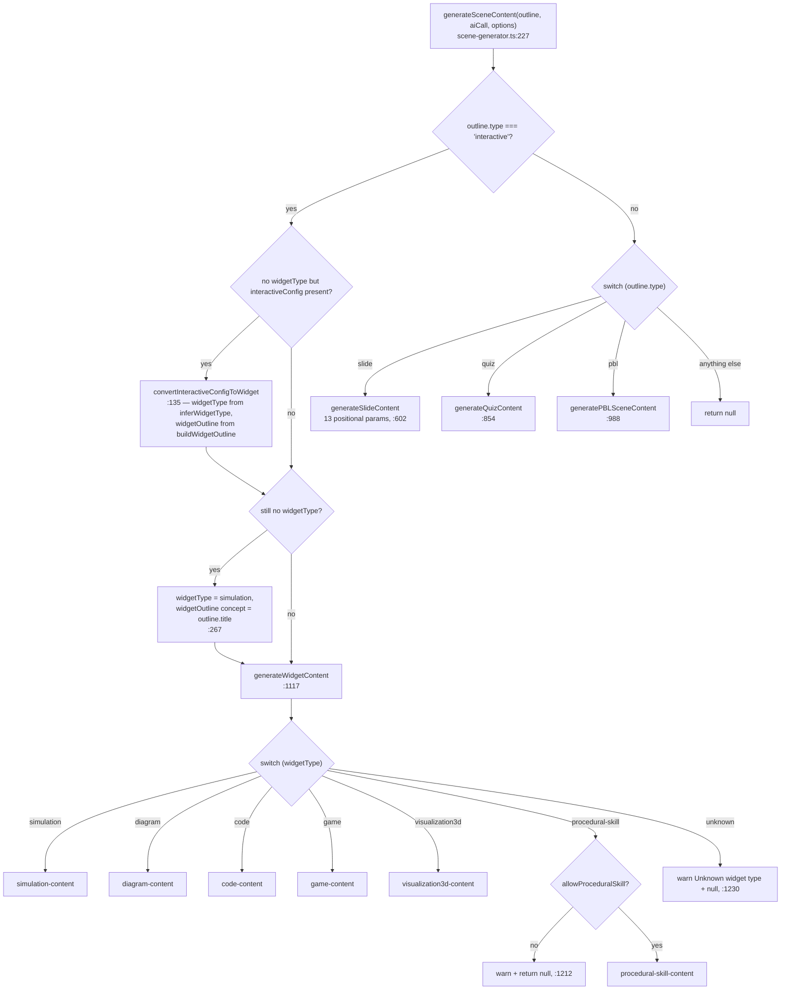
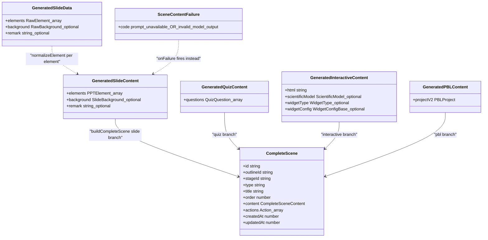
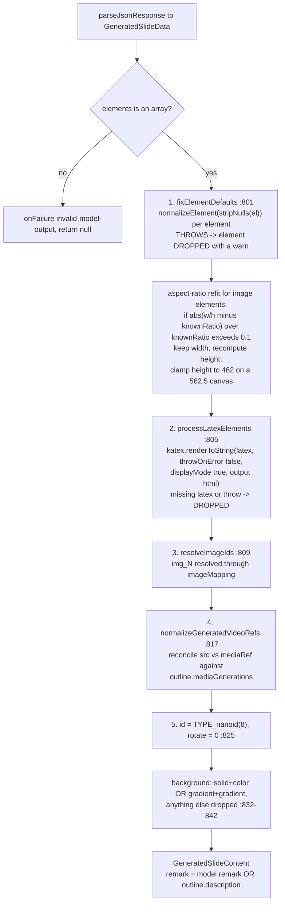
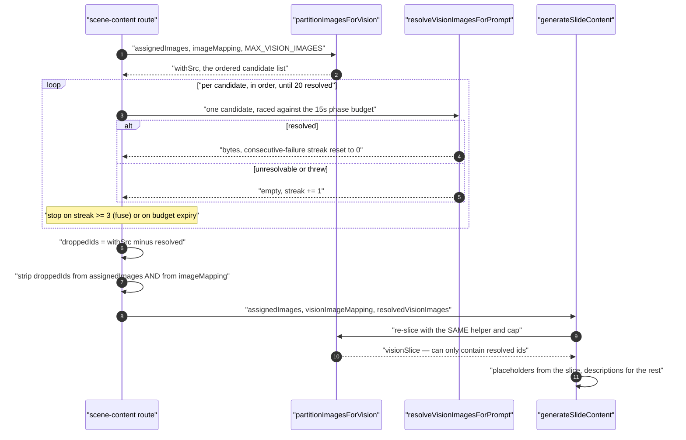

# Scene Generation

Stage 4: one `SceneOutline` becomes a persisted DSL `Scene`. Three hops — content,
actions, assembly — with `scene-generator.ts` (1931 lines) as the centre. This section
covers the type router, all four scene branches plus the six widget sub-types, the schema
each must satisfy, and the generation strategy per type.

**Sources:** `packages/@openmaic/generation/src/scene-generator.ts`,
`.../scene-types.ts`, `.../scene-builder.ts`, `.../action-parser.ts`,
`.../interactive-post-processor.ts`, `.../pbl/planner-single-call.ts`,
`app/api/generate/scene-content/route.ts`, `app/api/generate/scene-actions/route.ts`;
evidence: [`02b-interfaces-scenes.md`](docs/appendix/research/generation-pipeline/02b-interfaces-scenes.md),
[`03b-flows-scenes-and-quiz.md`](docs/appendix/research/generation-pipeline/03b-flows-scenes-and-quiz.md).

## The three hops

| Hop | Function | Route | LLM calls | Failure mode |
| --- | --- | --- | --- | --- |
| Content | `generateSceneContent` ([`scene-generator.ts:227`](packages/@openmaic/generation/src/scene-generator.ts#L227)) | `POST /api/generate/scene-content` (`maxDuration = 300`) | 1 (2 for PBL) | returns `null`, or throws `PBLGenerationError` |
| Actions | `generateSceneActions` (`:1608`) | `POST /api/generate/scene-actions` (`maxDuration = 60`) | 1 | returns a canned `Action[]`, or `[]` |
| Assembly | `buildCompleteScene` ([`scene-builder.ts:22`](packages/@openmaic/generation/src/scene-builder.ts#L22)) | inside the actions route ([`:170`](app/api/generate/scene-actions/route.ts#L170)) | 0 | returns `null` |

The split is a real boundary: the two routes resolve models independently
(`scene-content:<type>` versus `scene-actions`), so content and actions can be pinned to
different models via `MODEL_ROUTES` — see
[`../04-ai-provider-layer/index.md`](docs/04-ai-provider-layer/index.md).

## Type dispatch

`generateSceneContent` is a router with one pre-switch normalisation branch. Interactive
is handled *before* the switch, at `:255-280`, because legacy outlines need converting
first.



`inferWidgetType` (`:169`) is a bilingual regex cascade over
`subject + ' ' + concept + ' ' + designIdea`, lowercased, testing in this order:
physics/chemistry keywords → `simulation`; programming keywords → `code`;
process/workflow keywords → `diagram`; biology/3D keywords → `visualization3d`;
game/practice keywords → `game`; default `simulation` (`:173-194`). It only runs on the
deprecated `interactiveConfig` path, so its blast radius is legacy classrooms — but it is
undocumented model behaviour hiding in five regexes.

## Content schemas



`GeneratedSlideData` ([`pipeline-types.ts:31`](packages/@openmaic/generation/src/pipeline-types.ts#L31)) is the *raw* parse target — an index-signature
element shape with `type`, `left`, `top`, `width`, `height` required and everything else
`unknown`. `GeneratedSlideContent.elements` is `PPTElement[]`, the DSL contract. The
transformation between them is the five-pass repair pipeline below.

The failure contract is a callback, not a throw:
`SceneContentFailureCode = 'prompt-unavailable' | 'invalid-model-output'`
([`scene-generator.ts:75`](packages/@openmaic/generation/src/scene-generator.ts#L75)), delivered via `options.onFailure` and *always* accompanied by a
`null` return. The slide, quiz and widget branches use it; PBL does not — it throws.

## Slide generation

`generateSlideContent` (`:602`) is module-private and takes **13 positional parameters**, of
which only the first two — `outline` and `aiCall` — are required; ten are optional and `log`
has a default (`:602-615`). `generateSceneContent` unpacks it at `:284`. Every
sibling (`generateWidgetContent`, `generateSceneActions`) uses an options object.

### Prompt inputs

Thirteen variables (`:710-724`). Four are conditional flags derived from what the outline
actually carries (`:667-673`):

```ts
const generatedImageEnabled = generatedImageEntries.length > 0;   // mediaGenerations type image
const generatedVideoEnabled = generatedVideoEntries.length > 0;   // mediaGenerations type video
const imageElementEnabled   = hasAssignedImages || generatedImageEnabled;
const mediaElementEnabled   = imageElementEnabled || generatedVideoEnabled;
```

Those gate three `{{#if}}` sites in `templates/slide-content/user.md` (`:14`, `:32`, `:35`)
and three snippet includes in its 937-line `system.md`. Canvas is hard-coded 1000 × 562.5
(`:705-706`) to match `viewportSize: 1000, viewportRatio: 0.5625` in the assembler.

`assignedImagesText` seeds to the Chinese literal
`'无可用图片，禁止插入任何 image 元素'` (`:618`) and the generated-media block later
*detects its own sentinel* with `assignedImagesText.includes('禁止插入')` (`:696`) — a
string-comparison contract between two lines of the same function.

### Edit mode

When `editDirective` or `baselineContent` is present, the user prompt is appended with an
`## EDIT MODE` block (`:744-772`): the baseline slide serialised as JSON, the instruction
wrapped in `<<<INSTRUCTION … INSTRUCTION>>>` markers so it cannot be read as schema, and a
conditional "KEEP existing images" rule when the baseline has image elements. Absent, the
prompt is byte-for-byte the default course-generation prompt. This is the seam the MAIC
editor agent's `regenerate_scene` tool uses — see
[`../07-dsl-renderer-editor/index.md`](docs/07-dsl-renderer-editor/index.md).

### The five-pass repair pipeline



Pass 1's drop-not-keep decision is documented in place (`:495-507`): keeping a malformed
element would hand the raw payload to consumers that read it unguarded
(`getElementRange`, `BaseLineElement`, the PPTX exporter indexing into `start[0]`),
crashing playback or export over a single bad element. `stripNulls` (`:551`) recursively
removes `null`-valued object properties — models emit `null` for "no value" and the DSL
treats a present-but-null field as malformed — but leaves **arrays untouched**, because a
`null` inside a tuple like `[null, 5]` is genuinely malformed, not absent.

`resolveImageIds` (`:355`) is exported and worth reading closely:

| Element `src` | Behaviour |
| --- | --- |
| missing | element removed with a warn (`:365`) |
| matches `/^img_\d+$/i` and `imageMapping[src]` exists | `src` replaced with the mapping **value, verbatim** |
| matches `/^img_\d+$/i` and no mapping entry | **element removed** (`:373`) |
| matches `/^gen_(img\|vid)_[\w-]+$/i` | kept as a placeholder unless `generatedMediaMapping` already resolves it |
| a `data:`, `http(s):` or `/`-prefixed value | left alone (`isImageIdReference` returns false, `:326`) |

The mapping **value** decides the asset transport, and no flag is threaded into the
package (`:342-353`): a browser-backed pool stores base64 data URLs so the element `src`
becomes a data URL; a server-backed pool stores allocated asset ids so the `src` becomes
an asset id the renderer resolves through the pool registry.

### Vision pre-resolution

The scene-content route resolves the vision slice's asset ids to bytes *before* calling the
generator, so the generator's `aiCall` resolution becomes a defensive no-op. Because the
generator **re-slices** with the same helper, the route must resolve with refill.



Both stops degrade rather than fail: `VISION_RESOLUTION_BUDGET_MS = 15_000`
([`app/api/generate/scene-content/route.ts:49`](app/api/generate/scene-content/route.ts#L49)) raced against every probe, and
`MAX_CONSECUTIVE_UNRESOLVABLE_VISION_IMAGES = 3` (`:57`) as a store-is-down fuse. Every
candidate that did not resolve — unresolvable *or* unprobed when a stop fired — is
stripped from both structures (`:290-300`), so a model reference to a dropped id takes the
clean "no mapping → remove element" path instead of writing a dangling allocated id into
`src`. One summary warn names which stop fired (`:301-309`).

## Continued

This section outgrew the file-size ceiling and was split. The quiz, widget and PBL content
branches, action generation and parsing, the canned fallbacks, DSL assembly, and the open
questions are in [`./05b-scene-types-and-assembly.md`](docs/06-generation-pipeline/05b-scene-types-and-assembly.md).

## Related

- [`./05b-scene-types-and-assembly.md`](docs/06-generation-pipeline/05b-scene-types-and-assembly.md) — the remaining
  content branches, actions, assembly.
- [`./06-prompt-architecture.md`](docs/06-generation-pipeline/06-prompt-architecture.md) — the templates every branch
  above builds.
- [`./07-concurrency-and-retry.md`](docs/06-generation-pipeline/07-concurrency-and-retry.md) — how the two routes are
  driven, retried and cancelled.
