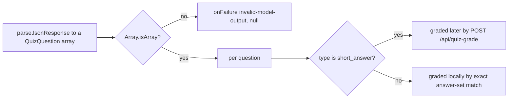
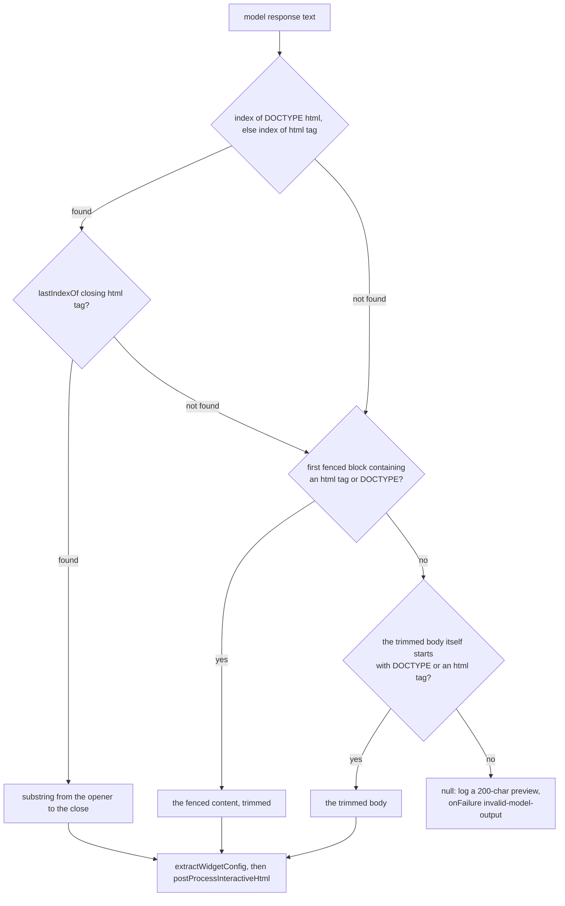
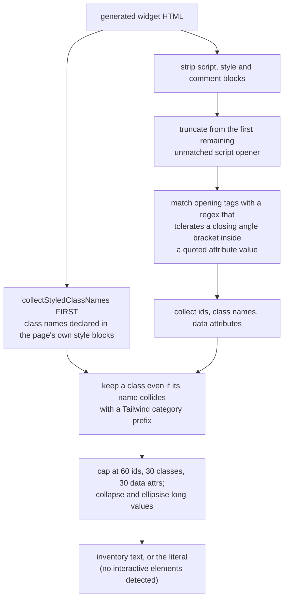
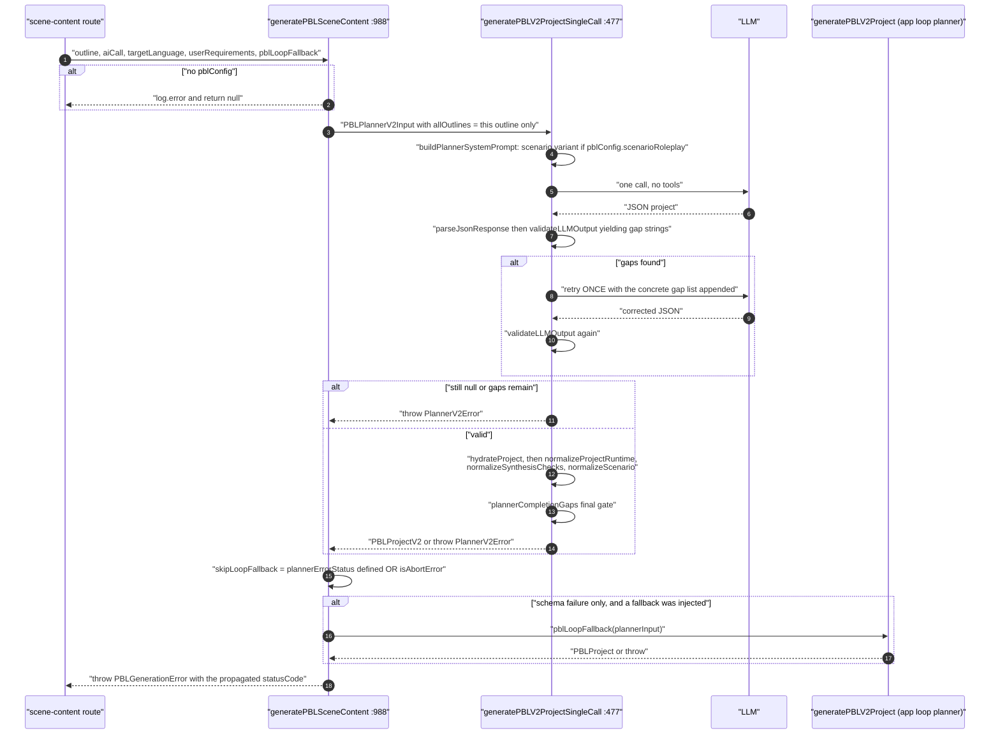
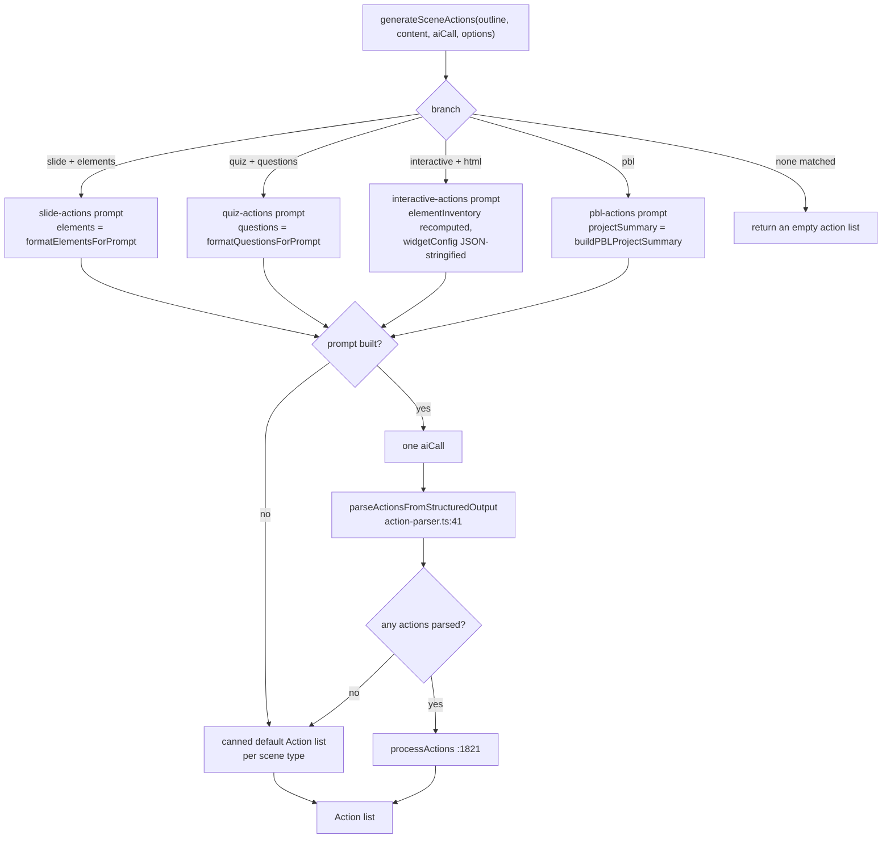
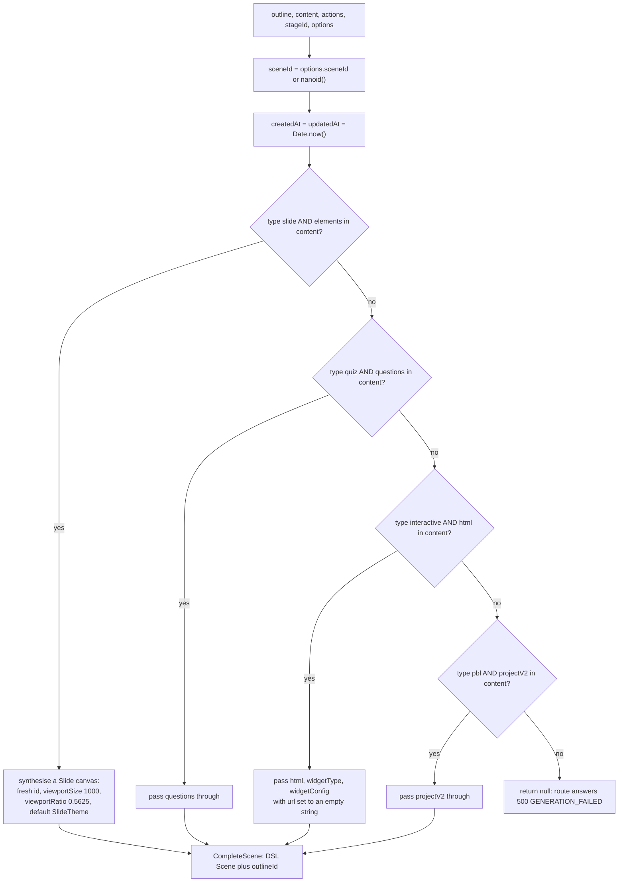

# Scene Generation, Part 2: Quiz, Widget, PBL, Actions, Assembly

Part 2 of the scene walkthrough. The three hops, the type router, the content schemas and
the slide branch are in [`./05-scene-generation.md`](./05-scene-generation.md). This half
covers the remaining three content branches plus the six widget sub-types, action
generation, and DSL assembly.

**Sources:** `packages/@openmaic/generation/src/scene-generator.ts:854-1564`, `:1608-1931`,
`.../interactive-post-processor.ts`, `.../action-parser.ts`, `.../scene-builder.ts`,
`.../pbl/planner-single-call.ts`, `app/api/generate/scene-actions/route.ts`;
evidence: [`02b-interfaces-scenes.md`](../appendix/research/generation-pipeline/02b-interfaces-scenes.md),
[`03b-flows-scenes-and-quiz.md`](../appendix/research/generation-pipeline/03b-flows-scenes-and-quiz.md).

## Quiz generation

`generateQuizContent` (`:854`) defaults a missing `quizConfig` to
`questionCount: 3, difficulty: 'medium', questionTypes: ['single']` (`:861`) so it never
fails on an absent config. Post-parse it is deliberately tolerant of loose output:

| Field | Normalisation |
| --- | --- |
| `id` | `q.id \|\| 'q_' + nanoid(8)` |
| `options` | `normalizeQuizOptions` (`:914`) — a plain string becomes value = positional letter, label = the string; an object keeps a string `value` else takes the positional letter, and `label` falls back `label → value → text → letter` |
| `answer` | `normalizeQuizAnswer` (`:943`) — reads `answer ?? correctAnswer ?? correct_answer`, coerced to `string[]` |
| `short_answer` | `options: undefined, answer: undefined, hasAnswer: false` (`:900-902`) |

The `short_answer` split is the handoff to runtime LLM grading — see
[`./09-quiz-and-grading.md`](./09-quiz-and-grading.md).

## Interactive widget generation

Output is **HTML, not JSON**. Three-strategy extraction (`extractHtml`, `:1076`):
a `<!DOCTYPE html>` or `<html` opener paired with the *last* `</html>`; else the first
fenced code block that contains `<html` or `<!DOCTYPE`; else the raw trimmed body if it
starts with either. `null` on all three, with a 200-char response preview logged.

Then two post-passes:

- `extractWidgetConfig(html, widgetType)` (`:1264`) reads
  ``.
- `postProcessInteractiveHtml(html)` (`interactive-post-processor.ts:16`) converts
  `$$…$$` → `\[…\]` and `$…$` → `\(…\)` with `<script>` bodies swapped out for
  placeholders first and restored after, then injects KaTeX CSS/JS with auto-render and a
  MutationObserver — but only if the HTML does not already mention `katex` (`:21`).

Prompt variables per widget type (`:1140-1232`), each also receiving `languageDirective`:

| widgetType | Prompt id | Type-specific variables |
| --- | --- | --- |
| `simulation` | `simulation-content` | `conceptName`, `conceptOverview`, `keyPoints`, `variables` (from `keyVariables`), `designIdea` (always empty) |
| `diagram` | `diagram-content` | `diagramType` (default `flowchart`), `nodeCount`, `prescribedNodes`, plus the conditional flags `hasNodeCount` and `hasPrescribedNodes` |
| `code` | `code-content` | `programmingLanguage` (default `python`); `starterCode`, `testCases`, `hints` are all empty — the model generates them |
| `game` | `game-content` | `gameType` (default `quiz`), `scoring` as a literal object with `correctPoints: 10` and `speedBonus: 5` |
| `visualization3d` | `visualization3d-content` | `visualizationType` (default `custom`), `objects`, `interactions` |
| `procedural-skill` | `procedural-skill-content` | `procedureType`, `task`, `tools`, `steps`, `successCriteria`, `errorConsequences` — gated by `allowProceduralSkill` |

`diagram` is the only branch with conditional prompt blocks, and the only one whose
`prescribedNodes` can pin the exact node set the model must produce.

### The element inventory

Before generating actions for an interactive scene, `extractInteractiveElements(html)`
(`:1289`) builds a text inventory of real selectors so the actions prompt targets nodes
that exist. It is a hand-written scraper with several deliberate hardening steps:

1. `collectStyledClassNames` runs **first** (`:1295`) so the widget author's own
   `<style>`-declared hooks survive the Tailwind filter later.
2. `<script>`, `<style>` and HTML comments are stripped, **then everything from the first
   remaining unmatched `<script`** is truncated away (`:1305-1308`) — a truncated
   generation would otherwise leak ids and classes buried in `innerHTML` template strings.
3. The tag regex accepts quoted attribute values containing `>` so
   `<button aria-label="go >>">` is not truncated at the first inner `>` (`:1314`).
4. Caps: 60 ids, 30 classes, 30 data attributes (`:1322-1324`); attribute values collapsed
   and ellipsised past `MAX_ATTR_VALUE_CHARS` (`:1400`).

The inventory is **recomputed from the current HTML on every actions call**, never
persisted (`:1691-1696`), because persisting it would go stale relative to
`postProcessInteractiveHtml` output and to any in-turn HTML edits.

## PBL generation

The only branch that throws instead of returning `null`.

Three details that matter:

- **`courseContext.allOutlines` carries only the current outline** (`:1008`). The PBL
  planner does not see the rest of the course.
- **A provider or HTTP failure skips the loop fallback** (`:1042-1043`): if
  `plannerErrorStatus(err)` walks a status code out of the error chain, or the error is an
  abort, the loop planner would hit the same provider again (or run against a cancellation
  the user already issued). Only schema/parse failures wrapped in `PlannerV2Error` fall
  through to it. `plannerErrorStatus` (`:972`) walks `statusCode`/`status`/`status_code`
  through `cause` and `lastError` with a `Set`-based cycle guard.
- **The status code is propagated onto `PBLGenerationError`** (`:1053`, `:1063`), which the
  route's `llmApiError(error)` then maps onto the HTTP response so the browser's retry
  classifier can see it.

The app-owned agentic loop planner stays outside the package and is injected as
`pblLoopFallback` by both drivers (`app/api/generate/scene-content/route.ts:337`,
`lib/server/classroom-generation.ts:602`). PBL planner quality is measured by
`eval/pbl-v2-planner/runner.ts`.

## Action generation

`generateSceneActions` (`:1608`) has four branches, each guarded by **both**
`outline.type` and a content shape check — `'elements' in content`, `'questions' in
content`, `'html' in content`, and `type === 'pbl'`. A mismatch falls through every branch
and the function returns `[]` (`:1760`), which the assembler then turns into a scene with
zero actions.

Only the interactive branch passes an allow-list: `INTERACTIVE_WIDGET_ACTIONS` is
`['widget_highlight', 'widget_setState', 'widget_annotation', 'widget_reveal']` (`:66`),
handed to the parser as `allowedActions`.

### Parsing strategy

`parseActionsFromStructuredOutput` (`action-parser.ts:41`) is a three-tier parse followed
by four filters:

| Step | Behaviour |
| --- | --- |
| locate | strip fences, take `[` to the last `]`; if there is no closing `]`, take from `[` to the end and let partial-json handle it (`:60`) |
| parse | `JSON.parse` → `jsonrepair` → `parsePartialJson` allowing arrays, objects, strings, numbers, booleans and null (`:73`) |
| convert | `type: 'text'` items become `speech` actions from `content`; `type: 'action'` items accept `name`/`params` **and** legacy `tool_name`/`parameters` (`:108`), id from `action_id`/`tool_id` or a fresh nanoid |
| guard | `widget_setState` with a missing `state` gets an empty object (`:122`), because `SET_WIDGET_STATE` handlers dereference it |
| filter 1 | a `discussion` action must be last: everything after the first one is truncated (`:134`) |
| filter 2 | `SLIDE_ONLY_ACTIONS` stripped from non-slide scenes (`:142`) |
| filter 3 | `allowedActions` filters everything except `speech` (`:153`) |

Because the partial-json tier accepts an unclosed array, a generation truncated mid-array
still yields all complete leading items.

### `processActions` and its one non-determinism

`processActions` (`:1821`) fills missing ids, repoints an invalid `spotlight.elementId` to
the first element (`:1845`), and — when the model names an unknown `discussion.agentId` —
replaces it with a **randomly chosen** student agent, falling back to the non-teacher pool
(`:1859-1866`). That makes the actions stage non-deterministic for reasons unrelated to the
model, and makes a golden test of that branch impossible.

Note the quiz and interactive branches call `processActions(actions, [], agents, log)` with an
**empty** element list (`:1682`, `:1724`), so the `spotlight` repair is a no-op there; a
hallucinated `spotlight` keeps its invalid id and is removed later by the parser's
`SLIDE_ONLY_ACTIONS` filter instead.

### The canned fallbacks

Four hard-coded lists, reached when the prompt is missing or zero actions parsed:

| Function | Content |
| --- | --- |
| `generateDefaultSlideActions` (`:1877`) | a `spotlight` on the first text element titled `'聚焦重点'`, plus a `speech` titled `'场景讲解'` whose text is the key points joined with `。` |
| `generateDefaultQuizActions` (`:1908`) | one `speech` titled `'测验引导'` |
| `generateDefaultInteractiveActions` (`:1922`) | one `speech` titled `'交互引导'` |
| `generateDefaultPBLActions` (`:1766`) | one `speech` |

All four ship Chinese `title` and `text` that reach the learner regardless of
`languageDirective`.

## Assembly

`buildCompleteScene` (`scene-builder.ts:22`) is pure and synchronous. Four shape-guarded
branches; any outline/content mismatch returns `null` (`:114`), which the route turns into
`500 GENERATION_FAILED`.

| Branch | Assembled `content` |
| --- | --- |
| `slide` + `elements` | `type: 'slide'` plus a `canvas` `Slide` with a fresh `nanoid()` id, `viewportSize: 1000`, `viewportRatio: 0.5625`, and a **hard-coded default `SlideTheme`** (`:37-44`) |
| `quiz` + `questions` | `type: 'quiz'` plus `questions` |
| `interactive` + `html` | `type: 'interactive'`, `url: ''`, plus `html`, `widgetType`, `widgetConfig` |
| `pbl` + `projectV2` | `type: 'pbl'` plus `projectV2` |

The slide branch is the only one that synthesises structure. `options.sceneId` (`:12-18`)
lets a retrying or upserting consumer keep scene identity stable so a replay becomes the
same logical scene rather than a duplicate; the default is a random `nanoid()`.

After assembly the actions route extracts this scene's `speech` action texts and returns
them as `previousSpeeches` (`app/api/generate/scene-actions/route.ts:179-181`), which the
caller threads into the *next* scene's `SceneGenerationContext`. That is the entire
cross-scene coherence mechanism, and it is why actions must stay serial — see
[`./07-concurrency-and-retry.md`](./07-concurrency-and-retry.md#why-content-can-be-parallel-but-actions-cannot).

## Open questions

- **Is `generateWidgetContent` returning `null` a fallback or an error?** The warn text
  says "falling back to standard interactive" (`:1132`) but the function returns `null`,
  `generateSceneContent` propagates it, and the route turns that into a 500 (`:346`). Either
  the comment is stale or a standard-interactive fallback path was removed. Same question
  for the procedural-skill gate at `:1210`, which also warns and returns `null` even though
  the *outline* layer has a real demotion path (`sanitizeProceduralSkillOutline`).
- **Deprecation timeline for `interactiveConfig`.** Marked `@deprecated`
  (`outline-types.ts:88`) yet still load-bearing: `convertInteractiveConfigToWidget` plus the
  `inferWidgetType` regex run whenever it is present, and the actions branch still reads
  `outline.interactiveConfig` for `conceptName` and `designIdea` (`:1701-1702`).
- **When `gen_img_*` / `gen_vid_*` placeholders are backfilled into already-stored scenes.**
  The route passes an empty `generatedMediaMapping` with the comment "Media generation is
  handled client-side in parallel" (`app/api/generate/scene-content/route.ts:312-315`), and
  `generateMediaForOutlines` is launched fire-and-forget from
  `lib/hooks/use-scene-generator.ts:672`. The write-back contract belongs to
  [`../09-media-and-export/index.md`](../09-media-and-export/index.md).
