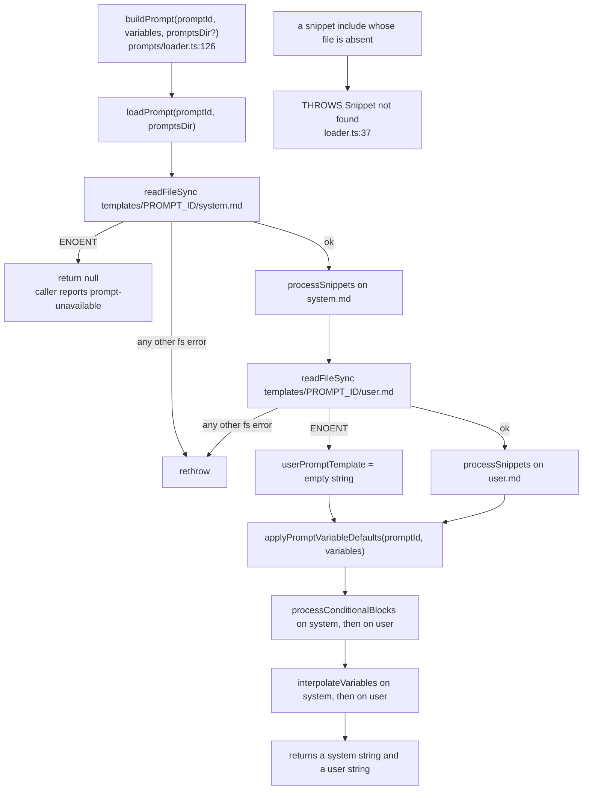
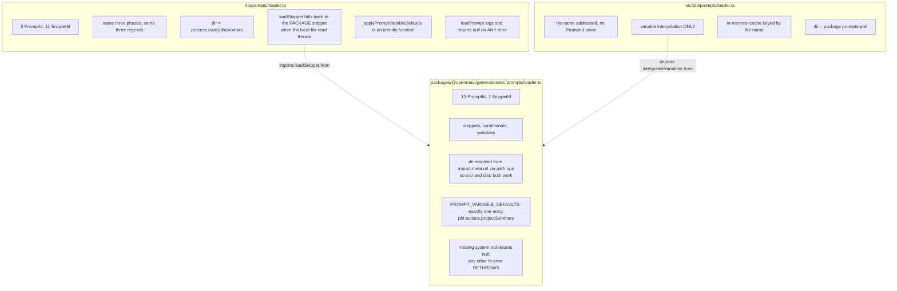
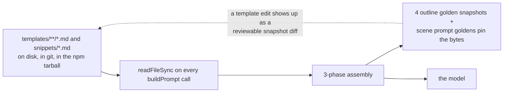

# Prompt Architecture

Prompts are Markdown on disk, not string concatenation in TypeScript. 26 template files
(4583 lines) plus 7 snippets in the package, 8 more template directories plus 4 snippets in
the app, all assembled by a three-phase substitution over a closed `PromptId` union. This
section covers the template language, composition order, the three parallel loaders, prompt
i18n, the formatters that produce prompt *content*, and one real assembled prompt.

**Sources:** `packages/@openmaic/generation/src/prompts/{loader,types,index}.ts`,
`.../prompt-formatters.ts`, `.../outline-formatters.ts`,
`packages/@openmaic/generation/templates/**`, `packages/@openmaic/generation/snippets/**`,
`lib/prompts/{loader,types}.ts`, `lib/prompts/templates/**`,
`packages/@openmaic/generation/src/pbl/prompts/loader.ts`; evidence:
[`02e-interfaces-prompt-system.md`](../appendix/research/generation-pipeline/02e-interfaces-prompt-system.md),
[`02d-interfaces-wire-and-prompt.md`](../appendix/research/generation-pipeline/02d-interfaces-wire-and-prompt.md).

## The whole template language is three regexes

| Phase | Regex | Source |
| --- | --- | --- |
| snippet include | `/\{\{snippet:(\w[\w-]*)\}\}/g` | `prompts/loader.ts:46` |
| conditional block | `/\{\{#if (\w+)\}\}([\s\S]*?)\{\{\/if\}\}/g` | `prompts/loader.ts:57` |
| variable | `/\{\{(\w+)\}\}/g` | `prompts/loader.ts:101` |

No loops, no nesting, no expressions, no helpers. `\w+` on the variable regex is
deliberate: kebab-case placeholders such as `{{next-agent}}` pass through untouched
(`prompts/loader.ts:100`).

## Composition order



Ordering is load-bearing:

- **Snippets splice in during `loadPrompt`, before conditionals** (`loader.ts:79`, `:89`),
  so a snippet may itself contain `{{#if}}` blocks and `{{variable}}` placeholders that the
  caller's variables then resolve.
- **Conditionals run before interpolation** (`loader.ts:137` and `:141` nest
  `processConditionalBlocks` *inside* `interpolateVariables`), so a removed block's
  placeholders are never evaluated.

Two asymmetric failure modes, both intentional:

| Condition | Behaviour | Rationale |
| --- | --- | --- |
| Missing snippet file | **throws** `Snippet not found: <id>` | "Fail loud rather than silently shipping `{{snippet:foo}}` to the model" (`loader.ts:36`) |
| Missing `system.md` | returns `null` | every caller detects prompt-unavailable from this |
| Missing `user.md` | tolerated, `''` — **only on ENOENT** (`loader.ts:87`) | user templates are genuinely optional for some prompts |
| Undefined variable | leaves the literal `{{token}}` in place (`loader.ts:103`) | silent passthrough; see [Silent passthrough](#silent-passthrough) |
| Object-valued variable | `JSON.stringify(value, null, 2)` (`loader.ts:104`) | lets `prescribedNodes` and `scoring` be passed as data |

## Prompt ids are closed unions

Package (`prompts/types.ts:6`) — 13 ids, all with a template directory on disk:

```
requirements-to-outlines   slide-content            quiz-content
simulation-content         diagram-content          code-content
game-content               visualization3d-content  procedural-skill-content
slide-actions              quiz-actions             interactive-actions
pbl-actions
```

`PROMPT_IDS` (`prompts/index.ts:13`) is
`as const satisfies Record<string, PromptId>`, so a constant whose value is not in the
union fails to compile.

Package snippets (`prompts/types.ts:22`) — 7 ids, 7 files:

```
json-output-rules  image-instructions  video-instructions  media-safety-guidelines
slide-image-instructions  slide-generated-image-instructions  slide-video-instructions
```

App (`lib/prompts/types.ts:8`) — 8 ids, of which two belong to generation
(`interactive-outlines`, `task-engine-outlines`) and six to chat/agents/search. App snippet
ids number 11 (`lib/prompts/types.ts:21`) but only **four** exist as local files
(`action-types.md`, `element-types.md`, `speech-guidelines.md`,
`whiteboard-reference.md`); the other seven resolve through the loader's fallback into the
package snippet store.

## Three parallel loaders



The differences are small and each has a reason:

- **The package resolves its prompts dir from `import.meta.url`** via `path` operations
  rather than a static import, "so app bundlers do not mistake the Markdown directory for a
  statically imported module asset" (`prompts/loader.ts:10-13`). `src/prompts` and
  `dist/prompts` are at the same depth below the package root, so one expression works for
  both.
- **The app loader falls back to the package snippet store** (`lib/prompts/loader.ts:38-41`),
  which is what lets `interactive-outlines` reuse `image-instructions`,
  `video-instructions` and `media-safety-guidelines` without a second on-disk copy.
- **The app loader is more forgiving**: any `readFileSync` failure on `system.md` becomes a
  logged `null` (`lib/prompts/loader.ts:101-104`), where the package rethrows anything that
  is not `ENOENT`.
- **The PBL loader is deliberately separate** — adding its prompts to `PromptId` would touch
  a type shared across every generation surface. It does variable interpolation only, with
  no snippets and no conditionals, and caches by file name.

`applyPromptVariableDefaults` in the app loader is an identity function
(`lib/prompts/loader.ts:124-129`) kept only for structural symmetry with the package.

## Where each prompt id is built

| Prompt id | Built at | Conditional variables |
| --- | --- | --- |
| `requirements-to-outlines` | `outline-generator.ts:99` | `hasSourceImages`, `imageEnabled`, `videoEnabled`, `mediaEnabled` |
| `slide-content` | `scene-generator.ts:710` | `imageElementEnabled`, `generatedImageEnabled`, `generatedVideoEnabled`, `mediaElementEnabled` |
| `quiz-content` | `scene-generator.ts:867` | none |
| `simulation-content` | `scene-generator.ts:1142` | none |
| `diagram-content` | `scene-generator.ts:1155` | `hasNodeCount`, `hasPrescribedNodes` |
| `code-content` | `scene-generator.ts:1171` | none |
| `game-content` | `scene-generator.ts:1185` | none |
| `visualization3d-content` | `scene-generator.ts:1197` | none |
| `procedural-skill-content` | `scene-generator.ts:1214` | none (gated by `allowProceduralSkill`) |
| `slide-actions` | `scene-generator.ts:1634` | none |
| `quiz-actions` | `scene-generator.ts:1664` | none |
| `interactive-actions` | `scene-generator.ts:1697` | none; receives `elementInventory` |
| `pbl-actions` | `scene-generator.ts:1734` | none; `projectSummary` has a loader default |
| `interactive-outlines` (app) | `scene-outlines-stream/route.ts:436` | same media flags as the outline template |
| `task-engine-outlines` (app) | `scene-outlines-stream/route.ts:436` | receives the same media flags, but **the template declares no `{{#if}}` blocks and no snippet sites** |

Only six template files carry conditionals at all: `slide-content/system.md` (6 sites),
`requirements-to-outlines/system.md` (5), `slide-content/user.md` (3),
`interactive-outlines/system.md` (3), `diagram-content/user.md` (2),
`requirements-to-outlines/user.md` (1).

Snippet include sites, all 15 of them:

| Template | Snippets |
| --- | --- |
| `requirements-to-outlines/system.md:125,129,133` | `image-instructions`, `video-instructions`, `media-safety-guidelines` |
| `slide-content/system.md:105,109,113` | `slide-image-instructions`, `slide-generated-image-instructions`, `slide-video-instructions` |
| `quiz-content/system.md:5` | `json-output-rules` |
| `lib/prompts/templates/interactive-outlines/system.md:240,244,248` | `image-instructions`, `video-instructions`, `media-safety-guidelines` |
| `lib/prompts/templates/web-search-query-rewrite/system.md:5` | `json-output-rules` |
| `lib/prompts/templates/agent-system/system.md:26` | `speech-guidelines` |
| `lib/prompts/templates/agent-system-wb-{teacher,assistant,student}/system.md` | `whiteboard-reference` |

Largest template files: `slide-content/system.md` at 937 lines,
`visualization3d-content/system.md` at 663, `game-content/system.md` at 396,
`requirements-to-outlines/system.md` at 386.

## Prompt i18n

There are no per-locale templates. All 21 template directories (13 package + 8 app) hold
exactly one `system.md`/`user.md` pair each — no `*.zh` / `*.en` variants, no locale
argument on `loadPrompt`. Output language travels as **data through one template variable**,
never by selecting a translated template.

That variable is `languageDirective`, a 2–5 sentence prose instruction:

- `requirements-to-outlines` is the only template that *produces* it — its system prompt
  declares it a required output key (`requirements-to-outlines/system.md:21`, `:374`) and the
  outline model infers it
  from the requirement. When the model omits it, the package substitutes
  `DEFAULT_LANGUAGE_DIRECTIVE = 'Teach in the language that matches the user requirement.'`
  (`outline-generator.ts:20`).
- Exactly **12 templates consume it** as a `{{languageDirective}}` placeholder — every
  package prompt id except `requirements-to-outlines`, always in `user.md`: the eight content
  templates and the four action templates. Neither app outline template declares the
  placeholder.
- Every call site passes `languageDirective || ''` (`scene-generator.ts:719`, `:874`,
  `:1149`, `:1165`, `:1180`, `:1192`, `:1205`, `:1225`, `:1642`, `:1671`, `:1708`, `:1743`),
  so an absent directive collapses the line rather than shipping a literal
  `{{languageDirective}}` — see [Silent passthrough](#silent-passthrough). The PBL path is
  the one exception: it defaults to `DEFAULT_LANGUAGE_DIRECTIVE` instead of `''` (`:1009`).

Full propagation path — session, stage, then per-scene request bodies — in
[`03b` → Output-language control](./03b-outline-streaming.md#output-language-control).

Two sites bypass the directive channel entirely:

| Site | Mechanism |
| --- | --- |
| `POST /api/quiz-grade` | branches its whole system **and** user prompt on `language === 'zh-CN'` (`app/api/quiz-grade/route.ts:53-61`, `:63-69`) — a hard-coded bilingual pair built in TypeScript, not a template, and it never receives `languageDirective` |
| the four canned action fallbacks | ship hard-coded Chinese `title`/`text` (`scene-generator.ts:1766`, `:1877`, `:1908`, `:1922`) that reach the learner whatever the directive says — see [`05b` → The canned fallbacks](./05b-scene-types-and-assembly.md#the-canned-fallbacks) |

The templates themselves are English instructions, but the TypeScript around them is not
locale-neutral: `generateSlideContent` seeds `assignedImagesText` to the Chinese literal
`'无可用图片，禁止插入任何 image 元素'` (`scene-generator.ts:618`) and then detects its own
sentinel with `.includes('禁止插入')` (`:696`), so that string cannot be translated without
breaking the generated-media branch.

## Formatters produce prompt *content*, not structure

Templates hold structure; these functions produce the strings that fill the holes.

| Function | Output |
| --- | --- |
| `buildCourseContext(ctx)` (`prompt-formatters.ts:9`) | the full title list with a ` ← current` marker on the active page, a same-session instruction, a first/middle/last position line, and the last 150 characters of the previous page's final speech |
| `formatAgentsForPrompt(agents)` (`:53`) | `- id: "x", name: "y", role: z — persona` per agent |
| `formatTeacherPersonaForPrompt(agents)` (`:65`) | `''` unless a `teacher`-role agent has a `persona`; otherwise the persona plus an explicit instruction that the teacher's name must not appear on the slides |
| `formatImageDescription(img)` (`:78`) | `- **img_2**: from biology.pdf page 2 \| size: 800×600 (aspect ratio 1.33) \| <description>` |
| `formatImagePlaceholder(img)` (`:93`) | the same minus the description, ending `[see attached]` |
| `buildVisionUserContent(userPrompt, images)` (`:109`) | the multimodal message parts array |
| `buildLanguageText(directive, sceneNote)` (`:145`) | directive plus an "Additional language note for this scene" paragraph — **no live caller** |

`buildCourseContext`'s same-session instruction is worth quoting because it exists to fix a
specific model behaviour (`:24`): "All pages belong to the SAME class session. Do NOT greet
again after the first page. When referencing content from earlier pages, say 'we just
covered' or 'as mentioned on page N' — NEVER say 'last class' or 'previous session' because
there is no previous session."

`buildVisionUserContent` emits `[{type:'text', text:userPrompt}]`, then a
`\n\n--- Attached Images ---` marker, then per image a `\n**img_N** (w×h, aspect ratio r):`
text part followed by the image part, so the model can bind each id to its picture. A
`data:<mime>;base64,` src is split into `{ image: base64, mimeType }` because the AI SDK
accepts only http(s) URLs or raw base64 (`:126-132`).

**`formatImageDescription` and `formatImagePlaceholder` are byte-duplicated inside the
package** — defined at `prompt-formatters.ts:78`/`:93` and again at
`outline-formatters.ts:3`/`:14`, with only the `prompt-formatters` pair exported from the
barrel. `sortDocumentImagesForVision` is likewise defined in `outline-formatters.ts:24`
**and** re-implemented in `lib/document/bundle.ts:165`.

## One real assembled prompt

Verbatim from the golden snapshot
`packages/@openmaic/generation/test/__snapshots__/outline-prompt.test.ts.snap:928`, the case
that pins every conditional *on*: vision enabled, one mapped image, image and video
generation on, research context and teacher persona present.

```
Please generate scene outlines based on the following course requirements.

---

## User Requirements

用中文讲解光合作用

---

## Student Profile

Student: Lin — Middle-school learner

Consider this student's background when designing the course. Adapt difficulty, examples, and teaching approach accordingly.

---

## Language Context

Infer the course language directive by applying the decision rules from the system prompt. Key reminders:
- Requirement language = teaching language (unless overridden by explicit request or learner context)
- Foreign language learning → teach in user's native language, not the target language
- PDF language does NOT override teaching language — translate/explain document content instead

---

## Reference Materials

### PDF Content Summary

Source notes about chlorophyll.

### Available Images

- **img_2**: image from biology.pdf page 2 | size: 800×600 (aspect ratio 1.33) [see attached]

### Web Search Results

A current source summary.

Teacher Persona:
Use a Socratic style.

---

## Output Requirements
…
```

### Reading that against the template

| `requirements-to-outlines/user.md` line | Placeholder | Filled by |
| --- | --- | --- |
| 7 | `{{requirement}}` | `requirements.requirement` |
| 11 | `{{userProfile}}` | built **in TypeScript**, not in the template (`outline-generator.ts:89-92`) — the `## Student Profile` heading and the trailing `---` are part of the interpolated value |
| 26 | `{{pdfContent}}` | `pdfText.substring(0, MAX_PDF_CONTENT_CHARS)`, or the literal `None` |
| 30 | `{{availableImages}}` | `buildAvailableImages` (`:46`); the `[see attached]` suffix comes from `formatImagePlaceholder` |
| 34 | `{{researchContext}}` | web-search context, or the literal `None` |
| 36 | `{{teacherContext}}` | `formatTeacherPersonaForPrompt(agents)` |
| 87–89 | `{{#if hasSourceImages}}` | `(pdfImages?.length ?? 0) > 0` — adds the `suggestedImageIds` instruction |

Note the shape of the composition: `{{userProfile}}` and `{{teacherContext}}` each carry
their own Markdown heading, so an absent value collapses the section entirely and the
surrounding `---` rules still read correctly. That is the pattern for optional prompt
sections here — the value owns its heading, not the template.

Four snapshot cases pin `buildOutlinePrompt` byte-for-byte (every conditional off, all on,
and two mixed states) in a 2033-line snapshot file. A prompt regression therefore surfaces
as a diff rather than as degraded model output. A second golden file,
`test/scene-prompt-golden.test.ts`, does the same for the scene prompts.

## Silent passthrough

`interpolateVariables` returns the literal `{{token}}` for an undefined value
(`prompts/loader.ts:103`). That is safer than throwing at request time but it means a
typo'd placeholder ships to the model. The defences are:

1. Tests that render templates and assert no surviving `{{…}}` remains
   (`tests/prompts/templates.test.ts` scans for non-conforming placeholders,
   per the comment at `lib/prompts/loader.ts:112-115`).
2. `PROMPT_VARIABLE_DEFAULTS` for the one case where a missing value is expected: the
   `pbl-actions` `projectSummary` defaults to `'(No generated milestones are available;
   introduce the project topic without inventing any.)'` (`prompts/loader.ts:15-20`).

Neither is a runtime check, and the test coverage only extends to the templates those tests
render.

## Prompts are configuration

The `files` array ships `dist`, `templates`, `snippets`, `prompts-pbl`
(`packages/@openmaic/generation/package.json:15-22`) — the Markdown is part of the published
artifact. Both loaders read from disk on every call with no caching (only the PBL loader
caches), so a prompt edit takes effect without a rebuild in a running dev server.



## Open questions

- **Whether the two near-identical loaders should converge.** They differ only in the
  prompts dir, the app version's `log.error`-and-return-null behaviour, and its snippet
  fallback into the package. The app's `applyPromptVariableDefaults` is dead weight.
- **Why `task-engine-outlines` receives media conditional flags it cannot use.** The route
  passes `imageEnabled`, `videoEnabled` and `mediaEnabled` to both app outline templates
  (`scene-outlines-stream/route.ts:442-444`), but only `interactive-outlines` declares
  `{{#if}}` sites for them.
- **Whether the duplicated formatters are intended.** Nothing pins
  `outline-formatters.ts`'s copies of `formatImageDescription` / `formatImagePlaceholder` to
  the exported `prompt-formatters.ts` pair, so a change to the vision description format
  must be made in two places inside one package.
